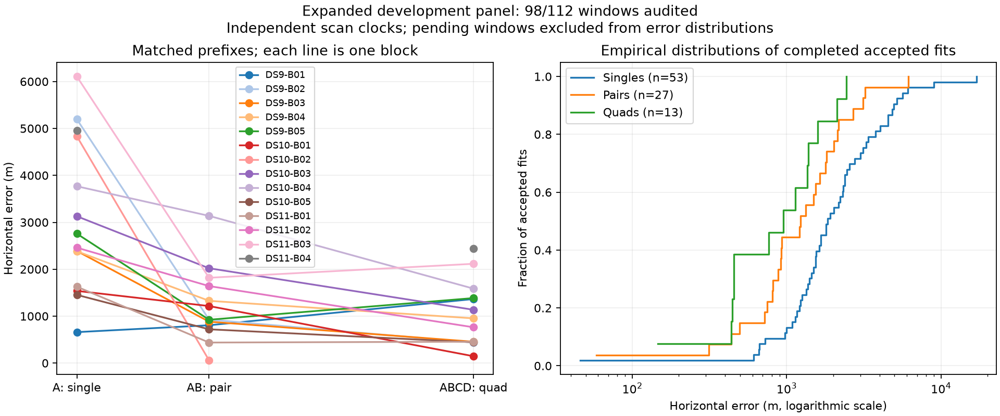

# Fourteen blocks audited; full-panel analysis prepared

The baseline accepts 93 of 98 evaluated windows. DS10-B05 passes all seven numerical audits, with matched first-scan / first-pair / quad errors of 1,454 / 720 / 443 m. DS11-B05 and DS9-B06 remain in the running queue. The five previously recorded failures remain unchanged; no continuation results are substituted into the baseline.

| Baseline window | Audited / planned | Accepted / audited | Median error | 90th percentile | Within 1 km / audited |
|---|---:|---:|---:|---:|---:|
| Single | 56/64 | 53/56 | 1,845 m | 4,934 m | 7/56 |
| Pair | 28/32 | 27/28 | 1,231 m | 2,867 m | 12/28 |
| Quad | 14/16 | 13/14 | 953 m | 2,010 m | 7/14 |

Quantiles condition on acceptance. The [sealed snapshot](panel-fourteen-blocks-v1.json) retains all failures and fourteen pending windows. These correlated development results use the operator reference and are not held-out estimates.

The final-analysis script now requires all sixteen block audits and all 112 planned units before producing a full-panel report. It adds per-dataset summaries, maximum error, cold inference wall/CPU times, time per scan, actual recording span and matched A→AB→ABCD comparisons. It separates pairs with two accepted fits from cases where only one endpoint is accepted; it does not turn a convergence difference into a geographic-error difference. Two reporting tests pass, covering failure denominators, runtime inclusion and asymmetric matched outcomes. No full-panel result is claimed yet.

The [fixed post-baseline experiment plan](post-baseline-v1/plan.json) remains queued behind the identified baseline supervisor. It will run eligible continuations, the four constituent-start pilots and the three cold acquisition checks sequentially. Its source hashes and pilot membership remain unchanged. The final comparison will keep warm replay timing distinct from fresh cold timing and the failure-selected constituent case separate from the three metadata-selected cases.

The [uncertainty undercoverage result](PILOT_UPDATE_10.md) and [missed-mode diagnostic](PILOT_UPDATE_08.md) still apply. Finish the remaining baseline and queued variants before selecting an estimator or making calibrated-uncertainty claims.
