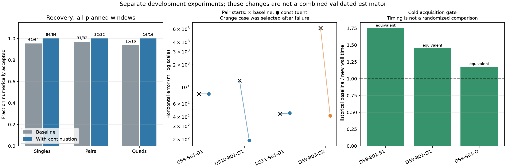

# Recovery, initialization and acquisition experiments

The fixed post-baseline queue has completed. All five iteration-limited windows pass the numerical audit after bounded continuation; all four constituent-start pair pilots pass; and all three faster-acquisition cold runs pass the numerical-equivalence gate. These are three separate experiments, not a combined validated estimator.

## Bounded continuation

| Window | Accepted / planned | Median error | 90th percentile | Within 3 km / planned |
|---|---:|---:|---:|---:|
| Singles, original | 61/64 | 2,023 m | 4,959 m | 42/64 |
| Singles, with continuation | 64/64 | 1,972 m | 5,126 m | 44/64 |
| Pairs, original | 31/32 | 1,494 m | 3,137 m | 26/32 |
| Pairs, with continuation | 32/32 | 1,410 m | 3,135 m | 27/32 |
| Quads, original | 15/16 | 1,136 m | 2,312 m | 15/16 |
| Quads, with continuation | 16/16 | 1,044 m | 2,280 m | 16/16 |

Quantiles condition on acceptance, so newly accepted difficult cases change the population. Continuation recovers optimization completeness but does not guarantee accuracy: DS9-B05-S2 converges 46,067 m from the operator reference. Original launch work plus continuation stays charged to each window's original allowance. This diagnostic reuses recorded fitted states; an integrated cold policy is not yet evaluated.

## Constituent starts

Instead of acquiring a pair from zero nuisance parameters, use its two constituent single-scan positions as two starts, copy each scan's own fitted nuisance parameters, recompute all satellite assignments and jointly refit the same objective. The three metadata-selected pilot pairs all converge; their median error changes from 806 to 447 m, while median charged runtime increases from 78.6 to 96.8 seconds. DS10 improves from 1,215 to 193 m; DS9 stays about 806 m; DS11 changes from 438 to 447 m. The fourth, failure-selected DS9-B03-D2 case improves from 6,139 to 411 m and is excluded from the three-case aggregate.

The evidence supports a broader experiment, not promotion. The [full-pair plan](FULL_PAIR_PLAN.md) freezes an unchanged policy across all 32 pairs and reports the 28 outside the pilot separately. Those 28 are still development data because their baseline outcomes have been inspected. All original single results, including the inaccurate recovered one, remain eligible under the same non-geographic admission rule. A new versioned runner retains missing-input and budget failures, and its three tests pass for a pair outside the original pilot. Runs proceed in sequential batches of at most four under the shared fit lock. Recursive pair-to-quad starts remain a separate next experiment.

## Faster acquisition calculation

Replacing the acquisition's contraction with matrix products preserves the requested points, unique-point count, spacing, seed locations/order, score tolerance, fit count, all fitted states and labels, best objective and selected start on the three fixed cold gates. Maximum difference in the winning fitted state is zero in each case.

| DS9-B01 window | Historical baseline wall time | New cold wall time | Ratio |
|---|---:|---:|---:|
| S1 | 41.29 s | 23.61 s | 1.75× |
| D1 | 70.00 s | 48.22 s | 1.45× |
| Q | 170.13 s | 144.58 s | 1.18× |

These timings include cold worker startup but exclude original track/orbit preparation and audit. Host load and cache state were not randomized or paired, so the ratios are observations, not established production speedups. The optimization changes arithmetic execution, not the inference model. Keep it separate from the constituent-start experiment so that model improvements remain attributable.

The [sealed comparison](post-baseline-summary-v1.json) links every input receipt and preserves failures. The [baseline report](FULL_PANEL_BASELINE.md) describes panel composition and matched results; the [fixed experiment plan](post-baseline-v1/plan.json) and completed receipt remain available. No experiment here establishes calibrated uncertainty or generalization to new receiver locations.
