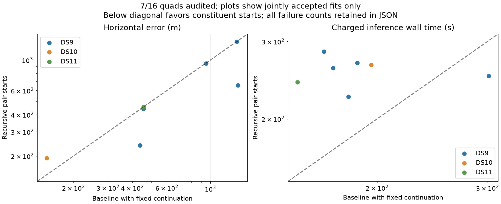

# Seven recursive quads and a separate smooth-weight prototype

Seven of sixteen recursive quads have completed and passed the numerical audit. The ordered partial panel includes five DS9 blocks and the first block of DS10 and DS11; nine outcomes remain pending. Baseline and recursive medians are both about 455 m on these seven cases. The p90 changes from 1,373 to 1,111 m, while median charged wall time increases from 180.0 to 261.1 seconds.

Five jointly accepted cases improve by more than one metre, one worsens and one stays within one metre. Median paired change is only −8 m. DS9-B05 is a substantial individual improvement, from 1,385 to 654 m. The within-1-km count rises from 5/7 to 6/7; both remain 7/7 within 3 km. Do not extrapolate this favorable subset to the entire panel, particularly the known failed pair constituent in DS11.

The [sealed snapshot](recursive-quads-snapshot-01.json) retains all sixteen planned entries and distinguishes admission/budget failures from fit/audit failures. It separately compares original and continued baseline, dataset and pilot strata. Runtime statistics retain known failed costs and report how many are known; unknown admission costs are not converted into zero-cost successes.

## Mathematical prototype, not a benchmark change

The [smooth-visibility plan](SMOOTH_VISIBILITY_PLAN.md) formalizes normalized signal/background association weights and their gradients. A small research helper passes seven tests for probability conservation, finite-difference gradients including background, extreme margins and invalid parameters. It has not changed any acquisition, fit, audit or reported result.

The proposed product of logistic visibility gates is only one modeling choice. It depends on observation count and must be compared with a shared-threshold or smooth worst-margin model. Geometry derivatives, scoring consistency and optimizer/audit integration still need verification. The existing fast solver derives gradients from selected residuals and Gaussian priors; connecting only the new scores would omit necessary derivatives and be incorrect. Keep this future model experiment separate from the running recursive initialization arm.

The next bounded batch is DS9-B06 and DS10-B02. Complete the remaining fixed membership before deciding whether recursive initialization earns its added cost. The published recipes and existing outcomes remain unchanged.
