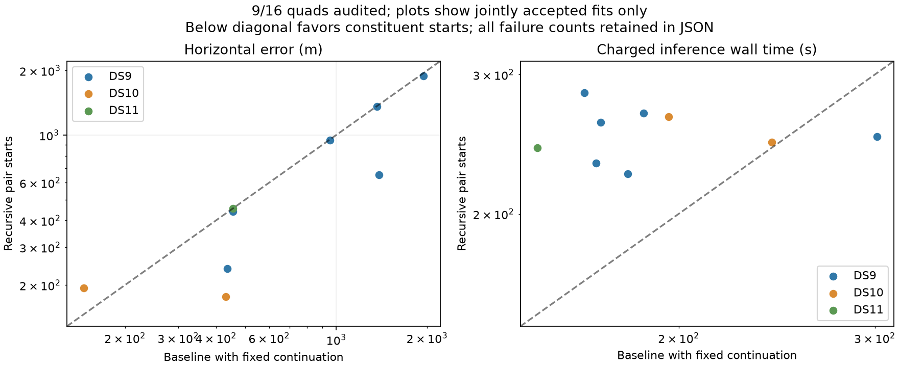

# Nine recursive quads; product visibility model rejected before integration

Nine fixed recursive quads have completed, all numerically accepted. On these same cases the continued baseline also accepts nine. Median accepted error is essentially unchanged at 455 m; p90 changes from 1,497 to 1,464 m. Within-1-km outcomes increase from 6/9 to 7/9, and both methods are 9/9 within 3 km. Median charged runtime increases from 180.0 to 250.3 seconds.

DS10-B02-Q is accepted at 177 m, compared with 431 m for the bounded-continuation baseline. The original baseline alone was unresolved on this unit; do not describe a comparison against it as an error reduction from a nonexistent accepted location. DS9-B06-Q improves slightly from 1,944 to 1,885 m. Seven jointly accepted cases improve by more than one metre, one worsens and one is within one metre; median paired change is −14 m. Seven planned quads remain pending in the [sealed snapshot](recursive-quads-snapshot-02.json).

The parallel [synthetic visibility check](VISIBILITY_COUNT_FINDING.md) changes the proposed modeling direction. Multiplying per-observation logistic gates makes visibility collapse when the same geometric evidence is merely duplicated. Its derivatives were mathematically correct, but the independence assumption is unsuitable as a default track-visibility repair. Reject this formula before integration. A shared random threshold applied to the worst track margin avoids duplication sensitivity, but remains piecewise differentiable at minimum ties and still needs geometry, scoring and solver validation. No benchmark result or audit is changed by this decision.

The next bounded quad batch covers DS10-B03/B04. Complete the fixed sixteen-quads study, including admission failures, before selecting an initialization policy. The smooth-weight helper remains an isolated, tested mathematical prototype rather than a promoted inference model.
