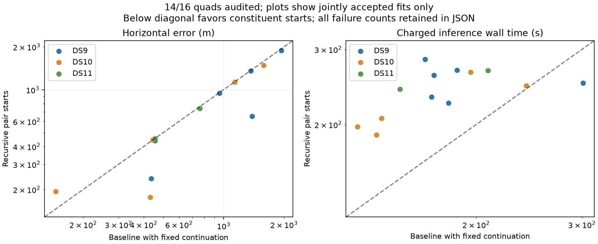

# Fourteen recursive outcomes: thirteen accepted and one admission failure

The frozen recursive study has fourteen terminal outcomes: thirteen numerical acceptances and one constituent-admission failure. DS11-B03-Q fails because its D2 pair did not pass the unchanged independent audit. No quad fit is substituted and no reference error is assigned. Its total runtime remains unknown in this receipt rather than being reported as zero; runtime summaries explicitly count known values.

| Same fourteen planned outcomes | Continued baseline | Recursive pairs → quad |
|---|---:|---:|
| Accepted | 14/14 | 13/14 |
| Median accepted error | 858 m | 654 m |
| 90th percentile accepted error | 1,836 m | 1,455 m |
| Within 1 km / evaluated | 8/14 | 9/14 |
| Within 3 km / evaluated | 14/14 | 13/14 |
| Median known charged wall time | 175.1 s | 246.4 s |

Conditional accuracy gains coexist with lost coverage and extra cost. Two final quads remain pending in the [sealed snapshot](recursive-quads-snapshot-03.json). Do not omit the rejected constituent's quad or replace it with another pair estimate to improve the method's denominator.

Separately, the [shared-threshold probe](SHARED_THRESHOLD_PROBE.md) verifies that the alternative visibility weights remove the recorded score jump for one fixed background track. Its three mathematical tests pass, including explicit handling of nondifferentiable minimum ties. This is a promising numerical property, not a repaired benchmark result or demonstrated geographic improvement. The running recursive arm continues unchanged.
