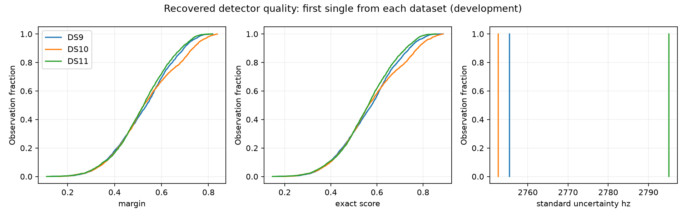

# Detector quality can be bound to the frozen observations

Hypothesis: detector margin or support geometry may help predict residual reliability better than another fitted scale parameter. Before fitting weights, recover the public detector evidence and verify its identity against existing observations. This experiment is an input audit, not an accuracy improvement.

The first single from each dataset now has a separate, hash-sealed overlay. Every frozen track and sample matches exactly in time, normalized de-aliased CFO, receiver, channel, RF and physical visit. Session and input/analysis manifests match. The pinned reader module hashes match before and after all exports. No frozen input was changed, no IQ was read, and no RF was collected.

| Dataset | Exported tracks | Track/sample occurrences | Unique candidates | Additional projected tracks excluded |
|---|---:|---:|---:|---:|
| DS9 | 64 | 2,627 | 2,627 | 0 |
| DS10 | 59 | 2,583 | 2,576 | 5 |
| DS11 | 62 | 3,162 | 3,160 | 2 |

These are counts before the localization pipeline's independent-track filter and eight-point retention. Alternative track hypotheses can share candidates; the overlay preserves those identities. They must not be treated as independent measurements. The descriptive figure deduplicates candidate IDs within each scan.

Detector margin varies substantially: median values are 0.536 / 0.524 / 0.524, with 10th–90th percentile intervals 0.353–0.696 / 0.359–0.734 / 0.352–0.684. Exact/control scores, rank, support timestamps and support moments are also available. This establishes available predictors, not that any predictor improves localization.

The exported standard uncertainty is constant within each scan: 2,755 / 2,753 / 2,795 Hz in the raw candidate frequency convention. It is a heuristic combining a 400 Hz term with the session UTC bracket, not a measured per-observation variance. It therefore supplies no within-scan detector-quality ranking. It must not be inserted as independent measurement noise for every sample: the timing component has shared structure, and normalization also changes frequency units.

## Binding corrections and validation

The first launch stopped before capture reads because evaluation labels were mistaken for prepared-input IDs. The revised lookup uses the sealed selection manifest. The preserved `quality-overlay-v2` receipt rejects all three joins because raw detector CFO differs from normalized de-aliased track CFO. Public trajectory source inspection identifies the exact normalized field. The preserved `quality-overlay-v3` receipt then binds DS9 but rejects DS10/DS11 because its initial global uniqueness requirement disallowed alternative track hypotheses. The final `quality-overlay-v4` allows overlap between distinct track hypotheses, rejects reuse within a track, and reports unique versus repeated candidates explicitly. It binds all three scans without relaxing time or frequency equality.

Four tests cover exact joins, corrupted frequencies/timestamps/physical identity/manifests, missing or duplicate tracks, and shared candidates across hypotheses. The final three read-only workers exited successfully in 15.5 / 14.3 / 15.9 seconds under 90-second external limits, sequentially with single-thread numerical libraries and the shared fit lock. All jobs are terminal. No numerical localization fits ran.

## Next test

Join the overlay to the actual retained track observations, retaining the existing independent-track filter and normalized-frequency convention. Check detector margin against conditional held-observation residual consistency, accounting for fitted-state reuse and correlations. Start with a descriptive diagnostic; any quality-to-variance rule must subsequently be frozen and checked on whole held-out development blocks before expanding to singles, pairs and quads. Do not tune weights against receiver GPS or infer calibrated uncertainty from these three scans.

Evidence: `quality-overlay-v4/overlay.json` and SHA sidecar, `quality-overlay-summary-v1.json` and SHA sidecar. Failed exploratory receipts and their exact source versions remain available. This is development evidence; no production promotion or new geographic error claim follows.
