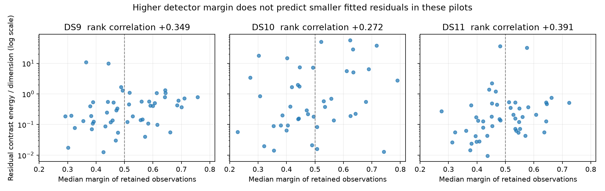

# Detector margin does not justify higher localization weight

The predeclared three-scan diagnostic fails its directional gate in every dataset. Higher median detector margin is associated with **larger**, not smaller, fitted residual energy. Do not introduce a monotone higher-margin/higher-weight rule on this evidence. Do not invert the rule after observing these results either.

| Dataset | Signal / background tracks | Retained observations, both branches | Margin–energy rank correlation | Within-satellite concordance | Median Q/d below / above margin 0.5 |
|---|---:|---:|---:|---:|---:|
| DS9 | 50 / 0 | 400 | +0.349 | 32/79 = 40.5% | 0.191 / 0.445 |
| DS10 | 42 / 2 | 352 | +0.272 | 13/29 = 44.8% | 0.211 / 0.642 |
| DS11 | 48 / 0 | 383 | +0.391 | 25/50 = 50.0% | 0.130 / 0.211 |

The fixed split counts below/above 0.5 are 26/24, 24/18, and 26/22 signal tracks. There were no ties in the within-satellite comparisons. The directional gate required negative rank correlation and concordance above 50% in every dataset. None passes.

## Model and interpretation

Use the existing accepted baseline state and hard satellite assignments. For each signal track, define r as the vector of offset-free frequency contrasts and C as its existing model covariance. The response is Q/d = rᵀ C⁻¹r/d. This avoids assigning arbitrary contrast coordinates to individual detector observations. The predictor is the median detector margin over that track's actual retained observations. No covariance parameter or weight is fitted here.

The exact join covers all 1,135 retained observations, including the two background tracks. It verifies physical observation IDs, normalized de-aliased frequency, and UTC-derived relative time. All fitted physical IDs are unique. The original independent-track filter and eight-point selection remain intact; the much larger exported-track sample counts are not likelihood sample counts. Background tracks receive no invented satellite residual.

The fit and associations already used these observations. These results are descriptive in-sample evidence, not held-out prediction, a causal relationship, or proof that strong detections are less accurate. Residuals can include orbital error, association error, systematic RF effects, time-support mismatch, and effects of fitting. Higher detector confidence concerns detection evidence; it need not imply that a particular satellite Doppler model is accurate. Comparing tracks assigned to the same satellite reduces one source of confounding but does not establish independence or truth of that assignment.

## What changes next

Stop direct margin-to-variance fitting from these pilots. The existing robust residual model remains unchanged. A more physical next diagnostic is whether the predicted Doppler uses the same finite observation support as the detector: the quality overlay carries support start/center/end and factorial moments. Audit the meaning and units of those moments, compare the frozen model's point-time prediction against a correctly normalized support-averaged prediction, and bound the size of that difference before adding another fitted parameter. This is a proposed direction, not an established cause or improvement.

All three bounded workers exited successfully; no optimization or GPS scoring ran. Three tests cover tied ranks, correlation direction, same-satellite grouping and absent-comparison failures. Parent fit/input/source seals and overlay bindings were verified before and after analysis. The predeclared protocol is `QUALITY_RESIDUAL_PLAN.md`; complete track-level outcomes and provenance are in `quality-residual-v1`, with the plotted summary in `quality-residual-summary-v1.json` and SHA sidecar. No production change follows.
