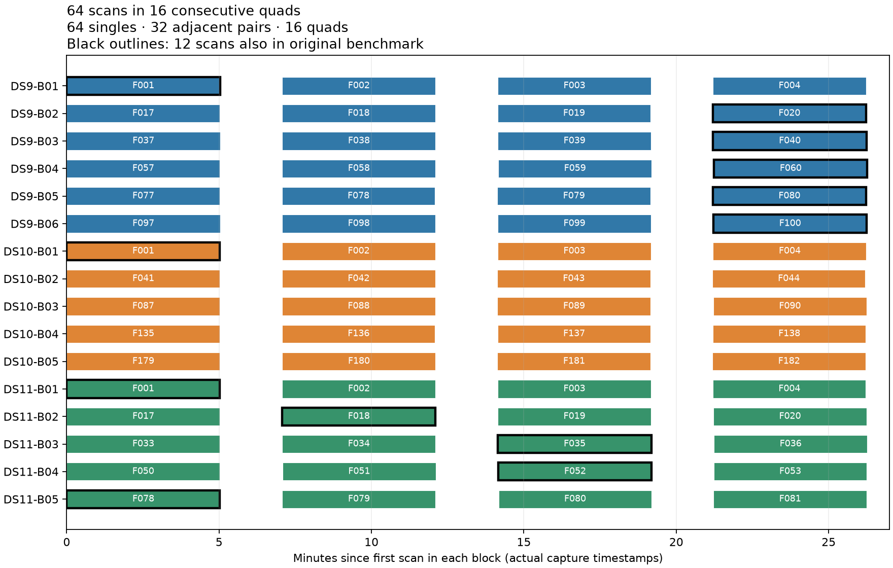

# Expanded quad development set

Latest results: [six-block baseline and bounded continuation](PILOT_UPDATE_06.md). Numerical audits accept 41 of 42 baseline windows; one quad reaches its iteration limit. A separate three-iteration continuation resolves it at 431 m error. Median accepted baseline errors are 1,513 / 811 / 455 m for singles / pairs / quads. This is a partial development result. The [clock ablation and acquisition experiment](PILOT_UPDATE_04.md) retain independent scan clocks as the baseline.

Frozen 64-scan membership: 16 non-overlapping blocks of four consecutive recordings, selected using metadata only. This adds 52 scans beyond the original 64-scan benchmark and reuses 12; together the two panels contain 116 unique scans. The original benchmark is preserved. DS12 remains outside this development selection.

| Source | Quads | Scans | Adjacent pairs |
|---|---:|---:|---:|
| DS9 | 6 | 24 | 12 |
| DS10 | 5 | 20 | 10 |
| DS11 | 5 | 20 | 10 |
| Total | 16 | 64 | 32 |

Each block A/B/C/D yields four singles, AB and CD, and ABCD. There are 112 evaluation units per model, with 16 matched A → AB → ABCD comparisons. These share observations and are not independent trials. All tuning and resampling must keep complete quads together.

All selected blocks span 26.20–26.27 minutes. Four approximately five-minute captures are separated by normal approximately two-minute capture gaps. Continuity checks use the full frozen candidate inventory, including inadmitted recordings that break runs. The selector rejects cross-hardware links, overlaps and inter-scan gaps above 180 seconds. It does not select using GPS, fit outcomes or convergence.

| Block | Chronological admitted scan ranks |
|---|---|
| DS9-B01 | 1–4 |
| DS9-B02 | 17–20 |
| DS9-B03 | 37–40 |
| DS9-B04 | 57–60 |
| DS9-B05 | 77–80 |
| DS9-B06 | 97–100 |
| DS10-B01 | 1–4 |
| DS10-B02 | 41–44 |
| DS10-B03 | 87–90 |
| DS10-B04 | 135–138 |
| DS10-B05 | 179–182 |
| DS11-B01 | 1–4 |
| DS11-B02 | 17–20 |
| DS11-B03 | 33–36 |
| DS11-B04 | 50–53 |
| DS11-B05 | 78–81 |

Eight selector tests pass, covering missing captures, long gaps, overlapping captures, hardware changes, deterministic selection, duplicate rejection, nested units and real-data counts. Membership and input/source bindings are hash sealed in [selection.json](selection.json) and [selection.sha256](selection.sha256).

Six blocks are evaluated, with correlated nested windows. See [PILOT_REPORT.md](PILOT_REPORT.md) for the original model and [PILOT_UPDATE_06.md](PILOT_UPDATE_06.md) for current results. Both first quads in each dataset plus DS9-B03 and DS10-B03 are prepared, bringing admitted observation/orbit inputs to 32 scans. Capture-bound operator pose companions were verified for all 64 scans, reporting constant location within each quad; this is not physical movement sensing or a survey.

[PROTOCOL.md](PROTOCOL.md) is the original frozen execution plan; its final “Current stage” paragraph records the state at selection time. All windows restart from the original uniform Sacramento prior and fixed 100 ft MSL height. Input or numerical failures remain in the selected population without replacement. The common-clock pilot is complete; broader panel evaluation and cold-fit validation of the faster acquisition remain pending.

