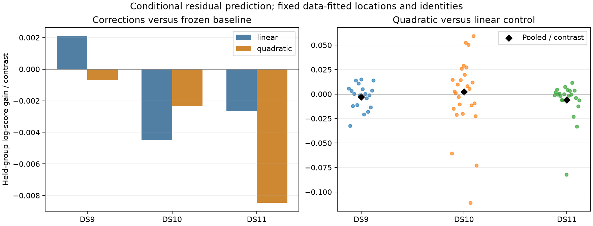

# Receiver-shared curvature: no expansion warranted

The conditional diagnostic does not support adding receiver-specific quadratic frequency drift to the localization model. All 67 held-satellite folds converged with full-rank designs. Quadratic corrections predict worse than no correction on all three pilot scans, and beat the added-linear control only on DS10. The preset all-three-scan gate fails. No localization refits or geographic scoring were performed.

| First single | Signal / background tracks | Held NORAD groups | Quadratic minus linear, pooled / contrast | Median group gain / contrast | Improving groups |
|---|---:|---:|---:|---:|---:|
| DS9-B01-S1 | 50 / 0 | 19 | -0.002796 | +0.000189 | 10/19 |
| DS10-B01-S1 | 42 / 2 | 26 | +0.002169 | +0.004054 | 15/26 |
| DS11-B01-S1 | 48 / 0 | 22 | -0.005786 | -0.000732 | 8/22 |

Positive values mean better conditional predictive log score. Pooled values divide summed log-score differences by the number of held contrast coordinates; medians give each satellite group equal weight after its own normalization. These are natural-log score units, not meters or probabilities. Counts are 350, 294 and 335 contrast coordinates respectively.

## Model and controls

The existing predictor already contains a linear frequency drift per receiver. Freeze its accepted fitted location, global clock, satellite epochs, drifts and selected satellite identities. For retained observation time t, define u=(t-center)/scale using the common midpoint and half-span across the scan's selected signal observations. Add a residual mean B[(a_r u+b_r u²) I(receiver=r)] times reference_frequency/track_frequency. B is the original Helmert contrast matrix; constants vanish. One common time origin is essential to preserve a shared quadratic model across tracks.

Compare zero correction, two added linear coefficients, and those same linear terms plus two quadratic coefficients. Fit each correction using the original Student-t4 residual objective and fixed covariance. Withhold every track assigned to one NORAD identity together across both receivers; estimate correction coefficients on the remaining groups. Evaluate the held group with plug-in coefficients. No coefficient prior is used in this diagnostic. Background assignments are excluded explicitly because they have no selected-satellite residual.

The linear design matches the actual predictor Jacobian to at most 4.53e-14. Four synthetic tests pass, covering the common-time basis, robust fitting, whole-identity exclusion and rank failures. All 134 held-group fits converge within the fixed 64-update cap. Three sequential single-thread processes take 1.67, 1.72 and 1.73 seconds, each below its 90-second external limit. Source and input hashes verify before and after fitting.

## Interpretation and limits

Quadratic versus zero pooled gains are -0.000686, -0.002340 and -0.008457 per contrast for DS9, DS10 and DS11. Thus the favorable DS10 comparison to linear alone does not establish an improvement over the current frozen baseline. Adding flexibility can fit training residuals while reducing cross-group prediction.

Leaving out different satellite groups also changes the quadratic estimates appreciably. Conditional acceleration ranges for RX0/RX1, in reference-frequency Hz/s², are DS9 [0.00164, 0.01236]/[0.00529, 0.02607], DS10 [-0.04143, -0.01627]/[0.01716, 0.03388], and DS11 [-0.01248, -0.00181]/[-0.00959, 0.00257]. These are fold ranges, not confidence intervals or measured oscillator accelerations. The coefficients can absorb geometry, association or orbit errors.

This is an exposed conditional diagnostic: the original fitted state and satellite assignments used every observation, including subsequently held groups. It is not independent validation of position, uncertainty or satellite identification. Correction-coefficient uncertainty is not integrated. Results cover only the first single from each dataset; they do not establish absence of curvature elsewhere.

Retain the existing model and do not expand this unregularized curvature arm to pairs or quads. The next useful question is whether inconsistent satellite groups, rather than a common receiver polynomial, drive the remaining location bias. A bounded influence/identifiability diagnostic can test that before another model campaign; any subsequent correction needs its own frozen hypothesis and acceptance criteria.

## Reproduction and artifacts

The frozen hypothesis is in `RECEIVER_CURVATURE_PLAN.md`. `check_receiver_curvature.py` performs the bounded diagnostic, with exclusive output directory `receiver-curvature-v1`. `receiver_curvature.py` implements the four-parameter maximum-size robust regressions; `test_receiver_curvature.py` contains the four tests. `summarize_receiver_curvature.py` verifies receipts and produces `receiver-curvature-summary-v1.json` and the figure. All case results, launches and source manifests have SHA256 sidecars. Reproduction requires a new output version; completed receipts are immutable.
