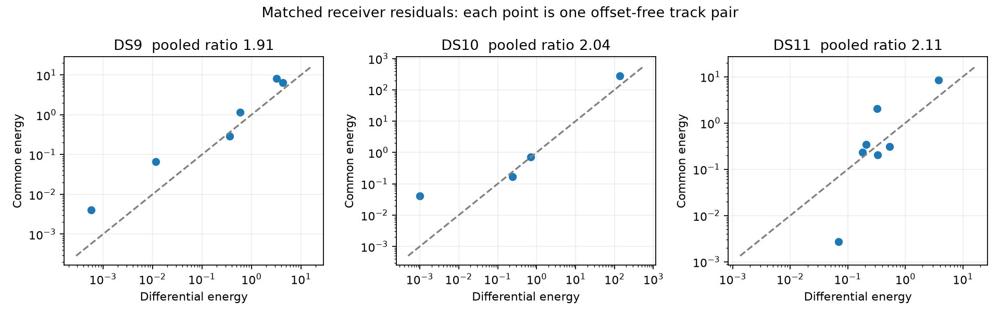

# Matched receivers show common variation, with a dominant DS10 outlier

The pooled common/differential energy ratio is 1.91 / 2.04 / 2.11 on DS9/DS10/DS11. Common variation dominates a majority of track pairs in every dataset, but the predeclared ratio-above-two gate fails on DS9. The all-dataset gate therefore fails. Do not add a shared covariance model from these pilots.

| Dataset | Matched visits | Eligible track pairs | Contrast dimensions | Common energy | Differential energy | Common-dominant pairs |
|---|---:|---:|---:|---:|---:|---:|
| DS9 | 34 | 6 | 28 | 16.18 | 8.48 | 5/6 |
| DS10 | 24 | 4 | 17 | 282.91 | 138.88 | 3/4 |
| DS11 | 39 | 7 | 27 | 11.52 | 5.45 | 4/7 |

One DS10 track pair, indices 17/16 assigned to NORAD 64429, contributes 281.98 common and 137.94 differential energy across seven contrast dimensions: over 99% of both DS10 totals. Thus its pooled ratio is not evidence of broadly elevated common covariance. It has substantial receiver disagreement as well as common variation. In DS9 and DS11 most aggregate energies are smaller than the contrast count under the nominal covariance; these fitted residuals do not justify general variance inflation either.

## Construction and checks

Matches require identical assigned NORAD, channel and physical visit, exactly one retained observation per receiver, overlapping support intervals, and center times within 1 ms. Maximum observed center separation in the matched inventory is 93.815 microseconds. No ambiguous or incompatible-support matched visits occur. There are 332 / 288 / 305 unmatched satellite/channel/visit keys, retained explicitly as unavailable comparisons. Three DS10 and five DS11 track pairs have only one matched visit and cannot yield an offset-free comparison; they are excluded from the energy table.

The original residual vectors use different Helmert bases. We first reconstruct each track's centered observation residuals with Cᵀr, select matched visits, then apply a new common Helmert basis H. This yields a=H S0 C0ᵀr0 and b=H S1 C1ᵀr1, removing arbitrary source-track offsets. Covariances use the identical linear transformations. The common and differential residuals are (a+b)/sqrt(2) and (a−b)/sqrt(2); under the baseline independent-receiver assumption both have covariance (V0+V1)/2. Reported energies whiten with that covariance.

Three tests verify invariance to arbitrary receiver offsets, aligned/opposed residual behavior, orthonormal contrasts and covariance scaling. Parent fit/source/input bindings and exact retained observation identities are verified. All three bounded workers exited successfully. No localization fit, label change, GPS score or RF collection ran.

The labels and fitted state already used these observations. Same assigned satellite is not verified identity, and track-pair groups may share original tracks. Ratios are descriptive, not independent statistical tests or causal evidence of orbit error. Timing differences, detector bias, association errors and fitted-parameter coupling remain possible explanations. The 1 ms support criterion is an explicit matching tolerance, not a claim of exact simultaneous timestamps.

## Next discriminating test

Inspect the DS10 17/16 pair's per-visit signed residuals and detector candidate ranks/alias choices. Test whether its disagreement is concentrated in a few observations, a smooth slope, or a discrete jump. Use the existing fixed fit and original candidates, without deleting observations or choosing labels by GPS. This is a diagnostic selected after observing an outlier, not an unbiased benchmark. A concrete receiver-pair consistency model should only follow a verified mechanism and then be tested across complete blocks and all window sizes.

The frozen plan is `RX_RESIDUAL_PLAN.md`; track-pair results, source receipts and execution logs are in `rx-residual-v1`. `rx-residual-summary-v1.json` and its SHA sidecar accompany the figure. The independent-noise robust baseline remains unchanged.
