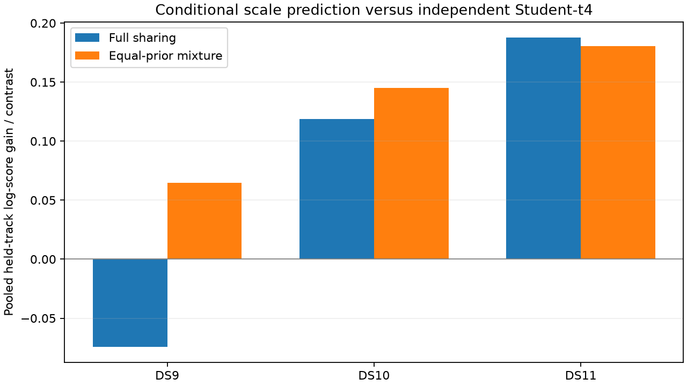

# Equal-prior scale mixture passes conditional prediction gate

The fixed equal-prior mixture gives positive pooled and median held-track predictive gains on each of the three first singles. It remedies the DS9 pooled loss under full sharing and improves on full sharing for DS10, while slightly reducing DS11's gain. This passes the frozen prerequisite for a separately specified localization implementation. No locations were fitted or geographically evaluated in this experiment.

| First single | Full-sharing pooled gain | Mixture pooled gain | Mixture median track gain | Improving tracks |
|---|---:|---:|---:|---:|
| DS9 | -0.0742 | +0.0648 | +0.0513 | 30/41 |
| DS10 | +0.1189 | +0.1449 | +0.1259 | 19/24 |
| DS11 | +0.1879 | +0.1805 | +0.1712 | 32/38 |

All gains are natural-log predictive score differences versus independent Student-t4, divided by contrast dimension. Pooled gains sum scores and dimensions; medians give each track equal weight after its own normalization. The103tracks belong to multi-track groups. The37singleton tracks reproduce the independent density. Background tracks remain excluded as in the frozen input diagnostic. This is not a table of geographic errors.

## Mathematical model and ablation

For each fixed satellite group, define p_I as the product of normalized per-track Student-t4 residual densities and p_S as the normalized shared-scale Student-t4 joint density. Use

    p_M(r_G) = 0.5 p_I(r_G) + 0.5 p_S(r_G).

The two components use the same original covariance blocks. The only new latent choice is whether that group shares residual scale. The prior probability is fixed at0.5, with no geographic tuning, fitted width or degrees-of-freedom search. Singletons have identical components, so their density is unchanged. Compare this mixture with both the independent baseline and complete sharing on exactly the same frozen residuals.

For held track h and training tracks T, predictive density is p_M(T,h)/p_M(T). Equivalently, mix the independent and shared conditional predictions using the model probability calculated from T alone:

    rho_T = p_S(T) / (p_I(T) + p_S(T)).

Using the full-group responsibility here would leak the held residual into predictive weights. Both correct formulas agree to9.24e-14 on the real examples. Every track's training-only probability and component/mixture scores is saved with its NORAD and frozen track index.

## What changed and what did not

The independent component preserves an alternative for residual patterns incompatible with sharing. It mitigates DS9's negative pooled result without changing how many tracks have positive gain. It does not uniformly dominate full sharing: DS11 loses0.00732log-score units per contrast relative to full sharing, while remaining positive against independence. No density mixture guarantees that every conditional prediction will improve.

The original baseline state, nuisance parameters and identities already used all observations. These are exposed conditional predictive comparisons. Their positive result does not override the earlier full-sharing localization failure, establish a calibrated confidence estimate, or establish independent generalization. The difference between residual prediction and geographic accuracy was already visible in the previous pilot.

## Localization implementation requirement

For fitting, the mixture responsibility must use the full group at the current state. With track energy q_i and dimension d_i, total Q and D, define w_i=(4+d_i)/(4+q_i) and w_G=(4+D)/(4+Q). The coefficient multiplying track i's residual-gradient contribution is

    w_eff_i = (1-rho_G) w_i + rho_G w_G.

The full normalized physical objective retains the original branch priors and replaces only residual density terms. This gradient is not obtained by treating the concatenated group as a single Student-t with one common weight. A purpose-built research objective/IRLS step is needed, with finite-difference verification, exact independent/shared endpoint controls and fixed memberships for the first pilot. The positive IRLS metric is an optimization approximation, not posterior covariance.

Next freeze a small paired localization pilot with an original independent-track control, unchanged physical prior/height/observations, explicit stationary-state audits and separate geographic scoring. Dynamic group membership under reassignment remains a later modeling problem. Do not claim a cold algorithm or extend to pairs/quads until that pilot's predefined gate passes.

## Verification and artifacts

Four tests pass: singleton equivalence, conditional-ratio/training-responsibility agreement, finite extreme-statistic calculations, and effective track weights versus finite differences of the normalized joint mixture. The run verifies all prior source/input seals and uses the existing immutable sufficient statistics; it launches no physical likelihood or localization fits. `SCALE_MIXTURE_PLAN.md` freezes the experiment. `scale_mixture.py`, `test_scale_mixture.py` and `check_scale_mixture.py` implement, verify and execute it. The sealed output is `scale-mixture-prediction-v1.json`, with all track-level comparisons. No production change or RF collection occurred.
