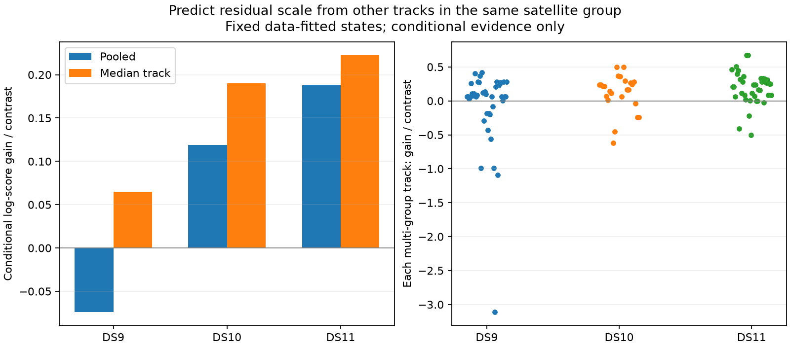

# Full scale sharing misses within-group outliers

Other tracks' residual energies improve conditional prediction on DS10 and DS11, but reduce pooled prediction on DS9. The preset all-three-scan diagnostic condition fails. This does not change the preceding localization pilot's failed expansion gate; no additional localization fits were run.

| First single | Tracks in multi-track groups | Groups | Pooled log-score gain / contrast | Median track gain / contrast | Improving tracks |
|---|---:|---:|---:|---:|---:|
| DS9 | 41 | 10 | -0.0742 | +0.0649 | 30/41 |
| DS10 | 24 | 8 | +0.1189 | +0.1899 | 19/24 |
| DS11 | 38 | 12 | +0.1879 | +0.2227 | 32/38 |

Positive values favor shared precision conditional on other group members. These are natural-log predictive scores, not meters. Singleton tracks (9/18/10 respectively) reproduce the independent model and are excluded from these aggregates. DS10 has2 background tracks, excluded explicitly; DS9 and DS11 have none. All140 signal tracks are accounted for, with103 nontrivial held-track predictions. Improving group counts are7/10,6/8 and9/12.

## Exact conditional calculation

Keep the original accepted baseline location, nuisance state, satellite labels and covariance. For one held track, let its residual dimension be d, Mahalanobis energy q, and covariance C. From the other tracks assigned to this satellite, accumulate dimension D_T and energy Q_T. A Gamma(2,2) shared prior becomes Gamma((4+D_T)/2,(4+Q_T)/2), using shape/rate parameters. Its predictive density is Student-t with degrees of freedom4+D_T and scale matrix [(4+Q_T)/(4+D_T)]C. Compare its normalized log density with the original Student-t4 residual density.

This integrates the shared precision rather than plugging in its estimate. It also equals the normalized full-group log density minus the training-group log density, verified to within7.82e-14 on the real cases. Three synthetic tests pass for that equivalence, singleton equality and adverse prediction when training energy is incompatible. Original independent densities agree with the established likelihood implementation. All three processes finish within90seconds, totaling5.41seconds, with sealed source/input checks.

## Why DS9 loses despite helping most tracks

The largest DS9 loss is track index34, assigned NORAD58210: its7-dimensional residual has energy70.02, while the other5 tracks have combined dimension35 and energy11.03. Their shared posterior concentrates toward a small scale and predicts the held residual poorly: it loses21.80log-score units relative to independent Student-t4. Another track loses7.64units. These losses outweigh many smaller gains. Track indices refer to the frozen scan port order and are diagnostic identifiers, not new ground-truth satellite labels.

The conditional predictive pattern does not mirror the localization changes. DS9 location improved under shared-scale fitting despite its negative pooled conditional score; DS10 location worsened despite positive prediction. Predicting residual energies is therefore useful evidence about assumptions but not a substitute for geographic evaluation. The baseline fit and labels already used every held observation, so even this cross-track calculation is exposed conditional evidence, not an independent test.

## Model implication

Complete sharing is too restrictive for at least one exposed scan: peers can make an atypical track look much less plausible than the original heavy-tailed model does. Further work should preserve an independent heavy-tailed alternative, rather than simply tune a shared variance or delete influential observations.

A concrete future hypothesis is a normalized mixture at the group level: with a fixed prior probability, a group uses either independent per-track Student-t scales or one shared scale. Its joint density is a weighted sum of the two normalized densities. Conditional held-track prediction must use the ratio of full mixture density to training mixture density, which updates the model probability using only the training residuals; a simple fixed average of conditional densities would not implement the same model. A preset equal-prior diagnostic would introduce no geographic threshold or fitted width. It remains only a hypothesis until frozen and tested, and any localization implementation must differentiate the full mixture objective rather than reuse an incorrect common IRLS weight.

Do not expand the existing full-sharing fit to pairs/quads. A positive result for a new mixture would still need its own synthetic equivalence/gradient tests and bounded model-control fits before claiming improvement.

## Reproduction

`SCALE_PREDICTION_PLAN.md` fixes the diagnostic. `scale_prediction.py` implements the integrated densities; `test_scale_prediction.py` has the three tests. `check_scale_prediction.py` writes the three immutable `scale-prediction-v1` case receipts. `summarize_scale_prediction.py` verifies receipts and generates the summary and figure. No state optimization, reference scoring, new RF collection or production changes occurred.
