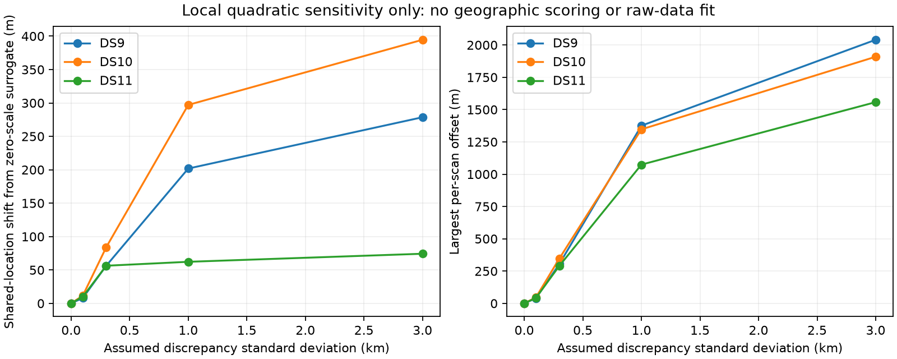

# Scan-specific discrepancy: exact local algebra and limits

Independent scan offsets can soften a scan's geometric contribution, but cannot identify a bias shared by all scans. Four algebra tests pass, and a reference-free sensitivity probe of the three existing first-block quad approximations is complete. This establishes a possible model and its limits, not an accuracy improvement or a raw-observation fit. No discrepancy width is selected.

## Full model to test

Let x be shared horizontal position, b_j a two-dimensional discrepancy for scan j, and eta_j its existing clock, drift and satellite epoch parameters. Retain the existing track likelihoods and hard satellite assignments, evaluated at apparent position x+b_j. For a fixed width tau, minimize

\[
J(x,b,\eta)=\sum_j L_j(x+b_j,\eta_j)
  +\sum_j P_j(\eta_j)+\frac{1}{2\tau^2}\sum_j\|b_j\|^2.
\]

The uniform Sacramento support remains on x, and height remains 30.48 m MSL. Here b_j represents model discrepancy, not a claim that the receiver moved. The physical meaning is deliberately limited: it absorbs residual patterns that mimic a scan-specific displacement. It could also hide timing/orbit/model defects. Existing epoch and clock priors stay fixed so this is a separate ablation.

With interior x and equal isotropic offset priors, stationarity implies sum(b_j)=0. This is a consequence of the prior and free shared location, not independent evidence of unbiased measurements. If an additional unpenalized common bias c enters as x+c+b_j, shifting x by a and c by -a leaves every prediction unchanged. No number of scans identifies those two quantities separately. A zero-centered prior on c would resolve the numerical ambiguity through an assumption, not new data.

For one scan, the joint MAP has b_1=0 and reproduces the baseline optimum when the apparent optimum lies inside the common prior support. This is a statement about joint MAP, not the position marginal after integrating b. Near a support boundary, or for a multimodal marginal, that equivalence must not be assumed.

## Exact quadratic calculation

Around an existing joint solution x_0, approximate the nuisance-profiled scan objective by

\[
q_j(z)=g_j^Tz+\tfrac12z^TH_jz,\quad
V_j=H_j^{-1},\quad m_j=-V_jg_j.
\]

Assuming positive-definite H_j and fixed tau, eliminating offsets gives

\[
W_j=(V_j+\tau^2I)^{-1},\qquad
\widehat\delta=(\sum_jW_j)^{-1}\sum_jW_jm_j,
\qquad \widehat b_j=\tau^2W_j(m_j-\widehat\delta).
\]

Thus scan information is reduced while preserving anisotropy. At tau=0 this is the original shared quadratic fit. As tau grows, the point estimate tends to the equal-weight mean of the *local quadratic minima*, while shared information tends to n I/tau² and vanishes. Those minima are not necessarily the independently acquired single-scan modes used in the centroid ablation. A stable point estimate at large tau does not imply good identifiability.

For fixed quadratic V_j, integrating Gaussian offsets and profiling offsets give the same shared-position optimizer at a fixed tau, because the extra determinant terms do not depend on position. They are not equivalent criteria for choosing tau. Gaussian marginal likelihood includes log determinants of V_j+tau²I; integrating the common mean under a flat prior additionally gives a log determinant of sum(W_j), as in the restricted-likelihood construction. For nonlinear or changing-association models, curvature can depend on position and this fixed-quadratic equivalence does not hold. Do not tune tau by lowering only the penalized residual objective, which necessarily becomes more permissive with increasing tau.

Mixed-effects modeling provides established likelihood and restricted-likelihood machinery for variance parameters; Bates et al. describe its computation via profiled deviance/REML criteria. This supports the methodological distinction, not calibration of our local IRLS matrices. [Bates et al., 2015](https://www.jstatsoft.org/article/view/v067i01/0).

## Existing-data sensitivity, without geographic scoring

The probe uses the sealed scan-tension records for DS9-B01-Q, DS10-B01-Q and DS11-B01-Q. These contain local IRLS Schur information and spatial gradients at the accepted joint solutions. IRLS information is not the exact Hessian or a calibrated inverse covariance. The stored spatial gradient approximates the nuisance-profile gradient near nuisance stationarity; the records do not establish exact nuisance profiling away from that point. No optimizer, reference scoring or width selection runs here.

| Assumed tau | DS9 shared shift | DS10 shared shift | DS11 shared shift |
|---|---:|---:|---:|
| 0.1 km | 8 m | 12 m | 10 m |
| 0.3 km | 56 m | 84 m | 56 m |
| 1 km | 202 m | 297 m | 62 m |
| 3 km | 279 m | 395 m | 74 m |

Shifts are measured from the zero-discrepancy quadratic solution, not from the reference location. At tau=1 km the largest scan offsets are 1,375 / 1,347 / 1,074 m. Larger offsets may leave the local approximation's useful range. DS11's limited shared-position response in this surrogate suggests that this particular local reweighting has limited leverage there; it does not bound the response of a nonlinear refit or another block.

## Verification and next implementation gate

Four tests compare the closed-form result with a direct full joint block solve over several widths; check zero-width, singleton and large-width limits; verify decreasing information and translation equivariance; demonstrate the free-common-bias null direction; and reject invalid matrices/scales. Existing tension, evaluation, receipt and diagnostic-source hashes are verified. The probe reads historical audit files for provenance but does not use geographic error fields. Its sealed output binds all consumed files and source code.

The next justified step is a separate research port implementing x+b_j with exact chain-rule Jacobians for both shared and local coordinates. At zero offsets it must reproduce the baseline scores, predictions and assignments; finite differences must cover spatial offsets and their prior terms. Preserve all existing nuisance priors, eight-point observations, hard-assignment behavior and numerical tolerances. Only after that gate should a fixed-width sensitivity pilot on the first single/pair/quad of each dataset be frozen with explicit cost limits. Do not select width from geographic errors or expand based only on lower fitting cost. Width estimation from two or four scans, or claiming calibrated uncertainty from this surrogate, is not justified.

Artifacts: [algebra implementation](scan_discrepancy_quadratic.py), [tests](test_scan_discrepancy_quadratic.py), [reference-free probe](probe_scan_discrepancy.py), [sealed results](scan-discrepancy-quadratic-v1.json), and [preceding centroid ablation](CENTROID_ABLATION_RESULTS.md). The production estimator and full-panel baseline remain unchanged.
