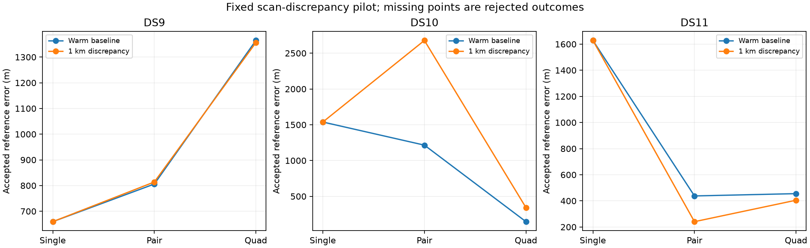

# Scan-discrepancy pilot: numerically valid, geographically mixed

All eighteen predeclared fits passed process, budget and numerical audits. The 1 km scan-discrepancy prior leaves all three single-scan results exactly unchanged, makes negligible geographic difference on DS9, worsens DS10, and improves DS11. Retain the original joint model and stop this expansion. Do not select a model or discrepancy width separately for each dataset using these reference errors.

## Hypothesis and controlled comparison

The hypothesis was that independent zero-centered scan offsets could soften overly sharp or conflicting scan likelihoods while preserving joint geometric information. Each scan is evaluated at x+b_j, with b_j distributed as a two-dimensional isotropic Gaussian with 1 km standard deviation per coordinate. Shared location x retains the uniform Sacramento disk and fixed 30.48 m MSL height. Existing scan clocks, drifts, satellite epochs, eight-point evidence, covariance and hard satellite assignment policy are unchanged.

The [frozen plan](SCAN_DISCREPANCY_FIT_PLAN.md) compares a warm baseline continuation with the discrepancy arm on the first single, pair and quad of each dataset. Both start from the same original three-start winner, with zero appended offsets in the new model, and receive at most 64 iterations. Original inference cost is charged to each arm within the original 90/180/360-second allowances. Neither arm starts from the other. Reference scoring follows independent numerical auditing. These are previously exposed, overlapping development windows, not independent validation.

## All geographic results

| Window | Warm baseline error | 1 km discrepancy error | Change |
|---|---:|---:|---:|
| DS9 single | 659 m | 659 m | 0 m |
| DS9 pair | 806 m | 814 m | +8 m |
| DS9 quad | 1,365 m | 1,356 m | -8 m |
| DS10 single | 1,538 m | 1,538 m | 0 m |
| DS10 pair | 1,215 m | 2,678 m | +1,463 m |
| DS10 quad | 146 m | 343 m | +197 m |
| DS11 single | 1,628 m | 1,628 m | 0 m |
| DS11 pair | 438 m | 241 m | -197 m |
| DS11 quad | 455 m | 405 m | -50 m |

Changes are rounded from unrounded errors. All outcomes are accepted; no failure is omitted. Three of six multi-scan windows improve and three worsen. The first DS11 block's gain does not establish a remedy for the higher DS11 errors across the full panel.

## What the offsets do

| Window | Shared-position movement | Largest scan offset | Endpoint assignment changes from original parent |
|---|---:|---:|---:|
| DS9 pair | 33 m | 357 m | 0 |
| DS9 quad | 186 m | 1,829 m | 1 |
| DS10 pair | 1,487 m | 2,106 m | 2 |
| DS10 quad | 438 m | 2,054 m | 0 |
| DS11 pair | 218 m | 875 m | 0 |
| DS11 quad | 55 m | 1,168 m | 0 |

Endpoint assignment counts do not describe every intermediate optimizer step. Warm baseline endpoints retain their parent assignments in all nine cases. The new model's offsets sum to zero within 2e-12 m in every case, as expected at an interior stationary point; this identity does not prove physical unbiasedness. Single-scan locations are identical across arms and their offset magnitudes are below 1e-12 m, confirming the expected joint-MAP invariance.

The DS10 pair regression includes changed assignments, but the DS10 quad regression occurs without an endpoint assignment change. The failure therefore cannot be attributed exclusively to changed satellite identities. Relaxing the shared geometric constraint can itself worsen position. Conversely, DS11 improvements show that the added flexibility sometimes helps; three first-block comparisons cannot identify when it is trustworthy. The offsets are phenomenological model discrepancy, not measured receiver motion.

## Cost and verification

Charged baseline/discrepancy times in seconds were DS9 single 47.0/45.8, pair 77.4/79.5, quad 187.1/193.8; DS10 single 85.9/64.0, pair 113.2/120.9, quad 221.7/219.9; DS11 single 40.6/46.7, pair 95.1/84.6, quad 156.1/160.9. These include original historical inference plus the new worker process, excluding prerequisite/coordinator preparation and separate audit time. Wall time varied substantially relative to CPU time; this is not a randomized cold speed comparison. Discrepancy multi-scan fits used 9–32 iterations versus 1–2 for warm controls.

Five admission/initial-state tests pass, supplementing the earlier three port tests, four algebra tests and nine real-data derivative prerequisites. Every fit passed the original active-coordinate gradient and stationarity checks, including appended offsets, under the same thresholds. No retry or tolerance change was used. An initial orchestration attempt stopped before creating a fit directory because original launch receipts lack separate hash sidecars; the reader was corrected before any fit, and those launch files are hash-bound in the new freezes. This was not a failed numerical outcome or a replaced trial.

The final summary verifies receipt/launch/audit seals, initial-state and parent bindings, unchanged observation IDs and all frozen source/input hashes. All eighteen completed outcomes and offset vectors are retained. Errors are against the existing unsurveyed operator reference; neither acceptance nor the offset prior supplies calibrated uncertainty.

## Decision and next direction

Do not expand this fixed-width discrepancy arm or launch a width search based on these geographic results. Together with the centroid and covariance ablations, it shows that changing weights or adding flexibility is not sufficient evidence of better localization. Preserve the joint geometric constraint as the baseline.

The strongest existing simplification remains the one-start policy, already evaluated by replay across the full panel. Its fresh cold timing comparison currently covers only the first DS9 block. A bounded cross-dataset cold comparison is a more directly supported next test than another nuisance-width search; inspect its existing sources and timing protocol before extending it. Keep that initialization/cost experiment separate from the rejected discrepancy model.

Artifacts: [sealed summary](scan-discrepancy-pilot-summary-v1.json), [runner](run_discrepancy_pilot.py), [independent audit wrapper](evaluate_discrepancy_pilot.py), [summarizer](summarize_discrepancy_pilot.py), [numerical prerequisites](SCAN_DISCREPANCY_PREREQUISITES.md), and eighteen sealed outcomes in `scan-discrepancy-pilot-v1/`. No production estimator or full-panel baseline was replaced.
