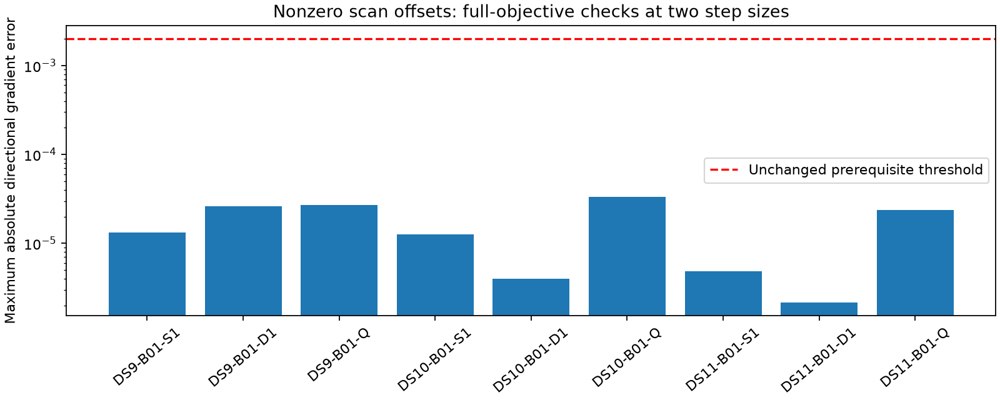

# Scan-discrepancy adapter passes all nine prerequisites

The research adapter evaluates each scan at shared location x plus its own two-coordinate offset b_j. It preserves the original window likelihood and adds identical spatial derivative columns for x and b_j. Scores, observation IDs, covariance, time origins, satellite catalogues and existing nuisance coordinates remain delegated to the original ports. Offset priors add precision 1/tau² without changing the original prior entries. Production components are unchanged.

Three unit tests pass: exact zero-offset score parity and nonlinear finite-difference Jacobians without state mutation; scan isolation and prior precision; and invalid layouts, states and widths. The synthetic Jacobian test covers every coordinate, including another scan's offset block. Zero discrepancy uses the original model rather than infinite precision.

All nine real-data prerequisites pass. Each starts at the original accepted three-start result, verifies its recorded observations and prior, and checks every track's zero-offset score vector and winning score. For signal winners it also checks exact prediction, covariance, eligibility and baseline Jacobian equality, with copied spatial columns for the offset. At nonzero offsets of (+20,-30) m per scan, full-objective derivative checks include shared position, each scan offset, each clock, three deterministic mixed active-coordinate directions, and the offset-prior gradient. Both finite-difference steps, 0.0005 and 0.0001 in native state units, must preserve winning assignments.

| Window | Track appearances | Directions at each of two steps | Maximum absolute gradient error |
|---|---:|---:|---:|
| DS9-B01-S1 | 50 | 8 | 0.0000132 |
| DS9-B01-D1 | 96 | 11 | 0.0000263 |
| DS9-B01-Q | 191 | 17 | 0.0000270 |
| DS10-B01-S1 | 44 | 8 | 0.0000127 |
| DS10-B01-D1 | 93 | 11 | 0.00000402 |
| DS10-B01-Q | 188 | 17 | 0.0000331 |
| DS11-B01-S1 | 48 | 8 | 0.00000489 |
| DS11-B01-D1 | 96 | 11 | 0.00000215 |
| DS11-B01-Q | 190 | 17 | 0.0000236 |

These are 996 track appearances in overlapping windows and 216 directional checks, not independent examples. All errors are below the unchanged 0.002 prerequisite threshold. Original hard visibility boundaries remain; these local checks do not prove global smoothness or guarantee convergence elsewhere.

Checks ran sequentially under the shared fit lock, each with a 90-second external process timeout; all processes completed successfully. No optimizer or geographic scoring ran. The summary verifies all check seals and their source/input bindings. The [fixed pilot plan](SCAN_DISCREPANCY_FIT_PLAN.md) now specifies eighteen warm outcomes: unchanged baseline and 1 km discrepancy arms on these nine windows. It requires unchanged numerical audits and charges the original inference work to each arm. The width is an illustrative fixed sensitivity setting, not an estimate; no geographic success is implied by this prerequisite.

Artifacts: [summary](scan-discrepancy-port-summary-v1.json), [port](scan_discrepancy_ports.py), [real-data checker](check_scan_discrepancy_ports.py), [unit tests](test_scan_discrepancy_ports.py), and per-window sealed checks in `scan-discrepancy-port-check-v1/`. See [model derivation](SCAN_DISCREPANCY_MODEL.md) for identifiability limits.
