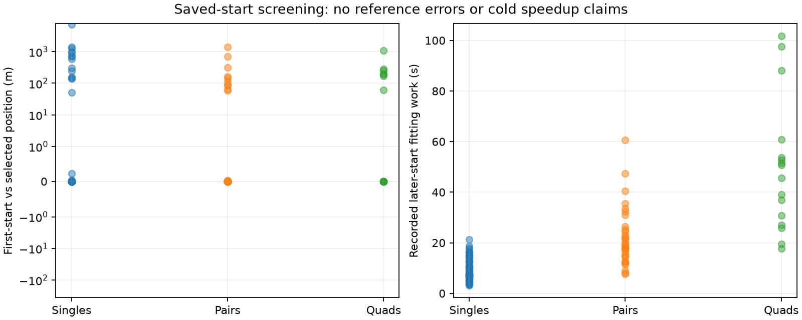

# Acquisition-start complexity on the expanded panel

The saved-fit screen supports a cold one-start ablation, but not an assumption that extra starts are redundant. It reads only sealed original inference receipts and the frozen selection; no geographic reference or error enters this screen.

| Window | First start reports convergence | Original selected start reports convergence | Later start wins | Median recorded fitting work omitted | First/selected positions differ by >100 m |
|---|---:|---:|---:|---:|---:|
| Single | 61/64 | 61/64 | 18/64 | 8.50 s | 13/64 |
| Pair | 32/32 | 31/32 | 14/32 | 19.22 s | 6/32 |
| Quad | 16/16 | 15/16 | 7/16 | 48.18 s | 6/16 |

Solver convergence is not independent numerical acceptance. In particular, a first-start result that was not the original winner has not inherited the winner's audit. The original minimum-objective selection rule includes unresolved starts; we preserve that rule rather than choosing whichever converged. Counts across sizes reuse observations.

The largest horizontal differences between first-start and selected solutions are 7,273 m, 1,400 m and 1,074 m for singles, pairs and quads. These are differences between estimates, not reference errors. Later starts improve the objective by more than one unit in 11 singles, 7 pairs and 6 quads. Thus the screen alone cannot determine whether one start improves accuracy. Recorded omitted fit work excludes acquisition and is not a measured cold speedup.

## Frozen next experiment

Hypothesis: one acquisition-ranked start reduces fresh inference cost while retaining useful accuracy and numerical acceptance. Compare seed limits one and three, using the same original acquisition, physical model, priors, 64-iteration limit, 90/180/360-second external budgets and independent numerical audit. Both arms acquire from scratch and initialize nuisance coordinates to zero; neither uses the saved fitted state. Keep this separate from the faster acquisition implementation.

Use metadata-first DS9-B01-S1, DS9-B01-D1 and DS9-B01-Q as implementation gates. Run limits in orders (1,3), (3,1), (1,3), respectively. This small alternating-order study is not a randomized runtime benchmark or a cross-dataset accuracy claim. Preserve all failures. Verify acquisition proposals and first-fit states/labels/objectives match between arms, and compare each audited output to the original baseline. Report wall/CPU costs, acceptance and only then geographic errors. Any pair/quad gate remaining unexecuted must be marked pending, not inferred from the single.

The screen has two passing tests covering unresolved minimum-objective selection and invalid prefix/winner rejection. Artifacts: [sealed summary](seed-prefix-screen-v1.json), [script](screen_seed_prefix.py), [tests](test_screen_seed_prefix.py). The original 112 baseline outcomes remain unchanged.
