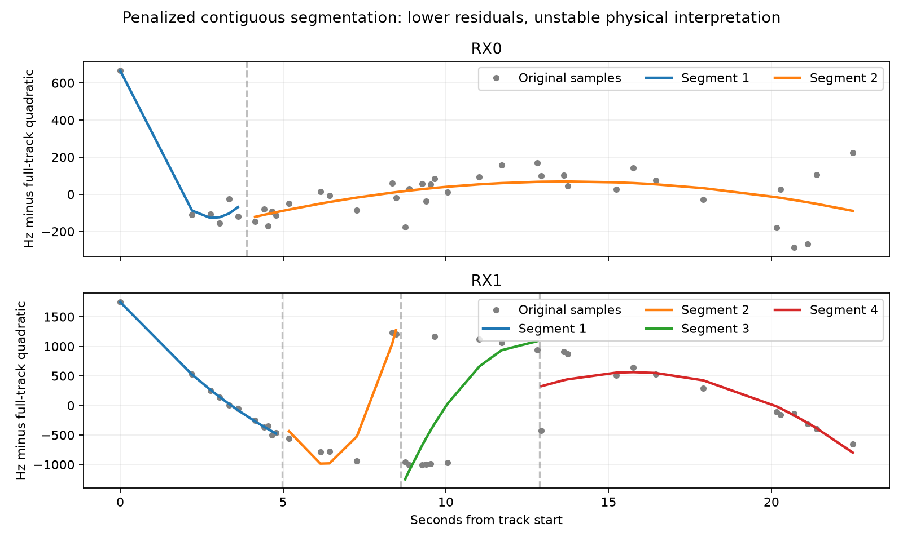

# Contiguous quadratic segmentation is too unstable to promote

The primary radio-only segmentation splits 54 of 142 independent tracks across the three pilot scans. It lowers the DS10 RX1 outlier's quadratic RMS from 769 to 371 Hz, but also splits RX0, failing the predeclared control requirement. Alternating-sample partitions differ substantially. No localization fit is warranted from this rule yet.

| Dataset | Independent tracks | Primary split | Half penalty | Double penalty | 300 Hz noise |
|---|---:|---:|---:|---:|---:|
| DS9 | 50 | 14 | 22 | 12 | 7 |
| DS10 | 44 | 15 | 18 | 12 | 7 |
| DS11 | 48 | 25 | 29 | 22 | 9 |

Every track was processed, including the two previously background-assigned DS10 tracks. Segmentation uses only original full-track frequency and time; those background labels and the fitted satellite identities do not enter its objective. All observations are covered exactly once and every segment has at least six observations and three seconds of span.

## Model and ablations

Exact dynamic programming minimizes sum(SSE_segment / sigma²) + lambda*(K−1), with a quadratic frequency curve per contiguous segment and at most four segments. The primary sigma is 100 Hz and lambda is 6 log(n). Half/double penalty controls and a 300 Hz noise control were frozen before execution. Correlated data, boundary search and non-Gaussian residuals make this a heuristic complexity penalty, not a calibrated likelihood or literal BIC.

| DS10 track | Primary segments; RMS | Double penalty | Noise 300 Hz | Alternating-point segment counts |
|---|---:|---:|---:|---:|
| RX0 | 2; 98 Hz | 2; 98 Hz | 1; 159 Hz | 2 / 1 |
| RX1 | 4; 371 Hz | 4; 371 Hz | 3; 428 Hz | 2 / 3 |

RX1 reaches the four-segment cap under both primary and doubled penalties. Its primary boundaries fall between approximately 4.78–5.18, 8.47–8.75 and 12.81–12.94 seconds from track start. Alternating-point fits do not preserve those partitions. RX0's first short segment largely isolates early behavior; reducing residual SSE does not establish a separate emitter there. The predeclared useful-outlier gate required RX0 to remain unsplit, and it fails.

Thinning also changes support and effective information, so differing partitions are a stability warning rather than an independent validation score. The existing eight-point localization cap cannot support even two six-point segments. Any future segmentation arm must act before that cap, and must separately account for additional observations and nuisance parameters. These results do not imply a fair geographic comparison with the current baseline.

## Verification and decision

Four tests cover no splitting of an exact quadratic, known step recovery, invariance to frequency/time offsets, exhaustive two-segment optimality, and minimum support. Source/input seals and complete non-overlapping coverage checks pass. The bounded three-scan job exited successfully; no RF, GPS scoring, source export mutation or localization optimization occurred. The predeclared plan is `SEGMENTATION_PLAN.md`, full partitions are sealed in `radio-segmentation-v1.json`, and counts/gate are in `radio-segmentation-summary-v1.json`.

Do not promote this contiguous splitter or choose a more favorable penalty after seeing these results. The RX1 pattern repeatedly returns to earlier frequency branches; contiguous segments may be the wrong representation. The next distinguishable hypothesis is a small mixture of smooth trajectories with non-contiguous memberships and explicit observation exclusivity. Test whether such a model gives stable, adequately supported branches and predicts withheld radio observations before attaching separate satellite identities. This is a proposed model, not evidence that two satellites were observed. Preserve the original single/pair/quad benchmark throughout.
