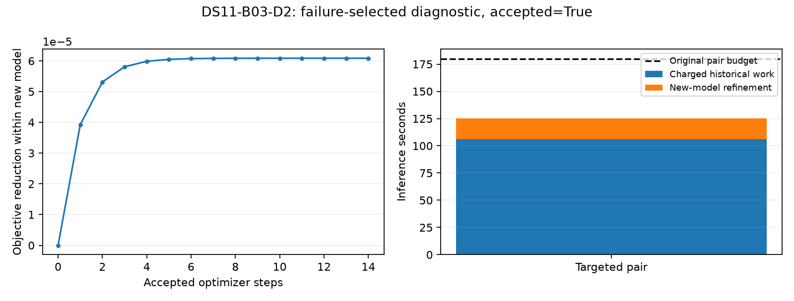

# The previously rejected boundary pair passes the new-model audit

DS11-B03-D2 now passes a fresh-process numerical audit under the shared-threshold visibility model and residual-curvature optimizer. This is an explicitly failure-selected diagnostic initialized from the exact rejected constituent-pair-v3 state. It does not replace or relabel the original result and is not a full-panel accuracy improvement claim.

The original model's hard visibility count caused a background-score jump and a finite-difference audit failure: reported maximum derivative discrepancy 0.99356 and numerical decrement squared 0.35703. The new model uses continuous shared-threshold weights at width0.1 degrees, includes their complete gradients, and retains the original observation data, orbit banks, nuisance priors, shared position and fixed30.48m MSL height.

The new fit takes fourteen accepted full steps. Its maximum scaled gradient is 6.94e-5, below the unchanged1e-4 stopping threshold. The maximum discrepancy in the prescribed derivative checks is 1.95e-5, below0.002. These checks include the previously problematic second-scan clock, every scan's clock/drift/first-epoch coordinates and fixed global nuisance directions. The old and new audit suites are not identical, and selected checks are not an exhaustive differentiability proof.

The new objective decreases by6.09e-5 from its value at the source state. This is a within-model comparison; old and new objective values are not directly comparable. No satellite assignments change. Original historical work is106.21seconds, including constituent scans, and new preparation/fitting adds19.06seconds for a125.27second total against the180second pair allowance. Audit time is outside inference and recorded separately in the sealed launch. No convergence tolerance or budget was relaxed.

This result supports the proposed repair of the visibility-boundary mechanism at the known failed state. It does not yet show improved location accuracy, reliable cold acquisition, calibrated uncertainty, or general performance across pairs and quads. The original pair remains rejected under its original model and audit.

The six predeclared metadata-first pair/quad windows are a separate subsequent pilot. Their results must be reported with all failures before deciding whether to expand the arm. Existing full-panel benchmark outcomes and the continued original-model reference remain unchanged.

## Evidence

- [Pre-fit multi-window plan](SHARED_WINDOW_PILOT_PLAN.md).
- [New-model fit receipt](shared-window-pilot-v1/DS11-B03-D2/DS11-B03-D2.json), [independent audit](shared-window-pilot-v1/DS11-B03-D2/evaluation.json) and [charged launch](shared-window-pilot-v1/DS11-B03-D2/DS11-B03-D2.launch.json), each sealed.
- [Runner](run_shared_window_pilot.py) and [two passing window-policy tests](test_shared_window_pilot.py), in addition to the six previously passing curvature/optimizer tests.
- [Original discontinuity diagnosis](GRADIENT_DIAGNOSIS.md) and [optimizer-only comparison](SHARED_CURVATURE_PILOT_RESULTS.md).
