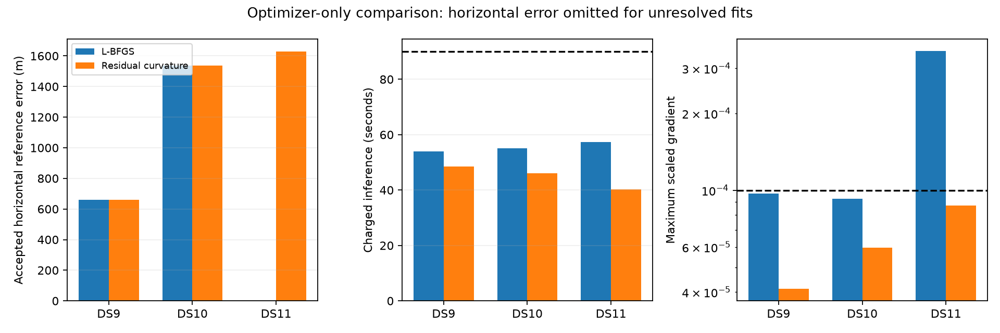

# Residual curvature resolves the three-single optimizer pilot

The structured residual-curvature direction passes all three fixed single-scan cases, including DS11-B01-S1, which failed with L-BFGS. The objective, starting states, stopping criterion, line search and audit are unchanged. This supports the direction computation for further experiments; it does not demonstrate better geographic accuracy or justify promotion to the full benchmark.

| First single | L-BFGS accepted; steps | Curvature accepted; steps | Additional inference, L-BFGS / curvature | Charged inference, L-BFGS / curvature | Curvature reference error |
|---|---|---|---:|---:|---:|
| DS9-B01-S1 | Yes; 7 | Yes; 2 | 12.73 / 7.27 s | 54.02 / 48.56 s | 659.456 m |
| DS10-B01-S1 | Yes; 22 | Yes; 5 | 15.48 / 6.44 s | 55.14 / 46.09 s | 1,538.160 m |
| DS11-B01-S1 | No; 1 then failed line search | Yes; 1 | 21.44 / 4.36 s | 57.28 / 40.19 s | 1,628.197 m |

These are three exposed development singles and historical sequential timings, not a randomized performance trial. Original baseline inference is charged in both arms; each starts from the original baseline state, not the other optimizer's output. Fresh-process audits take another 20.95, 22.72 and 23.96 seconds for the curvature arm and are reported separately. All three inference totals are below the unchanged 90-second allowance.

## What changed mathematically

Both optimizers minimize the same Gaussian prior penalty minus the maximum full branch log score per track. Both use the complete gradient, including the shared-threshold visibility weights and their effect on background probability. Position support, fixed 30.48 m MSL height, nuisance priors, hard assignment updates and 0.1-degree horizon width are identical.

The changed direction is `d = -H^-1 g`, with

`H = P + sum_tracks w J.T C^-1 J`,

where P is prior precision, J is the selected signal branch's residual-mean Jacobian, C its covariance, and `w = (4 + residual_dimension) / (4 + residual.T C^-1 residual)` is the Student-t4 IRLS weight. Background branches contribute to the full gradient and objective but have no residual Jacobian row in this preconditioner. Visibility-weight curvature is omitted. Therefore H is an approximate positive curvature for choosing steps, not the exact Hessian or a calibrated uncertainty estimate.

Woodbury nuisance elimination and a 2-by-2 position Schur complement avoid constructing a dense matrix over every satellite epoch. Singular geometry and non-descent directions fail explicitly. No position regularization is added. Both arms retain the five-kilometer position-step cap, 24 Armijo backtracks, maximum 64 iterations and maximum scaled gradient below 1e-4 stopping rule. The [plan](SHARED_CURVATURE_PILOT_PLAN.md) was written and source-bound before fitting.

## Evidence and limits

Final scaled gradients are 4.11e-5, 5.95e-5 and 8.72e-5. All three pass the same fresh-process source/input, prior/observation, objective, assignment, monotonicity, budget and selected finite-difference checks used for the L-BFGS pilot. Numerical decisions precede reference scoring. Six tests cover the structured solve and integrated optimizer, including dense-solve equivalence, whitening and column mapping, background exclusion, coupled-quadratic convergence, deadline handling and unidentifiable geometry.

Every satellite assignment remains unchanged. Positions move only 0.017, 0.107 and 0.022 meters from the original baseline. The extra decimal places document the small changes; they do not imply centimeter ground-truth accuracy. The reference remains unsurveyed. There is no meaningful location improvement here.

The useful finding is narrower: a direction based on residual curvature resolves DS11's pilot failure under the original convergence rule. The earlier tiny-step diagnosis did not establish a unique root cause, and this ablation does not prove one. It demonstrates that changing the direction computation is sufficient in this case, without relaxing acceptance or changing the statistical model.

Next evaluate the actual previously rejected boundary-pair state as an explicitly failure-selected diagnostic, then matched pair and quad pilots with size-scaled original budgets. The three-single result alone does not establish performance with multiple independent nuisance blocks, changed satellite associations or cold acquisition. Preserve both optimizer arms and all original failures; the continued original model remains the full-panel reference.

## Reproducibility

- [Sealed comparison summary](shared-curvature-pilot-summary-v1.json) and SHA-256 sidecar bind all outcomes and the prior arm.
- [Optimizer](shared_visibility_curvature_optimizer.py), [runner](run_shared_curvature_pilot.py), [tests](test_shared_visibility_curvature_optimizer.py), and [figure/summary generator](summarize_shared_curvature_pilot.py).
- Per-case sources, receipts, launch timing and independent audits remain under `shared-curvature-pilot-v1/`.
- [Preserved L-BFGS outcomes](SHARED_VISIBILITY_PILOT_RESULTS.md) and [line-search diagnosis](SHARED_LINE_SEARCH_DIAGNOSIS.md).
