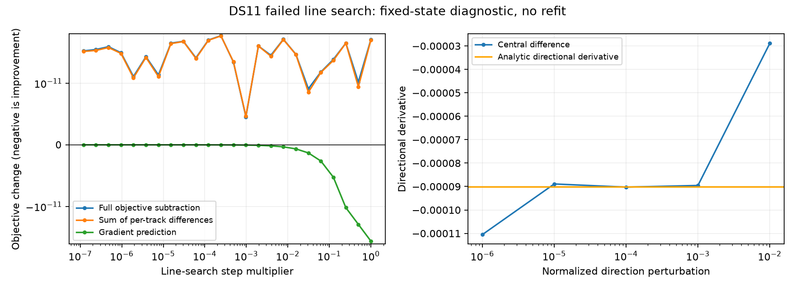

# DS11 line-search diagnosis and a structured direction solver

The failed DS11-B01-S1 pilot is reproducible at its saved state. Reconstructing its single L-BFGS history pair reproduces rejection of all 24 prescribed step sizes. None changes a satellite assignment. The original unresolved result remains unchanged; this diagnostic performs no refit or geographic scoring.

The full proposed step has mixed-coordinate norm 4.66e-7; this is not a distance in meters because it combines position and nuisance coordinates. Its predicted objective change is -4.20e-11, whereas the evaluated change is +6.09e-11. Across the 24 shrinking steps, actual changes range from +4.55e-12 to +7.19e-11 and do not shrink smoothly with the step. The objective's floating-point spacing is 4.55e-13. The requested Armijo decrease at the largest step is only 4.20e-15, below that spacing.

Computing prior changes algebraically and summing individual track-score differences gives +5.98e-11 at the full step, close to ordinary subtraction. Therefore cancellation from subtracting the total objective is not the main explanation. Per-track evaluation precision and geometry calculations remain possible sources. This experiment does not isolate them, and it does not inspect switches of the minimum-elevation observation inside each visibility weight.

The analytic derivative along the normalized proposed direction is -9.013e-5. Central differences at steps 0.001 and 0.0001 give -8.955e-5 and -9.025e-5, supporting descent at those scales. At 0.000001 the estimate is -1.105e-4, showing greater sensitivity; at 0.01 the estimate differs substantially, consistent with probing a nonlocal scale. These observations support investigating numerical resolution and step conditioning, rather than relaxing convergence or claiming a wrong satellite association caused this failure.

## Next optimizer comparison

A separate structured curvature helper now solves `H d = g` for

`H = diag(prior_precision) + U.T U`,

where U will contain whitened, robustly weighted residual Jacobian rows. Nuisance priors are positive; the two horizontal coordinates can retain zero precision. Woodbury elimination reduces the nuisance solve to observation space, and a 2-by-2 Schur complement solves position. This avoids constructing and factoring a dense matrix over every satellite epoch. Three tests verify equivalence to a dense solve with free position coordinates, positive descent, rejection of unidentified position geometry, and invalid-prior rejection.

This helper is only a direction preconditioner. It is not the exact Hessian of visibility weights or the Student-t objective, and it does not provide calibrated uncertainty. Integration must retain the complete new-model gradient and objective, use a checked descent direction and line search, preserve the same stopping rule, and report failures. No radio fit has used it yet.

The next ablation should change only the direction computation from L-BFGS to this residual-curvature preconditioner, keeping the same three baseline states, 0.1-degree visibility width, priors, fixed height, charged 90-second budget, maximum 64 iterations and independent audit. Specify and freeze the complete runner before fitting. If that arm passes, proceed to the known boundary pair as a failure-selected diagnostic, then broader matched singles/pairs/quads evaluation. Neither a tiny-step diagnosis nor a passing synthetic solve justifies promotion.

## Evidence

- [Sealed fixed-state diagnostic](shared-line-search-diagnostic-v1.json), with source bindings and all 24 steps; runtime 20.22 seconds under a 120-second external cap.
- [Diagnostic implementation](diagnose_shared_line_search.py) and [figure generator](plot_shared_line_search.py).
- [Structured solve](structured_curvature.py) and [three passing tests](test_structured_curvature.py).
- [Original pilot outcomes](SHARED_VISIBILITY_PILOT_RESULTS.md), including the preserved DS11 failure.
