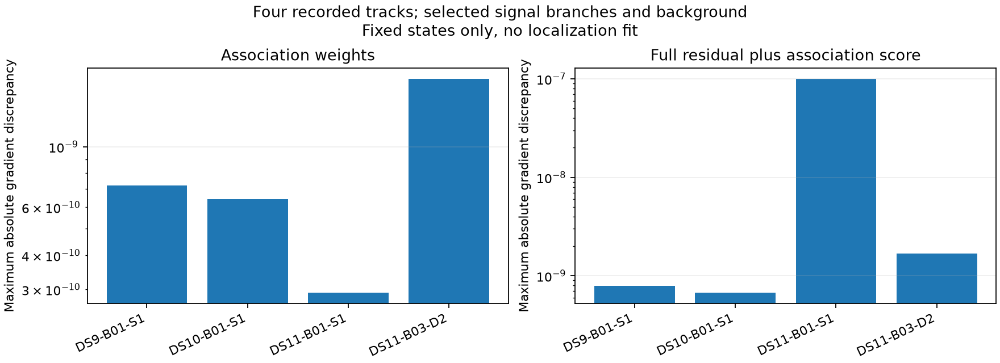

# Shared-threshold branch scoring passes recorded-track gradient checks

The experimental scorer now combines the original Student-t residual likelihood with shared-threshold signal/background weights. It preserves the original observation and covariance definitions but replaces the hard visibility allocation in this separate research port. No existing fitter, source-frozen receipt or benchmark result is changed.

The state-gradient implementation stores only candidate-by-three geometry derivatives and a vector of background epoch contributions. A selected signal depends on its own epoch; background depends on all epochs. The common-clock derivative equals their summed contributions. A synthetic test checks every state column, probability conservation and zero drift influence on visibility. Four recorded-track checks additionally verify that perturbing one satellite epoch leaves every other candidate's geometry exactly unchanged.

Complete branch-score derivatives are checked against central differences in east, north, clock, both receiver drifts and selected epoch coordinates. Each of the four tracks tests candidate index zero, the final candidate, the candidate nearest the visibility boundary, the highest-scoring signal, and background. Duplicate indices are collapsed. Maximum discrepancy is approximately 1.01e-7, below the fixed 1e-4 threshold. The original selected-satellite prediction mean is also checked against the full-catalogue residual mean.

The [weight-gradient receipt](visibility-state-gradient-check-v1.json) and [complete branch-score receipt](shared-visibility-port-check-v1.json) bind the saved inputs and experimental sources. The geometric E/N mapping derivative remains numerical, and the inherited residual predictor uses its existing derivative implementation. These checks do not constitute a global gradient proof or a successful location estimate.

Next aggregate the new track ports and Gaussian nuisance priors into a full scan/window objective, verify it against directional differences, and implement a separate optimizer that includes all association-weight derivatives. Preserve the explicit nondifferentiable-tie outcome. The existing fast solver omits these terms and cannot be used unchanged merely by swapping scores. Pilot membership, width sensitivity and runtime budgets must be fixed before comparative fitting.
