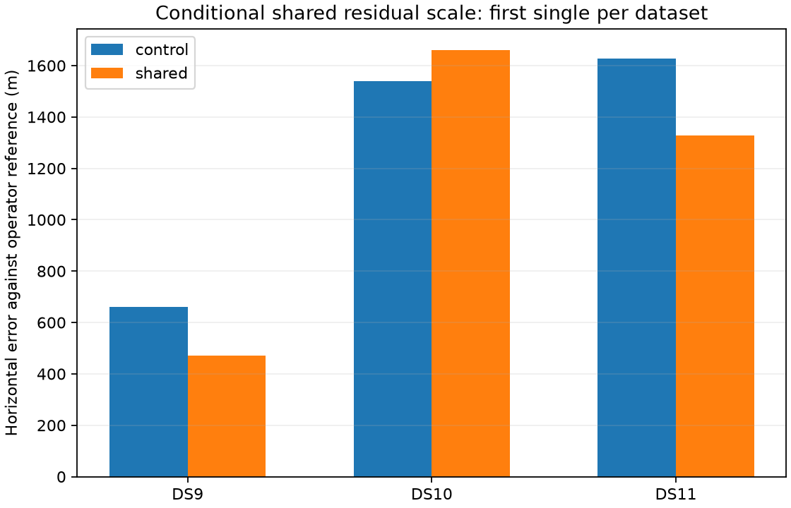

# Shared satellite residual scale: numerically valid, mixed accuracy

The conditional shared-scale model passes its mathematical and numerical checks, improves two first-single cases, and worsens the third. It fails the predefined expansion gate because DS10 deteriorates by121m. Retain the original model; do not expand this nu4 fixed-membership version to pairs or quads or tune it against these three geographic answers.

| First single | Original fixed-association control | Shared scale | Paired error change | Shared fit updates |
|---|---:|---:|---:|---:|
| DS9 | 659 m | 470 m | -189 m | 6 |
| DS10 | 1,538 m | 1,660 m | +121 m | 12 |
| DS11 | 1,628 m | 1,327 m | -301 m | 8 |

All6 planned fits pass numerical audit. Median paired change is-189m, but the gate also required no pilot case to worsen by more than1m. Three exposed cases cannot establish population benefit. These numbers are errors against unsurveyed operator reference metadata, not held-out accuracy.

## Model

The original model integrates a separate latent residual precision for each track. For a group of tracks assigned to one satellite within one scan, the alternative shares one precision lambda_G~Gamma(2,2), using the shape/rate convention. Conditional on lambda_G, residual vectors are Gaussian with their existing covariance divided by lambda_G. Integrating lambda_G gives one normalized multivariate Student-t4 density over the concatenation of group residuals with block-diagonal original covariance.

If D is total contrast dimension and Q is summed Mahalanobis distance, the shared IRLS weight is(4+D)/(4+Q). The corrected physical group score is the sum of original selected-branch scores, minus their individual residual log densities, plus the normalized group log density. This preserves branch priors and required normalization constants. A singleton group exactly reproduces the old score. No observations are dropped and no geographic weighting threshold is introduced.

Sharing a scale makes residual magnitudes dependent across tracks; it does not insert off-diagonal covariance or replace the existing shared satellite epoch parameter. One badly fitting track can reduce weights for useful tracks in its group. Conversely, many well-fitting tracks can increase another track's weight relative to the independent-scale model. Thus this model changes the reliability assumption rather than simply making the fit more robust in every situation.

Membership and identities are fixed from each accepted baseline. The research composite port exposes one allowed group branch and concatenated predictions to the existing joint optimizer. Original background-assigned tracks retain their fixed background branch. Dynamic reassignment would change group membership and couple branch decisions, so this pilot is not an implementation of dynamic group association or a cold-start algorithm.

## Controls and verification

Four synthetic tests pass: normalized group-density/physical-prior preservation, exact singleton equivalence, analytic versus finite-difference gradient, and rejection of duplicate evidence or background members. Real first-single prerequisites preserve all original physical observation IDs and reproduce singleton means, covariances and Jacobians exactly. The largest real objective-gradient discrepancy is3.61e-5 at step0.0005 and1.34e-6 at step0.0001, below0.005. DS9/DS10/DS11 contain respectively10/8/12 multi-track groups and9/18/10 singleton groups; DS10 retains its two background tracks.

Both arms start from the identical accepted state with unchanged prior, height and covariance model. The original fixed-association controls move only0.012–0.033m from their parent positions; comparison uses these freshly audited controls. Shared fits move193m,122m and370m respectively. Their stationarity audits pass, with the largest finite-gradient scaled decrement below1.67e-8. The six sequential processes take18.57seconds in total, including audits and startup, each below90seconds; this is warm-pilot cost, not cold inference timing. The prerequisite processes take13.14seconds total.

The frozen `SHARED_SCALE_PLAN.md` required all three pilots accepted, a negative median paired change, and no worsening greater than1m before extending to predefined pairs/quads. The last condition fails. No reruns, degrees-of-freedom changes or geographic case selection occurred. Geographic scoring follows verification of all6 sealed numerical outcomes.

## Decision and next question

The pilot shows that correlated scale is implementable with a small exact likelihood change and that it can materially alter location. It does not establish a reliable improvement over independent per-track robustness. Preserve it as a mixed result and retain the original control.

Before another scale-model fit, a useful follow-up is to examine whether within-group residual energy actually predicts other tracks' residual energy at a fixed state, using leave-one-track-out conditional predictive densities under the shared Gamma precision versus independent Student-t4. That diagnostic could distinguish evidence for shared reliability from a favorable location shift on two cases. Fixed baseline states use all observations, so it would remain an exposed conditional diagnostic, not independent validation. A negative result would lower the priority of further scale variants; a positive result would still require an explicit new hypothesis and controls before any new width/shape or partial-pooling model.

## Artifacts

`shared_scale_port.py` implements the conditional model; `test_shared_scale_port.py` contains the four tests. `check_shared_scale.py` writes immutable real prerequisites under `shared-scale-check-v1`. `run_shared_scale_pilot.py` writes all6 model/control receipts under `shared-scale-pilot-v1`; `evaluate_shared_scale.py` verifies them before producing the geographic summary and figure. Each scientific JSON has a SHA256 sidecar and source/input bindings. No production implementation or prior receipt was changed.
