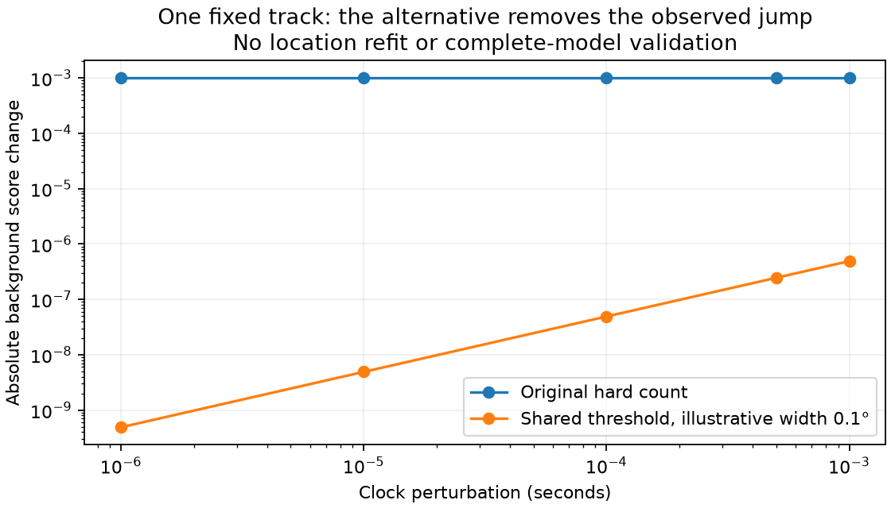

# Shared threshold removes the recorded background jump in a local probe

The shared-threshold helper uses one uncertain horizon offset per track, giving candidate visibility `sigmoid(minimum elevation margin / width)`. It preserves normalized signal/background mass and avoids the duplicate-observation defect of the product gate. Three tests pass: probability and derivative consistency at unique minima, invariance under duplicate geometry/derivatives, and continuity at a crossing minimum. At an exact tie with different slopes, it returns no ordinary Jacobian rather than falsely certifying differentiability.

On the saved DS11-B03-D2 state, background-assigned track 60 reproduces the original constant score jump across shrinking clock perturbations. Replacing only the visibility weights for this diagnostic makes the score difference shrink proportionally with the perturbation. The finite-difference derivative is approximately −0.00024550679 per second across steps from 0.001 to 0.000001 seconds, agreeing with the chain-rule derivative. The geometry clock derivative used in that chain rule is itself a central difference at 0.00001 seconds; this is not proof of a fully analytic geometry implementation.

Width 0.1 degrees is illustrative and was not selected using geographic error. This probe changes no saved state, assignment, optimizer, audit or benchmark outcome. It evaluates one background term, not the entire likelihood. The rejected pair and its dependent recursive quad remain rejected under the original experimental policy.

The [sealed real-data probe](shared-threshold-real-probe-v1.json) binds the original fitted receipt and model-helper sources. Next validate spatial, clock and epoch geometry derivatives, selected signal weights, background contributions and scoring consistency, including near-tie cases. A solver using only residual derivatives cannot safely adopt these new weights. A separately frozen pilot with complete objective/audit agreement is required before claiming localization improvement.
