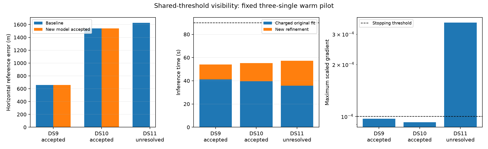

# Shared-threshold pilot: stable positions, no demonstrated gain

The fixed three-single warm pilot is complete. DS9 and DS10 pass the new numerical audit, but their positions move only 0.022 and 0.133 m. DS11 fails the stopping condition after a line-search failure. This arm is not promoted; the continued original model remains the benchmark reference.

| First single | Numerical result | Original error | New accepted error | Position change | Charged inference | Separate audit |
|---|---|---:|---:|---:|---:|---:|
| DS9-B01-S1 | Accepted | 659.443 m | 659.461 m | 0.022 m | 54.02 s | 26.84 s |
| DS10-B01-S1 | Accepted | 1,538.240 m | 1,538.149 m | 0.133 m | 55.14 s | 21.27 s |
| DS11-B01-S1 | Unresolved: line search | 1,628.178 m | — | — | 57.28 s | 22.03 s |

Sub-meter digits document how little the estimates changed; they do not imply survey accuracy. The reference is operator reported and unsurveyed. No geographic score is assigned to the unresolved output. All satellite assignments remain unchanged across all three fits.

## Model and hypothesis

For satellite i, replace the discontinuous all-observation horizon gate with

`v_i(x) = sigmoid(min_t elevation_margin_i,t(x) / 0.1 degree)`.

Signal branch mass is `signal_prior * v_i / N`; background receives the complementary mass. This models a shared uncertain horizon threshold, avoiding the artificial evidence multiplication of independent per-observation gates. The minimum remains piecewise differentiable; unequal-gradient exact ties are explicit failures. Track residuals retain the Student-t4 likelihood. A single position is shared within a window, and Gaussian clock, receiver-drift and satellite-epoch priors are unchanged.

The objective is the Gaussian prior penalty minus the sum of the maximum branch log score per track. The experimental optimizer is limited-memory BFGS with the full score gradient, including visibility contributions to background probability. It recomputes hard assignments, clears curvature history after label changes and uses an Armijo line search. Both model and optimizer changed, so this pilot cannot attribute effects to either alone.

The hypothesis was that continuous horizon weights could remove a previously observed background-score discontinuity while retaining useful baseline modes. These three metadata-first singles test compatibility near existing solutions. They do not directly test the rejected DS11-B03-D2 boundary case or acquisition from the broad prior.

## Budget and independent checks

The [pre-fit plan](SHARED_VISIBILITY_PILOT_PLAN.md) fixes the cases, width, initialization and 90-second charged allowance. Each run starts at its sealed original baseline state. Historical baseline launch time plus new worker preparation and fitting is charged; the additional inference costs are 12.73, 15.48 and 21.44 seconds. No budget or convergence threshold was relaxed.

A fresh process reconstructs the objective and verifies source/input seals, window identity, priors, observations, assignments, initial/final objective, monotonicity, charged budget and maximum scaled gradient below 1e-4. Before fitting, the runner fixes coordinate checks 0 through 5, floor(D/2), D-1, plus three deterministic nuisance directions, at steps 0.0005 and 0.0001. All derivative discrepancies are below the predeclared 0.002 tolerance; maxima are 1.69e-5, 1.09e-5 and 5.22e-6. These selected checks are not exhaustive derivative, Hessian or uncertainty certification. Geographic reference is read only after all numerical decisions are fixed.

The final scaled gradients are 9.71e-5, 9.27e-5 and 3.51e-4. DS11 satisfies the binding, budget, objective and derivative checks but fails convergence and stationarity. Keeping this explicit failure is essential: a successful derivative check does not imply an optimizer has reached its stopping criterion.

## What this changes next

There is no useful accuracy improvement here. Within the new model, objective reductions are only 5.95e-10, 6.69e-8 and 8.64e-11. Original-model and new-model objective values must not be compared directly. Extra generic quasi-Newton iterations near these baseline solutions add cost without changing the association mode.

The DS11 line-search failure warrants a bounded numerical diagnosis before widening this arm to pairs and quads. Candidate explanations include poorly conditioned position/nuisance directions, objective precision at tiny steps and piecewise visibility geometry; none is established by this pilot. Inspect the failed descent direction over fixed step sizes, compare predicted versus actual objective reduction, and locate any active minimum or assignment changes. Preserve these original receipts and thresholds.

For a subsequent optimizer ablation, retain the same visibility model, starts and budget while changing only preconditioning or the step computation. A targeted run on the previously rejected pair would then test the actual boundary mechanism, explicitly labeled as a failure-selected diagnostic. Broader singles/pairs/quads evaluation remains necessary before any promotion. Width sensitivity at 0.03 and 0.3 degrees remains a separate planned experiment, not an explanation for these results.

## Evidence

- [Sealed summary](shared-visibility-pilot-summary-v1.json) and SHA-256 sidecar bind all three receipts, launches, audits and sources.
- [Runner and fresh-process audit](run_shared_visibility_pilot.py), [summary and figure generator](summarize_shared_visibility_pilot.py).
- Six tests pass across runner policy, optimizer and complete-window objective. The runner tests cover charged historical cost, failed-check rejection and deterministic audit directions; optimizer tests cover synthetic convergence and deadline handling. Recorded-data audits provide the separate integration evidence.
- Per-case artifacts are retained under `shared-visibility-pilot-v1/`. These are exposed development results and a warm replay, not a new held-out or cold-acquisition benchmark.
