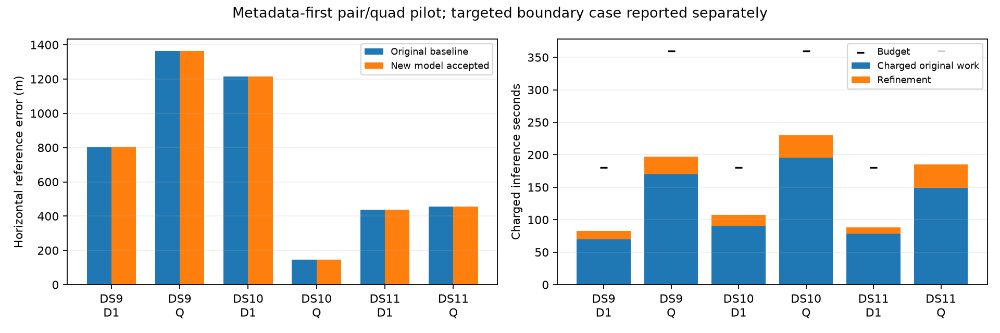

# Shared-visibility pair/quad pilot: six passes, essentially unchanged accuracy

All six predeclared metadata-first pair/quad windows pass the complete new-model numerical audit. Together with the three-single curvature pilot, this validates warm refinement on three singles, three pairs and three quads under the tested settings. It does not establish cold acquisition, full-panel superiority or geographic generalization. The continued original model remains the full-panel reference.

| Window | Original error | New accepted error | Position change | Added inference | Charged total / limit |
|---|---:|---:|---:|---:|---:|
| DS9-B01-D1 | 805.914 m | 805.926 m | 0.038 m | 12.77 s | 82.77 / 180 s |
| DS9-B01-Q | 1,364.712 m | 1,364.718 m | 0.006 m | 27.05 s | 197.18 / 360 s |
| DS10-B01-D1 | 1,215.341 m | 1,215.236 m | 0.115 m | 16.50 s | 107.05 / 180 s |
| DS10-B01-Q | 146.104 m | 146.126 m | 0.025 m | 34.54 s | 230.31 / 360 s |
| DS11-B01-D1 | 437.794 m | 437.770 m | 0.025 m | 9.79 s | 88.41 / 180 s |
| DS11-B01-Q | 455.424 m | 455.423 m | 0.007 m | 35.60 s | 184.89 / 360 s |

The extra decimals expose the negligible changes; they do not imply centimeter reference accuracy. All references are operator reported and unsurveyed. Every satellite assignment remains unchanged. Additional objective reductions under the new model are below1e-7 in these six cases. This is compatibility and numerical-stability evidence, with no meaningful accuracy improvement.

## Model, audit and cost

Each window shares one horizontal position and retains independent scan clock, receiver-drift and satellite-epoch nuisance blocks. The Student-t4 residual likelihood and Gaussian priors are unchanged. Shared uncertain-horizon weights replace the hard visibility gate at width0.1degrees. The residual-curvature optimizer uses the complete score gradient and a positive residual-Jacobian approximation for its search direction. The geographic support remains the uniform250km Sacramento disk, and height remains30.48m MSL.

Each fit starts at its own original baseline state; this is warm refinement, not an integrated cold run. Original baseline launch time is charged once, followed by new preparation and inference. Budgets,64iteration limit,24Armijo trials,5km position cap and scaled-gradient stopping threshold1e-4 were frozen in the [plan](SHARED_WINDOW_PILOT_PLAN.md) before fitting. No outcome was replaced or selected using geographic error.

All six fresh-process audits pass source/input bindings, observation identity, priors, column maps, initial/final objective, assignments, monotonicity and budget. Final maximum scaled gradients range3.77e-5 to8.38e-5. Maximum discrepancies in selected finite-difference checks range4.61e-6 to2.66e-5, below0.002. Checks cover position, each scan's clock/drifts/first epoch and deterministic nuisance directions. They are not exhaustive Hessian checks or calibrated uncertainty guarantees. Separate audit times range39.82–85.44seconds, excluded from inference consistently with the earlier benchmark.

## The targeted boundary case stays separate

The seventh case, DS11-B03-D2, deliberately starts from the previously rejected constituent-pair state. It passes the new audit after14steps within125.27/180charged seconds and now has2,802.351m horizontal reference error. Its position moves5.005m from the rejected state. The original source remains rejected and receives no accepted geographic score or claimed accuracy delta. Its unchanged assignments and repaired numerical behavior support the boundary-mechanism fix, not an unbiased accuracy gain. See the [separate diagnostic](SHARED_BOUNDARY_DIAGNOSTIC.md).

## What to do next

The smoother visibility model has repaired the known numerical boundary problem without materially perturbing the tested ordinary solutions. A full-panel warm replay would therefore mainly test robustness; it is not yet a compelling accuracy experiment. The [existing-mode ranking diagnostic](MODE_RANKING_DIAGNOSTIC.md) likewise finds limited sub-kilometer headroom from merely choosing between already available alternatives.

Next measure conditional satellite-association ambiguity at these nine metadata-first fitted states before paying for an all-candidate soft-association optimizer. The [diagnostic plan](ASSOCIATION_AMBIGUITY_PLAN.md) specifies normalized branch mass, entropy, top-branch gaps and hard-to-marginal score corrections without any new fits or geographic selection. This will help distinguish whether marginalizing associations is promising or whether residual-model mismatch and different candidate evidence deserve priority. Conditional probabilities at fitted nuisance values are not calibrated posterior probabilities, so profiling/integration asymmetry must remain explicit.

All pilot jobs are terminal. The [sealed seven-case summary](shared-window-pilot-summary-v1.json), source-bound receipts under `shared-window-pilot-v1/`, and [summary/figure generator](summarize_shared_window_pilot.py) preserve every planned outcome. The original full-panel, constituent and recursive results remain unchanged.
