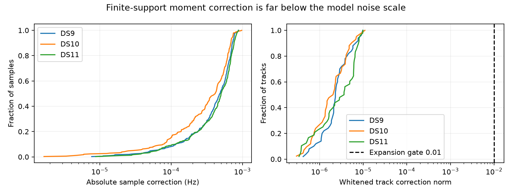

# Finite detector support is negligible in the three pilots

The tested finite-support correction is below 0.001 Hz on every retained signal observation. Its maximum whitened track norm is about 0.000011, nearly three orders of magnitude below the predeclared 0.01 expansion threshold. Stop this localization-model expansion; it does not explain the current residual mismatch under the tested moment approximation.

| Dataset | Signal tracks | Maximum absolute correction | Maximum whitened track norm | Expansion gate |
|---|---:|---:|---:|---|
| DS9 | 50 | 0.000884 Hz | 0.00000987 | Fail |
| DS10 | 42 | 0.000975 Hz | 0.00001094 | Fail |
| DS11 | 48 | 0.000876 Hz | 0.00000979 | Fail |

## Meaning of the model

The pinned public `fractional_glrt64_support_geometry` computes equally weighted selected-symbol centers. Its recorded timestamp is their mean. The factorial moments are m0=1, m1=0, m2=E[dt²]/2 and m3=E[dt³]/6; their units are respectively 1, seconds, seconds squared and seconds cubed. The recorded support envelope spans roughly 18–19 milliseconds in these scans. It also includes interpolation guards, so the envelope is not a uniform integration interval.

The frozen localization model evaluates Doppler at the recorded center plus the fitted scan clock and satellite epoch shifts. We approximated the support average by f(t) + m2 f''(t) + m3 f'''(t). Centering cancels the first-order term. Linear receiver drift therefore receives no correction under this weighting. The same normalized reference-frequency convention, fixed-height surface, receiver coordinates and orbital position/velocity interpolation were retained.

For each track, the correction is transformed through the existing offset-removing contrasts and whitened by the existing covariance. The gate concerns that norm, not an unnormalized sum over measurements. No new variance, timing or weighting parameter is introduced.

## Numerical checks and limits

The independent point-time calculation reproduces all signal prediction contrasts within 1.02e-10 Hz, including fitted receiver drift. Differences between h=0.02 s and h=0.04 s finite-difference corrections are at most 2.14e-8 Hz, and every step-stability check passes. Three tests cover exact cubic support averaging, zero constant/linear correction and rejection of off-center moments. All three workers exited successfully under 90-second caps; no fit, GPS score or RF collection ran. Source/input bindings were verified, and the public support function source and its module digest are preserved in `support-effect-v1/geometry-source.json`.

This is a cubic moment approximation about already fitted states, not an exact model of the frequency estimator, a rigorous Taylor remainder bound, or a geographic accuracy evaluation. Equal-weight symbol-center moments do not prove the detector's actual frequency-estimation weights. The result rules against implementing this particular correction on the three pilots; it does not rule out estimator bias, timestamp conventions, RF systematics or orbit error more generally. No pair/quad fit is warranted from this effect-size result.

## Next hypothesis

Investigate the signed residual structure across the two receivers for matched satellite and physical visit/time support. Shared residual variation would be more consistent with a common prediction/timing source; receiver differences would motivate an RF-specific model. First audit overlap and establish a contrast that removes arbitrary track offsets without treating fitted labels as truth. This can distinguish candidate causes more directly than another unconditional noise-scale change. It remains an untested proposal.

The predeclared plan is `SUPPORT_EFFECT_PLAN.md`; all per-track corrections, gates, source receipts and execution logs are in `support-effect-v1`. The summary is sealed in `support-effect-summary-v1.json` with its SHA sidecar and accompanying figure. Existing baseline models remain unchanged.
