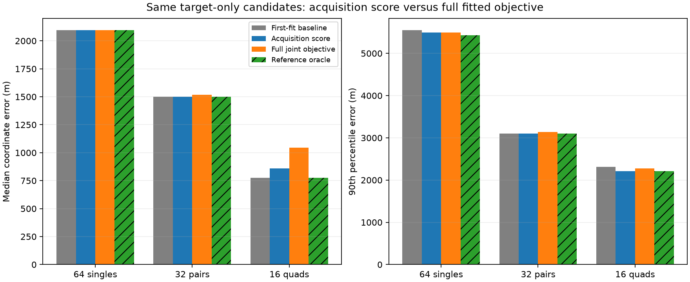

# Full fitted objectives do not fix location ranking

The separate 112-target comparison is complete. Ranking accepted same-target leaders by their full joint objective does not improve the median single error, slightly worsens pairs, and raises quad median error from 775 to 1,044 m. It changes 28 choices: twelve improve by more than 1 m and sixteen worsen. Keep the first-fit reference; neither more aggressive minimization nor consistent point-objective ranking is established as an accuracy improvement.

| Targets | Baseline median / p90 | Target acquisition score median / p90 | Full joint objective median / p90 | Target-only reference oracle median / p90 |
|---|---:|---:|---:|---:|
| 64 singles | 2,094 / 5,547 m | 2,094 / 5,496 m | 2,094 / 5,496 m | 2,094 / 5,425 m |
| 32 pairs | 1,501 / 3,104 m | 1,501 / 3,104 m | 1,519 / 3,135 m | 1,501 / 3,104 m |
| 16 quads | 775 / 2,310 m | 858 / 2,212 m | 1,044 / 2,280 m | 775 / 2,212 m |

All columns use the same target-only candidate sets. These differ from the larger contained-window pools in the [preceding diagnostic](WINDOW_CANDIDATE_RESULTS.md); comparing the new objective arm to that larger pool would confound ranking with candidate availability. The oracle uses the reference answer and is diagnostic only.

## Model and controlled comparison

The [post-result plan](TARGET_OBJECTIVE_PLAN.md) freezes a new ranking arm while preserving the original candidate study. Each target has its accepted first fit and, where available, its accepted original three-start winner. The three first fits recovered by the 96-iteration pilot remain explicit replacements. Accordingly, the 64-single baseline includes those formerly rejected cases; it is not the earlier median conditioned on only 61 accepted first fits or a fresh unified cold benchmark.

For candidate j fitted to the same target w, select the lowest already audited value

`F_w(x_j, eta_j) = 0.5 * eta_j.T P_w eta_j - sum_tracks max_branches ell(track, branch, x_j, eta_j)`.

Each candidate uses its own fitted nuisance coordinates and assignments. Prefer the first fit within 1e-6 of the minimum, then frozen order. Both candidates must have identical model, ordered scan binding, observation IDs, inputs, height, columns, prior precision and configuration apart from start/iteration limits. No objective from a single or pair is compared to the objective for a larger window.

The alternative acquisition arm uses branch log-sum-exp with every nuisance coordinate set to zero. Switching to the full objective therefore changes both nuisance treatment and association treatment. This is a consistency comparison, not a factor-by-factor attribution of their effects. It also remains a point-objective comparison, not integration over nuisance uncertainty or mode volume.

The selector reads accepted source receipts and their matching audits, checks finite recorded objectives and preserves their hashes. All 112 choices are sealed before the separate evaluator accesses reference-derived errors. Three tests guard cross-target comparisons, inconsistent scan bindings, nonfinite objectives, deterministic ties and independence from error metadata. Every source/input binding is verified. No new fits, retries, runtime claims or production changes occur.

## Paired outcomes

| Targets | Full objective improves >1 m | Worsens >1 m | Within 1 m | Baseline / full-objective within 1 km |
|---|---:|---:|---:|---:|
| Singles | 7 | 6 | 51 | 6/64 / 7/64 |
| Pairs | 3 | 6 | 23 | 12/32 / 12/32 |
| Quads | 2 | 4 | 10 | 9/16 / 8/16 |

Median paired changes are zero in all sizes because most cases are unchanged. A changed pooled median should not be interpreted as that same improvement or regression on every window. Maximum errors remain 46,067 / 6,139 / 2,803 m. The full objective does not remove the difficult tail in these candidate sets.

The failures are not all near-ties. DS9-B05-Q improves its objective by 25.2575 but worsens reference error from 493 to 1,385 m. DS9-B02-D2 improves its objective by 22.6457 while error worsens from 603 to 750 m. Conversely, DS9-B02-S3 improves its objective by 82.8585 and error from 1,848 to 665 m. A lower objective can accompany either better or worse geography. These examples are descriptive after the fixed comparison, not thresholds for overriding it.

Dataset median errors, baseline / full-objective selection:

| Dataset | Singles | Pairs | Quads |
|---|---:|---:|---:|
| DS9 | 2,007 / 1,917 m | 1,127 / 1,127 m | 723 / 1,159 m |
| DS10 | 1,724 / 1,671 m | 1,171 / 1,223 m | 443 / 443 m |
| DS11 | 2,729 / 2,729 m | 2,162 / 2,162 m | 2,308 / 2,116 m |

Do not switch algorithms by dataset using these exposed results. The windows overlap and share one unsurveyed operator reference site. Candidate generation required earlier inference; a cheap lookup among stored results is not a free real-time estimator.

## What changes next

The earlier ranking failure is not explained solely by fixing nuisance parameters at zero: even the model's coherent fitted objective selects less accurate leaders in several cases. This does not prove which physical or statistical assumption is wrong, nor that the first fit is always preferable. It argues against spending the next campaign solely on more minimization or profiling of these same leaders.

An evidence-driven next direction is a measurement-model check for shared receiver time structure beyond the current linear drift term. The frozen physical predictor explicitly adds receiver drift times centered observation time; its contrast projection removes constant offsets. A small receiver-shared curvature term could be tested as a hypothesis, but it must not be added merely because it lowers training residuals. First inspect time/receiver coverage and test residual prediction across held-out satellite/track groups, with fitted geometry and identities held fixed and no geographic tuning. Include an added-linear-drift control, since shrinkage or baseline misfit could imitate a curvature signal. This conditional diagnostic would not establish a physical oscillator fault or out-of-sample localization performance.

Only a useful predictive signal would justify a separate bounded nonlinear-fit pilot, with explicit priors, exact zero-term equivalence, derivative tests and preserved baseline controls. Keep the current likelihood and original results unchanged until that evidence exists.

Artifacts: [sealed decisions](target-objective-decisions-v1.json), [sealed evaluation](target-objective-evaluation-v1.json), [selector](target_objective_policy.py), [tests](test_target_objective_policy.py), [decision builder](select_target_objectives.py), [evaluator/figure generator](evaluate_target_objectives.py). The linear drift implementation is in `reports/2026_09_30_gaussian_sum_64_scan/physics.py`, with the fixed-height adapter retaining that predictor.
