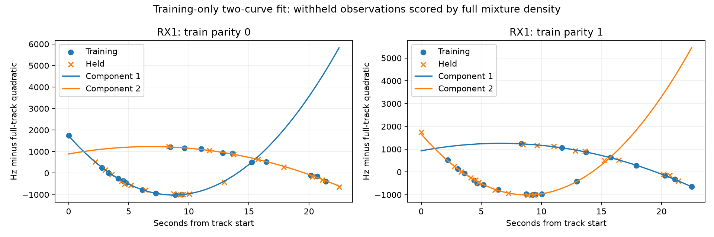

# Interleaved trajectories improve held radio prediction on a minority of tracks

The two-quadratic mixture gives positive pooled held-observation gains in every dataset, including against a robust Student-t4 single-curve control. Unlike contiguous segmentation, it predicts both alternating folds of the selected DS10 RX1 outlier well while leaving RX0 on the single-curve fallback. This is promising radio-model evidence, but the predeclared panel gate **fails** because median per-track gains are zero in all datasets. No localization implementation or accuracy improvement is claimed.

| Dataset | Tracks | Mixture selected / folds | Pooled gain vs Gaussian single | Median track gain | Improved / worsened tracks | Policy gain vs robust single |
|---|---:|---:|---:|---:|---:|---:|
| DS9 | 50 | 21/100 | +4.113 | 0 | 11 / 0 | +0.593 |
| DS10 | 44 | 19/88 | +4.986 | 0 | 10 / 0 | +0.600 |
| DS11 | 48 | 31/96 | +4.348 | 0 | 16 / 2 | +0.733 |

All gains are nats per held observation. Paired per-track gains aggregate both folds before counting improvements. Zero-gain fallbacks remain in all denominators. The selected Gaussian policy retains a single Gaussian on unselected tracks; its comparison with robust t therefore includes differences in distribution shape on unchanged tracks. On mixture-selected folds alone, gains over robust single curves are +1.649 / +1.861 / +1.711 nats per held observation.

## Model and validation

Each component is a quadratic frequency curve. A fixed-sigma Gaussian mixture permits an observation to belong to either curve regardless of chronological contiguity. EM uses six deterministic starts and at most 100 updates. Only converged starts with at least six hard-assigned training observations spanning three seconds in each component are eligible. Training likelihood chooses the start. Held scores use the normalized weighted sum of component densities, not the closest curve.

Even-indexed observations train one fold and odd-indexed observations train the other. Time/frequency normalization, coefficients, component weights and complexity selection use training observations only. These are correlated within-track folds; they do not establish unseen-block, temporal, hardware or geographic generalization. Frozen upstream track membership already used the recordings. The two curves are not verified satellites.

The primary training selection requires twice the likelihood gain to exceed 4 log(ntrain). Doubling that penalty changes pooled gains to +4.085 / +4.976 / +4.345. A separate fixed 300 Hz noise control gives +0.320 / +0.429 / +0.315, still positive, with fewer admitted mixtures. Neither control was selected by its held score.

The Gaussian primary has 77 / 66 / 63 fallback folds. These include insufficient component support and absence of a supported converged start; they are not all numerical failures. Individual EM starts reaching the update cap number 21 / 19 / 9. Their fits are excluded from model selection. Every fallback uses the trained single curve. The complete start-level receipts remain in `trajectory-mixture-v1.json`.

## Outlier and robust control

DS10 RX1 improves by +27.86 and +36.81 nats per held observation against the single Gaussian in its two folds; against the robust t4 single curve the gains are +4.38 and +4.21. RX0 does not produce a supported converged mixture in either fold. Its Gaussian fallback loses to the robust control, so this experiment does not recommend replacing robust single-curve treatment generally.

The robust-control plan was frozen after the Gaussian result and before fitting controls. It fixes the mixture choices and fits a single Student-t4 quadratic by monotone IRLS on each training fold. All 568 robust controls converge across both scales. This comparator is a scalar-noise radio regression, **not** the existing multivariate Student-t localization contrast likelihood. Positive radio predictive scores do not demonstrate smaller position error.

## Verification and decision

Three mixture tests verify normalized mixture scoring, interleaved synthetic-curve recovery, time/frequency-offset invariance and unsupported fallback. Two robust-control tests verify clean-curve convergence, offset invariance and density scaling. Source/input seals pass, and the bounded 142-track job and robust-control job are terminal. No GPS, satellite prediction or fitted localization state enters curve fitting. Original measurements and benchmark arms remain unchanged.

Do not bypass the failed median-gain gate or promote this model from one selected outlier. The next step is a separately frozen transfer study on the next metadata-selected block in each dataset, retaining these constants and all zero-gain/failed cases. Include robust single-curve controls and report whether the minority-of-tracks gains persist. Only then consider how exclusive component memberships could enter localization, with observation counts, added offsets and compute charged explicitly for singles, pairs and quads.

Plans: `TRAJECTORY_MIXTURE_PLAN.md` and `TRAJECTORY_ROBUST_CONTROL_PLAN.md`. Complete folds, models and source receipts: `trajectory-mixture-v1.json`, `trajectory-robust-control-v1.json`, and `trajectory-mixture-summary-v1.json`, each with SHA sidecar.
