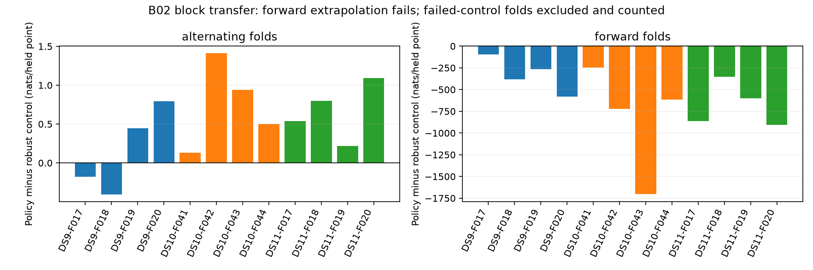

# Trajectory-mixture transfer: interpolation gains survive, forward prediction fails

The frozen two-curve Gaussian policy was evaluated on all twelve scans of DS9-B02, DS10-B02 and DS11-B02: **554 independent tracks**. Its pooled alternating-observation gains extend beyond the original first scans. However, every scan loses to the robust single-curve control when predicting the second half from the first half. The predeclared transfer gate fails. Do not integrate this policy into localization.

| Dataset | Tracks | Alternating gain vs robust | Improving scans | Forward gain vs robust | Improving scans |
|---|---:|---:|---:|---:|---:|
| DS9 | 186 | +0.208 | 2/4 | −357.24 | 0/4 |
| DS10 | 181 | +0.777 | 4/4 | −852.82 | 0/4 |
| DS11 | 187 | +0.670 | 4/4 | −687.69 | 0/4 |

Gains are nats per held radio observation, **not meters**. Primary sigma is 100 Hz. Alternating robust comparisons condition on converged controls: coverage is 371/372, 357/362 and 372/374 folds, or 6,780/6,795, 9,238/9,466 and 9,976/10,040 held observations. All forward robust controls converge (186/186, 181/181, 187/187). Eight failed alternating controls remain explicitly missing; they are not scored as ties or discarded from the planned counts.

## Controls and what the failures mean

The fixed 300 Hz control improves all twelve scans under alternating validation; pooled gains versus robust single are +0.179 / +0.314 / +0.257. It still loses every forward comparison, with gains −41.95 / −105.87 / −75.10. All robust controls converge at this wider scale. Widening measurement noise reduces extreme penalties but does not resolve the failure.

The primary policy versus a single Gaussian still has forward gains +58.20 / −38.22 / +133.36. Thus a weak Gaussian comparator would conceal much of the problem. Even on the mixture-selected subset alone, forward gains versus robust single are strongly negative: −908.78 / −2,425.90 / −1,516.25. The failure is not solely due to Gaussian fallback on unchanged tracks. Doubling the training complexity penalty does not establish a robust forward result; complete ablations are preserved in the summary.

The large negative log scores occur because this surrogate predicts with fixed-width Gaussian densities around extrapolated quadratic curves. It does not propagate uncertainty in their coefficients or constrain them to orbital dynamics. Squared tail penalties can be enormous far from the predicted curves. These scores demonstrate an overconfident predictive model; they do not directly measure position error or prove a particular emitter interpretation. A Student-t control also has heavy tails, so this comparison changes both fit robustness and density shape. These effects need separation before proposing a replacement.

## Protocol and numerical evidence

The policy, noise controls, EM starts/limits, component-support requirements and training-only model-selection penalties were reused without retuning. Each scan uses its frozen independent-track membership and original observations. Even/odd training is reciprocal; forward training uses only the first chronological half. Upstream trajectory construction already used the full capture, so forward validation is conditional on that offline construction and is not a fully causal tracking demonstration.

All twelve workers exited successfully, sequentially under the shared lock and 90-second per-scan limits with single-thread numerical libraries. Frozen input/source seals pass. Two reporting tests verify that failed robust controls retain their planned denominators and that an empty selected subset produces no invented score. The frozen mixture/robust-control tests and implementations remain unchanged. No orbit propagation, localization optimization, geographic scoring, IQ access or RF collection ran.

Each block is one correlated development group; these are not 554 independent transfer trials or untouched test data. The new transfer gate required positive robust-relative gain in every dataset for both split types, at least three improving scans per dataset/split, and no failed robust controls. It fails both on forward performance and on primary alternating coverage; DS9 also fails the alternating scan-count condition. The earlier failed pilot median gate remains unchanged.

## Next model question

Before any localization integration, separate trajectory-mean error from predictive overconfidence. Test a frozen predictive-uncertainty control using the same training-fitted component curves, with uncertainty increasing outside their training support, and compare it with a robust emission model. Do not refit curves or select a noise scale using these held outcomes. A physically constrained satellite-mixture model may ultimately be preferable to extrapolating arbitrary quadratics, but that requires its own model and bounded single/pair/quad evaluation. The current Gaussian trajectory policy is not promoted.

Evidence: `TRAJECTORY_TRANSFER_PLAN.md`, twelve complete per-scan receipts under `trajectory-transfer-v1`, and `trajectory-transfer-summary-v1.json` with SHA sidecar and per-scan coverage. Original baseline localization results remain unchanged.
