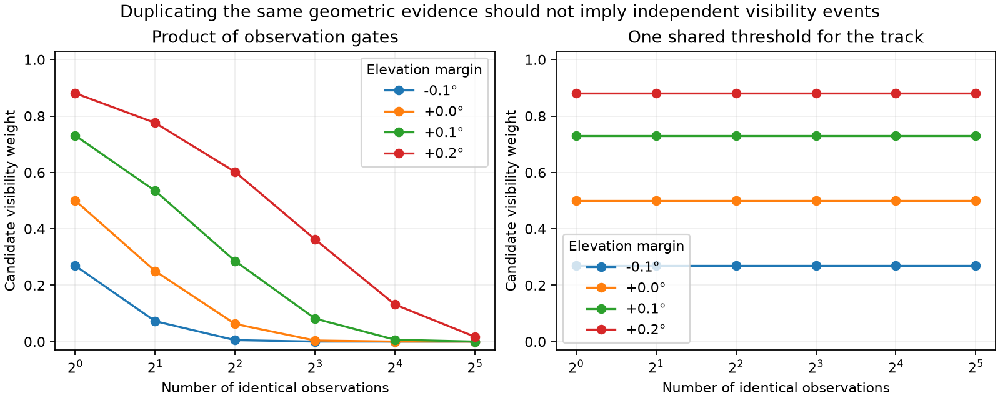

# Reject the product gate as the default track-visibility model

The product-of-logistic-gates prototype passes its probability and derivative tests but fails an important modeling check: duplicating identical geometric evidence changes the track visibility weight sharply. At zero elevation margin and width 0.1 degrees, one observation gives visibility 0.5; eight identical observations give 0.00390625; thirty-two give about 2.33e-10. For signal mass 0.8 in this one-candidate example, the corresponding background weight increases from 0.6 toward one.

This is expected mathematically from multiplying independent gate probabilities, but repeated samples do not provide independent horizon uncertainty. Therefore do not integrate the product formula as the default repair for the observed discontinuity. The mathematical tests were necessary consistency checks, not evidence that the model is scientifically suitable.

A shared random horizon offset \(H\) gives a more direct alternative. If visibility requires \(m_{it}>H\) at every observation and \(H\) has a logistic distribution of scale \(w\), then

\[
v_i=\Pr(H<\min_t m_{it})=\sigma(\min_t m_{it}/w).
\]

Duplicating observations leaves this probability unchanged. It is continuous, but only piecewise differentiable when the minimizing observation changes. That differs from the diagnosed discontinuous score jump; it still needs an optimizer and audit that handle ties correctly. A normalized smooth approximation to the minimum is another candidate, but its effect on support and observation weighting must be assessed rather than assumed equivalent.

The width in this probe is illustrative, not fitted to radio data or selected for geographic accuracy. The [sealed synthetic probe](visibility-count-probe-v1.json) binds the tested helper and plotting script. No observation likelihood, localization fit or benchmark result was changed. Next compare shared-threshold geometry derivatives at unique minima and ties before any inference integration.
