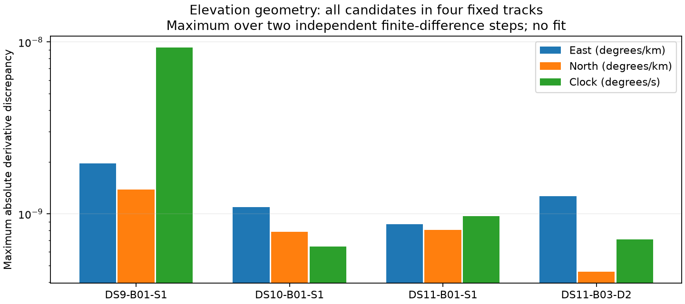

# Actual visibility geometry derivatives verified on four tracks

The new geometry adapter reproduces elevation-margin derivatives for east, north and common clock on four recorded tracks: the first track of the first single scan in DS9, DS10 and DS11, and track 60 of the rejected DS11-B03-D2 pair. Each check covers every candidate satellite and eight retained observations. Catalogue sizes are 1,102, 1,118, 1,128 and 1,248 respectively.

The largest discrepancy across two comparison steps is 9.29e-9 degrees per coordinate unit (km for east/north, seconds for clock), below the predeclared 1e-4 threshold. The check compares the full elevation calculation at perturbed states with a chain-rule derivative that includes the changing receiver normal. The receiver E/N-to-ECEF differential remains a central difference at 0.001 km; the full comparison uses independent steps of 0.0005 and 0.0001 in each coordinate. This is a hybrid analytic/numerical calculation, not a claim of entirely analytic geometry.

The time derivative differentiates the actual Hermite interpolation of satellite position. The existing scorer separately interpolates velocity with a four-knot polynomial for Doppler, so simply substituting that velocity as the derivative of the position interpolation would not be justified. A synthetic cubic/knot test confirms the Hermite derivative and checks unsupported query rejection. The original scoring/interpolation code is unchanged.

The [sealed result](visibility-geometry-check-v1.json) binds all four original fitted receipts and helper sources. All work is read-only with respect to recordings and existing scientific results; no location was fitted and no geographic reference was used.

Remaining gates are explicit: verify individual satellite epoch columns, assemble the full signal/background weight gradient without a dense candidate-by-epoch tensor, validate selected signal residual derivatives and complete objective agreement, handle minimum ties, and connect a separate experimental solver. Only then run a bounded, frozen pilot against the continued baseline. These four tracks do not establish global derivative accuracy, convergence or positioning performance for the new model.
