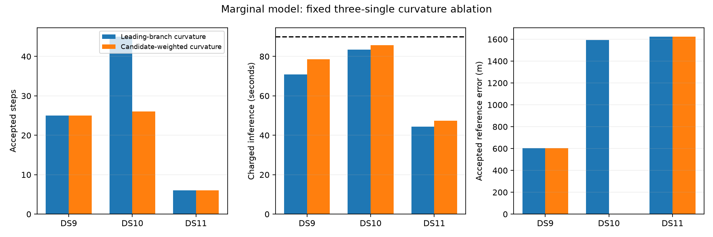

# Candidate-weighted curvature does not improve the bounded single pilot

Stop expansion of this optimizer arm. Candidate-weighted curvature passes 2/3 singles versus 3/3 for the leading-branch preconditioner. The two accepted solutions are essentially unchanged and cost more. DS10 reaches its budget without satisfying stationarity. No pair/quad extension is justified by these outcomes.

| First single | Leading / weighted acceptance | Leading / weighted steps | Charged leading / weighted time | Weighted accepted error |
|---|---|---:|---:|---:|
| DS9-B01-S1 | Yes / Yes | 25 / 25 | 70.81 / 78.65 s | 604.30 m |
| DS10-B01-S1 | Yes / No | 45 / 26 | 83.41 / 85.68 s | — |
| DS11-B01-S1 | Yes / Yes | 6 / 6 | 44.47 / 47.32 s | 1,623.27 m |

The marginal objective, model source, physical inputs, original baseline states, priors, visibility width and 90-second charged budgets match. The summary explicitly checks those bindings before comparing objective values. Both accepted weighted solutions differ from the preceding marginal objectives by less than 1e-10, and their reference errors are effectively identical. This is computational overhead without a measured benefit on those two cases.

DS10 stops at the internal wall budget after 26 steps, with scaled gradient 0.001503 against the unchanged 1e-4 threshold. Its numerical audit fails convergence and stationarity, while the other checks pass. The objective is only 3.92e-7 above the previous accepted solution, but a small objective difference is not permission to relax stationarity or assign a geographic score. Its rejected output is preserved.

## What changed and what was held fixed

The sole direction change replaces leading-branch residual curvature with the sum of all signal-branch Jacobian products weighted by conditional branch probability and Student-t4 IRLS weight. Compact6-by-6candidate blocks and diagonal epoch elimination keep the core solve small. Complete marginal scores and gradients, Armijo line search,5km step cap,64iteration limit and stopping rule are unchanged. Visibility and mixture-covariance curvature remain omitted, so this is a positive preconditioner, not an exact Hessian or calibrated covariance.

The same original baseline work is charged to each arm. Extra weighted preparation/fitting takes37.36,46.03and11.48seconds, versus29.52,43.76and8.63seconds previously. Separate fresh-process audits take24.44,23.26and21.62seconds. Timings are sequential historical measurements, not a randomized performance trial. All numeric decisions precede reference scoring; the operator reference is unsurveyed and these development cases are exposed.

Synthetic and recorded-state checks established correct assembly and solution of the approximate curvature system. The fitted experiment shows that correctness of this approximation does not establish that it improves convergence under the budget. No numerical tolerance, budget, initial state or acceptance rule was changed after results were viewed.

## Evidence-based next direction

Keep the leading-branch optimizer for any further marginal-model diagnostic, but do not expand marginalization as an accuracy improvement: the completed nine-case model comparison passed8/9versus9/9for hard association and worsened five of eight matched errors. Further preconditioner variants are lower priority than testing a supported simplification or new model evidence.

A review of earlier experiments prevents several unnecessary repeats. The [timing-prior pilot](../2026_10_01_localization_goal/central-epoch-review.md) already rejected weaker tail shrinkage at matched central curvature. The [balanced regression](../2026_10_01_localization_goal/balanced-regression-review.md) did not establish a replacement on the original64scans. The quad development [overlap checks](PILOT_UPDATE_12.md) found no repeated active satellite/TLE-snapshot groups in tested blocks, limiting the immediate value of shared satellite epochs at those fitted modes.

The earlier [complexity ablation](../2026_10_01_localization_goal/ablation-review.md) did support one acquisition-ranked start in saved-result replay, including the then-reservedDS12panel, but explicitly left cold timing unverified. The next lean step is to inspect start usage on the expanded64scan panel without geographic selection, then freeze a small fresh one-start cold comparison on singles/pairs/quads. This tests whether extra search work is warranted on the current corpus. It must remain separate from claims about soft-association accuracy or generalization, and should not automatically trigger a full112window campaign.

## Artifacts

- [Sealed matched summary](weighted-marginal-pilot-summary-v1.json) and per-case source, launch and audit receipts under `weighted-marginal-pilot-v1/`.
- [Pre-fit plan](WEIGHTED_MARGINAL_PILOT_PLAN.md), [runner](run_weighted_marginal_pilot.py), and [summary/figure generator](summarize_weighted_marginal_pilot.py).
- [Marginal model results](MARGINAL_WINDOW_PILOT_RESULTS.md), preserved with every failure.

All three jobs are terminal. The weighted pair/quad extension is declined based on this pilot. The continued original model remains the full-panel reference, and no baseline result has been replaced.
