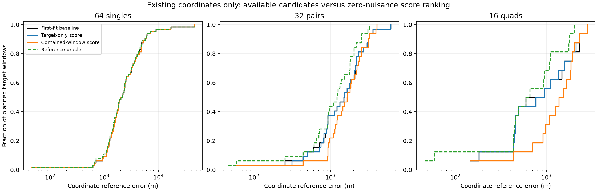

# Existing candidates offer some room for improvement, but acquisition ranking loses accuracy

The fixed candidate diagnostic is complete for all 64 singles, 32 pairs and 16 quads. Selecting stored coordinates with zero-nuisance acquisition scores worsens median pair error from 1,501 to 1,655 m and quad error from 775 to 1,456 m. Better coordinates exist in the eligible pools, but this cheap scoring rule often chooses poorly. Do not promote it as a replacement for joint fitting.

| Target windows | First-fit baseline median / p90 | Target-only score median / p90 | Contained-window score median / p90 | Target-only oracle median / p90 | Contained-window oracle median / p90 |
|---|---:|---:|---:|---:|---:|
| 64 singles | 2,094 / 5,547 m | 2,094 / 5,496 m | 2,094 / 5,496 m | 2,094 / 5,425 m | 2,094 / 5,425 m |
| 32 pairs | 1,501 / 3,104 m | 1,501 / 3,104 m | 1,655 / 3,128 m | 1,501 / 3,104 m | 1,225 / 2,477 m |
| 16 quads | 775 / 2,310 m | 858 / 2,212 m | 1,456 / 2,169 m | 775 / 2,212 m | 628 / 1,784 m |

The two oracle columns explicitly use reference error to pick the best available candidate. They are unattainable diagnostic selectors, not measured algorithms or confidence bounds. They never influence the score-based choices.

| Target windows | Baseline within 1 km | Target-only score | Contained-window score | Target-only oracle | Contained-window oracle |
|---|---:|---:|---:|---:|---:|
| Singles | 6/64 | 6/64 | 6/64 | 7/64 | 7/64 |
| Pairs | 12/32 | 12/32 | 7/32 | 12/32 | 14/32 |
| Quads | 9/16 | 9/16 | 5/16 | 9/16 | 11/16 |

These are retrospective coordinate comparisons, not new localization fits. A coordinate from an accepted source fit does not constitute an audited full state for a different target window. All planned targets remain in these distributions; none is dropped according to the selected coordinate's error.

## What was frozen and evaluated

The [plan](WINDOW_CANDIDATE_PLAN.md) fixed all sixteen blocks and five comparisons before their results were computed. The pool contains 219 labeled entries: 112 accepted first fits and 107 accepted original three-start winners. For the three originally unresolved first fits, the accepted [96-iteration estimates](ITERATION96_RESULTS.md) are substituted explicitly. Other first fits and original winners are unchanged. Duplicate coordinates remain separate labeled entries; 219 is not a count of distinct posterior modes.

Consequently, this single-scan baseline uses all 64 stored coordinates, including the 46 km recovered case. Its 2,094 m median differs from the earlier 2,023 m median conditioned on 61 accepted first fits. This is a changed reporting population, not a claim of changed estimates on those 61 cases, and not a fresh 64-scan benchmark of the optimized implementation.

For a target window w, eligible candidate sources have scan sets contained in w. A single has only its own one or two accepted leaders. A pair can use its own leaders and its two constituent singles, giving five or six entries here. A quad can use its own leaders, its two disjoint pairs and its four singles, giving twelve to fourteen entries. Singles never use future pair/quad positions, and pairs never use the sibling pair or the quad. The target-only arm further restricts candidates to that exact target unit.

For each eligible coordinate x, the scoring rule is

`A_w(x) = sum_(s in w) sum_tracks logsumexp_branches ell(track, branch, x, nuisance=0)`.

It selects the highest score, preferring the target's first fit within a 1e-6 tie and otherwise retaining frozen candidate order. The same-window arm isolates extra accepted leaders; the contained-window arm adds constituent locations. No nuisance profiling, marginalization over nuisance parameters, new starting-location search or refit occurs. The physical likelihood, prior support and fixed height are unchanged.

Every ranking was sealed before a separate evaluator loaded reference coordinates and calculated errors or oracle choices. Three tests verify scan availability, deterministic ties and independence from supplied error metadata. Source/input and receipt/audit bindings establish candidate provenance. The evaluator recomputes all eligibility and score decisions before opening the reference artifact.

All sixteen scoring processes finish within their 90-second caps, taking 10.9–13.1 seconds each and 190.0 seconds in total. They cover 2,906 track appearances across the 64 scans. At all stored block coordinates, original and optimized implementations have identical finite/visibility masks and maximum score difference 1.75e-10, below 1e-6. Original scores drive the decisions. No processes remain live; there were no fits or retries. Candidate-generation work is historical and additional, so these timings do not establish an end-to-end inference budget.

## Where the scoring rule fails

The contained-window rule improves 9 pairs by more than 1 m and worsens 11; twelve change by at most 1 m. For quads it improves 4 and worsens 9, with only three essentially unchanged. The median paired quad change is a 261 m regression. Its lower quad p90 does not compensate for the loss of typical accuracy or the drop from nine to five quads within 1 km.

DS10-B02-Q is a clear counterexample. Its baseline coordinate has 182 m error, and an eligible pair coordinate has 59 m error. The zero-nuisance score instead selects S4's 2,314 m coordinate. For DS10-B02-D2, the same choice worsens 253 m to 2,314 m. These examples are descriptive after the full frozen comparison; they are not used to tune or override selection.

The mathematical mismatch matters: acquisition scores branches with nuisance coordinates fixed at zero, while the stored coordinates resulted from a joint robust fit with optimized nuisance parameters and hard assignments. A score designed to propose starts is not automatically a sound score for comparing optimized locations. This experiment rejects that direct use; it does not isolate whether nuisance treatment or association treatment explains each mistake.

## Dataset variation and limits of this pool

Median coordinate errors below are baseline / contained-window score / contained-window reference oracle:

| Dataset | Singles | Pairs | Quads |
|---|---:|---:|---:|
| DS9 | 2,007 / 2,007 / 1,917 m | 1,127 / 1,280 / 951 m | 723 / 1,029 / 576 m |
| DS10 | 1,724 / 1,724 / 1,671 m | 1,171 / 1,344 / 1,075 m | 443 / 1,540 / 443 m |
| DS11 | 2,729 / 2,729 / 2,729 m | 2,162 / 2,188 / 1,810 m | 2,308 / 1,845 / 1,766 m |

DS11 quads improve under this rule while DS9/DS10 quads regress. This does not justify dataset-specific switching on exposed results. The datasets share one unsurveyed operator reference site; windows are correlated and do not establish geographic generalization.

Even the contained oracle adds only two pairs and two quads within 1 km. Its median gains are about 276 m for pairs and 147 m for quads; its maximum quad error remains 2,023 m. The single-scan oracle leaves the median unchanged and cannot remove the 46 km case. Those conclusions apply only to this pool of accepted leaders. Unselected original starts were not independently audited here, and entirely new modes or better measurement models are outside this diagnostic.

## Decision and next experiment

Keep the joint first-fit reference; reject direct zero-nuisance acquisition ranking as a coordinate selector. The pool contains useful alternatives, but selecting among it alone offers limited improvement and will not solve the difficult single-scan tail.

A low-cost next control is to compare target-only leaders using their already audited full joint objectives, which include each candidate's fitted nuisance state. Freeze that as a separate post-result arm and keep it distinct from candidate transfer across windows, where a source objective is not comparable to a target objective. If meaningful multi-window ranking gains remain plausible, then test a small, separately bounded nuisance-profiled candidate comparison. Do not spend a full campaign on more retries or rank transferred states with incomparable objectives.

Artifacts: [candidate manifest](window-candidate-manifest-v1.json), [sealed evaluation](window-candidate-evaluation-v1.json), [candidate builder](build_window_candidates.py), [availability/ranking policy](window_candidate_policy.py), [tests](test_window_candidate_policy.py), [block scorer](score_window_candidates.py), [evaluator/figure generator](evaluate_window_candidates.py), and sealed decisions/process receipts under `window-candidate-score-v1/`.
