DS13 · signal processing & satellite association · research report

# From GLRT hypotheses to satellite tracks

What refinement fixes, what “unassigned” really means, and what we can—and cannot—conclude from 95% top-response coverage.

Evidence snapshot: 4 October 2026 UTC · Two archived 300-second scans · Known-position development analysis · Offline, self-contained edition

**Read the evidence in order—or jump to a question**

1. [Executive summary](#summary)
2. [What exactly are we counting?](#units)
3. [From IQ to a GLRT candidate](#glrt)
4. [Candidate-only refinement](#refinement)
5. [The “missing” 66204 track](#ambiguity)
6. [Choosing the top GLRT response](#selection)
7. [Orbit model and timing consistency](#orbit)
8. [Greedy and replacement search](#solver)
9. [Results and matched controls](#results)
10. [Limits, lessons, and next experiments](#limits)
11. [Track inventory and reproducibility](#appendix)

<a id="summary"></a>

01 / Motivation and findings

## Explain signals, not just dots

We want a small, physically consistent set of satellite trajectories to explain the detected radio activity. The difficult part is deciding which dots represent different signals—and which are different hypotheses about the same signal.

A single 20 ms IQ window can yield several acquisition/GLRT candidates. Several satellites can also be active in that same window. Those two facts look similar in a scatter plot but call for different treatment. Counting every candidate as an independent detection makes duplicate-like alternatives look like missing tracks; retaining only one candidate can hide genuinely simultaneous signals.

**7,382 → 3,837** — Scan A: canonical candidates → windows, after retaining the highest refined-margin candidate per window.

**94.97%** — 3,644 / 3,837 top candidates assigned with fitted RF calibration coefficient *c*; 33 satellites.

**95.07%** — 3,648 / 3,837 assigned with *c* = 0 under matched search; also 33 satellites.

**The headline is window coverage, not complete signal recovery.**

The 95% result covers the strongest retained hypothesis in each observed receiver/channel/window. It is not 95% of the original 7,382 hypotheses, not 95% of every recorded window, and not proof of correct satellite identity or accurate localization.

1 · Detect **IQ → candidates** Several frequency/epoch hypotheses may survive for one 20 ms window.

2 · Refine **Recenter and rescore** Use the candidate and raw IQ, without an orbit input. Keep hypothesis identities separate.

3 · Select **One top response** Choose the maximum refined GLRT margin independently per receiver/channel/window.

4 · Associate **Orbits → compact set** Greedy additions, then one-out/greedy-many-in repairs, with explicit support constraints.

The experiments below reuse the existing radio corpus. No new capture or production detector deployment was performed to prepare this report. Unless explicitly stated otherwise, results are in-sample development diagnostics at the known receiver position.

<a id="t1-at-v1"></a>

**Named baseline: Top-1 Absolute-Timing Baseline (T1-AT v1)**

The implementation identifier is `t1_at_v1`. This names the approach previously called “earlier top-candidate greedy + replacement,” not the original/all-candidate experiments or the later rebuilt multi-scan benchmark.

- Refine candidates using their own IQ evidence, without orbit input; keep the highest refined GLRT *margin* per 20 ms receiver/channel/probe window, with original row index as the deterministic tie break.
- Freeze the original five-fold receiver/RF calibration, including the interpolated receiver correction. Use one **absolute ephemeris timing shift per satellite**, shared across receivers and folds, searched within ±20 s. Do not add a fold-specific common timing reference to that shift.
- Use the original frozen orbit inputs and timing-hypothesis pool. Maximize explained windows − 10 × selected satellites, with a ±600 Hz circular residual gate.
- Require at least 10 windows over at least 5 s in each retained receiver/channel segment, splitting at gaps over 5 s. Run greedy selection, followed by up to three one-out/greedy-many-in replacement sweeps.
- Preserve matched fitted-*c* and *c* = 0 variants. The residual/1 s Gaussian timing proxy breaks count ties; it is not added to the primary count objective.

“T1-AT baseline” is shorthand for this frozen version. Different calibration, TLE inputs, fold-dependent timing, or alternative-candidate policies must be labeled separate variants. A version name does not certify satellite identities or localization accuracy. The later Scan B replication is documented separately below.

<a id="fig-top-coverage"></a>

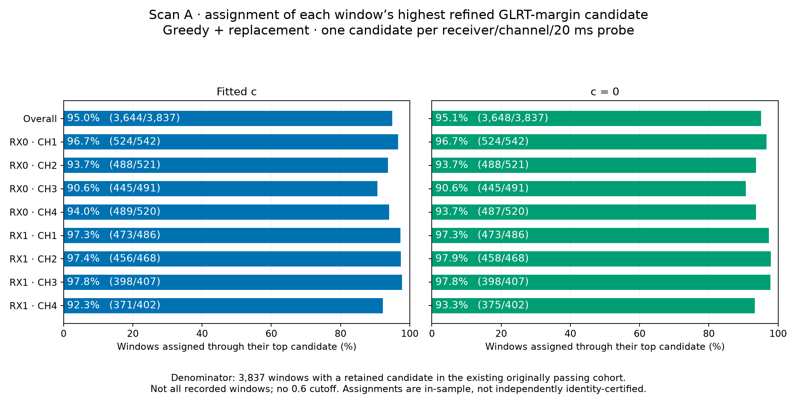

**Figure 1.** Scan A, latest top-response experiment. Each percentage uses windows with at least one retained candidate in that lane. Fitted-c and c=0 use the same selected observations and timing-hypothesis union. No 0.6 cutoff was applied.

<a id="units"></a>

02 / Data and accounting

## A window is not a candidate, and a pair is neither

| Term | Definition in this report | Accounting consequence |
| --- | --- | --- |
| Window / probe | One 20 ms IQ segment from one receiver on one channel during a visit. | Simultaneous RX0 and RX1 windows remain distinct. The saved key is visit, receiver, probe; the visit identifies the channel. |
| GLRT candidate | A retained acquisition-frequency and epoch hypothesis with its own GLRT scores. | Several candidates can come from the same samples. They do not all share a score. |
| Canonical candidate | A candidate after the existing exact alias-copy grouping. | Exact alias copies are excluded; nearby but distinct hypotheses remain. |
| Within-window pair | Any unordered pair of retained candidates from the same probe. | A window with n candidates contributes n(n−1)/2 pairs, not n. |
| Assigned candidate | A candidate accepted for one satellite by the current solver. | At most one owner per candidate and one candidate per satellite/probe. |
| Top-response window coverage | Fraction of eligible windows whose maximum refined-margin candidate is assigned. | Exactly one selected candidate per window; denominator 3,837 for Scan A. |

**Scan A:** `scan-fw-911c4e5db9243281` (short name `db9243281`), 7,382 canonical candidates, 3,837 candidate-bearing windows, and 2,126 visits represented in refinement. **Scan B:** `scan-fw-ffa1cc19d8d7c09f`, 6,602 canonical candidates. Both cover approximately 0–300 seconds and use RX0/RX1 across CH1–CH4.

| Scan | Session ID | Capture start (UTC) |
| --- | --- | --- |
| A | scan-fw-911c4e5db9243281 | 2026-10-02T09:46:26.922392+00:00 |
| B | scan-fw-ffa1cc19d8d7c09f | 2026-10-02T15:52:13.232492+00:00 |

Scan A has 1,946 multi-candidate windows and 1,891 single-candidate windows. The former contain 5,491 candidates and contribute 5,901 within-window pairs. This is why a histogram of pairs must not be read as a histogram of independent signals.

<a id="fig-multiplicity"></a>

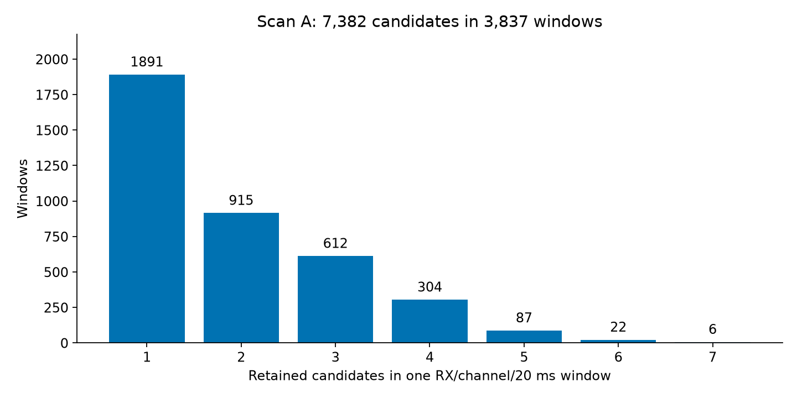

**Figure 2.** Scan A canonical candidate multiplicity before top-response selection. Every bar counts windows, not candidate pairs. The input cohort is unchanged by refinement, including five fallbacks.

<a id="fig-all-candidates"></a>

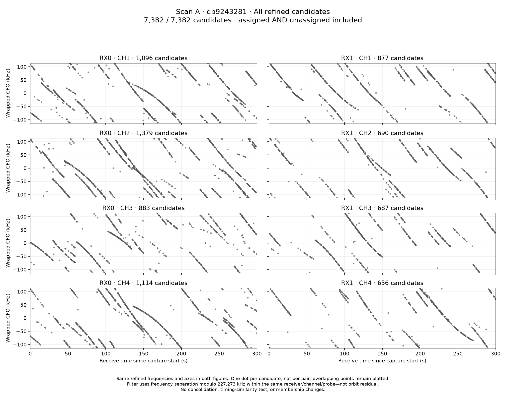

**Figure 3.** Scan A: all 7,382 canonical candidates after candidate-guided refinement, in wrapped measured-frequency coordinates. All points are shown without association colors; this plot is not restricted to unassigned points. Multiple dots may use the same 20 ms IQ.

<a id="glrt"></a>

03 / Detector mechanics

## From IQ to a frequency-and-epoch hypothesis

The GLRT is a signal-evidence calculation, not an orbit detector. Acquisition proposes a frequency and signal epoch; the conditioned GLRT evaluates the signal model against a control response. In the saved interface the score used for filtering and top-response selection is the **margin = exact score − control score**. It is not a probability or a calibrated satellite-confidence score.

| Saved Scan A detector setting | Value |
| --- | --- |
| analyzer_id | adaptive-hop-variable-dwell-fractional-glrt64-cfo-v1 |
| sample_rate_hz | 10000000 |
| probe_ms | 20 |
| probe_stride_ms | 120 |
| glrt64_margin_gate | 0.025 |
| maximum_acquisition_candidates | 8 |
| timing_refinement | circular-five-cell-log-parabola-plus-lanczos16-v1 |
| decision_score | fractional-epoch-conditioned-glrt64-v1 |

1. **Extract a 20 ms segment.** At the 10 MHz sample rate used for this replay, that is 200,000 complex samples. The replay asserts the saved probe index is zero and uses the first 20 ms of the corresponding visit/RX.
2. **Acquire candidate frequency and epoch.** The acquisition search is data-driven, not a random set of guesses. The scan configuration permits up to eight acquisition candidates; the representative records preserve their separate frequency/epoch hypotheses.
3. **Evaluate a residual-frequency response.** The original 512-bin GLRT grid has approximately 443.89 Hz spacing across the 227.273 kHz ambiguity period. Each candidate can return a different maximum and margin.
4. **Form the reported frequency.** Add the acquisition center to the GLRT residual, preserving the associated epoch. Equivalent frequency branches require explicit alias handling.
5. **Apply the configured activity gate and canonical grouping.** The saved scan cohort originally passed a 0.025 margin cutoff. It is not the complete population of every attempted or rejected acquisition.

### What the GLRT response actually sums

The installed replay scorer correlates the CFO-corrected samples with the exact known pilot template and a symbol-rolled control template at the candidate epoch. It selects symbols 2 through 65 inclusive—64 pilot symbols—within each supported frame. Fractional epochs use interpolated samples. For each trial residual frequency, it sums correlations coherently across those symbols, then sums squared magnitudes across frames. Absolute phase between frames is not forced to agree.

S(f) = Σ<sub>frames m</sub> |Σ<sub>symbols k</sub> z<sub>m,k</sub> exp(−j2πf Δt<sub>k</sub>)|² C = Σ<sub>frames m</sub> (Σ<sub>symbols k</sub> |z<sub>m,k</sub>|)² exact_score = max<sub>f</sub> S<sub>exact</sub>(f) / C<sub>exact</sub> control_score = max<sub>f</sub> S<sub>control</sub>(f) / C<sub>control</sub> margin = exact_score − control_score

The control has its own maximizing residual frequency. The returned frequency uses the exact-template maximum. A uniform FFT/autocorrelation implementation evaluates the same response efficiently; the source snapshot includes its direct phase-bank equivalent. The approximately 4.4 μs symbol spacing makes the residual phase response periodic in frequency. A whole 20 ms probe contains many pilot-symbol observations; “GLRT-64” does not mean 64 separate 20 ms windows.

f<sub>reported</sub> = f<sub>acquisition</sub> + r<sub>GLRT</sub> P = 1 / (4.4 μs) = 227,272.727… Hz d<sub>alias</sub>(f₁, f₂) = |wrap<sub>[−P/2, P/2)</sub>(f₁ − f₂)|

### The concrete boundary example

At approximately 102.669 seconds in Scan A RX1/CH3, these three saved hypotheses came from the same probe. The orbit was used to investigate them, not to generate the acquisition centers.

| Hypothesis | Acquisition center (Hz) | GLRT residual (Hz) | Reported frequency (Hz) |
| --- | --- | --- | --- |
| Previously assigned candidate | 104,853.5859 | 0 | 104,853.5859 |
| Positive-edge alternative | −8,030.1244 | +113,192.4716 | 105,162.3472 |
| Negative-edge alternative | 217,775.4575 | −113,192.4716 | 104,582.9859 |

The positive-edge residual lies close to the half-period boundary at +113,636.364 Hz. The three reported frequencies differ by hundreds of hertz even though their starting representations concern the same local ridge. Fractional epoch differences and center-dependent scoring matter as well: “subtract one exact alias period” is not a complete correction for these hypotheses.

Increasing frequency-grid density alone at the original centers did not resolve the targeted disagreement. The successful prototype coupled recentering with alias-branch comparison and fractional-epoch refinement. That is evidence for a center/epoch-sensitive estimation issue, not evidence that the physical orbit itself suddenly changed.

<a id="refinement"></a>

04 / Estimation experiment

## Refine each candidate without telling it the orbit

The prototype starts from each saved tracking frequency and fractional epoch. Its scorer receives IQ, frequency, and epoch—not a satellite ID or predicted Doppler. The orbit enters only afterward, when calculating diagnostic residuals.

```text
Start: own saved frequency f and epoch e
Iteration 0: evaluate centers f − P, f, f + P at epoch e
Iteration 1: recenter at the best frequency;
             test epoch offsets [−0.5, −0.25, 0, +0.25, +0.5] samples
Iteration 2: recenter again;
             test offsets [−0.25, −0.125, 0, +0.125, +0.25] samples
Each evaluation: recompute conditioned GLRT using the 4,096-bin grid
Reject a returned maximum >1,000 Hz circularly from its requested center
Choose the highest-margin eligible trial; retain the previous best
If no eligible local maximum exists, retain the original saved candidate
```

The nominal path makes 13 scorer calls per candidate, with approximately 55.49 Hz residual-grid spacing. This implementation still searches the full 4,096-bin response and then checks locality; it is *not* a specialized narrow-band optimizer. It neither merges candidates nor subtracts signals nor performs an orbit-guided correction.

### Targeted result: strong agreement, not uniformly lower orbit RMS

For the 46 previously investigated probes, 135 hypotheses were refined. The 89 alternatives’ median separation from the originally assigned hypothesis fell from **234.13 Hz to 14.16 Hz**; maximum separation fell from 532.31 Hz to 50.57 Hz. All 89 ended within 60 Hz. The alternative set’s orbit-residual RMS fell from **272.20 Hz to 57.99 Hz**, while the originally assigned set’s RMS increased from **38.66 Hz to 61.10 Hz**.

<a id="fig-refinement-case"></a>

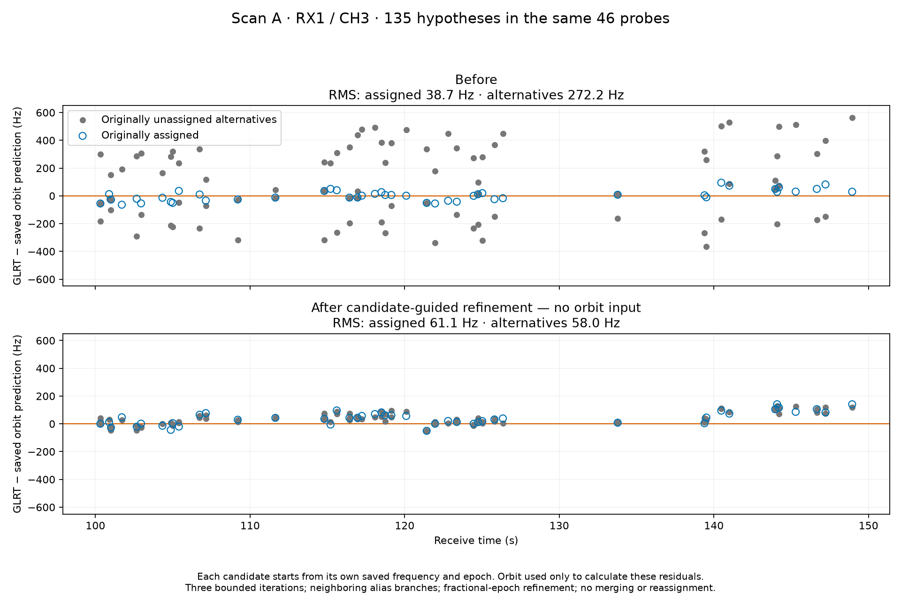

**Figure 4.** Same 135 hypotheses and same saved orbit prediction, before and after candidate-only refinement. Gray points are originally unassigned alternatives; blue rings are originally assigned. No reassignment or consolidation is performed in this figure.

**No orbit input does not mean blind sample selection.**

These 46 probes were chosen during an orbit-based investigation of 66204. The refinement algorithm is orbit-independent, but the targeted experiment is a selected case study, not a population-level validation.

### Whole-scan result: the denominator stays fixed

All 7,382 canonical Scan A candidates were processed. **7,377 refined successfully; five retained their original measurement and margin.** Margins improved for 6,031 candidates. Recorded wall time was 236.56 seconds with eight workers on the analysis host; this is a replay measurement, not an embedded real-time performance claim.

With the old assignments and old orbit predictions held fixed, RMS increased from 153.12 to 176.02 Hz in the fitted-c arm and from 205.14 to 221.48 Hz in the c=0 arm. Re-running association on all refined candidates also did not improve coverage: fitted-c changed from 5,273 to 5,267 assigned candidates; c=0 changed from 5,246 to 5,238.

<a id="fig-refinement-tradeoff"></a>


**Figure 5.** Signal-evidence improvement and orbit agreement measure different things. Left: post-refinement margin changes over the unchanged Scan A cohort, with a log count axis. Right: RMS against fixed old predictions and memberships—not the RMS of a newly selected set.

<a id="fig-refined-coverage"></a>

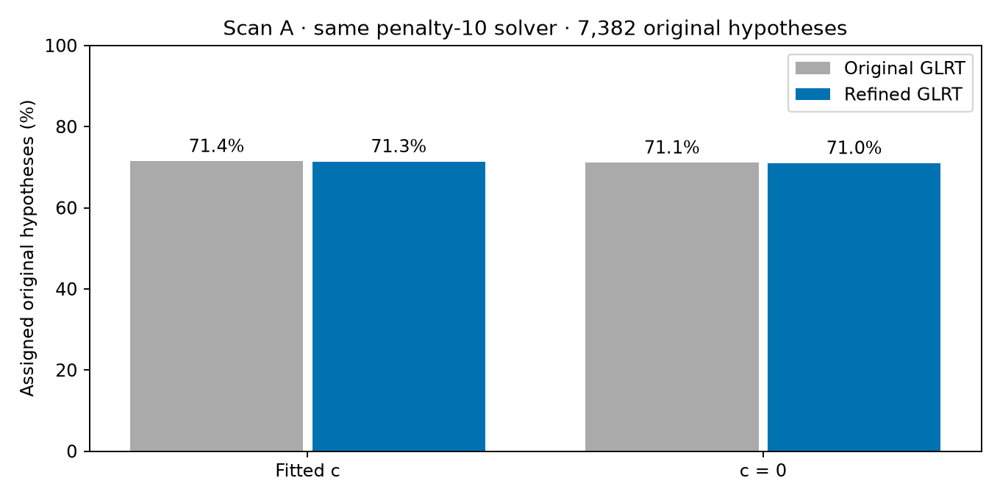

**Figure 6.** Like-for-like denominator comparison: 7,382 canonical candidates in each bar, with the same penalty-10 solver and frozen receiver/RF calibration. Refinement alone did not raise raw candidate coverage.

<a id="ambiguity"></a>

05 / Diagnostic case studies

## Why an obvious gray ridge can already be recovered

After refinement, the RX1/CH3 region between 100 and 150 seconds still appeared prominently in the unassigned-only plot. The selected 66204 track was already present. In this interval, 100 candidates were assigned to it, and another 89 unassigned alternatives matched its selected orbit within the 600 Hz gate.

Those 89 alternatives occupied 46 probe windows. **Every one of those windows already had a candidate assigned to 66204.** No other satellite was taking those specific satellite/probe slots. Nearby 66083 activity is a different track, not the explanation for this exclusion.

<a id="fig-exclusivity"></a>


**Figure 7.** Actual saved refined-solver ownership. Top: 66204 and neighboring orbit predictions with both assigned and unassigned observations. Middle: residuals connect alternatives to the assigned candidate from the same probe. Bottom: one probe separated into rows for legibility; these are not different observation times.

**The exclusivity rule is per satellite/probe, not one satellite for the whole sky.**

Different candidates from one window may belong to different satellites. But assigning several alternative estimates from the same window to the same satellite would multiply the evidence without adding independent samples. Conversely, the later top-response experiment intentionally discards all but one candidate per window and therefore cannot retain two simultaneous signals from that window.

### Not all alternatives converge—and not every large separation is an alias error

After refinement, 2,651 of the 5,901 within-window pairs were separated by less than 50 Hz. Another 3,135 pairs—53.1%—were separated by at least 1 kHz modulo the ambiguity period. That last bin spans a wide range; it does not mean all those pairs are “about 1 kHz” apart.

<a id="fig-pair-distribution"></a>

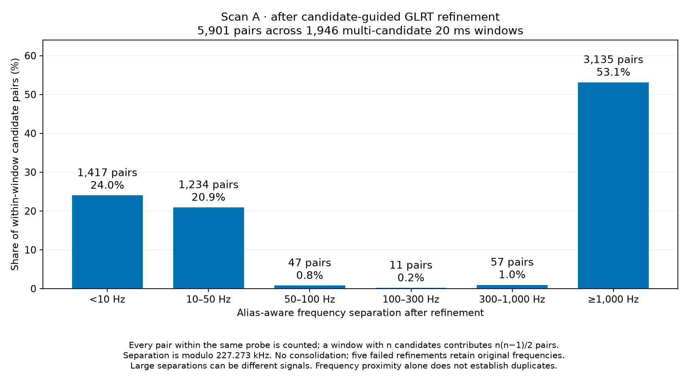

**Figure 8.** All unordered within-window pairs after refinement. No margin re-filter is applied to the original cohort, and five failed refinements retain original frequencies. Proximity is not by itself a proof that two hypotheses are duplicates.

Five illustrative pairs near the lower edge of the ≥1 kHz bin had roughly 1.03–1.31 kHz circular separations and substantial epoch separations. Cross-epoch rescoring supported the possibility of distinct detections: at a fixed epoch, different seeds could converge to that epoch’s response. However, the scorer retained a frequency search, and these were selected examples, not a formal one-source versus two-source likelihood test.

<a id="fig-khz-pairs"></a>


**Figure 9.** Five deliberately selected near-1-kHz candidate pairs. Frequency and epoch information together are more informative than frequency alone. These in-sample owner labels and cross-epoch checks do not independently certify two physical sources or their satellite identities.

<a id="selection"></a>

06 / Observation-set choice

## Keep the strongest hypothesis—but state what is lost

The latest experiment chooses the maximum **refined margin** independently within each original receiver/channel/probe. A failed refinement uses its original margin; exact ties choose the smallest original row index. This choice uses no orbit residual and no satellite identity.

winner(g) = arg max<sub>i in window g</sub> (refined_margin<sub>i</sub>, −original_row_index<sub>i</sub>)

The rule retains 3,837 candidates and discards 3,545. There is **no new 0.6 gate**, no post-refinement 0.025 re-filter, and no silent duplicate clustering. Even a retained winner is drawn from the original already-gated acquisition cohort.

This is an elegant baseline for the question “Can we explain the strongest detection in each window?” It is not sufficient for “Can we explain all independent simultaneous signals?” In the fitted-c full-refined result, 1,995 assigned candidate rows are discarded by top selection; some may be redundant alternatives, while others may be secondary signals. The current evidence does not establish the mixture.

### What changing the GLRT cutoff showed

The following histograms re-filter the saved candidates by their post-refinement margins; both members must pass to contribute a pair. Each panel is normalized to its own surviving pair count. A cutoff of zero here *cannot recover candidates that failed the original acquisition cutoff*.

| Refined-margin cutoff | Candidates | Multi-candidate windows | Within-window pairs | Pairs <50 Hz | Pairs ≥1 kHz |
| --- | --- | --- | --- | --- | --- |
| 0.0 | 7380 | 1946 | 5896 | 45.0% | 53.1% |
| 0.025 | 7358 | 1933 | 5855 | 45.3% | 52.8% |
| 0.2 | 7210 | 1887 | 5683 | 46.5% | 51.5% |
| 0.6 | 2237 | 482 | 1600 | 81.6% | 16.1% |

<a id="fig-margin-cutoffs"></a>

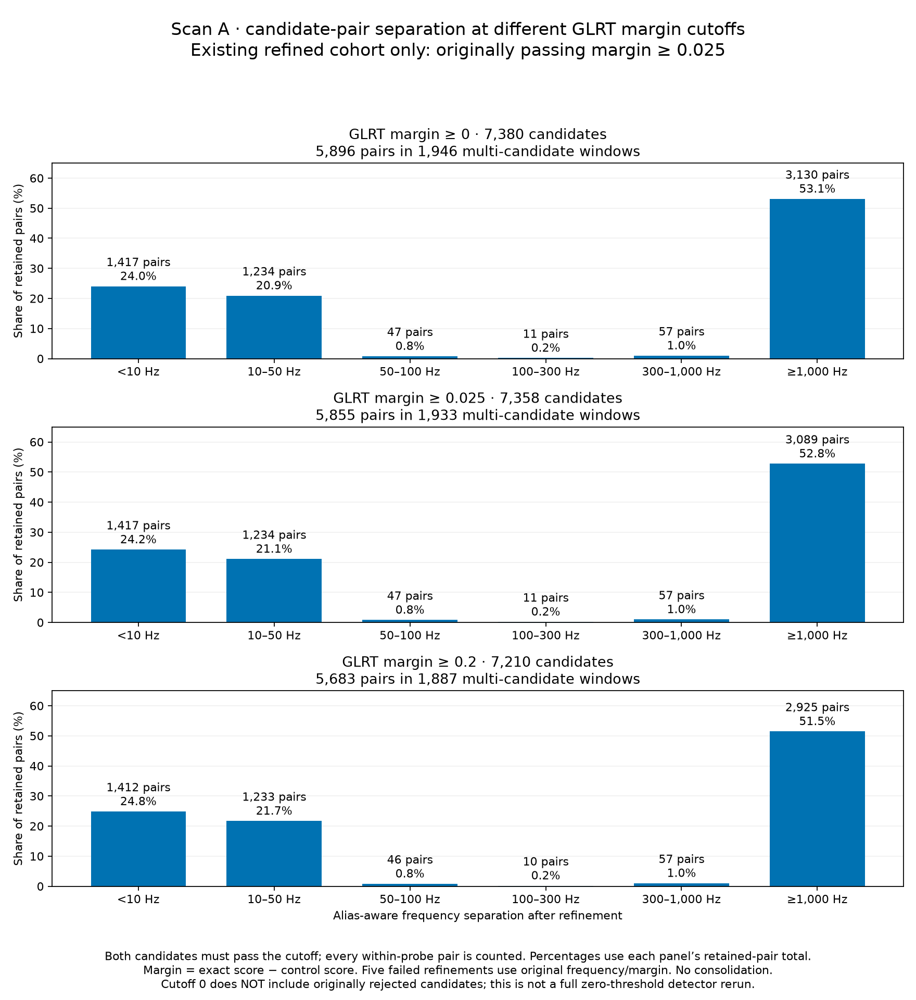

**Figure 10.** Conditional separation distributions at refined-margin cutoffs 0, 0.025, and 0.2. These are re-filters of the same saved cohort, not new acquisitions at different thresholds.

<a id="fig-margin-06"></a>

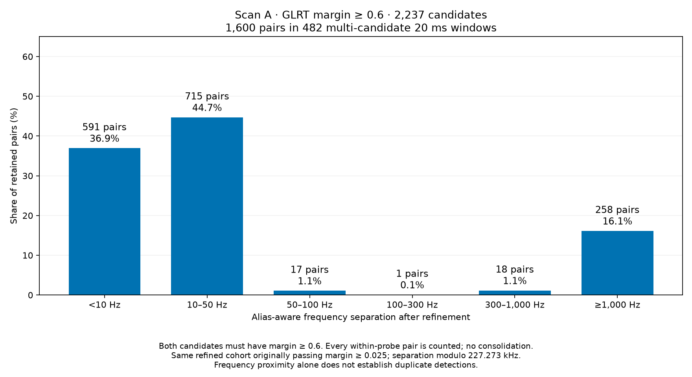

**Figure 11.** At margin ≥0.6, 2,237 candidates produce 1,600 pairs in 482 multi-candidate windows; 81.6% of pairs are under 50 Hz. The more concentrated distribution is descriptive and does not prove duplicates or justify discarding weaker independent signals.

Top-response selection and raising the cutoff are different operations: one picks one winner per window; the other can keep several or none. We did not combine them in the reported top-response solver run.

<a id="orbit"></a>

07 / Physical prediction and calibration

## One satellite must have one consistent timing shift

The conceptual frequency model used during this investigation combines an orbit prediction with receiver frequency offset/drift and RF-dependent calibration:

ŷ<sub>i,s</sub> = D<sub>s</sub>(x, t<sub>i</sub> + τ + δ<sub>s</sub>; F<sub>i</sub>)  + a<sub>rᵢ</sub> + b<sub>rᵢ</sub>(t<sub>i</sub> − 150)  + c (F<sub>i</sub> − F<sub>ref</sub>) / (1 GHz)

Here *x* is receiver position, *D* is orbit Doppler at the observation’s RF, *τ* and *δ* represent common and satellite-relative timing, and *a*, *b*, *c* represent nuisance calibration. The learned RF coefficient is not a substitute for computing physical frequency-dependent Doppler.

**The latest association replay is more specific than this conceptual equation.**

It keeps the known position and previously fitted, fold-specific receiver/RF calibration frozen, including the saved time-interpolated receiver corrections. It is not a new joint fit of location, linear drift, RF coefficient, and assignments. Candidate testing replaces the satellite timing entry with one *absolute* shift θ<sub>s</sub> in every fold, bounded to ±20 seconds.

An earlier implementation added one relative candidate offset to each fold’s different common-timing reference. The same satellite could therefore be evaluated at different physical timing shifts across folds. Correcting that convention increased Scan A fitted-c assignments from 4,130 to 5,273, with observations unchanged. This was a model-consistency correction, not simply “loosening the prior.”

<a id="fig-timing-fix"></a>


**Figure 12.** The 58622 timing-regression case that exposed inconsistent fold timing. This belongs to the pre-refinement timing correction, not to the later top-response experiment. It illustrates why a physically shared trajectory must use a consistent ephemeris evaluation shift.

### Candidate-bank generation and eligibility

1. Inspect every ID in the archived candidate inventory; use visibility from the orbit predictor. This is exhaustive over that saved inventory, not every object or possible TLE in existence.
2. Evaluate coarse timing offsets from −20 to +20 seconds in one-second steps, using residuals and Doppler derivatives to propose local timing roots.
3. Cluster timing support, then refine proposed offsets with three bounded local updates. A zero-centered, one-second-scale Gaussian timing penalty enters this proposal refinement.
4. Take the union of timing hypotheses discovered by the fitted-c and c=0 arms, and score that identical union in both arms.
5. Cache visible candidate-to-orbit edges within a 600 Hz circular residual gate. The selector does not repeatedly propagate every orbit during each greedy addition.

| Experiment | Archived catalog IDs | Matched timing hypotheses / arm | Discovery wall time (s) |
| --- | --- | --- | --- |
| A-original | 738 | 20117 | 274.3 |
| B-original | 853 | 17443 | 243.0 |
| A-refined | 738 | 16762 | 241.6 |
| A-top | 738 | 7695 | 98.9 |

Each c comparison is matched within its own observation-set experiment: observations, candidate timings, gates, and search budgets are shared. The nuisance fits themselves are separately saved arms. Across original/refined/top experiments, candidate pools are regenerated because the observations change; that is not a frozen-pool ablation.

<a id="solver"></a>

08 / Association algorithms

## A count-first objective with explicit feasibility rules

Maximize J = N<sub>assigned</sub> − 10 N<sub>selected satellites</sub>

Here the reward per assigned retained candidate is one and the cost per unique satellite is ten. In the top-response experiment, retained candidates and windows are one-to-one. A candidate can have only one owner; a satellite can take at most one candidate from any probe; a satellite is selected with one timing mode.

For each satellite/timing mode, eligibility is recomputed using currently unclaimed candidates. Within each receiver/channel lane, choose the closest available residual per probe, order by time, and split at gaps greater than five seconds. A segment must contain at least ten distinct probes and span at least five seconds. All retained residuals must be within 600 Hz and visible.

The minimum segment size is ten, but an addition must explain **more than ten** currently available candidates overall to improve the penalty-10 objective. A mode with exactly ten does not pay a positive net reward.

### Greedy: add the best available satellite

```text
selected = empty; all candidate rows are unclaimed
evaluate each satellite/timing mode on currently unclaimed observations
repeat:
    pick the eligible new satellite/mode with the largest candidate count
    stop if its count ≤ 10
    claim its eligible candidates and add it to selected
    refresh other modes whose available support was affected
```

Equal counts are broken using a residual/timing proxy, then deterministic catalog/mode ordering:

tie score = −½ Σ(residual / 200 Hz)² − ½(θ<sub>s</sub> / 1 s)²

This proxy is **not added to the primary count objective**. A timing prior influences proposal generation and count ties; it does not turn the final selector into a fully Bayesian likelihood fit. Already selected tracks are not continuously refitted after every addition.

### Replacement: challenge an earlier choice

```text
start from greedy
for each selected satellite:
    temporarily remove it and release its observations
    forbid that ID during this trial
    greedily add one or more alternative satellites
    accept only if the complete objective strictly improves
    after acceptance, allow the removed ID to re-enter if it pays its cost
repeat complete sweeps until none improve, or the three-sweep cap is reached
```

This can replace one broad, mediocre choice with multiple more useful satellites. It does not enumerate every subset, perform arbitrary multi-out swaps, or optimize a selected satellite’s timing in isolation. A no-improvement sweep proves only a fixed point for this particular greedy-repair neighborhood.

<a id="fig-solver-progress"></a>

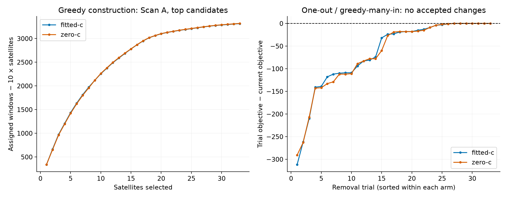

**Figure 13.** Scan A top-response search traces. Left: the objective after each greedy addition. Right: the objective change for each one-out/greedy-many-in trial, sorted within each arm. None was strictly positive, so replacement accepted no changes.

All eight saved runs summarized here stopped after a no-improvement sweep. In the latest top-response runs, 33 removals were tested per arm and zero changes accepted. “Greedy + replacement” describes the algorithm run; it does not imply replacement improved these particular results.

| Scan | Observation set | Calibration | Greedy assigned | After replacement | Removal trials | Accepted | Selection wall time (s) |
| --- | --- | --- | --- | --- | --- | --- | --- |
| A | Original GLRT; corrected timing | fitted-c | 5273 | 5273 | 46 | 0 | 33.73 |
| A | Original GLRT; corrected timing | zero-c | 5246 | 5246 | 44 | 0 | 34.18 |
| B | Original GLRT; corrected timing | fitted-c | 4963 | 4963 | 51 | 0 | 26.70 |
| B | Original GLRT; corrected timing | zero-c | 4969 | 4969 | 51 | 0 | 27.19 |
| A | Refined GLRT; all candidates | fitted-c | 5267 | 5267 | 46 | 0 | 27.64 |
| A | Refined GLRT; all candidates | zero-c | 5238 | 5238 | 44 | 0 | 28.06 |
| A | T1-AT v1; refined top per window | fitted-c | 3644 | 3644 | 33 | 0 | 9.32 |
| A | T1-AT v1; refined top per window | zero-c | 3648 | 3648 | 33 | 0 | 9.51 |

Efficiency comes from cached sparse candidate-orbit edges and updating only modes affected by newly claimed or released rows. Recorded times above cover selection, not raw-IQ refinement or orbit-bank discovery. Cached discovery times appear separately in Section 7.

<a id="results"></a>

09 / Results and controlled comparisons

## Two scans, three observation sets—and no hidden denominator change

The original rows below already use the corrected absolute timing convention. “Refined” preserves every canonical candidate. “Top” keeps one refined-margin winner per window. Every row uses the same penalty-10, 600 Hz, coherence-constrained greedy/replacement family with frozen calibration.

| Scan | Observation set | Calibration | Assigned / denominator | Coverage | Unassigned | Satellites | Objective | Assigned RMS (Hz) |
| --- | --- | --- | --- | --- | --- | --- | --- | --- |
| A | Original GLRT; corrected timing | fitted-c | 5,273 / 7,382 | 71.43% | 2109 | 46 | 4813 | 153.1 |
| A | Original GLRT; corrected timing | zero-c | 5,246 / 7,382 | 71.06% | 2136 | 44 | 4806 | 205.1 |
| B | Original GLRT; corrected timing | fitted-c | 4,963 / 6,602 | 75.17% | 1639 | 51 | 4453 | 137.1 |
| B | Original GLRT; corrected timing | zero-c | 4,969 / 6,602 | 75.27% | 1633 | 51 | 4459 | 201.8 |
| A | Refined GLRT; all candidates | fitted-c | 5,267 / 7,382 | 71.35% | 2115 | 46 | 4807 | 142.5 |
| A | Refined GLRT; all candidates | zero-c | 5,238 / 7,382 | 70.96% | 2144 | 44 | 4798 | 214.4 |
| A | T1-AT v1; refined top per window | fitted-c | 3,644 / 3,837 | 94.97% | 193 | 33 | 3314 | 146.4 |
| A | T1-AT v1; refined top per window | zero-c | 3,648 / 3,837 | 95.07% | 189 | 33 | 3318 | 214.6 |

Assigned RMS is √mean(residual²) over each row’s final assigned set, using saved circular residuals. Memberships differ between rows, so these RMS values are descriptive, not a controlled frequency-estimator comparison. The fixed-membership comparison is in Section 4. Objectives across different observation sets are not directly comparable.

**Historical snapshot scope.**

The original results table above contains the original-candidate/corrected-timing baseline for both scans, but refined and top-response results for Scan A only. The later Scan B T1-AT v1 replication is a separate addendum below; historical tables and figures have not been relabeled as new results.

<a id="scan-b-replay"></a>

### Later addendum: Scan B T1-AT v1 reproducibility replay

A fresh selection replay on 4 October 2026 reused the original frozen Scan B top-candidate timing pool and calibration. All 35 recorded upstream source hashes verified. Both greedy and final replacement assignments matched their respective historical receipts exactly. This reran selection, not IQ refinement, calibration, orbit discovery, or position estimation.

| Calibration | Assigned / windows | Coverage | Unassigned | Satellites | Assigned RMS (Hz) | Exact historical match |
| --- | --- | --- | --- | --- | --- | --- |
| fitted-c | 3,460 / 3,602 | 96.06% | 142 | 32 | 90.5 | True |
| zero-c | 3,460 / 3,602 | 96.06% | 142 | 32 | 179.7 | True |

Greedy already reached 3,460 / 3,602 windows in both RF arms. The replacement sweep tested all 32 selected satellites and accepted no changes. These are per-window coverage and assigned-set frequency RMS, not held-out identification accuracy or position error. The compressed replay receipts are included in the downloadable evidence.

### What the c=0 control says

For Scan A top responses, c=0 assigns four more windows and has an objective four points higher. Fitted c has a lower assigned-set residual RMS (146.4 versus 214.6 Hz), but the assigned sets differ. Neither arm establishes superior satellite identification or localization. The RF coefficient may change residual fit without improving location accuracy; no position search was run for this report.

### The new activity view

<a id="fig-top-orbits"></a>


**Figure 14.** Scan A fitted-c top-response assignments with the selected model predictions. Colors identify satellites; gray points are unassigned. Lines reconstruct the saved orbit-plus-calibration value as measurement minus saved residual at assigned times, with breaks at alias wraps and gaps over five seconds. They do not extrapolate a full orbit over unobserved intervals.

<a id="fig-top-fit"></a>

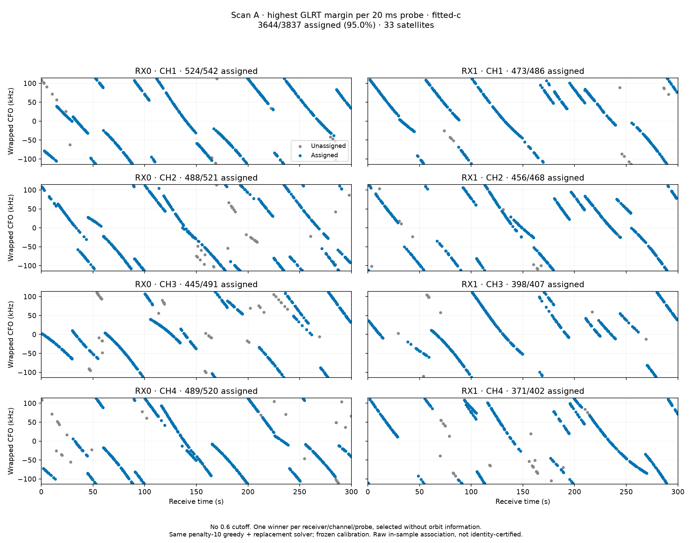

**Figure 15.** Scan A top-response result, fitted c. Blue points are assigned and gray points unassigned; only one retained candidate per receiver/channel/window is present. This is a measured-frequency ownership plot, not an overlay of all orbit curves.

<a id="fig-top-zero"></a>

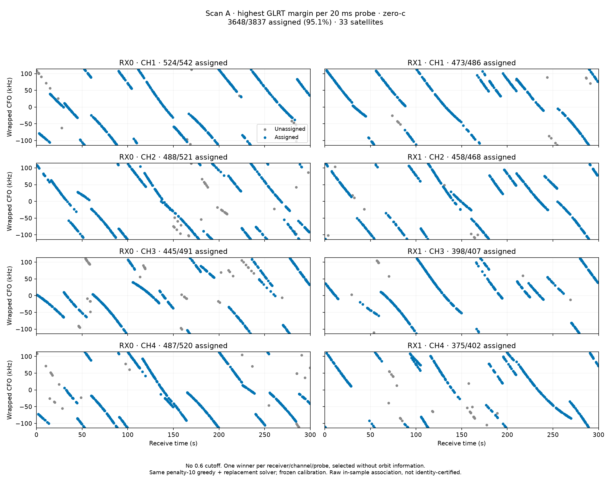

**Figure 16.** The matched c=0 top-response result on the same windows and timing-hypothesis union. Similar coverage does not imply identical owners or identical residuals.

<a id="fig-satellite-support"></a>

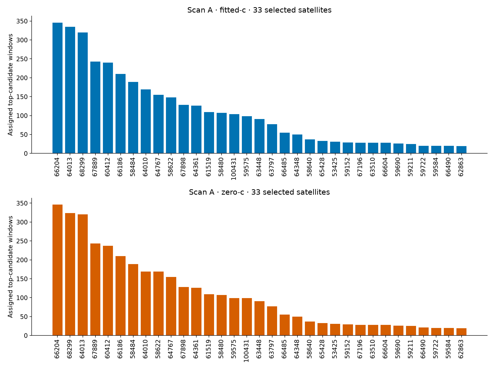

**Figure 17.** Assigned top-response windows per selected satellite, separately for both calibration arms. Counts combine receiver/channel support for each ID; they are not independent confirmations of satellite identity.

### The remaining unassigned observations depend on the experiment

<a id="fig-refined-unassigned"></a>

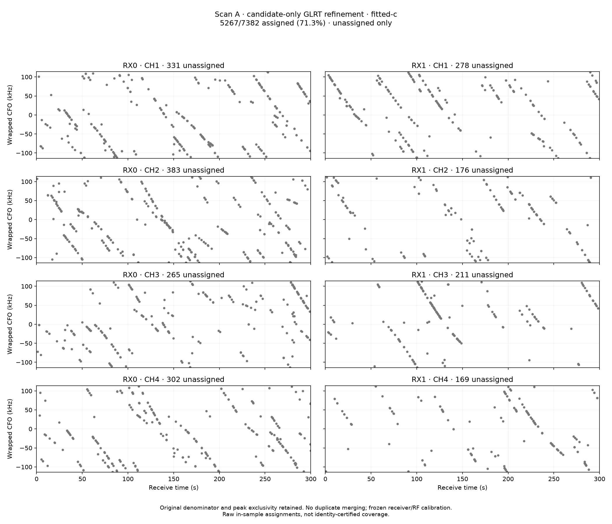

**Figure 18.** Scan A, all refined candidates, fitted c: 2,115 unassigned candidate hypotheses. This older full-cohort view includes alternatives excluded by per-satellite/probe exclusivity; it must not be mistaken for the 193 unassigned top-response windows.

<a id="fig-scan-b-unassigned"></a>

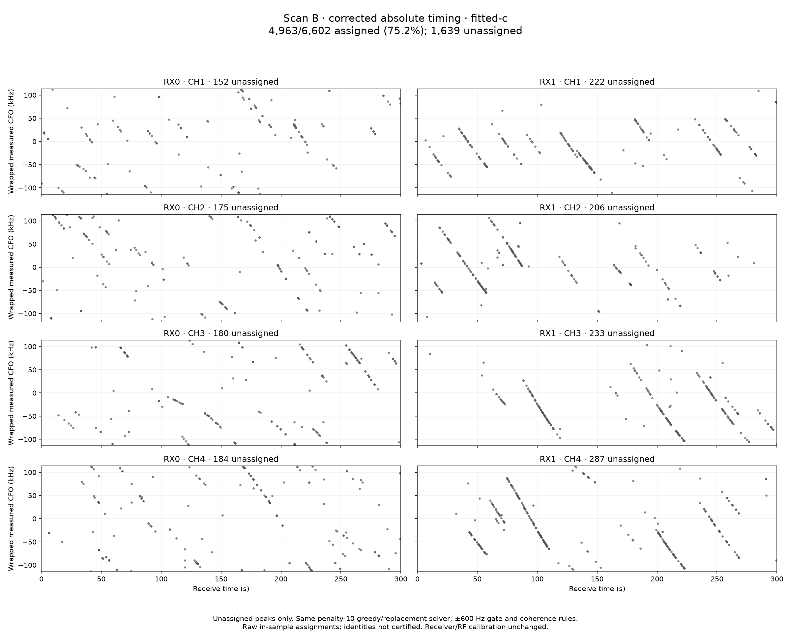

**Figure 19.** Scan B original-candidate baseline after the absolute timing correction, fitted c: 1,639 of 6,602 candidate hypotheses unassigned. This is not a refined or top-response Scan B result.

The Scan A top-response fitted-c solution assigns 3,644 rows, equivalent to 49.36% of the original 7,382 candidate records. That fraction is also not independent-signal coverage: many original records are alternative hypotheses. The right next step is to classify or consolidate hypotheses using signal evidence, not to choose whichever denominator makes coverage appear largest.

<a id="limits"></a>

10 / Interpretation and next experiments

## What is resolved—and what still needs evidence

| Question | Supported answer | Not yet established |
| --- | --- | --- |
| Can candidate-only refinement reduce the selected boundary disagreement? | Yes: all 89 targeted alternatives end within 60 Hz of their window’s originally assigned candidate. | Universal frequency accuracy or orbit-residual improvement. |
| Was the RX1/CH3 gray ridge a missing 66204 track? | The audited 89 alternatives share windows already assigned to 66204. | That every unassigned ridge elsewhere is a duplicate. |
| Can the model explain the strongest response in most observed windows? | About 95% for Scan A under these matching and selection rules. | 90%+ recovery of all independent simultaneous signals. |
| Did replacement improve the latest greedy result? | No accepted changes in the tested neighborhood. | A global optimum or uniqueness of the selected configuration. |
| Does a better frequency fit prove the correct location? | No. Calibration, timing, selection, and identity uncertainty remain confounded. | Improved position accuracy or an unbiased localization objective. |

### Recommended bounded follow-up

1. **Preserve the Scan B replication as a regression baseline.** The addendum reproduces the saved T1-AT v1 selection. Future calibration, TLE, or candidate-policy changes should be isolated against that frozen reference with matched c=0/fitted-c comparisons. Fresh end-to-end regeneration remains distinct from selection replay.
2. **Separate duplicate-like hypotheses from distinct signals.** Compare candidate solutions in frequency *and* epoch, and test single-source versus multi-source explanations on raw IQ. Avoid declaring duplicates from a 300 Hz distance rule alone.
3. **Keep top-response coverage as one metric, add signal-component coverage.** Consolidate only with an explicit auditable criterion; allow multiple independently supported components per window.
4. **Audit identity and residual structure.** Compare close competing satellite IDs, timing modes, channel-consistent curvature, and residual distributions. A 600 Hz acceptance gate is a matching tolerance, not a confidence interval.
5. **Validate on reproducibly randomized independent groups.** Keep all candidates and overlapping IQ from a probe/block together. Record the seed and split, fit calibration and preprocessing on training groups, and test on held-out groups or separate scans. The current reused-fold development search is not that validation.
6. **Expand the local-search neighborhood only when needed.** Test timing-only reconsideration or bounded two-out exchanges on ambiguous subsets, with a fixed budget. Compare score, identity stability, and held-out residuals—not just raw assigned counts.

The most useful design principle from this investigation is simple: **keep measurement estimation, hypothesis consolidation, satellite association, and localization as separate evidence layers.** A change that helps one layer must be measured—not assumed—to help the next.

<a id="appendix"></a>

11 / Reproducibility appendix

## Inspect the tracks and the receipts

This HTML contains its figures, downloadable evidence, and source snapshots. It can be copied and read offline without a server, CDN, JavaScript library, or access to the radio corpus. The companion `report.md` is generated from the same document and links to the packaged assets, evidence, and source files; retain that directory structure when copying Markdown. Figure numbering follows reading order. Expand the sections below for the underlying details.

### Latest top-response satellite inventory: counts, timing, and RMS

| Calibration | NORAD | Windows | Absolute timing shift (s) | Assigned RMS (Hz) |
| --- | --- | --- | --- | --- |
| fitted-c | 66204 | 346 | -2.601364 | 77.39 |
| fitted-c | 64013 | 335 | -0.931920 | 148.53 |
| fitted-c | 68299 | 320 | -0.662651 | 241.99 |
| fitted-c | 67889 | 243 | -0.066143 | 109.13 |
| fitted-c | 60412 | 240 | +0.670145 | 107.73 |
| fitted-c | 66186 | 210 | -0.511607 | 137.71 |
| fitted-c | 58484 | 189 | +0.120209 | 86.23 |
| fitted-c | 64010 | 169 | -0.853702 | 61.38 |
| fitted-c | 64767 | 155 | -0.247724 | 168.06 |
| fitted-c | 58622 | 148 | +0.244332 | 405.39 |
| fitted-c | 67898 | 128 | -0.619093 | 65.94 |
| fitted-c | 64361 | 126 | -0.090751 | 53.69 |
| fitted-c | 61519 | 109 | +0.766214 | 92.83 |
| fitted-c | 58480 | 107 | +1.469547 | 83.07 |
| fitted-c | 100431 | 104 | +0.231612 | 88.33 |
| fitted-c | 59575 | 98 | -0.007337 | 71.90 |
| fitted-c | 63448 | 91 | -0.168021 | 99.88 |
| fitted-c | 63797 | 77 | -0.594397 | 95.10 |
| fitted-c | 66485 | 55 | -0.202078 | 67.78 |
| fitted-c | 64348 | 50 | -0.294092 | 75.39 |
| fitted-c | 58640 | 37 | -0.662842 | 68.36 |
| fitted-c | 65428 | 33 | -0.848974 | 66.36 |
| fitted-c | 53425 | 31 | +0.605334 | 63.17 |
| fitted-c | 59152 | 29 | -0.291771 | 91.54 |
| fitted-c | 67196 | 28 | -0.433842 | 109.50 |
| fitted-c | 63510 | 28 | +0.102376 | 114.56 |
| fitted-c | 66604 | 28 | -0.801724 | 114.56 |
| fitted-c | 59690 | 26 | +2.322552 | 121.21 |
| fitted-c | 59211 | 25 | +0.249027 | 78.15 |
| fitted-c | 59722 | 20 | +0.239292 | 85.94 |
| fitted-c | 59584 | 20 | +2.369918 | 161.39 |
| fitted-c | 66490 | 20 | -5.712554 | 94.31 |
| fitted-c | 62863 | 19 | +0.231722 | 128.25 |
| zero-c | 66204 | 346 | -2.539553 | 218.03 |
| zero-c | 68299 | 324 | -0.662651 | 211.44 |
| zero-c | 64013 | 320 | -0.850736 | 213.19 |
| zero-c | 67889 | 243 | -0.005007 | 160.67 |
| zero-c | 60412 | 237 | +0.711552 | 303.25 |
| zero-c | 66186 | 210 | -0.439803 | 217.22 |
| zero-c | 58484 | 189 | +0.145800 | 246.58 |
| zero-c | 64010 | 169 | -0.818872 | 270.41 |
| zero-c | 58622 | 169 | +0.244332 | 320.06 |
| zero-c | 64767 | 155 | -0.161203 | 143.90 |
| zero-c | 67898 | 128 | -0.593838 | 171.93 |
| zero-c | 64361 | 126 | -0.023145 | 189.94 |
| zero-c | 61519 | 109 | +0.842425 | 201.87 |
| zero-c | 58480 | 107 | +1.540808 | 201.85 |
| zero-c | 59575 | 99 | +0.052752 | 83.24 |
| zero-c | 100431 | 99 | +0.296251 | 230.44 |
| zero-c | 63448 | 91 | -0.076438 | 264.27 |
| zero-c | 63797 | 77 | -0.612002 | 142.12 |
| zero-c | 66485 | 55 | -0.116811 | 93.15 |
| zero-c | 64348 | 50 | -0.094760 | 200.12 |
| zero-c | 58640 | 37 | -0.509544 | 171.41 |
| zero-c | 65428 | 33 | -0.851826 | 254.53 |
| zero-c | 53425 | 31 | +0.656460 | 149.07 |
| zero-c | 59152 | 29 | -0.213033 | 101.15 |
| zero-c | 67196 | 28 | -0.326810 | 71.46 |
| zero-c | 63510 | 28 | +0.273718 | 113.45 |
| zero-c | 66604 | 28 | -0.643694 | 141.95 |
| zero-c | 59690 | 26 | +2.394256 | 92.22 |
| zero-c | 59211 | 25 | +0.357844 | 135.71 |
| zero-c | 66490 | 21 | -5.500142 | 98.56 |
| zero-c | 59722 | 20 | +0.401227 | 83.71 |
| zero-c | 59584 | 20 | +2.628784 | 131.94 |
| zero-c | 62863 | 19 | +0.317506 | 77.39 |

One absolute timing mode per selected ID, shared across receivers and folds. RMS is in-sample, circular, and conditional on selected memberships. Multiple lane segments may contribute to one satellite’s count.

### Download numerical evidence and original solver receipts

The eight historical solver receipts and two later Scan B T1-AT v1 selection-replay receipts are preserved losslessly as gzip-compressed JSON, including initial/final assignments, timing modes, greedy traces, and replacement trials. The compact CSV includes all Scan A canonical candidates, original/refined measurements and margins, probe membership, top-selection flags, and owners across the saved experiments. Blank owner fields mean unassigned or not retained for that experiment.

- [A-original-fitted-c.json.gz](evidence/A-original-fitted-c.json.gz) (169,937 bytes)
- [A-original-zero-c.json.gz](evidence/A-original-zero-c.json.gz) (168,504 bytes)
- [A-refined-fitted-c.json.gz](evidence/A-refined-fitted-c.json.gz) (169,876 bytes)
- [A-refined-zero-c.json.gz](evidence/A-refined-zero-c.json.gz) (168,729 bytes)
- [A-top-fitted-c.json.gz](evidence/A-top-fitted-c.json.gz) (118,234 bytes)
- [A-top-zero-c.json.gz](evidence/A-top-zero-c.json.gz) (118,491 bytes)
- [B-original-fitted-c.json.gz](evidence/B-original-fitted-c.json.gz) (161,359 bytes)
- [B-original-zero-c.json.gz](evidence/B-original-zero-c.json.gz) (161,486 bytes)
- [B-t1-at-v1-replay-fitted-c.json.gz](evidence/B-t1-at-v1-replay-fitted-c.json.gz) (112,703 bytes)
- [B-t1-at-v1-replay-zero-c.json.gz](evidence/B-t1-at-v1-replay-zero-c.json.gz) (112,928 bytes)
- [detector-provenance.json](evidence/detector-provenance.json) (6,549 bytes)
- [exclusivity.json.gz](evidence/exclusivity.json.gz) (260 bytes)
- [khz-pairs.json.gz](evidence/khz-pairs.json.gz) (2,504 bytes)
- [manifest.json](evidence/manifest.json) (26,922 bytes)
- [margin-06.json.gz](evidence/margin-06.json.gz) (215 bytes)
- [margin-cutoffs.json.gz](evidence/margin-cutoffs.json.gz) (606 bytes)
- [metrics.json](evidence/metrics.json) (29,568 bytes)
- [pair-distribution.json.gz](evidence/pair-distribution.json.gz) (347 bytes)
- [refined-audit.json.gz](evidence/refined-audit.json.gz) (464 bytes)
- [scan-A-candidates.csv.gz](evidence/scan-A-candidates.csv.gz) (389,866 bytes)
- [target-refinement.json.gz](evidence/target-refinement.json.gz) (34,732 bytes)
- [timing-audit.json.gz](evidence/timing-audit.json.gz) (1,596 bytes)
- [top-audit.json.gz](evidence/top-audit.json.gz) (345 bytes)
- [top-coverage.json.gz](evidence/top-coverage.json.gz) (387 bytes)

### Download the exact analysis-script snapshots

These are forensic copies of the scripts used in the saved analysis. They document implementation details but are not a turnkey raw-IQ replay package: their original calibration archives, orbit banks, installed analysis release, and IQ corpus are external dependencies. They do not run merely by opening this report.

- [absolute_timing_solver.py](sources/absolute_timing_solver.py)
- [audit_absolute_timing_solver.py](sources/audit_absolute_timing_solver.py)
- [audit_refined_scan_A.py](sources/audit_refined_scan_A.py)
- [candidate_guided_refinement.py](sources/candidate_guided_refinement.py)
- [greedy_pool_two_scans.py](sources/greedy_pool_two_scans.py)
- [greedy_restart_scan.py](sources/greedy_restart_scan.py)
- [installed_pilot_methods.py](sources/installed_pilot_methods.py)
- [investigate_khz_pairs.py](sources/investigate_khz_pairs.py)
- [penalty_replace_search.py](sources/penalty_replace_search.py)
- [plot_close_candidate_scan.py](sources/plot_close_candidate_scan.py)
- [plot_pair_margin_06.py](sources/plot_pair_margin_06.py)
- [plot_pair_margin_cutoffs.py](sources/plot_pair_margin_cutoffs.py)
- [plot_refined_66204_exclusivity.py](sources/plot_refined_66204_exclusivity.py)
- [plot_refined_pair_distribution.py](sources/plot_refined_pair_distribution.py)
- [plot_top_candidate_window_coverage.py](sources/plot_top_candidate_window_coverage.py)
- [refine_full_scan_A.py](sources/refine_full_scan_A.py)
- [replay_historical_b.py](sources/replay_historical_b.py)
- [run_candidate_guided_refinement.py](sources/run_candidate_guided_refinement.py)
- [solve_refined_scan_A.py](sources/solve_refined_scan_A.py)
- [test_absolute_timing_solver.py](sources/test_absolute_timing_solver.py)
- [test_candidate_guided_refinement.py](sources/test_candidate_guided_refinement.py)
- [test_top_one_scan_A.py](sources/test_top_one_scan_A.py)
- [top_one_scan_A.py](sources/top_one_scan_A.py)

### Provenance, hashes, and scope

Packaged assets are SHA-256 checked by the report builder. Original paths identify the analysis-host archive; they are provenance labels, not required runtime paths for viewing this HTML. Large timing pools and the full refinement trace are referenced by hash rather than bundled. Compact measurements and original solver receipts are bundled. No new raw-IQ verification or orbit fit was performed when building the report.

| Packaged file / source | SHA-256 | Role |
| --- | --- | --- |
| assets/all-candidates.png | 7bee357f0e4a4cd1ebb2f6d37ba562ee384c82078f3cdd53c6fd612891f54794 | saved figure |
| assets/refinement-case.png | 193da5b780ff2a56c0b9ae6c72271ef08356708b4a33de1a268b5660e31b90be | saved figure |
| assets/pair-distribution.png | c164fb871ef34448ac9f45f3c340bc3cb0372a61090716feca21b81d000fc195 | saved figure |
| assets/margin-cutoffs.png | 2f63f235ade4ef150e51b85ad01fff33f543375df428f1307d2f3ee6d7ca0dde | saved figure |
| assets/margin-06.png | ead8efb6bd23be78490842436542946d30a559dac37d997fdb42b7c58ca3bfe2 | saved figure |
| assets/khz-pairs.png | 6b771160285fe989664ab5bd3b7b059e8554bd3d15b1cb151392d5fe17509eb9 | saved figure |
| assets/exclusivity.png | abe4c92eaa405f8acb79bca0045367288667249c4a0a9f8a7ebae5db11ada32e | saved figure |
| assets/timing-fix.png | 981ab0002ab96729e45497f1a33869af6031cf058918b01743a03816223c2a00 | saved figure |
| assets/refined-coverage.png | 2fdd96fa09d07f26dc569e51d038e2ec18f2dae70f9bfc4bf4c822f07e7fc8a3 | saved figure |
| assets/refined-unassigned.png | 95b48fe1f6ace499dc63fd7482688218df97f9ab9e830d5f3c84cb2b161aacd1 | saved figure |
| assets/top-coverage.png | eed2a9145796cdbd76344eb7e6c25e0bdcc6f228eec3e849bd06a33673b63d98 | saved figure |
| assets/top-fit.png | c794493e59077d6532d6ab0fa7a721131fbc73cbb4b322368411c615c5fb570f | saved figure |
| assets/top-zero.png | 6c17a49d771b725a9c71bb9f8c7d365c72ef6dadc73c78845c3d34439eb976cc | saved figure |
| assets/scan-b-unassigned.png | 2676b3dd22c8891489cfdc878b0f165fc17d7aa5d2df018780ecc762191bc446 | saved figure |
| evidence/top-audit.json.gz | d2a4c3c50f7cc1eede4fe6ee415afcc2cbeaaf33e9234eefdeff3904760041be | saved receipt; lossless gzip |
| evidence/refined-audit.json.gz | b97f8cfa72d10b90cb57a788410215b68010c85d4d490bc5f06f474359d63e51 | saved receipt; lossless gzip |
| evidence/timing-audit.json.gz | 18696fc98a33b641807a1b27250ba8c46304b8b86854dd3e3910992fe2e1ab78 | saved receipt; lossless gzip |
| evidence/target-refinement.json.gz | 840b3b0fb947c06a399b02a0abedf30d18454a3f96c475f18c882e0cf11722aa | saved receipt; lossless gzip |
| evidence/exclusivity.json.gz | 6a5c8b2f151b89a03073f77eb23a84c21457e47e8e7dd17c9fe99ecc6874a513 | saved receipt; lossless gzip |
| evidence/khz-pairs.json.gz | 6e37ee00ad1729725825664fc9219a49088095339141836cc82945b19861eb3c | saved receipt; lossless gzip |
| evidence/pair-distribution.json.gz | a9605218309075314697021b0ae91583bbd095b8cbb8d80c6a485b225be9415d | saved receipt; lossless gzip |
| evidence/margin-cutoffs.json.gz | 08abfc013d2802a61eca7b828501e4c6e573e6c48ee5f2373c980c5e04801189 | saved receipt; lossless gzip |
| evidence/margin-06.json.gz | c103bd120dd26e7e42e74172ad49b2b583d261314dee0dc83e81c2717a205ddf | saved receipt; lossless gzip |
| evidence/top-coverage.json.gz | 788e87bd923c6d6dca0f563245aabcd770daa9fdcf79ec0f8bdcca423f911323 | saved receipt; lossless gzip |
| sources/candidate_guided_refinement.py | e65fd4361bdab4642e29c4114d70a1e5869578f84ab11ed88f12e66f58b8d3b0 | forensic source snapshot |
| sources/refine_full_scan_A.py | d00e5438e8ea2bc704ae656a73c7292c1938c1d89cadb7b4c1a39766a6684d14 | forensic source snapshot |
| sources/run_candidate_guided_refinement.py | ee09a843e6a073f9e0183aec88494274657ec487a0651dc96889795ca440c487 | forensic source snapshot |
| sources/absolute_timing_solver.py | dffb8c3c250b16fd7dfe1291c4586976bbe32a98bd5e8b950123f3d7ca5c1cb7 | forensic source snapshot |
| sources/greedy_pool_two_scans.py | 29cba2532c11210dbcc1190b5edd8c7108f2a728a16a1d41813993cc11d2bd83 | forensic source snapshot |
| sources/greedy_restart_scan.py | 78d9800157bcb791ced6be71400ac70fc5fbe95c0a31d3b9498f5bb8746b15ed | forensic source snapshot |
| sources/penalty_replace_search.py | 1e9575c3f81ccc5045c11b7d46afa8e2b0b156e1a0383b1f0295c72dc78cb7d5 | forensic source snapshot |
| sources/solve_refined_scan_A.py | 2adecdc677b7e019ec20ed0c4dcc5221e32a824cdd2763088917a38f5ca4815d | forensic source snapshot |
| sources/top_one_scan_A.py | caa4f75187c0d8f16e2c4342926ae8a9eec32cd67682c14fdb51b0d500079683 | forensic source snapshot |
| sources/audit_absolute_timing_solver.py | 36dd3b6760773880de1abf4a06814579bee738817d0444c95301359ee7ea9d0d | forensic source snapshot |
| sources/audit_refined_scan_A.py | 93c5de0d929b8df72f24dc3a5d9eeb313c151b85d4ba5609c2aa3a63b076f31c | forensic source snapshot |
| sources/plot_refined_66204_exclusivity.py | 6950e6e2cef81d7e6673471d4416720d87c4ce4d9cb82117251e56afdc2a96f0 | forensic source snapshot |
| sources/investigate_khz_pairs.py | 9692d59df1b32be2c902998dd017fcface89d4a841986cee347b100823aa2d2d | forensic source snapshot |
| sources/plot_refined_pair_distribution.py | 095066ee07c61f0ef8cb927d0f11e82831cb8abc94e4a605768e24144f64c96f | forensic source snapshot |
| sources/plot_pair_margin_cutoffs.py | 5c960cd0fe97848c2a5bef72fd2aa315e0cc844348e23a5f11c7997041692d9b | forensic source snapshot |
| sources/plot_pair_margin_06.py | 20a0108164270e0512abf706f636aab4a96cacea98d0066c2abcfa076aa7ddb8 | forensic source snapshot |
| sources/plot_close_candidate_scan.py | 912f15c36e7b66efa698b6316678fd347f39c7652accff9693ea218e1e2687c9 | forensic source snapshot |
| sources/plot_top_candidate_window_coverage.py | 05a15f6f60cb1b9a38fa1dc95f1b6e8ccc8faf09fb7d1cff0aefd001836b140f | forensic source snapshot |
| sources/test_candidate_guided_refinement.py | 33c3338a26b6bb8e47650bfd6633e5b7c88915865dadc256d3e77bcf84b04dab | forensic source snapshot |
| sources/test_top_one_scan_A.py | 4f747d21d9bed758687db5e52818760a4393669563733e920acdba07561a010a | forensic source snapshot |
| sources/test_absolute_timing_solver.py | 22bf5426252be804c4bedffb5c9d9111d11b7c0c138770787c73fc931abb5fff | forensic source snapshot |
| sources/installed_pilot_methods.py | c33de1f8ed7b3d8f1f1b7de659d6aa2b110f658338eb2753ae2c5161757a2857 | installed refinement scorer; not a runtime dependency of the report |
| /home/mouse9911/gits/leo-tracker-reduxredux/reports/2026_10_02_ds13_timing_em/scans/scan-fw-911c4e5db9243281/bundle.json | 4a969537aab3af525a22120dd782048c32a0d80e85e9b16476f411a0cd9c3572 | scan metadata; selected fields in detector-provenance.json |
| /home/mouse9911/gits/leo-tracker-reduxredux/reports/2026_10_02_ds13_timing_em/scans/scan-fw-ffa1cc19d8d7c09f/bundle.json | 8fc67342142000ca7b0d7de2ba92608b5385c4f4cdb81f84f525971640370d7f | scan metadata; selected fields in detector-provenance.json |
| /home/mouse9911/gits/leo-tracker-reduxredux/reports/2026_10_02_ds13_from_911c4e5d/local/analysis/scan-fw-911c4e5db9243281.json | 52425796a04303a5e1160cf2993509af54c7c47bc68f6819007ad378b7ba8ee7 | acquisition configuration; selected fields in detector-provenance.json |
| evidence/A-original-fitted-c.json.gz | ce1b4bd3e9b7db640f2f8ed2e50f3b9289fd1499f199d0c2f3b34d8f5066b553 | solver receipt; lossless gzip |
| evidence/A-original-zero-c.json.gz | 1a10c0a8eff453a4834c43cc43412633a622ea7fe0af91f3f0f5f50c464150ef | solver receipt; lossless gzip |
| evidence/B-original-fitted-c.json.gz | 84fb5d37cad9b647df9fd0066714afa608a1c9786bd6e7d1bebd24b560157c27 | solver receipt; lossless gzip |
| evidence/B-original-zero-c.json.gz | 3bce9b7f765ba8353f1a0a0fbeaa73005f47df3ded298b78294b60ee9e1146cc | solver receipt; lossless gzip |
| evidence/A-refined-fitted-c.json.gz | d4ae6230dcda5b4a3366ffff58c181f29ee17d26d4d0ad48eeb93f533e187c81 | solver receipt; lossless gzip |
| evidence/A-refined-zero-c.json.gz | af0be3c05f900fc8eabc9c9545f5bebba56b55adae3510f690767564e3a8fe33 | solver receipt; lossless gzip |
| evidence/A-top-fitted-c.json.gz | 2d88fae357d93d9c67a789f39f2bf6840e9e0d292ab90b70ea747c0dd2086d55 | solver receipt; lossless gzip |
| evidence/A-top-zero-c.json.gz | e4fe5f9c0abfeef0088e4ade4ad15c210e3314261c1cb5e8031470c104b3a7fa | solver receipt; lossless gzip |
| /srv/bulk/leo/ds13-spline-replay.4hywxT/absolute-timing-penalty10/scan-A/candidate-pool.json | d4aed92c24e766db8a80e26f2dcb72ab96019232bac945cd648650dfb7cb24cb | large candidate pool; hash only, not bundled |
| /srv/bulk/leo/ds13-spline-replay.4hywxT/absolute-timing-penalty10/scan-B/candidate-pool.json | 08325acb1497fedf6e25fadefb0d2fc8dbd5ffb17442c2d1ec6bd073adff4779 | large candidate pool; hash only, not bundled |
| /srv/bulk/leo/ds13-spline-replay.4hywxT/full-scan-A-refinement/solver/scan-A/candidate-pool.json | 3e9a734505ea00c4cf90fa1a9f351584ac0c6fbefb9568508e3068cbd816bba2 | large candidate pool; hash only, not bundled |
| /srv/bulk/leo/ds13-spline-replay.4hywxT/full-scan-A-refinement/top-one/candidate-pool.json | ed30f514e518d2005154e0fcbc690f097b1c6761db55388d90da7d367428a414 | large candidate pool; hash only, not bundled |
| /srv/bulk/leo/ds13-spline-replay.4hywxT/full-scan-A-refinement/refined.json | 0129c0bc860ba0dafec26515442aff58dc6735b5df62d4f1cec2f943b1a9c7ca | full refinement trace; compact measurements bundled separately |
| /home/mouse9911/gits/leo-tracker-reduxredux/reports/2026_10_03_ds13_coverage_goal/frozen/A-observations.npz | 930727ab6409be341f83a7bac989b69fdf183688dc9c089cc91f8225f8e284d7 | frozen observations; compact measurements bundled separately |
| assets/multiplicity.png | 7a2a2631dabd8531de9c70d755b90975d4c1ec8c6af31e991294c182e2feb049 | derived figure; prepare_evidence.py, measurements and solver receipts |
| assets/refinement-tradeoff.png | af2afe65503c5036751f511411f2accead03571502602b5130d059a627222311 | derived figure; prepare_evidence.py, measurements and solver receipts |
| assets/satellite-support.png | 1a82232f582da7ee7b143f624aa0c25d2e98c1ab241f5b50b7c034c95a54c952 | derived figure; prepare_evidence.py, measurements and solver receipts |
| assets/solver-progress.png | d396624fada3808855004d5bb765942b3ca3ea39b70c6f172a584a2a1293f690 | derived figure; prepare_evidence.py, measurements and solver receipts |
| assets/top-orbits.png | 11704f3612361c6d5a309494dd5d0d7f68e817128ad84572b985d21fb88e52dc | derived figure; prepare_evidence.py, measurements and solver receipts |
| evidence/metrics.json | 17c0ef499de5ffbc1466be2a9bd4bad0661adaa82c5bf8cac4460767ad2ee742 | derived evidence |
| evidence/scan-A-candidates.csv.gz | 89a5923fa0c86c3893ca4e6ae3e4e69fb693089fe2dfdba241f68c7a3e6af042 | derived evidence |
| evidence/detector-provenance.json | c6b5a9fd027dded224a9c0990747cba87548dbb5f4d2050c8e843261bc8ac55b | derived evidence |
| evidence/B-t1-at-v1-replay-fitted-c.json.gz | 77c4e0b0ec3f09798de344a38f7874c598bd3cb5ce1a16d5528d0322c1732a4c | later T1-AT v1 selection replay receipt |
| evidence/B-t1-at-v1-replay-zero-c.json.gz | 19cc470e5d14dde46fa68056151b9eae1340dd3a3af3db2b638e96097e7d4407 | later T1-AT v1 selection replay receipt |
| sources/replay_historical_b.py | eadc5a15195be730e0319d1d9ffe0d5b0d82959709589e84ff0db4fb934abe11 | later selection replay script snapshot |

### Rebuilding and testing the portable report

```text
cd reports/2026_10_04_ds13_glrt_evidence_report
python3 build_report.py
python3 -m unittest discover -s . -p 'test_report.py' -v
```

The builder and report tests use only the Python standard library. Recreating derived figures from the original archives uses `prepare_evidence.py` with NumPy and Matplotlib. Tests recompute pair distributions, winner selection, denominator accounting, solver objectives and residual summaries from packaged evidence; verify exclusivity and coherence; and check every embedded image and internal link.

DS13 evidence report · Prepared from archived development experiments, 4 October 2026 UTC. Read the scope and denominator with every result. Frequency fit, coverage, satellite identity, and position accuracy are different claims.
