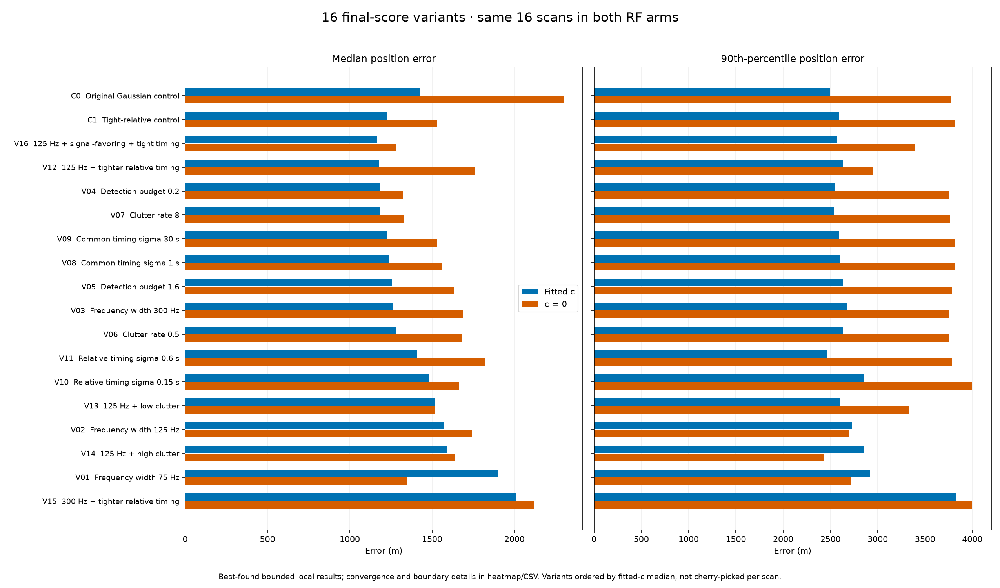
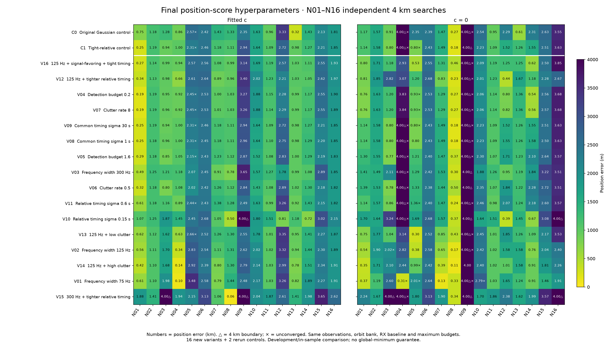
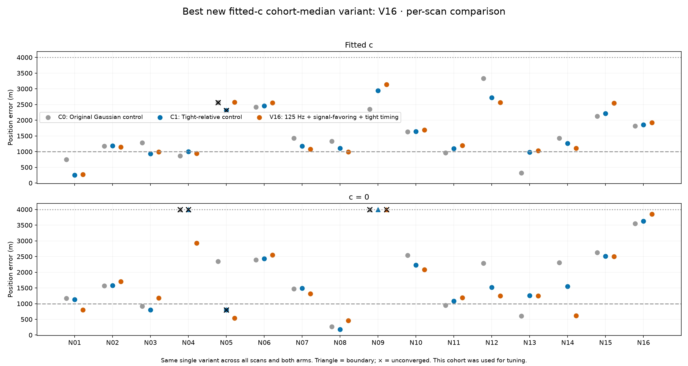

# N01–N16 final-position score: sixteen-variant study

## Executive summary

We evaluated 16 new final-position scoring configurations and two controls on
N01–N16, independently, with matched fitted-`c` and `c = 0` arms: **576 cases**.
V16 achieved the lowest cohort median, but did not consistently improve individual
scans. Retain C1 as the reference; V16 and V12 are candidates for further study,
not established replacements.

With fitted `c`, V16 reduced median position error from **1,225 to 1,167 m (4.8%)**,
but increased mean error from **1,571 to 1,609 m**. Six scans improved and ten
worsened by more than 1 m. Its 16 fitted-`c` results converged, with no boundary
hits. V12 produced five results below 1 km, compared with three for C1.

## Scope and controlled comparison

- Final-position scoring only: no new GLRT refinement, candidate selection,
  greedy/replacement association, or receiver-baseline fit.
- All associated top-one refined candidates from each scan were retained.
  Every fit used the full associated-window input, with no train/test folds.
- All scans were independent. The observations, satellite bank, ephemerides,
  upstream receiver calibration and maximum optimization budgets were matched
  across variants and between RF arms.
- The receiver baseline is inherited from the known-roof upstream calibration.
  The RF ablation concerns the additional coefficient in the final position fit;
  it is not an end-to-end removal of every RF-dependent upstream operation.
- Position searches were restricted to a 4 km disk about the reference roof.
  Common timing remained bounded to ±10 s, total satellite timing to ±20 s,
  receiver slopes to ±50 Hz/s and `c` to ±5,000 Hz/GHz.
- Solutions were selected by their own objective, never by distance to truth.
  Position error was used afterward for evaluation.

This is development on the same cohort used to motivate the experiments, **not
independent validation or a global-minimum certificate**. No new RF was collected.

## Model settings

The C1 reference uses frequency likelihood width `sigma_f = 200 Hz`, detection
budget `D = 0.8` with per-satellite `q = D / |S|`, clutter rate `lambda = 2`, and
zero-centered Gaussian timing priors with common sigma 10 s and relative sigma
1/3 s. These sigmas are prior widths, not hard timing bounds.

`D` is an expected detection-count budget, not a probability itself; `D = 1.6`
is valid here because each per-satellite `D / |S|` is less than one. The sixteen
variants comprise eleven one-at-a-time changes and five interaction experiments.
Unspecified values below equal C1.

| ID | Change from C1 | Median error, fitted c (m) | Median error, c = 0 (m) |
|---|---|---:|---:|
| C0 | Original control: relative timing sigma 1 s | 1,430 | 2,298 |
| C1 | Tight-relative reference | 1,225 | 1,531 |
| V01 | Frequency sigma 75 Hz | 1,902 | 1,350 |
| V02 | Frequency sigma 125 Hz | 1,571 | 1,742 |
| V03 | Frequency sigma 300 Hz | 1,261 | 1,688 |
| V04 | Detection budget 0.2 | 1,181 | 1,325 |
| V05 | Detection budget 1.6 | 1,257 | 1,632 |
| V06 | Clutter rate 0.5 | 1,279 | 1,684 |
| V07 | Clutter rate 8 | 1,182 | 1,326 |
| V08 | Common timing sigma 1 s | 1,238 | 1,563 |
| V09 | Common timing sigma 30 s | 1,225 | 1,531 |
| V10 | Relative timing sigma 0.15 s | 1,481 | 1,665 |
| V11 | Relative timing sigma 0.6 s | 1,407 | 1,820 |
| V12 | Frequency sigma 125 Hz; relative sigma 0.15 s | 1,179 | 1,758 |
| V13 | Frequency sigma 125 Hz; clutter 0.5 | 1,516 | 1,516 |
| V14 | Frequency sigma 125 Hz; clutter 8 | 1,593 | 1,641 |
| V15 | Frequency sigma 300 Hz; relative sigma 0.15 s | 2,011 | 2,119 |
| V16 | Frequency sigma 125 Hz; D 1.6; clutter 0.5; common sigma 3 s; relative sigma 0.15 s | 1,167 | 1,280 |

## Position results

Heatmap numbers are kilometres. Triangles indicate the 4 km search boundary;
crosses indicate unconverged results. Every row uses one common configuration
across all scans, rather than selecting a different winner per scan.

### Interpretation

1. **No broadly dominant winner.** V16 improves median error in both RF arms
   (4.8% fitted `c`, 16.4% `c = 0`), but its fitted-`c` mean worsens and most
   individual scans do not improve. V06 has the lowest fitted-`c` mean among the
   new variants, 1,547 m, only 1.5% below C1, while its median is worse.
2. **Stronger regularization is not uniformly beneficial.** Relative sigma
   0.15 s alone worsens fitted-`c` median error to 1,481 m. Common-timing prior
   changes have relatively little effect within the unchanged hard bounds.
3. **Frequency fit and localization must be separated.** V01 reduces median
   posterior-weighted residual RMS from 98 to 74 Hz, but increases median position
   error from 1,225 to 1,902 m. The effective residual weights also change with
   the likelihood; this is not a fixed-weight RMS improvement.
4. **Detection budget and clutter are partly redundant controls.** V04 and V07
   give nearly identical results. For a single candidate/window, the signal odds
   relative to clutter depend on `q / ((1 - q) * lambda)` at fixed visibility.
5. **Optimization and model bias are distinct.** Both controls were rerun using
   shared starts and stronger polishing. A lower score can correspond to a worse
   position error; differences from older reports are therefore not purely
   hyperparameter effects. See the control restart comparison below.

Raw NLLs should not be compared as localization evidence across different
frequency widths, detection budgets or clutter rates. The tables also retain
original-owner RMS, posterior-weighted RMS, signal posterior and a common-C1
data score evaluated without refitting. These are diagnostics, not alternate
truth-based selection criteria.

## Optimization and verification

Every case started from the same pool of twelve prior solutions, repriced under
its own objective. It received two roof nuisance fits (up to 3 s each), three
joint starts (up to 6 s each), and up to two 15 s Fisher polishing passes. A
second stage shared all 36 initial solutions for each scan, with up to two
additional 15 s polishing passes. Every case then received the same continuation
opportunity: up to 20 s SLSQP and 10 s Fisher, stopping early only on the same
first-order convergence criterion, KKT residual <= 0.001.

Of 576 cases, **535 converged and 41 did not**. There were **33 boundary hits**;
boundary and nonconvergence flags can overlap. Fitted-`c` accounted for nine
unconverged results and three boundary hits; `c = 0` accounted for 32 and 30.
Unconverged/boundary cases remain in the aggregate tables and are explicitly
marked, not silently discarded.

The sweep-specific Fisher implementation uses the configured frequency sigma in
all blocks, including the RF cross terms. Verification included exact agreement
with the legacy controls, 90 real-data numerical gradient checks (maximum
absolute discrepancy 2.86e-5), **53 passing tests**, and reconstruction of every
saved score, metric, input binding and hard constraint. All 576 reconstructions
passed. No case had a worse fitted-`c` objective than its nested `c = 0` result
beyond 1e-4.

## Evidence and next steps

- [Frozen experiment protocol](protocol.json)
- [Aggregate results](polished/summary.csv)
- [All per-scan results](polished/per-scan.csv)
- [Exact settings](polished/variants.csv)
- [Control restart comparison](polished/control-restart-comparison.csv)
- [Reconstruction audit](polished/audit.json)
- [Test results](tests.xml)
- [HTML version with numerical tables](polished/report.html)

Retain C1 as the baseline, carry V16 and V12 forward as comparison candidates,
and investigate changes to observation weighting, robust likelihoods and
receiver nuisance structure. Do not promote a variant solely because it lowers
in-sample residual RMS or wins this cohort's median.
