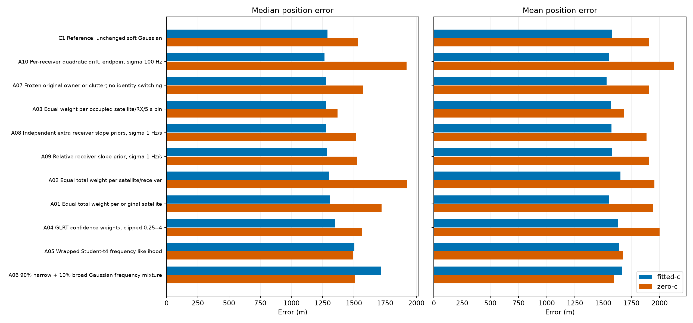
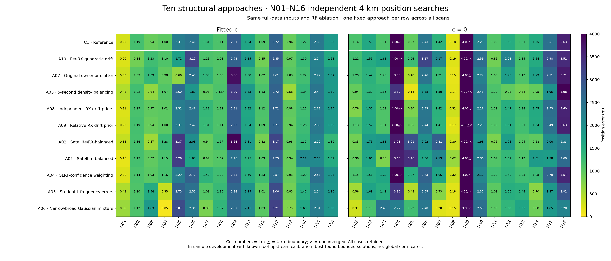

# Ten structural approaches to N01–N16 final-position scoring

## Motivation

The preceding [sixteen-variant hyperparameter study](../position-score-sweep/report.md)
found only modest improvements in median position error, with regressions on many
individual scans. Narrower frequency likelihoods could improve their own weighted
residual RMS while making localization worse. This study therefore tests changes
to the structure of the score, not another sweep of the same scalar widths.

## Predeclared approaches

Every approach changes the C1 reference in one conceptual way. The reference uses
a wrapped Gaussian frequency likelihood with sigma 200 Hz, detection probability
`q = 0.8 / number_of_satellites`, clutter rate 2, common timing sigma 10 s and
relative satellite timing sigma 1/3 s.

| ID | Approach | Hypothesis and precise implementation |
|---|---|---|
| A01 | Satellite-balanced evidence | Dense tracks may dominate. Give every original satellite the same total observation weight: each row gets inverse original-owner window count. |
| A02 | Satellite/receiver-balanced evidence | One receiver's dense track may dominate. Give every observed original-satellite/receiver pair the same total weight. |
| A03 | Temporal-density balancing | Bursts of nearby samples may have disproportionate influence. Give every occupied original-satellite/receiver/5-second bin equal total weight. This is a density-weighting proxy, not an explicit temporal covariance model. |
| A04 | GLRT-confidence weighting | Low-quality windows may distort the score. Weight by saved refined GLRT margin divided by the scan median, clipped to 0.25–4 before normalization. |
| A05 | Heavy-tailed frequency errors | Real residuals may have heavier tails than a Gaussian. Replace the frequency density with a wrapped Student-t distribution, four degrees of freedom, scale `200 / sqrt(2)` Hz, matching the reference's unwrapped variance. |
| A06 | Narrow core plus broad errors | Most windows may be precise while a minority have large errors. Use a wrapped Gaussian mixture: 90% sigma 100 Hz and 10% sigma `sqrt(310000)` Hz. Its unwrapped variance is also 200² Hz². |
| A07 | Freeze original identity | Soft reassignment after position changes may create spurious minima. Permit only each window's original satellite or clutter; retain the existing per-satellite q and physical visibility check. No observations or bank satellites are deleted. |
| A08 | Shrink extra receiver drifts | Final-fit receiver drift may absorb position errors. Add independent zero-centered Gaussian priors, sigma 1 Hz/s, on the extra RX0 and RX1 linear slopes. These are corrections to the saved baseline, not priors asserting zero raw hardware drift. |
| A09 | Couple receiver drifts | The receiver corrections may share a common drift. Penalize their slope difference with a zero-centered sigma 1 Hz/s Gaussian; leave their common component unpenalized. |
| A10 | Model receiver curvature | Some residual curvature may be receiver-wide rather than satellite-specific. Add one quadratic coefficient per RX: `k_rx * ((t - 150) / 150)^2`, sigma 100 Hz, hard coefficient bounds ±500 Hz. At t = 0 or 300 s the coefficient is the frequency correction in Hz. |

All weights are positive and normalized to mean one. Consequently all observations
remain in the fits and total nominal observation weight stays fixed; A01–A04
change relative influence rather than removing rows or globally weakening the
timing prior. Their objectives are weighted/composite likelihoods, not ordinary
unweighted generative likelihoods. Posterior assignment probabilities are reported
without multiplying them by these weights.

## Matched evaluation

- N01–N16 are fitted independently on their full associated top-one refined GLRT
  windows. No train/test folds and no observations removed.
- Frozen full-data upstream receiver calibration, satellite bank and ephemerides.
  No new association search, GLRT refinement, RF collection or calibration fit.
- C1 plus ten new approaches, in fitted-`c` and `c = 0` arms: **352 cases**.
  The RF coefficient is disabled only in the final position fit; the same saved
  upstream baseline remains in both arms.
- Same 4 km search disk, common timing ±10 s, total satellite timing ±20 s,
  slope bounds ±50 Hz/s and RF coefficient bounds ±5,000 Hz/GHz.
- Each configuration gets all 36 preceding polished solutions as shared seeds,
  repriced under its own score. A10 starts its extra terms at zero when transferring
  a seed from an approach without them.
- Two roof nuisance starts, up to 2 s each; three joint starts, up to 5 s each;
  and up to 10 s Fisher polishing. The three starts are the lowest-score shared
  seed, a geographically different shared seed, and the better nuisance-refitted
  roof seed.
- A second stage shares all 22 initial solutions within each scan, then offers
  up to 12 s Fisher and 8 s SLSQP continuation. Early stopping requires the same
  KKT residual <= 0.001. Budgets and seed pools are matched between RF arms.
- Each objective selects its own best solution by score, never by truth distance.
  All results, including boundary hits and unconverged results, enter summaries.

After the shared-start stage, every case was offered an additional convergence-only
pass: up to 25 s SLSQP and 20 s Fisher, stopping early at the same KKT threshold.
This introduced no new starts, data, parameter settings or selection rules. The
initial and shared-start files are preserved; the results below use the `polished`
stage. All cases received the same maximum continuation opportunity.

The single-window specialization was checked against the existing finite-set
likelihood for exact Gaussian score, gradient and Fisher agreement. The robust
likelihoods use wrapped image sums and positive IRLS curvature for optimization;
accepted steps are judged by the actual objective, not its quadratic approximation.

## Limits

This is an in-sample development comparison with known-roof upstream calibration.
It is not blind localization validation, an independent test set, or a guarantee
of globally optimal positions. Fitting on all windows does not eliminate this
selection/calibration dependence. A01–A03 rely on saved original owners, and A07
deliberately conditions on those owners.

Scores across structurally different likelihoods or weights are not directly
comparable. Frequency fit, posterior support, position accuracy, convergence and
boundary hits must be reported separately. A reduced posterior-weighted RMS can
reflect a change of weights or responsibilities, not improved physical accuracy.

## Artifacts

- [Frozen protocol](protocol.json)
- [Numerical self-check](self-check.json)
- [Unit-test results](tests.xml)
- [Aggregate results](polished/summary.csv)
- [All 352 per-scan results](polished/per-scan.csv)
- [Numerical reconstruction audit](polished/audit.json)

## Results

**No clear replacement for the reference emerged.** The lowest fitted-`c` median
was A10, at 1,264 m versus 1,288 m, only 1.9% better. The lowest fitted-`c` mean
was A07, at 1,531 m versus 1,580 m, 3.1% better. These are different approaches;
neither dominates all metrics or both RF arms.

The control is rerun with the new shared starts, so its fitted-`c` median differs
from the preceding study's 1,225 m. More thorough score optimization can move the
answer farther from truth. Compare against the matched control in this table,
not against a mixture of older and newer search results.

All table entries below are metres; lower is better. Every aggregate contains the
same sixteen scans, including flagged results.

| ID | Approach | Median, fitted c | Mean, fitted c | Median, c = 0 | Mean, c = 0 |
|---|---|---:|---:|---:|---:|
| C1 | Reference | 1,288 | 1,580 | 1,531 | 1,910 |
| A01 | Equal satellite weight | 1,311 | 1,555 | 1,721 | 1,943 |
| A02 | Equal satellite/receiver weight | 1,300 | 1,655 | 1,924 | 1,956 |
| A03 | 5-second temporal-density weighting | 1,277 | 1,570 | 1,368 | 1,686 |
| A04 | GLRT-confidence weighting | 1,347 | 1,629 | 1,565 | 2,001 |
| A05 | Student-t frequency errors | 1,505 | 1,639 | 1,494 | 1,675 |
| A06 | Narrow/broad Gaussian mixture | 1,717 | 1,668 | 1,508 | 1,595 |
| A07 | Original owner or clutter | 1,275 | 1,531 | 1,575 | 1,909 |
| A08 | Independent receiver drift priors | 1,277 | 1,575 | 1,517 | 1,885 |
| A09 | Relative receiver drift prior | 1,282 | 1,579 | 1,524 | 1,905 |
| A10 | Per-receiver quadratic drift | 1,264 | 1,551 | 1,922 | 2,129 |

### What we learned

1. **Temporal-density weighting is promising for the c = 0 arm.** A03 reduces
   median error by 10.6% and mean error by 11.7%, with six scans below 1 km instead
   of two. All six sub-kilometre results converged. It improves ten scans and
   worsens five by more than 1 m; one is essentially unchanged. With fitted `c`,
   however, it improves only five scans and worsens eleven despite slightly
   better aggregate median/mean. This is not yet a universal improvement.
2. **Robust frequency errors interact strongly with RF calibration.** A06 with
   `c = 0` lowers mean error by 16.5%, improves twelve of sixteen scans, and reduces
   the 90th-percentile error from 3,815 to 2,493 m. It has no boundary hits, although
   its N09 result remains just above the convergence tolerance. With fitted `c`,
   the same approach worsens median error from 1,288 to 1,717 m. Its median
   posterior-weighted RMS falls from 98.0 to 93.8 Hz in that arm: better conditional
   frequency fit is again not evidence of better localization.
3. **Fixed identities help some cases but are not a general solution.** A07
   improves fitted-`c` N05 from about 2,310 to 664 m, but worsens N09 from about
   2,807 to 3,856 m. Across fitted-`c` scans it improves ten and worsens six.
   This does not prove either the original owners or the soft replacements are
   generally correct.
4. **Simple receiver drift shrinkage changes little.** A08 and A09 produce small
   aggregate differences at the tested widths. Adding receiver quadratic terms
   gives the smallest fitted-`c` median, but only by 24 m, and substantially worsens
   the `c = 0` arm. It does not explain away the observed position bias.
5. **GLRT score is not automatically a useful localization weight.** The simple
   clipped confidence weighting in A04 worsens mean and median error in both
   arms. This rejects this weighting rule, not every use of GLRT quality.

### Numerical reliability

**340/352 cases converged; 12 did not.** Eleven unconverged cases are in the
`c = 0` arm on N04 or N09. The other is fitted-`c` A03 on N08. **15 cases hit the
4 km boundary**, all in the `c = 0` arm. Boundary and convergence flags are
separate, and both are visible in the heatmap/CSV.

All 352 cases passed reconstruction of input bindings, weights, score, metrics,
stationarity and hard constraints. The continuation's source checksums and
matched budgets were also verified. The implementation passed **70 tests** and
**180 real-data numerical derivative checks**, with maximum absolute gradient
discrepancy 4.77e-4. Gaussian control score, gradient and Fisher curvature match
the preceding implementation. In every case the fitted-`c` best score was no
worse than the corresponding nested `c = 0` score beyond 1e-4; this is a search
sanity check, not evidence that fitted `c` always localizes better.

### Recommendation

Keep C1 as the reference. Investigate **A03's temporal weighting** and **A06's
interaction with `c`** next, using the per-scan comparisons rather than selecting
a different model for each known answer. Use A07 as an identity-sensitivity
diagnostic. None of these results establishes an end-to-end unbiased localization
model or justifies silently replacing the baseline.
