# T1-AT v1: A, B and N01–N16

Completed 18-scan association and independent localization comparison. Results snapshot: **2026-10-04 23:43:14 UTC**. [HTML version](cohort-results.html).

All 18 association reruns and all **252 position/filter cases** are complete. Each nonempty case has matched fitted-`c` and `c = 0` position-search arms. Empty subsets are explicit, not zero-error solutions.

## Summary

- Historical A/B association coverage is reproduced: **94.97% for A and 96.06% for B** with fitted `c`.
- Across the 16 additional scans, window-weighted fitted-`c` coverage rises from **80.01% to 87.85%**; `c = 0` coverage rises from **77.09% to 87.55%**. This is not a uniform improvement on every scan.
- Better association coverage does **not** establish better localization or correct satellite identity. Position results remain sensitive to retained observations, RF calibration, and local optimizer basins.
- Of 504 position-search arm rows, 26 are empty-subset rows. Of the 478 nonempty fits, 407 converge and 71 do not; 241 reach the search boundary. Boundary and convergence flags are separate and can overlap.
- Direct reconstruction of the saved roof/best scores passes for all 252 cases, with maximum discrepancy **0.0**. See the [score and membership audit](cohort-audit.json).

## 1. Observations and association coverage

T1-AT v1 uses one highest-refined-margin candidate per passing **20 ms receiver/channel window**, followed by greedy satellite selection and replacement. Coverage counts assigned windows, not every alternative acquisition hypothesis in each window.

A/B replay the historical frozen pools exactly. The N scans reuse saved orbit-blind refinement and qualified saved receiver calibration, restoring absolute satellite timing and top-only discovery together. This is **not** an isolated timing-only causal ablation, a new IQ refinement run, or held-out identity validation.

A is the original **10 MS/s** reference; B and N01–N16 are **2.5 MS/s**. The additional scans use the recorded **40° fixture separation**. Full scan IDs, capture times, sample rates, previous coverage, and current coverage are in the [coverage CSV](cohort-coverage.csv).

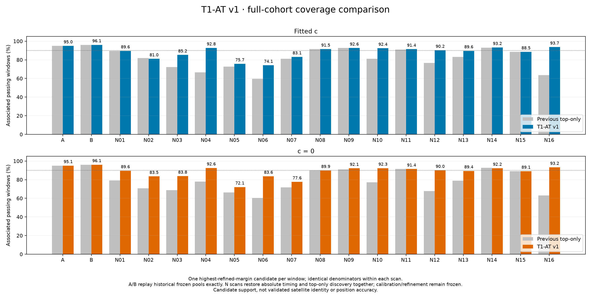

`Δ pp` is the change from the saved preceding result, in percentage points. RMS is an in-sample frequency-fit diagnostic, not position error. The association arms can select different satellites/windows; the subsequent localization ablation explicitly holds its observations and candidate bank matched.

| Scan | Windows | Fitted c assigned | Δ pp | Satellites | RMS (Hz) | c = 0 assigned | Δ pp | Satellites | RMS (Hz) |
| --- | ---: | ---: | ---: | ---: | ---: | ---: | ---: | ---: | ---: |
| A | 3837 | 3644 (94.97%) | +0.00 | 33 | 146.4 | 3648 (95.07%) | +0.00 | 33 | 214.6 |
| B | 3602 | 3460 (96.06%) | +0.00 | 32 | 90.5 | 3460 (96.06%) | +0.00 | 32 | 179.7 |
| N01 | 2728 | 2444 (89.59%) | +0.04 | 30 | 98.0 | 2444 (89.59%) | +10.45 | 30 | 180.5 |
| N02 | 2239 | 1814 (81.02%) | -0.76 | 27 | 184.6 | 1870 (83.52%) | +12.77 | 28 | 225.4 |
| N03 | 2547 | 2170 (85.20%) | +12.96 | 30 | 138.0 | 2134 (83.78%) | +15.16 | 30 | 229.6 |
| N04 | 3428 | 3181 (92.79%) | +26.23 | 29 | 113.6 | 3174 (92.59%) | +14.76 | 30 | 235.7 |
| N05 | 3542 | 2681 (75.69%) | +3.05 | 50 | 256.3 | 2553 (72.08%) | +5.90 | 49 | 274.4 |
| N06 | 2842 | 2106 (74.10%) | +14.43 | 31 | 207.3 | 2377 (83.64%) | +23.40 | 23 | 206.8 |
| N07 | 3296 | 2740 (83.13%) | +2.00 | 38 | 241.4 | 2558 (77.61%) | +5.92 | 40 | 241.6 |
| N08 | 3069 | 2808 (91.50%) | -0.10 | 25 | 107.3 | 2758 (89.87%) | -0.20 | 24 | 220.8 |
| N09 | 3416 | 3164 (92.62%) | +0.00 | 28 | 135.2 | 3147 (92.13%) | +1.02 | 29 | 204.7 |
| N10 | 3045 | 2814 (92.41%) | +11.20 | 30 | 139.4 | 2812 (92.35%) | +15.30 | 30 | 156.2 |
| N11 | 3027 | 2766 (91.38%) | +0.36 | 27 | 105.2 | 2766 (91.38%) | +0.00 | 27 | 105.3 |
| N12 | 3065 | 2765 (90.21%) | +13.47 | 27 | 109.3 | 2758 (89.98%) | +22.28 | 27 | 162.8 |
| N13 | 2636 | 2363 (89.64%) | +6.60 | 32 | 151.2 | 2356 (89.38%) | +10.43 | 32 | 163.2 |
| N14 | 2722 | 2538 (93.24%) | +0.26 | 32 | 109.5 | 2511 (92.25%) | -0.51 | 33 | 221.3 |
| N15 | 2103 | 1862 (88.54%) | -0.05 | 21 | 117.5 | 1873 (89.06%) | +0.05 | 22 | 181.3 |
| N16 | 3070 | 2876 (93.68%) | +30.23 | 27 | 114.7 | 2862 (93.22%) | +30.10 | 28 | 228.5 |

## 2. Independent position searches

Each scan is fitted **independently within a 2 km disk** around the known roof. No joint A/B or joint-cohort location is estimated.

The roof supplies the reference and frozen rankings. Fitted-`c` assignments select the included windows and candidate bank **for both RF arms**. The discrete T1-AT selector is not rerun during position searches. However, the finite-set likelihood still marginalizes over the fixed satellite bank, so its soft association probabilities can change. This is **not a fixed-owner least-squares objective**.

The saved receiver baseline is shared between arms. Additional receiver offsets/drifts and satellite timing are refitted; `c` is either fitted or fixed to zero. Other priors, observations, candidate sets, and bounded search budgets are matched. Three starts are used; the returned positions are **best found, not globally certified minima**.

Each scan has 14 named cases:

- All assigned windows (100%).
- Top 25%, 50%, and 75% by lowest satellite RMS, most windows per satellite, or highest window GLRT score (nine cases).
- Four cumulative satellite-level roof RMS cuts: ≤50, ≤100, ≤300, and ≤600 Hz.

Satellite rankings retain a fraction of satellites; GLRT ranking retains a fraction of assigned windows. These are not equivalent sample sizes. The RMS cuts do not change the **600 Hz association gate** or the GLRT activity threshold. All RMS and position comparisons here are **in-sample diagnostics**.

### Reading the figures

| Marker | Meaning |
| --- | --- |
| Triangle | Best-found point reaches the 2 km search boundary; this does not locate an unconstrained minimum. |
| Star | Search ambiguity / multiple competing local results. |
| X | Unconverged fit. |
| ‡ | Roof profile used for RMS rankings/cuts is unconverged; selection is provisional. |
| † | An identical-input archived solution has a better score than this bounded rerun. |

Roof profiles remain unconverged for **B, N05, N06, and N07**. Their RMS-derived selections are provisional even if a subsequent position search converges. Thirteen case subsets are empty; those have no fitted position, not zero error. Saved results are retained rather than silently repaired.

### Disjoint RMS strata

These distributions use **disjoint** bins: ≤50, 50–100, 100–300, 300–600, and >600 Hz. They differ from the cumulative threshold experiments below. The figure distinguishes satellite counts from assigned-window counts.

RMS is evaluated against the original T1-AT owner after the full soft profile. It can exceed the original association gate because the soft profile may favor a different satellite or clutter explanation.

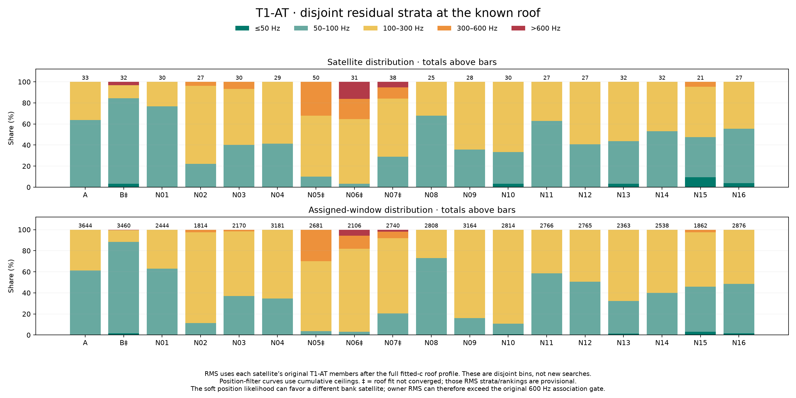

[Per-satellite strata and window counts](cohort-rms-strata.csv).

### Search reproducibility and the earlier A/B chart

The archived A/B chart is not overwritten. For **34 comparable case/arm pairs**, evaluating the archived vectors on the new objective reproduces their stored scores within **10⁻⁷**. In **seven pairs**, the archived solution has a lower score than this bounded rerun. These reflect different local basins, not changed scoring or coverage.

For B at 100%, the fitted-`c` score is **43,261.36** here versus the archived **43,250.92**; the distances are about **1,142 m** and **1,129 m**, respectively. A lower score is not necessarily a lower position error.

B's three RMS-ranked subsets differ from the archive because the new roof fit changes the RMS ranking. Those six RF-arm cases are not identical-input optimizer comparisons. Assignment coverage itself is unchanged.

[Direct cross-evaluation audit](historical-position-audit.json) · [Earlier A/B reference with N01/N02 additions](subset-position-AB-N01-N02.png) · [All 504 position/filter arm rows](cohort-positions.csv).

### Subset comparisons

#### A, B, N01

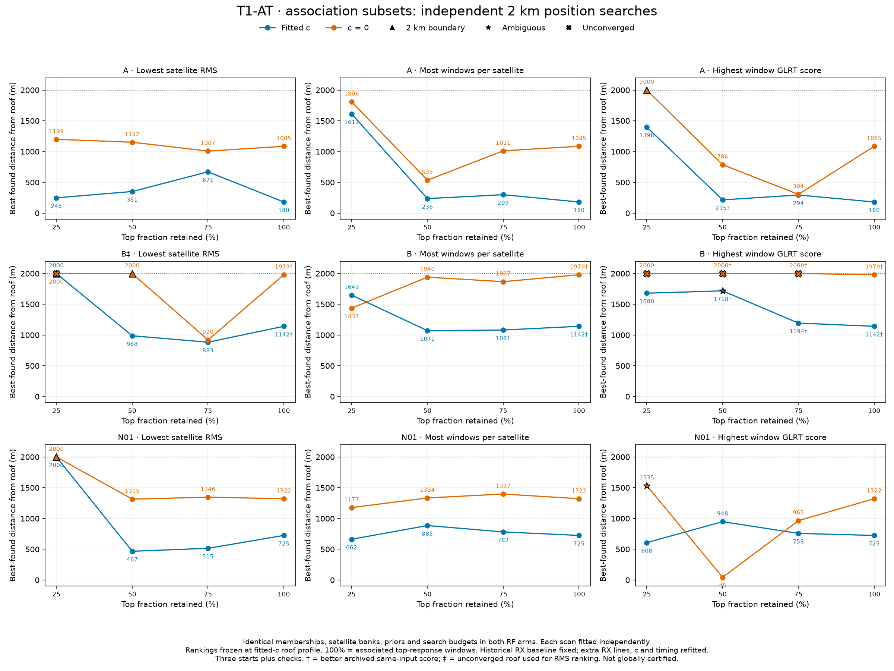

#### N02, N03, N04

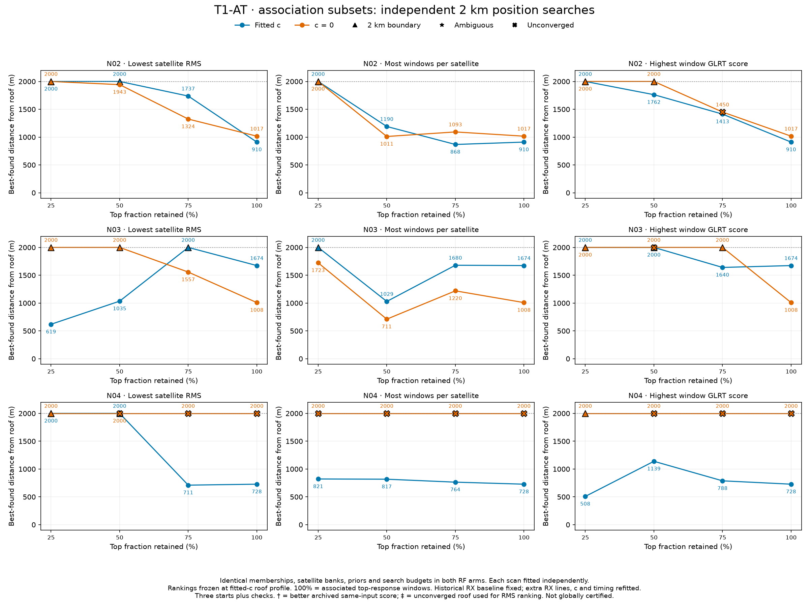

#### N05, N06, N07

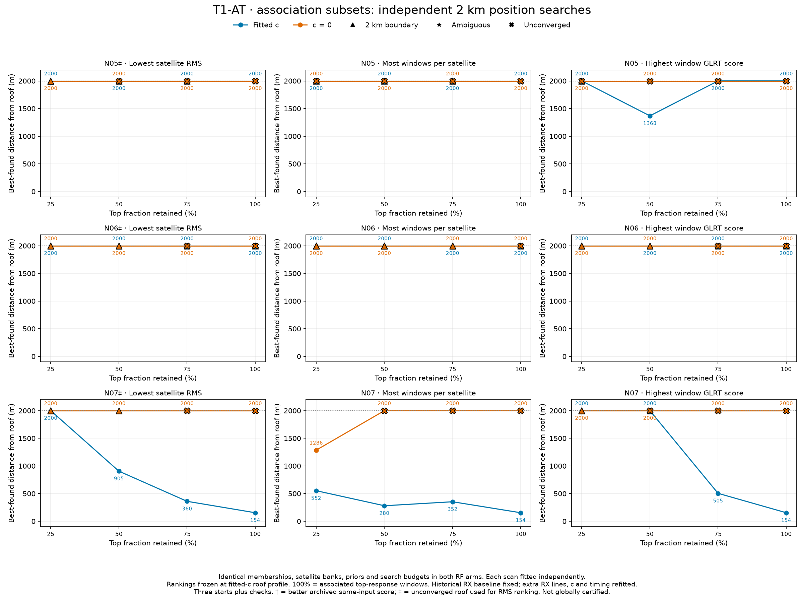

#### N08, N09, N10

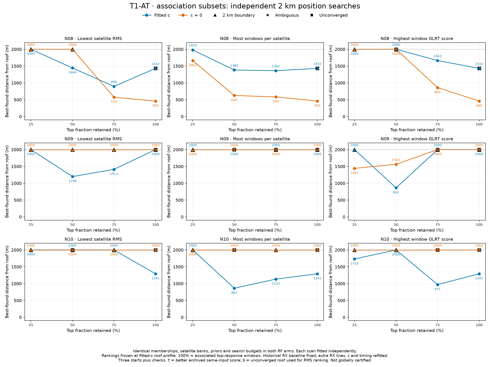

#### N11, N12, N13

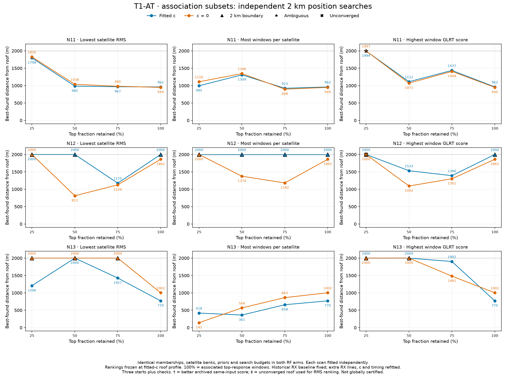

#### N14, N15, N16

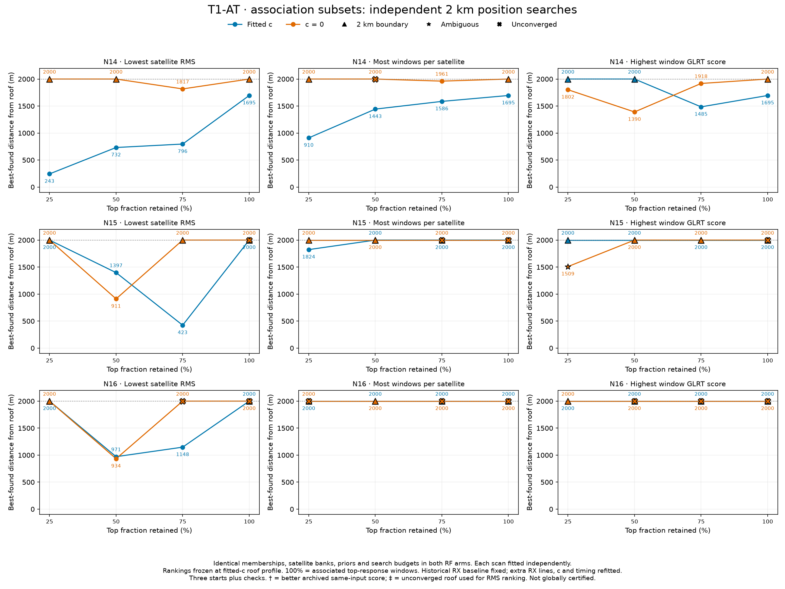

### Cumulative RMS threshold comparisons

#### A, B, N01–N04

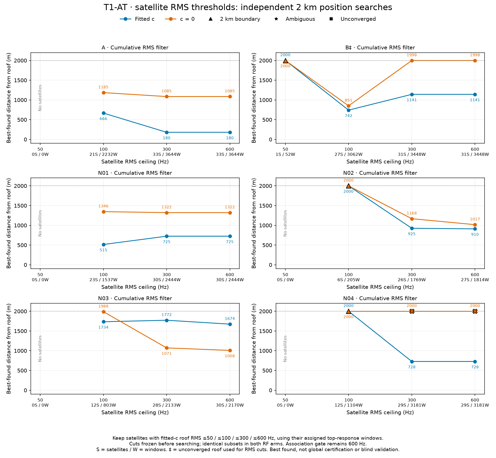

#### N05–N10

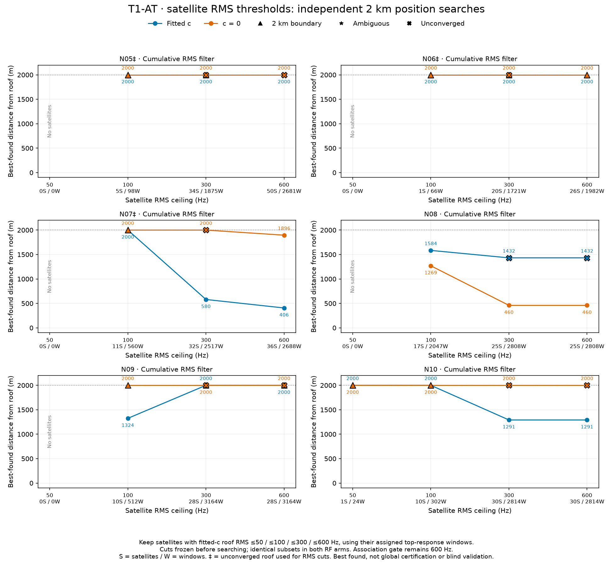

#### N11–N16

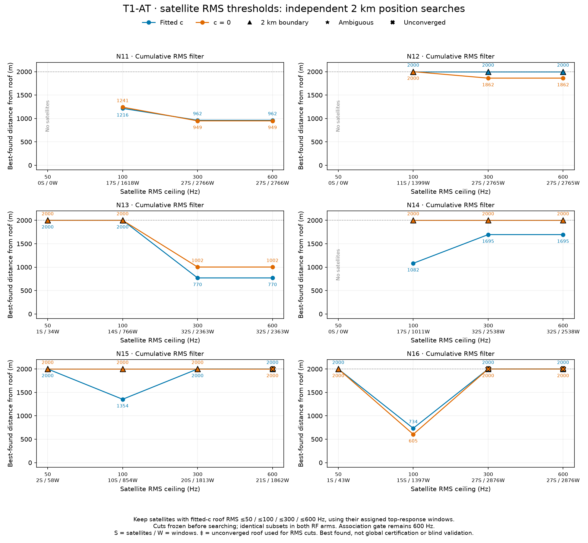

## 3. Adaptive analysis integration

The implementation described here is committed **locally** as `2fcacc87d` on `codex/t1-at-adaptive-analysis`. **Publishing this report does not push or deploy that implementation.** The following describes the tested opt-in integration, not the default behavior of remote `main`.

The optional `--t1-at-discovery-input` stage accepts qualified orbit-blind refinement, frozen receiver/RF calibration, and a full near-visible orbit bank. Runtime code selects the top response, discovers absolute **±20 s** timing hypotheses across that bank, then runs greedy + replacement with both RF arms. It does not depend on archived report scripts.

The alternative `--t1-at-input` accepts an already prepared matched timing-mode pool. Neither option silently creates calibration or recollects RF data. Outputs bind capture, analysis, and prepared-input digests, use an immutable T1-AT namespace, and cache exact inputs. Timeouts are partial, never published as completed solutions. Input probe stride follows the requested analysis product. Existing default analysis remains unchanged unless a T1-AT input is supplied.

### Numerical verification

- Selection exactly matches both archived RF arms for all 18 scans: **36 comparisons**.
- Fresh full-bank runtime discovery reproduces all 16 N scans in both arms: **32 comparisons**, with exact assigned-window sets and satellite IDs and residual agreement within **10⁻⁶ Hz**.
- Sampled calibrated predictions and timing derivatives agree within the tested **10⁻⁷ Hz** tolerance; maximum frequency discrepancy is approximately **6 × 10⁻¹¹ Hz**.
- The standard adaptive CLI was exercised on the existing N01 capture/analysis.
- **78 component/regression tests** and **six research-runner tests** pass.

[36-arm selection parity](production-core-parity.json) · [32-arm runtime discovery verification](discovery-pipeline-results.json) · [Current score/membership audit](cohort-audit.json).

### Opt-in invocation

This example requires the **local integration branch environment and qualified local evidence**, not just this report package:

```bash
python -m leo.cli.adaptive_hop_analysis \
  --bulk-root /srv/bulk/leo \
  --session-id scan-fw-0c4c127b1f80a01b \
  --probe-stride-ms 120 --metrics-only \
  --t1-at-discovery-input /srv/bulk/leo/t1-at-v1-replication-20261004/discovery-pipeline/N01/input.json \
  --t1-at-maximum-seconds 600
```

Inputs must bind the same capture and analysis manifests. The example uses already-qualified N01 evidence, not a template to relabel as another scan. T1-AT is an explicit opt-in stage, not an automatic calibration/refinement replacement.

## 4. Publication scope and limitations

This report package includes the Markdown and HTML reports, figures, result tables, and numerical audit receipts. Raw recordings, large prediction banks, local research dependencies, and the separately committed integration implementation are **not bundled**. Local paths in audit receipts identify provenance; they are not portable download links.

No new RF recording or fitting was performed to convert and publish this report. These are the completed saved results, with boundary hits, optimizer failures, historical differences, and provisional rankings disclosed. Coverage is evidence of consistency under the specified association model, **not proof of satellite identity or unbiased localization**.
