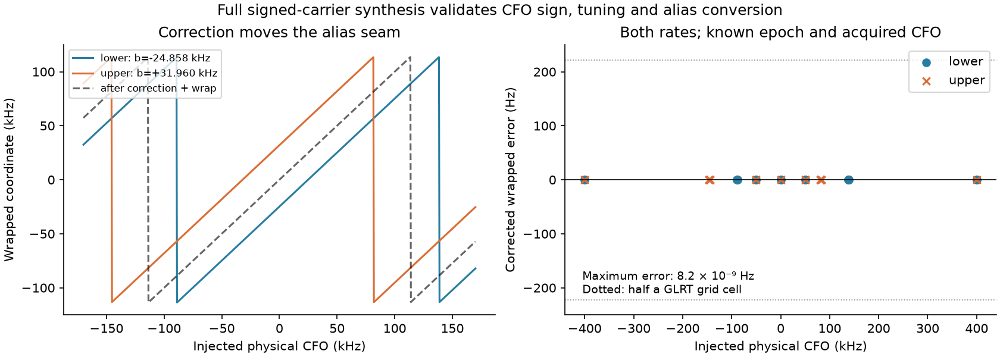
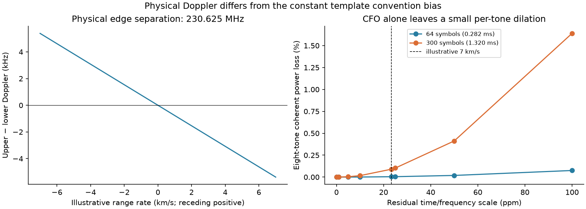
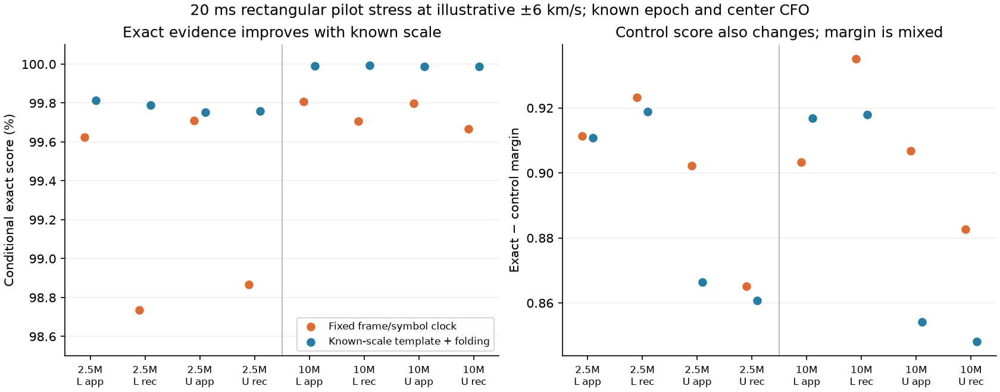
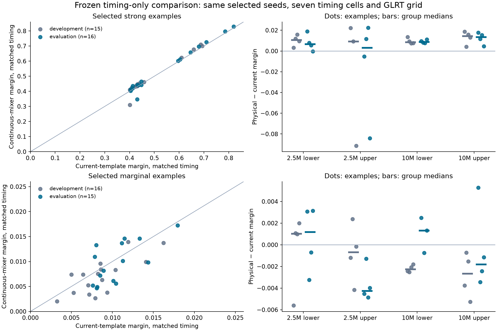
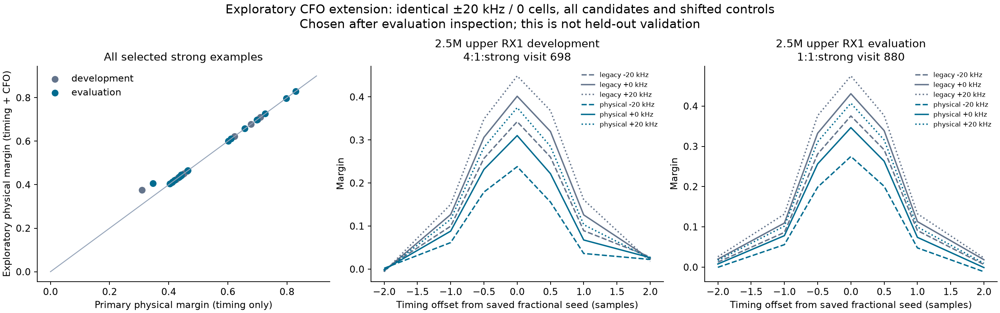
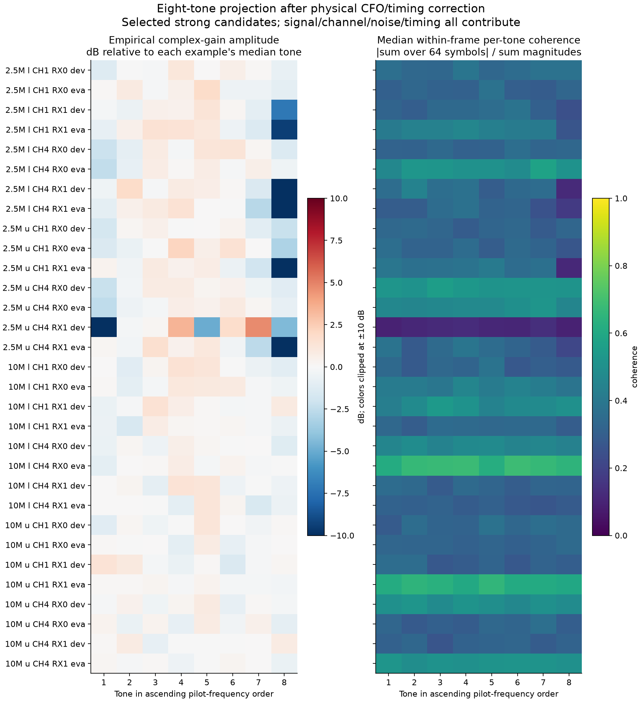
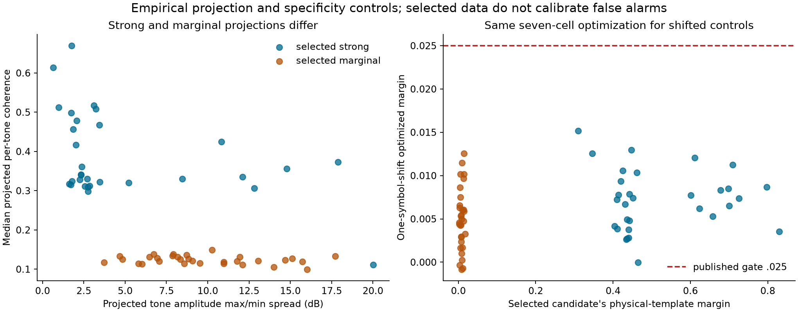

# Upper/lower edge debugging: acquisition, frequency coordinates, and Doppler

Analysis date: **2026-10-06**. Follow-up to the
[128-scan rate and edge review](../2026_10_06_rate64_edge_review/README.md).
Three Sol agents investigated independent frequency synthesis, paired bandwidth
replay, and waveform coherence in parallel; a coordinating agent reviewed and
joined the evidence. The scientific source is the same deployed snapshot,
`/opt/leo-adaptive-memory/9181d637d/src`.

**The strongest new finding is a reproducible acquisition failure: four RX1
probes fail after fresh acquisition at digitally restricted 2.5 MS/s, yet all
four pass on that same filtered IQ when supplied candidate seeds found at
10 MS/s.** Filtering reduces their margins, but useful evidence survives.
Candidate selection and refinement deserve direct investigation before a
production template or threshold change.

| Question | New evidence | Decision supported |
|---|---|---|
| Is the edge CFO convention real? | Independently decoded full-carrier synthesis reproduces −24.858 kHz lower / +31.960 kHz upper, including tuning and alias seams. | Make physical frequency conversion explicit; retain raw detector coordinates and branch information. |
| Does narrow capture remove all useful RX1 evidence? | All four filtered RX1 acquisition misses pass with transported high-rate seeds. | Trace acquisition basins, retention, and refinement; a missing seed is distinct from absent conditioned evidence. |
| Does a wider search always help? | One score-blind evaluation probe fails with a broad eight-candidate search and passes with a narrower eight-candidate search. | Inspect candidate competition under a fixed budget. |
| Is the physical template a demonstrated yield fix? | Timing-only gains largely disappear when both templates receive the same exploratory CFO refinement budget. | Keep the current detector pending an independent end-to-end qualification. |
| Are the physical Doppler shifts equal across edges? | Their RF centers differ by 230.625 MHz; upper Doppler magnitude and slope are about 2% greater for the same source and geometry. | Predict with each physical pilot RF, separating time-dependent Doppler from constant template and tuning terms. |

These are bounded diagnostic experiments, not a new cohort-wide detection-rate,
false-alarm, satellite-identification, or localization benchmark.

## 1. Frozen inputs and reproduction

[experiment-spec.json](data/experiment-spec.json) fixes eight scans and **62
published candidate examples**, spanning both rates, both edges, both receivers,
and CH1/CH4. The four original replay scans are development; a deterministic
hash-selected different scan in each rate/edge group is evaluation. Each scan's
examples are its first strong and marginal published winners after 60 seconds.
There are 31 examples in each split. Strong and marginal selection is deliberate;
this set cannot estimate an unbiased detection yield.

The split is at whole-scan level. However, all eight scans came from the original
report's inspected cohort. “Evaluation” here means separate scans for the frozen
follow-up procedures, not a previously unseen deployment or population.

All 62 fractional margins reproduce within `1e−7`. The coherence investigation
also reproduces integer/fractional exact and control scores and CFO fields;
its maximum discrepancy is **3.33e−16**. Readers validate sealed IQ hashes.
Actual visit indices are mapped to retained-reader indices, and original device
counters are asserted. The original report's 19 frozen artifact checksums pass.

The acquisition experiment adds **eight score-blind 20 ms probes** from a
hash-selected retained visit in each of the four high-rate scans, at 60–80 ms
within the visit, on both receivers. Lower uses CH1 and upper uses CH4; channel
and edge are consequently confounded in this small experiment. Four deterministic
Gaussian probes supply matched acquisition controls. These controls are too few
and too idealized to calibrate operational false alarms.

Initial grids, filters, and controls were fixed before evaluation IQ was loaded.
Later CFO and seed-transport checks are labeled **exploratory**. They explain
failures and must be tested on new independent dwells before qualifying a change.

## 2. Physical CFO, aliases, and expected Doppler



The independent synthesizer decodes the published Appendix-A pilot integers,
constructs full signed-channel carriers, and then continuously mixes to the
pilot center. It uses no production waveform generator. The model confirms:

| Edge | Template-coordinate bias at zero physical CFO |
|---|---:|
| Lower | −24,857.954545 Hz |
| Upper | +31,960.227273 Hz |
| Upper minus lower | **+56,818.181818 Hz** |

The 108-case sweep includes both rates, both edges, displaced tuner centers,
positive/negative CFO, and points around alias seams. In the 36 true-seeded cases,
the corrected wrapped physical CFO agrees within **8.2e−9 Hz**. The physical
template has exact score 1 in this noiseless ideal model. This independently
verifies the coordinate relationship under the stated waveform convention;
it does not independently establish every phase/filter detail of transmitted RF.

For presentation, remove nominal tuning and the edge bias before choosing the
physical alias and RF normalization:

```text
P = 1 / 4.4 µs = 227272.727273 Hz
physical_wrapped = wrap(raw_detector_CFO − nominal_pilot_baseband − b_edge, P)
physical_unwrapped = physical_wrapped + justified_physical_alias_lift × P
RF_normalized_CFO = physical_unwrapped × reference_RF / physical_pilot_RF
```

Subtracting the bias from an already wrapped CFO requires another wrap. The
physical alias lift can differ from the template-coordinate lift. Wrapped CFO
alone cannot restore the absolute frequency, and converted CFO still contains
receiver/transmitter oscillator contributions.

The other 72 synthetic cases deliberately move the acquisition seed by ±P.
Their exact scores fall to 0.0648–0.1442 and corrected wrapped errors can reach
99.876 kHz. **Symbol-rate phase aliases are not interchangeable full-waveform
acquisition seeds.** Within-symbol coherence carries additional branch evidence.
This is a reason to preserve the seed, branch, and score together.

### Physical upper/lower Doppler has the same sign and different magnitude



With range rate positive for recession:

```text
Doppler_edge = −RF_edge × range_rate / 299792458
Doppler_upper − Doppler_lower = −230625000 × range_rate / 299792458
```

For the same source at the same instant, both edges shift positive on approach
and negative on recession. At illustrative ±7 km/s, their difference is
∓5.385 kHz. Upper/lower Doppler and slope ratios are **1.021534 on CH1** and
**1.020125 on CH4**. Illustrative range acceleration 100 m/s² gives a differential
slope of −76.928 Hz/s. These are calculated examples, not estimated velocities
or accelerations for these recordings.

The physical difference varies through a pass; the convention difference
56.818 kHz is constant. Separate scans with different source mixtures cannot
measure this small physical difference as if they were simultaneous observations
of one satellite. The earlier report's remaining aggregate 1–3 kHz edge
displacements therefore do not establish an RF calibration or satellite match.

### The orbital path already scales by RF, with a small center distinction

The source audit finds `actual_rf_hz = target.rf_center_hz − actual_if_offset_hz`.
Trajectory construction carries this effective tuner RF center and raw tracking
CFO; tracking scales both CFO and alias spacing to 11.2 GHz before orbital
prediction. Thus most of the physical upper/lower frequency scaling is already
represented. At 10 MS/s, tuner and pilot centers still differ by ±312.5 kHz.
That distinction corresponds to about **7.30 Hz** at illustrative 7 km/s and
**0.104 Hz/s** at illustrative 100 m/s².

Tuning and template-bias constants currently enter the normalization too.
An offset-only fit can absorb a constant within a fixed lane. Physical reporting
should remove those terms first; improved frequency labels alone do not imply
better orbital fit or position accuracy.

### Doppler dilation must distinguish tone phase from frame timing

Removing common edge-center CFO leaves a tone-dependent residual. At
illustrative 7 km/s (23.35 ppm), the outer pilot has residual ±19.154 Hz.
The ideal equal-amplitude tone calculation gives coherent power loss **0.00410%**
over GLRT-64's 0.2816 ms and **0.0901%** over 300 symbols (1.32 ms).
Those tone-only losses are small; the calculation excludes code-transition
timing, filtering, noise, and accumulation over the full probe.

The source folds frames at fixed `sample_rate / 750`, so timing dilation across
multiple frames requires its own check.



A separate 12-case noiseless repeated-waveform stress uses illustrative
−6, 0, and +6 km/s at both rates and edges. At ±6 km/s, timing accumulates
**400.277 ns across 20 ms**, or 1.001 samples at 2.5 MS/s and 4.003 at 10 MS/s.
An oracle supplied the injected scale changes the physical template, symbol
duration, and frame-folding rate together. It improves exact scores by
**0.044–1.054 percentage points** in the eight nonzero-scale cases, while margin
changes remain mixed because controls change too. The common CFO estimate is
unchanged. Ideal sharp symbol transitions, known initial epoch, and missing
analog/source-clock effects make this a stress test, not attribution of the
recorded deficit. Tone phase and accumulating frame timing are distinct effects.
See the
[frequency investigation](frequency/findings.md) and its
[complete frozen results](frequency/results.json) for the independent sweep,
RF-path audit, timing-scale experiments, and their model limits.

## 3. Separate search support, filtering, and acquisition


The paired experiment starts with the same high-rate IQ, mixes the nominal pilot
position to DC, applies a frozen 321-tap Kaiser FIR (β=8.6, cutoff 1.125 MHz), and
decimates by four. FIR group delay is compensated. Epoch plus fractional timing
is divided by four; acquired CFO has nominal tuning subtracted. Frame support
is checked across the transformation.

The mathematical 2.5 MS/s tone-center search limit is ±429,687.5 Hz. It is not
a flat analog passband. Search eligibility and the FIR's measured per-tone
response are recorded separately. Among the 31 high-rate selected examples,
10 acquired seeds lie outside that mathematical search interval. All **16 strong
examples still pass** when scored on filtered IQ with their transported seeds;
all 15 selected marginal examples remain below the gate. Median strong margin
changes are −0.05632 development and −0.05326 evaluation. These are fixed-seed
diagnostics, including seeds a native narrow search would not necessarily supply.

### Fresh acquisition reveals missing candidates


For the eight score-blind probes, the three frozen treatments use eight retained
candidates, equal physical timing separation, and identical 20 ms support:

| Split | Probes | 10 MS/s search ±800 kHz | Same IQ, search ±400 kHz | Filtered 2.5 MS/s, search ±400 kHz |
|---|---:|---:|---:|---:|
| Development | 4 | 4 pass | 4 pass | 2 pass |
| Evaluation | 4 | 3 pass | 4 pass | 2 pass |

The conservative ±400 kHz domain preserves the 80 kHz coarse grid as an exact
subset of the broad grid. It is intentionally smaller than the tone-center
geometry cap. Every retained candidate has **14 supported frames**.
The four Gaussian null probes fail all three treatments; the separate 31
fixed-seed Gaussian controls also fail both scoring treatments. This supports
basic specificity in these cases, not a calibrated false-alarm probability.

All four RX0 probes pass fresh filtered acquisition; all four RX1 probes fail.
An exploratory check transports each narrow-search high-rate winner into the
same filtered IQ, without changing its physical epoch or CFO:

| RX1 probe | Fresh low-rate acquisition margin | Transported high-rate seed margin |
|---|---:|---:|
| Development lower / CH1 | 0.00808 | 0.0899 |
| Evaluation lower / CH1 | 0.01114 | 0.1695 |
| Development upper / CH4 | 0.00441 | 0.2615 |
| Evaluation upper / CH4 | 0.01103 | 0.1113 |

The gate is 0.025. These cases demonstrate that useful conditioned evidence
survives the digital bandwidth restriction and is missed by fresh acquisition.
They do not show that filtering is harmless, or identify the exact acquisition
stage responsible.

The evaluation upper/RX1 probe also demonstrates candidate competition:
broad-search strongest margin **0.001775** at acquired residual −538.0 kHz;
narrow-search strongest margin **0.157051** at +374.6 kHz. The budget remains
eight. Merely adding search support need not improve a bounded candidate list.

### A larger retention budget rescues two of the four misses


An exploratory post hoc rerun changes only the coarse-basin retention budget
from eight to 16 and 32 on those four filtered RX1 probes. Budget 16 recovers
evaluation lower (margin 0.16924) and development upper (0.26104); 32 recovers
no additional cases. Development lower and evaluation upper remain below the
gate at 0.01045 and 0.01215, despite their passing transported seeds. All eight
matched Gaussian-null runs at the expanded budgets fail the gate.

This isolates retention as a contributor in two cases and shows that a budget
increase alone is insufficient in the other two. The next trace should follow
their coarse timing/CFO basins and fine refinement. These post hoc cases do
not qualify a production budget increase.

All per-probe configurations, scores, hashes, and controls are in the
[coverage investigation](coverage/findings.md),
[fixed-seed results](coverage/bandwidth-results.json), and
[fresh-acquisition results](coverage/reacquisition-results.json). The exploratory
[seed transport](coverage/transport-results.json) and
[retention-budget results](coverage/budget-results.json) retain all trials.

## 4. Compare templates with matched refinement



The primary comparison uses the same published candidate, IQ, frame inventory,
and seven timing offsets for both templates: −2, −1, −0.5, 0, +0.5, +1, +2
samples about the saved fractional epoch. It subtracts the edge bias for the
physical-template frequency seed and retains the existing 512-cell GLRT
frequency estimation. Epoch acquisition and an additional acquired-CFO search
are not part of this primary comparison.

The timing grid is centered on a saved current-template seed and four physical
winners reach its boundary; this is a bounded local comparison rather than a
claim that either template has globally optimal timing.

| Evaluation examples | Count | Median physical-minus-current margin | Mean change | Positive changes |
|---|---:|---:|---:|---:|
| Strong | 16 | +0.008793 | +0.003887 | 13 |
| Marginal | 15 | −0.001162 | −0.000737 | 5 |

Two upper/RX1 strong examples at 2.5 MS/s lose approximately 0.0914 development
and 0.0842 evaluation. Their saved residual CFOs sit near opposite symbol-rate
Nyquist boundaries. This prompted a separate exploratory frequency test.

### Additional CFO refinement removes most of the apparent advantage



After inspecting the primary evaluation, both templates receive the same
additional three-cell acquired-CFO grid: −20, 0, +20 kHz, combined with
the same timing grid. This is an **exploratory** extension, not a new untouched
evaluation. All 62 examples and matched symbol-shift controls are evaluated.

The strong evaluation median difference shrinks to **+0.000585**, with mean
**−0.003198**. Current-template strong winners choose the +20 kHz boundary for
all 16 lower examples and the −20 kHz boundary for 13 of 15 upper examples.
Those boundary choices indicate that this small search has not bracketed every
optimum; they also show why comparing only one template's frequency correction
can overstate a waveform improvement.

The two physical-template outliers partially recover (0.3102→0.3751 and
0.3465→0.4070), but the current template with the same budget remains stronger
(0.4488 and 0.4748). No marginal example becomes passing. There is no evidence
here to qualify the physical template as a general yield improvement.

### Per-tone response is diagnostic, not analog calibration



Eight-tone least-squares projections use useful interior samples in each of the
64 symbols, remove a common phase per frame, and report amplitude, phase slope,
symbol coherence, and apparent timing drift. Strong evaluation examples have
median tone coherence **0.357** and amplitude spread **2.80 dB**; marginal
examples have **0.125** and **8.33 dB**. The loss outliers have unusually large
tone spreads. These quantities mix reception, interference, noise, code timing,
and model mismatch. A phase slope or apparent clock drift is not proof of LNB
group delay or a calibrated sample-clock error.

All four selected 2.5 MS/s lower/RX1 strong examples have a depressed eighth
tone, **−7.17 to −12.94 dB** relative to their median tone, with coherence
0.121–0.262. This makes an effective passband/projection problem worth tracing,
including narrow-band effects on the lower edge. The strong examples' apparent
clock proxy spans roughly **−426 to +508 ppm**, too unstable to treat as a
credible clock calibration. No gain or drift estimate is fed back into scoring.



All optimized one-symbol-shift controls stay below 0.025, including the added
frequency trials. This establishes specificity against this particular control;
it does not qualify a detection threshold. The receiver/channel plots supply
cases for targeted inspection, without proving a uniform analog upper-edge
deficit. See [coherence findings](coherence/findings.md),
[primary results](coherence/results.json), and
[exploratory trials](coherence/exploratory_cfo_results.json).

## 5. Next implementation and validation decisions

1. **Version physical CFO reporting.** Preserve raw detector CFO, nominal tuning,
   edge convention, acquired seed, and alias evidence. Remove tuning and bias,
   select the physical branch, then normalize using the physical pilot RF.
   Keep acquisition/derotation coordinates consistent with their template.
2. **Trace the four demonstrated acquisition misses.** Compare coarse timing/CFO
   basins, candidate retention, and fine refinement with the transported passing
   seed as a diagnostic reference. Investigate the broad-search miss as well.
   Any proposed budget or retention change must use matched runtime and controls.
3. **Test model and frequency search together.** The small CFO grid often ends
   at its boundary. Bracket its optimum on development data, then freeze a
   matched end-to-end comparison on independent, score-blind whole dwells,
   with both channels represented on both edges and explicit false-alarm controls.
4. **Separate receiver response from timing scale.** Use the per-tone outliers
   and synthetic dilation checks to choose focused saved-IQ diagnostics. Fit
   clock/timing parameters only with independent validation; do not assign
   empirical gain slopes to hardware without calibration evidence.

The original observational rate benefit remains useful context. This follow-up
does not apportion the entire upper-edge detection gap, change production
processing, or establish separate upper/lower transmission states. No learned
RF calibration coefficient or localization fit is used. Any later fitted-`c`
localization study must retain the matched `c=0` ablation and report position
accuracy separately from frequency fit.

## Reproducibility and publication scope

The report publishes scripts, synthetic tests, compact per-probe evidence,
figures, source hashes, and input identities. It publishes no IQ. Scientific
replays use supported read-only storage readers, and protected corpus access
requires an authorized execution identity. No new RF collection, service or
queue changes, production edits, or QNAP mutation occurred.

From the repository root, synthetic checks and frozen-result plots require
NumPy, Matplotlib, and pytest; original scientific code must match the
hashes in [provenance.json](data/provenance.json). Each investigation documents
its exact commands and additional source/access requirements. Output paths
can be placed in scratch directories to preserve frozen evidence.

```bash
cd reports/2026_10_06_rate64_edge_followup
sha256sum -c SHA256SUMS
```

The artifact manifest covers this report, figures, selection, source
provenance, result JSON, scripts, and tests. Detailed commands and validation
results are retained in the three linked investigation notes.

Final integration checks pass: **15 tests** (six frequency, four coverage,
three coherence, two experiment-specification invariants), Ruff lint and
formatting, local Markdown links, all artifact checksums, and cross-agent
agreement on the exact IQ and manifest digests for all 62 shared probes.
The 108 coordinate cases, 12 waveform-scale cases, and ten figures are present.

```bash
OPENBLAS_NUM_THREADS=1 OMP_NUM_THREADS=1 PYTHONDONTWRITEBYTECODE=1 \
  PYTHONPATH=/opt/leo-adaptive-memory/9181d637d/src \
  .venv/bin/python -m pytest -q reports/2026_10_06_rate64_edge_followup
```
