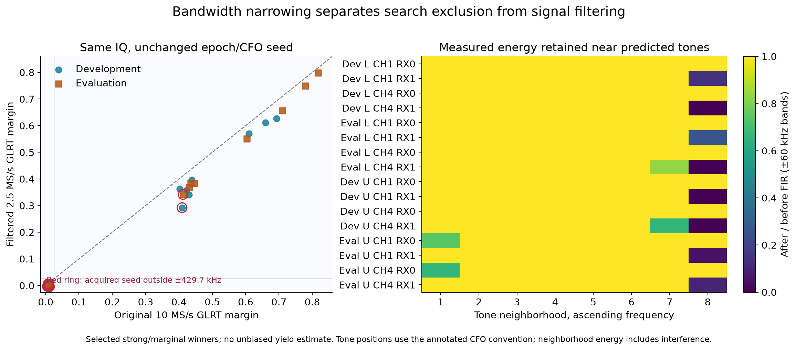
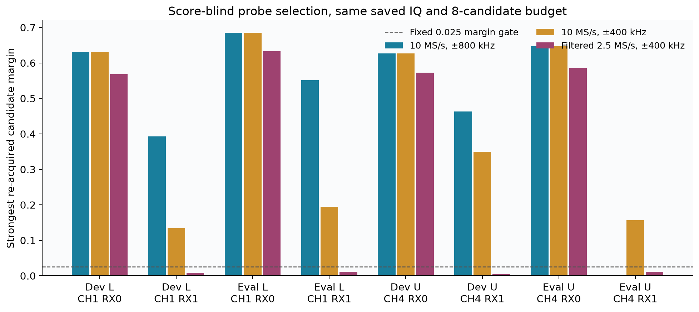
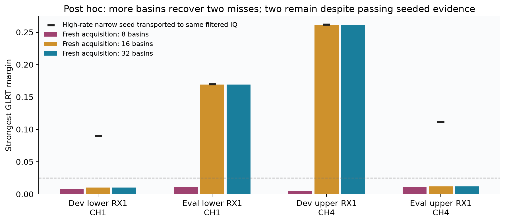

# Controlled bandwidth and acquisition evidence

The same saved 10 MS/s IQ supports two distinct limitations: narrowing removes
outer-band energy, and fresh acquisition can lose a passing timing/CFO basin
even when that basin remains detectable in the filtered IQ. Search width alone
does not predict detection under a fixed eight-candidate budget.

All **62 published candidate margins reproduce exactly** (maximum difference
0.0, required tolerance 1e-7), using the pinned `9181d637d` numerical source and
the read-only `AdaptiveHopIqStore` public reader. Retained visit indexes and
device sample counters are asserted. Each result records the input manifest
digest and a digest of its exact probe IQ. No capture, service, queue, QNAP path,
published product, or production detector was changed.

## Paired saved-winner bandwidth replay

The 31 selected high-rate examples contain 16 deliberately strong winners and
15 marginal winners. This is a selected-candidate diagnostic, **not a yield
sample**. Development and independently selected evaluation scans keep their
original assignments from [the frozen specification](../data/experiment-spec.json).

Three treatments separate mechanisms:

1. Replay each original full-search published winner at its original epoch and
   CFO, with the original 10 MS/s IQ.
2. Annotate whether that same acquired seed lies in the hypothetical low-rate
   tone-center search interval, ±429,687.5 Hz about the nominal pilot center.
   Eligible candidates retain exactly the original score; excluded seeds are
   marked unavailable. This operation is seed eligibility, **not reacquisition**.
3. Mix the same IQ by the nominal pilot offset (lower −312.5 kHz, upper +312.5
   kHz) **before** low-pass filtering and decimating by four. Preserve seed time
   by `(integer_epoch + fraction)/4`, and subtract the nominal offset from the
   acquired CFO. Re-evaluate the existing production template at 2.5 MS/s.

The frozen FIR has 321 symmetric unit-DC taps, Kaiser β=8.6, and cutoff
1.125 MHz at the original 10 MS/s rate. Convolution compensates its 160-sample
group delay. The first/last 16 µs contain zero-padding transients; scored pilot
symbols avoid them. This is one explicit digital low-rate emulation, **not a
measurement or reproduction of the actual 2.5 MS/s analog filter**. Timing,
template sampling, fractional interpolation, and finite-symbol filtering are
also part of this treatment; the resulting score change is not attributable
solely to signal energy.

| Split / selected bucket | Examples | Seeds outside ±429.7 kHz | Original passes | Filtered fixed-seed passes | Median margin change |
|---|---:|---:|---:|---:|---:|
| Development strong | 8 | 1 | 8 | 8 | −0.0563 |
| Evaluation strong | 8 | 1 | 8 | 8 | −0.0533 |
| Development marginal | 8 | 2 | 0 | 0 | −0.00772 |
| Evaluation marginal | 7 | 6 | 0 | 0 | −0.00925 |

The unchanged 0.025 gate is never tuned. All 31 original and narrowed
conditional Gaussian noise controls fail it. These fixed-seed controls do not
measure an acquisition false-alarm rate.



The energy panel measures after/before FIR energy in ±60 kHz neighborhoods of
the predicted eight pilot tones, using identical Hann-window spectra at the
original rate. It includes background and interference; it is **not an isolated
pilot-power estimate**. Outer positive-frequency neighborhoods are strongly
attenuated for many RX1 examples. [The row data](bandwidth-results.json) also
records broadband retention, theoretical FIR power gain at each predicted
tone center, and distance to the low-rate Nyquist boundary.

The predicted tone positions use tracking CFO minus nominal tuning and the
derived edge-dependent template bias. They remain a **branch-dependent
coordinate diagnostic**, not an independently measured physical carrier
position. Symbol-rate alias coordinates do not imply identical template
scores at different continuous CFO seeds. Acquired-seed containment and these
predicted physical-tone positions must therefore be interpreted separately.
The ±820,312.5 Hz outer tone centers do not bound the full spectrum of finite
rectangular OFDM symbols; neither tone-center containment nor a positive
Nyquist distance proves a flat analog passband or preserved group delay.

## Fresh acquisition on score-blind probes

For each of the four high-rate scans, a SHA-256 ordering selects one retained
visit without consulting published scores. Analyze 60–80 ms of that visit on
both receivers. Lower-edge scans use CH1 and upper-edge scans use CH4, so
**edge and channel are confounded in this eight-probe experiment**. Scan
selection still follows the original report cohort; probe selection is
score-blind. Only four independent scans are represented.

Run the existing `acquire_symbolwise` API and integer/fractional GLRT scoring
on (a) original IQ with ±800 kHz support, (b) the same IQ with ±400 kHz support,
and (c) filtered 2.5 MS/s IQ with ±400 kHz support. The conservative ±400 kHz
interval lies within the ±429.7 kHz tone-center domain and makes the original
80 kHz coarse CFO lattice an exact subset of the broader lattice. All other
frequency refinement steps/radii, symbol selections, and the eight-candidate
budget match. The epoch-separation budget is two microseconds at both rates
(20 versus five samples), rather than allowing sample-rate-dependent physical
separation. This makes the full-search treatment a controlled rerun of the
existing API, not a bit-for-bit replay of the published scanner's sample-count
separation policy. All retained candidates across all treatments have **14
complete frames of support**. Duration is 20 ms throughout.

| Probe | Full ±800 kHz | Search-only ±400 kHz | Filtered 2.5 MS/s ±400 kHz |
|---|---:|---:|---:|
| Dev lower CH1 RX0 | 0.6306 | 0.6306 | 0.5682 |
| Dev lower CH1 RX1 | 0.3927 | 0.1334 | 0.00808 |
| Eval lower CH1 RX0 | 0.6854 | 0.6854 | 0.6331 |
| Eval lower CH1 RX1 | 0.5520 | 0.1937 | 0.01114 |
| Dev upper CH4 RX0 | 0.6268 | 0.6268 | 0.5726 |
| Dev upper CH4 RX1 | 0.4632 | 0.3495 | 0.00441 |
| Eval upper CH4 RX0 | 0.6468 | 0.6468 | 0.5861 |
| Eval upper CH4 RX1 | 0.00178 | 0.1571 | 0.01103 |

Each cell is the highest retained candidate's GLRT margin, using fractional
refinement when available and its integer score otherwise. All maxima shown
here have completed fractional refinement. Candidate ranks, complete CFO
grids/configurations, and all retained candidate scores are frozen in
[reacquisition-results.json](reacquisition-results.json). Per-probe strongest
candidate CFO/rank/support summaries are in [summary.json](summary.json).



Development passes are 4/4, 4/4, and 2/4 across the treatments; evaluation passes
are 3/4, 4/4, and 2/4. Four additional matched-PSD Gaussian null probes, one per
scan, are reacquired under all treatments; none passes. Four null probes are
far too few to calibrate a false-alarm rate, and do not model interference.

The broader-search evaluation upper RX1 miss illustrates finite-budget basin
competition. Its strongest retained candidate is rank five, acquired
pilot-relative CFO −538.0 kHz, margin 0.00178. Restricting the same-IQ search
finds a rank-zero +374.6 kHz candidate with margin 0.1571. Broader support cannot
be treated as a monotonic detection improvement when only eight coarse basins
are retained before scoring.

## Transported-seed diagnosis of the acquisition misses

After inspecting the acquisition outcomes, a **post hoc diagnostic** transports
each high-rate strongest acquired seed to the filtered IQ, without refitting
the threshold or rerunning a new search. This additional diagnostic was not
part of the frozen initial acquisition comparison. It preserves physical epoch
time and checks equal frame inventory. Results are in
[transport-results.json](transport-results.json).

All four RX1 high-rate **narrow-search** winners still pass in the filtered IQ
at their transported seeds: margins 0.0899 and 0.1695 for lower development and
evaluation, and 0.2615 and 0.1113 for upper development and evaluation. Fresh
low-rate acquisition of that identical filtered IQ returns only failing
retained candidates. Thus these four fresh-acquisition failures cannot be
explained simply by loss of all detectable conditioned pilot evidence. They
implicate the acquisition/basin-retention path under this decimation and
template geometry. The experiment does not isolate which stage is responsible
or establish a production fix.

The high-rate RX1 full-search winners in the first three cases occupy acquired
pilot-relative CFOs +467.4, +470.6, and +486.9 kHz. Their high-rate narrow-search
winners occupy +355.7, +359.0, and +372.3 kHz, with different scores. These are
different continuous CFO/template hypotheses; merely assigning an alias label
does not establish their physical equivalence.

An additional **exploratory post hoc** rerun increases only the retained
coarse-basin budget from eight to 16 and 32 on those same four filtered RX1
probes. It takes 6.31 seconds, including four additional matched-PSD Gaussian
null probes at both budgets. Budget 16 recovers two of the four acquisition
misses; 32 recovers no additional case. All eight Gaussian-null budget runs
fail the unchanged gate. This is a diagnosis of candidate retention, not a
calibrated recommendation to change the production budget.

| Filtered RX1 probe | Fresh budget 8 | Fresh budget 16 | Fresh budget 32 | Transported high-rate narrow seed |
|---|---:|---:|---:|---:|
| Dev lower CH1 | 0.00808 | 0.01045 | 0.01045 | 0.0899 |
| Eval lower CH1 | 0.01114 | 0.16924 | 0.16924 | 0.1695 |
| Dev upper CH4 | 0.00441 | 0.26104 | 0.26104 | 0.2615 |
| Eval upper CH4 | 0.01103 | 0.01215 | 0.01215 | 0.1113 |



For the rescued evaluation lower and development upper cases, acquired CFOs
are +358.98 and +372.53 kHz, close to the transported high-rate narrow winners.
The two remaining misses require examination of the coarse/timing/refinement
path; increasing retention to 32 is insufficient. Complete exploratory
candidate inventories are in [budget-results.json](budget-results.json).

## Reproduction and checks

Run from this directory; elevated access is required only because the sealed
bulk corpus is not readable by the ordinary workspace account. Every storage
handle is read-only. The environment limits BLAS/OpenMP to one thread.

```bash
sudo -n env PYTHONDONTWRITEBYTECODE=1 OPENBLAS_NUM_THREADS=1 OMP_NUM_THREADS=1 \
  PYTHONPATH=/opt/leo-adaptive-memory/9181d637d/src \
  /home/mouse9911/gits/leo-tracker-reduxredux/.venv/bin/python bandwidth_replay.py \
  --spec ../data/experiment-spec.json --output bandwidth-results.json
sudo -n env PYTHONDONTWRITEBYTECODE=1 OPENBLAS_NUM_THREADS=1 OMP_NUM_THREADS=1 \
  PYTHONPATH=/opt/leo-adaptive-memory/9181d637d/src \
  /home/mouse9911/gits/leo-tracker-reduxredux/.venv/bin/python reacquire.py \
  --spec ../data/experiment-spec.json --output reacquisition-results.json
sudo -n env PYTHONDONTWRITEBYTECODE=1 OPENBLAS_NUM_THREADS=1 OMP_NUM_THREADS=1 \
  PYTHONPATH=/opt/leo-adaptive-memory/9181d637d/src \
  /home/mouse9911/gits/leo-tracker-reduxredux/.venv/bin/python transport_check.py
sudo -n env PYTHONDONTWRITEBYTECODE=1 OPENBLAS_NUM_THREADS=1 OMP_NUM_THREADS=1 \
  PYTHONPATH=/opt/leo-adaptive-memory/9181d637d/src \
  /home/mouse9911/gits/leo-tracker-reduxredux/.venv/bin/python budget_check.py
OPENBLAS_NUM_THREADS=1 /home/mouse9911/gits/leo-tracker-reduxredux/.venv/bin/python plot_coverage.py
PYTHONPATH=/opt/leo-adaptive-memory/9181d637d/src:. \
  /home/mouse9911/gits/leo-tracker-reduxredux/.venv/bin/python -m pytest test_bandwidth_replay.py -q
```

Four component-owned report-tool tests pass: symmetric FIR pass/stop response
and delay, both nominal mixer signs and timing units, closed tone-center
eligibility, and matched acquisition coarse lattices/physical budgets. Saved
seed replay additionally asserts matching frame indexes across rate conversion.
The main replay takes 4.70 seconds and all 36 fresh acquisition runs take
69.68 seconds. No threshold, filter, or search setting is tuned on evaluation.

These experiments support controlled bandwidth and acquisition mechanisms.
They do not quantify the 128-scan rate benefit, establish analog receiver
calibration, prove satellite identity, or measure position accuracy.
