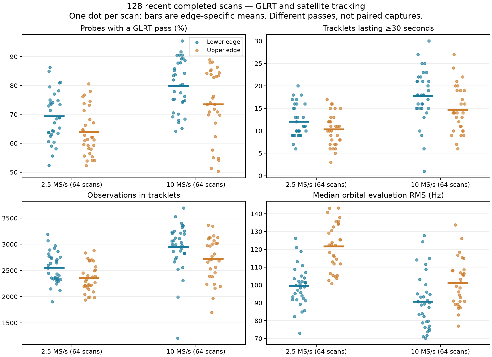
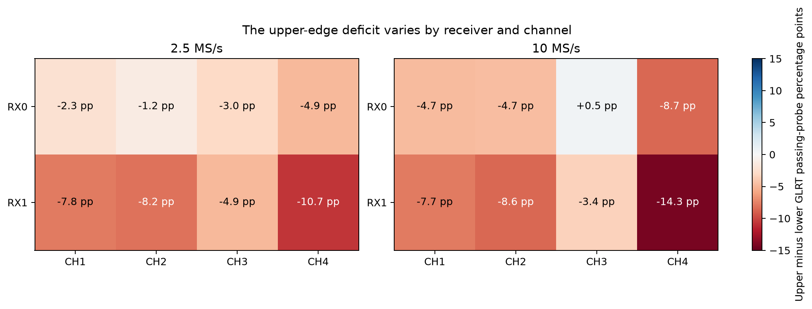
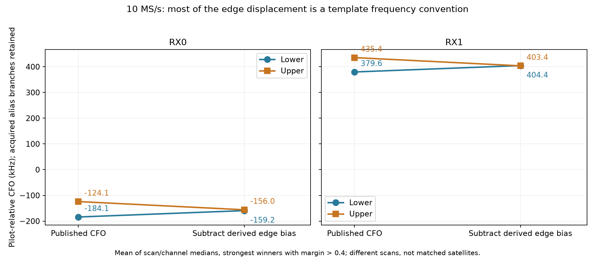
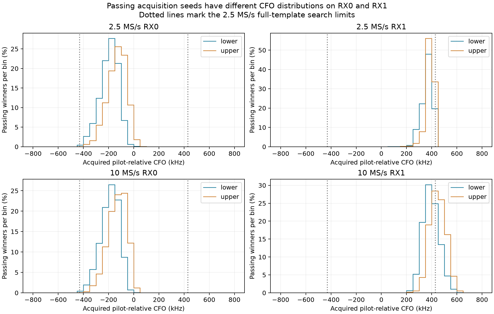
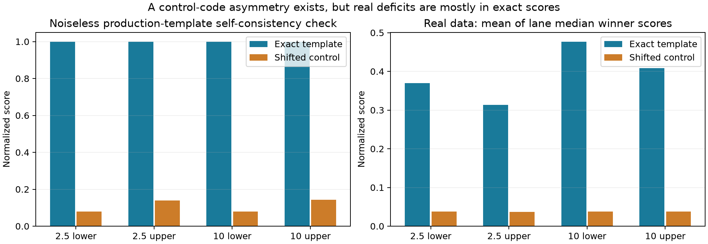

# 128 recent adaptive scans: sample rate and the upper/lower edge discrepancy

Analysis date: 2026-10-06. Cohort: 64 completed scans at 2.5 MS/s and 64 at
10 MS/s. This report preserves the earlier 64+64 comparison and adds a
frequency-coordinate audit, independent waveform checks, and bounded replay
of existing IQ. It changes no production detector, capture, or tracking product.

**10 MS/s produces more GLRT detections and longer supported tracks in this
cohort. There is also a real, deterministic edge-dependent CFO convention
offset in the current template/GLRT path.** It predicts a 56.818 kHz
upper-minus-lower displacement, matching most of the observed 10 MS/s
displacement. The offset is not evidence that the edges switch independently.
It does not, by itself, explain the entire upper-edge detection deficit.

## The sample-rate comparison

These are equal-weight means across scans. For quantities labeled median, first
take the median within a scan, then average those medians across scans.

| Metric | 2.5 MS/s | 10 MS/s | Interpretation |
|---|---:|---:|---|
| Probes with at least one passing GLRT candidate | 66.72% | 76.85% | +10.14 percentage points |
| Median strongest-candidate margin | 0.354 | 0.436 | Higher pilot/control separation |
| Passing candidates per scan | 8,452 | 10,741 | Candidates can overlap; not independent detections |
| Tracklets per scan | 60.23 | 62.50 | Heavily limited by the 64-track budget |
| Observations incorporated in tracklets | 2,456 | 2,842 | +15.7% |
| Tracklets spanning at least 30 seconds | 11.19 | 16.30 | +45.7% |
| Median tracklet span | 22.69 s | 24.20 s | Modest improvement |
| Median simple tracklet residual RMS | 588.1 Hz | 629.1 Hz | Worse |
| Median orbital evaluation RMS | 110.23 Hz | 95.61 Hz | 13.3% lower |
| Reviewed tracks with orbital evaluation RMS <100 Hz | 42.2% | 53.6% | Different selected tracks |
| Mean retained duty | 88.54% | 86.44% | No capture-duty improvement |



With bootstrap resampling of whole scans within edge/gain/duration strata,
10-minus-2.5 differences are +10.05 percentage points in GLRT yield
(descriptive 95% interval +6.76 to +13.22), +5.07 long tracklets per scan
(+3.47 to +6.65), +382.6 track observations (+252.9 to +505.9), and
−14.36 Hz orbital evaluation RMS (−18.85 to −9.86). Seed: 20261006;
20,000 resamples; stratum weights are the smaller rate count in each stratum.

A sensitivity comparison pairs the nearest captures of the same edge,
gain, and duration, without reuse and within 90 minutes: 45 pairs, median
separation 15.11 minutes. Differences remain +10.24 percentage points,
+5.76 long tracks, and −14.16 Hz orbital RMS. These are observational pairs,
not simultaneous recordings of the same passes. Pair IDs and statistics are
in [time-matched.json](data/time-matched.json).

Why expect improvement? A wider sampled band permits a larger CFO search and
more guard around the eight pilot tones. It also offers finer timing samples.
It does not create more pilot energy or guarantee a fourfold sensitivity gain:
the useful pilot band is unchanged, and admitted broadband noise increases
with bandwidth. The evidence here supports greater detection coverage and
track support, with a smaller improvement in orbital frequency fit. It does
not establish better satellite identity or position accuracy.

Only 176/256 versus 182/256 grouped TLE hypotheses avoid abstention. The
training leader persists on evaluation in 246/256 versus 243/256 groups.
The saved radio-null diagnostic is beaten in 0/256 versus 1/256, with that
single result in the oldest 10 MS/s scan. These remain satellite candidates.
Thirteen low-rate and 43 high-rate scans hit the 64-track cap, so total
tracklet count understates differences in available evidence.

## The edges share frame presence, but our pass fractions measure detectability

The published waveform model places pilots on both eight-tone bands in the
same OFDM symbols, 2–301. Their code sequences differ. That supports common
frame presence; it does not require identical received strength, distortion,
or detector score. See [Qin et al., section VII and Appendix A](https://arxiv.org/html/2602.02627v1#S7).

Each selected scan captures one edge. We therefore did not observe both
edges of a particular transmission simultaneously. A GLRT miss is also not
a measurement that a transmitter turned off. The observed deficit is:

| Rate / edge | Scans | Passing probes | ≥30 s tracks/scan | Orbital evaluation RMS |
|---|---:|---:|---:|---:|
| 2.5 MS/s lower | 33 | 69.33% | 12.03 | 99.49 Hz |
| 2.5 MS/s upper | 31 | 63.94% | 10.29 | 121.66 Hz |
| 10 MS/s lower | 34 | 79.87% | 17.74 | 90.70 Hz |
| 10 MS/s upper | 30 | 73.43% | 14.67 | 101.17 Hz |

Within each rate, nearest lower/upper scans without reuse, at most 90 minutes
apart, still show a deficit after giving all eight channel/receiver lanes
equal weight. At 2.5 MS/s: 22 pairs, upper-minus-lower −6.10 points
(95% interval −9.12 to −3.15). At 10 MS/s: 27 pairs, −4.81 points
(−8.09 to −1.52). Median time separation is about 15 minutes in both groups.
Whole-pair bootstrap seed 20261006; 20,000 draws. This reduces time imbalance
but cannot remove differences in illumination, source mixture, or geometry.



The deficit is larger on RX1 and CH4. At 10 MS/s it ranges from +0.5 points
on RX0/CH3 to −14.3 on RX1/CH4. A uniform independent transmitter on/off
explanation does not account for this receive-path pattern.

## A confirmed missing term in the physical CFO interpretation

The current [pilot template](../../src/leo/analysis/starlink/templates.py)
subtracts the mean pilot frequency from each tone and synthesizes the result
using time local to each OFDM symbol. Continuous mixing of the physical
channel waveform to the pilot center introduces an additional phase factor
between symbols. The template does not contain that factor.

Here is our derivation using the local-symbol OFDM construction in
[equations 14–16 of Qin et al.](https://arxiv.org/html/2602.02627v1#S5.SS2).
Let the pilot-center offset within the channel be `f_e`, symbol index `i`,
symbol duration `T_s = 4.4 µs`, and CP duration `T_g`. Apart from normalization,
write the current recentered template as `q_e(t)`. Expanding the full-channel
tone phase and then continuously mixing by `exp(-j 2π f_e t)` gives

```text
physical pilot at its band center
    = q_e(t) × exp[-j 2π f_e (i T_s + T_g)]

GLRT inter-symbol frequency bias
    b_e = wrap(-f_e, period = 1/T_s)
```

The CP part is a constant phase; the `i T_s` part is a phase progression.
Our numerical values, derived from the code's signed carrier indices, are:

| Edge | Mean signed index | f_e | Predicted GLRT CFO at zero physical CFO |
|---|---:|---:|---:|
| Lower | −492.5 | −115,429,687.5 Hz | −24,857.955 Hz |
| Upper | +491.5 | +115,195,312.5 Hz | +31,960.227 Hz |
| Upper minus lower | | | **+56,818.182 Hz** |

The independent [waveform check](../tools/rate64_phase_convention.py)
synthesizes the full signed-carrier waveform first, then applies a continuous
mixer. It shares the published pilot codes with production, but does not
use the production waveform generator. This is an ideal pilot-only,
rectangular-symbol test: no analog filtering, symbol taper, data interference,
clock skew, or noise. At both sample rates, for true CFO zero and acquisition
seeds at either zero or the predicted bias, production GLRT reports exactly
the predicted edge bias to numerical precision. With the continuously mixed
template, it reports zero and exact score 1. All eight cases assert these
results; see [edge-phase.json](data/edge-phase.json).

The [CFO canonicalizer](../../src/leo/analysis/starlink/pilot_search_geometry.py)
currently removes nominal capture tuning and chooses a symbol-rate alias;
it does not remove this edge-dependent term. Thus the published pilot-relative
CFO is a template coordinate, not yet an edge-neutral physical CFO coordinate.
For physical interpretation, the derived relationship is:

```text
physical pilot-relative CFO ≈ published unwrapped pilot-relative CFO − b_e
```

Choose the physical alias after accounting for this convention. Do not
silently change persisted raw detector CFOs: the template and the frequency
used to derotate IQ must remain consistent.

The 10 MS/s data agrees closely with the predicted displacement. Values below
are means of per-scan/channel median tracking CFOs for strongest candidates
with margin >0.4, retaining acquired alias branches; empty subsets are omitted.

| Receiver | Lower published | Upper published | Observed U−L | Lower after subtraction | Upper after subtraction |
|---|---:|---:|---:|---:|---:|
| RX0 | −184.11 kHz | −124.08 kHz | +60.02 kHz | −159.25 kHz | −156.04 kHz |
| RX1 | +379.59 kHz | +435.40 kHz | +55.81 kHz | +404.44 kHz | +403.44 kHz |



The remaining edge differences are +3.21 kHz on RX0 and −1.00 kHz on RX1.
These are different scans and satellite mixtures, so this is an aggregate
consistency check, not a same-satellite calibration measurement. Nevertheless,
the agreement on both receivers strongly supports the template convention as
the dominant source of the edge frequency displacement.

This term is constant for a given edge. An offset-only orbital fit can absorb
it. It cannot by itself generate quadratic-in-time orbital residuals, and
removing it does not automatically improve orbital RMS or localization.

## Search coverage compounds the edge discrepancy at 2.5 MS/s

The eight template tone centers extend to ±820,312.5 Hz. At 2.5 MS/s,
the implemented full-template search can only move their centers through
±429,687.5 Hz before reaching Nyquist. This is a mathematical tone-center
limit, not a measurement of a flat analog passband or of complete spectral
containment. At 10 MS/s the configured search is ±800,000 Hz about the
nominal pilot position.



Acquired RX1 candidates favor positive CFO branches, whereas RX0 favors
negative ones. Among passing 10 MS/s winners, **28.3% of lower RX1 and 59.1%
of upper RX1** lie beyond the hypothetical 2.5 MS/s search interval. For
RX0 these shares are about 0.1% and 0.0%. These percentages describe
coordinate/search coverage; they are not direct estimates of lost detections.
Alias selection, template convention, sample rate, and different captured
signals all matter. The receiver difference is not a calibrated measurement
of hardware oscillator error.

In the actual 2.5 MS/s searches, 7.48% of lower RX1 and 11.23% of upper RX1
probe winners sit within 20 kHz of a search boundary. The upper template's
positive bias pushes that branch toward the upper boundary. Narrow capture
coverage is therefore a plausible contributor to both the rate benefit and
the upper-edge deficit. Merely changing a displayed CFO cannot recover IQ
that fell outside a capture filter, or seeds that acquisition never supplied.

The nominal tuning audit found no missing ±312.5 kHz term. Every retained
visit matches the requested channel/edge geometry. At 2.5 MS/s both edges
are centered on their nominal pilot bands. At 10 MS/s the lower pilot lies
at −312.5 kHz and the upper at +312.5 kHz relative to the rounded tuner center;
the search geometry explicitly includes these values. The audit also found
no acquired winner outside its implemented search bounds.

## Score asymmetry remains after understanding the frequency convention



The fixed 17-symbol-roll control is not equally correlated with the two pilot
codes. In a noiseless production-template self-consistency test at 2.5 MS/s,
exact scores are 1 for both edges, but control scores are 0.0783 lower versus
0.1385 upper: margins 0.9217 versus 0.8615. At 10 MS/s the margins are 0.9209
versus 0.8563. This is a detector/control-code asymmetry, not unequal signal
power. Its existence survives the physical-template zero-CFO check.

However, it does **not** establish that the 0.025 gate alone causes the
observed pass-rate deficit. In 7,692 conditional synthetic cases, using the
same noise PSD across sample rates and common noise seeds 20261006–20261133,
upper-edge passing fractions are not systematically lower. For example, at
the 20 dB noise-to-pilot setting, passing fractions are 59.9% lower versus
61.2% upper at 2.5 MS/s, and 59.4% versus 61.7% at 10 MS/s. These tests know
the epoch and CFO and use a single frame; they do not model acquisition,
interference, multiple-testing false alarms, or real pass geometry.

In the real scans, means of lane-median control scores stay near 0.037–0.038.
The larger difference is in exact scores: 0.370 versus 0.313 at 2.5 MS/s,
and 0.477 versus 0.408 at 10 MS/s, lower versus upper. Thus there is also
less coherent template evidence on the upper edge. That could reflect signal
strength, analog/filter response, timing/model mismatch, or source mixture;
these normalized scores alone do not identify which.

The [earlier IF-centering report](../2026_08_21_edge_pilot_if_dc_centering.md)
notes limited guard at 2.5 MS/s. CH4 upper also lies near the top of the
configured LNB IF range. The strong CH4 deficit makes receive response worth
testing, but neither report supplies an amplitude/group-delay calibration
that proves an analog cause.

## Bounded replay of existing IQ

We selected one scan per rate/edge: the median GLRT-yield scan among the eight
most recent in that group. On CH1 and CH4, both receivers, we replayed the
first strong (>0.4 margin) and marginal (−0.01 to 0.06) published winner after
60 seconds. One lane had no strong example: 31 probes total, each 20 ms.
This is a diagnostic selection, not a random performance evaluation set.

All 31 original margins reproduce within 1e−7 from hash-verified IQ, with
device-counter alignment asserted. Fixed corrections of ±117.1875,
±234.375, and ±312.5 kHz all reduce average margin within every tested
rate/edge/strength group. Swapping edge codes, conjugating IQ with CFO sign
reversal, or shifting by an OFDM symbol also worsens the strong-group means.
These controls do not support a simple missing half-tone, full-tone,
rounded-tuning, IQ-inversion, or whole-symbol correction in these seeds.

A second report-only replay substitutes the physical template and subtracts
the derived edge bias, keeping the same IQ, candidates, epochs, and fractional
timing. Strong-group mean margins change as follows:

| Rate / edge | Strong probes | Published-template margin | Physical-template margin |
|---|---:|---:|---:|
| 2.5 lower | 4 | 0.4365 | 0.4466 |
| 2.5 upper | 3 | 0.4967 | 0.4767 |
| 10 lower | 4 | 0.5320 | 0.5415 |
| 10 upper | 4 | 0.4844 | 0.4973 |

Marginal-group means decrease in all four groups. This mixed result is why
the report claims a confirmed **CFO interpretation error**, not a validated
detector-yield fix. A physical template changes within-symbol matching as
well as the frequency label; new acquisition and timing optimization require
separate controlled validation. The template substitution is scoped to the
offline process and changes no stored artifact. Results and manifest hashes:
[edge-replay-phase.json](data/edge-replay-phase.json).

Fractional timing does not show a simple saturation failure: none of the
audited winning refinements reaches |offset| ≥1.9 samples. Refinement rescues
about 0.145–0.147% of all probes at 2.5 MS/s and 0.017–0.018% at 10 MS/s.
This does not exclude sample-clock skew, fractional-delay bias, or
frequency-dependent group delay. There was no dedicated skew estimation here.

## What should change next

1. Make the template-coordinate/physical-CFO relationship explicit and tested
   with the independent full-carrier mixer model. Correct physical reporting
   and cross-edge comparisons through a versioned coordinate conversion;
   preserve existing persisted detector contracts.
2. Compare the existing and physical templates end to end on identical saved
   IQ, candidate budgets, and search support. Randomize whole independent
   dwells/scans into development and evaluation groups, record their IDs and
   seed, and estimate false-alarm behavior on evaluation controls. The 31
   selected probes are insufficient to select or qualify a new threshold.
3. On existing wideband captures, digitally restrict bandwidth and search
   support to isolate coverage loss from sampling/timing effects. Keep
   observations, edge codes, noise scaling, and budgets matched. Separately
   inspect per-tone complex gain versus CFO, receiver, and channel; this is
   the direct route to testing filter attenuation, phase slope, and skew.
4. Keep any future learned RF-dependent calibration coefficient `c` study
   paired with a controlled `c=0` ablation, matched candidate sets and budgets,
   and report frequency fit separately from position accuracy. This report
   neither fits nor uses that learned calibration or performs localization.

The evidence already warrants fixing the physical CFO interpretation. It
does not warrant claiming separate edge transmission states or explaining
the entire pass-rate gap with one offset.

## Cohort, provenance, and reproducibility

Selection was newest-first among completed standard GLRT **and tracking**
products, not all newly captured scans. One pending 10 MS/s tracking job,
`scan-fw-77ce9a6d514ac635`, was excluded. Exact identities, timestamps, settings,
and per-scan values are in [selection.json](data/selection.json),
[metrics.json](data/metrics.json), and [per-scan.csv](data/per-scan.csv).

All use radio `1040005e0b100007100010000bf33a5d4d`, 40 dB manual gain,
300-second nominal duration, 120 ms dwell, 20 ms probe, 120 ms probe stride,
two receivers, GLRT margin gate 0.025, and eight acquisition candidate slots.
The cohort contains 283,334 versus 276,606 probe/receiver records and
3,652 versus 3,785 orbital track reviews. All captures are completed but
retain `capture_qualified=false` because the duty target was not met.

Capture windows, in America/Los_Angeles (UTC−07:00):

- 2.5 MS/s: October 5 06:44 through October 6 06:37.
- Newest 63 completed 10 MS/s: October 4 21:39 through October 6 05:21.
- The 64th 10 MS/s scan is `scan-fw-12d7643df59aad0a`, October 2 11:22.
  It has 38.48% duty, tracking V14, and an older TLE snapshot; the other
  127 tracking products are V15. Removing it leaves 76.71% passing probes,
  16.54 long tracks, and 95.95 Hz orbital RMS, so it does not drive the result.

Restricting to duty ≥85% leaves 63 low-rate and 60 high-rate scans, with
66.69% versus 76.87% passing probes, 11.22 versus 16.68 long tracks, and
110.53 versus 96.14 Hz orbital RMS. These sensitivity checks do not make
the cohort a randomized experiment.

Orbital RMS uses the first-ranked candidate in each published per-track
review: a fixed-orbit, offset-only frequency fit evaluated on its published
randomized observation split. This report aggregates that saved diagnostic;
it does not create an independent pass-level holdout, reselect satellites,
or estimate position. Correlation between observations and selection of
different tracks limit interpretation. The simple tracklet RMS measures a
different model on different supports, so its worsening is not inconsistent
with the orbital result.

The source baseline is remote-main commit `7b22e3fec`; the read-only audit
and IQ/synthetic checks import the deployed scientific source at
`/opt/leo-adaptive-memory/9181d637d/src`. See
[provenance.json](data/provenance.json) for file hashes. Public adaptive-hop
storage readers validate manifest/analysis bindings and sealed visit data.
The replay translates the actual visit index to the retained-reader index
and checks the original device counter. It does not assume those indices
are interchangeable. No new RF collection, queue changes, QNAP changes,
or multi-hour reprocessing campaign was performed.

Frozen lane distributions, counts, geometry, and selected replay seeds are in
[edge-audit.json.gz](data/edge-audit.json.gz). Bootstrap pairs and aggregates
are in [edge-summary.json](data/edge-summary.json). Conditional synthetic
results are in [edge-synthetic.json.gz](data/edge-synthetic.json.gz).
SHA-256 checksums accompany the frozen data and figures.

From the repository root, using Python with NumPy and Matplotlib, reproduce
the aggregate figures without access to the radio corpus:

```bash
report=reports/2026_10_06_rate64_edge_review
scratch=$(mktemp -d)
gzip -dc "$report/data/edge-audit.json.gz" > "$scratch/edge-audit.json"
gzip -dc "$report/data/edge-synthetic.json.gz" > "$scratch/edge-synthetic.json"
python reports/tools/rate64_report.py --input "$report/data" --output "$scratch/rate"
python reports/tools/rate64_edge_summary.py --audit "$scratch/edge-audit.json" --synthetic "$scratch/edge-synthetic.json" --output "$scratch/edge"
python reports/tools/rate64_phase_plot.py --audit "$scratch/edge-audit.json" --output "$scratch/edge"
```

With the pinned scientific source on `PYTHONPATH`, the two synthetic scripts
`rate64_edge_synthetic.py` and `rate64_phase_convention.py` each accept
`--output FILE`. Corpus auditing additionally requires authorized read access
to the local bulk store and the original exported per-scan API analysis
responses. `rate64_edge_audit.py --help` and `rate64_edge_replay.py --help`
document their input locations; these scripts perform no capture or service
mutation. The report publishes compact sufficient aggregates rather than
the full private IQ corpus or all tracking API payloads.
