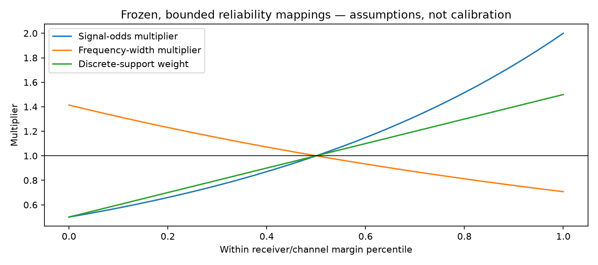
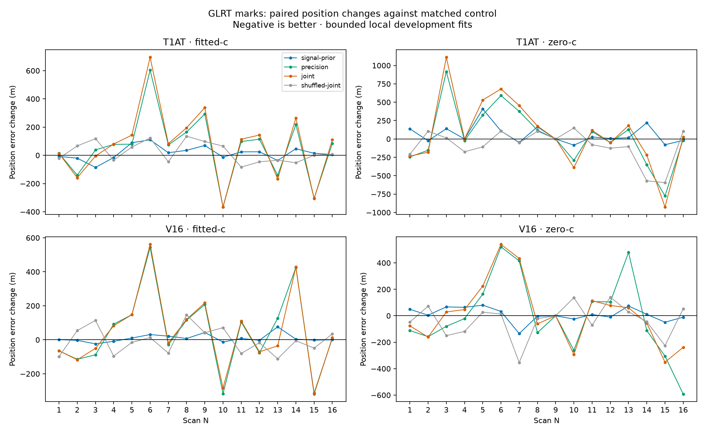
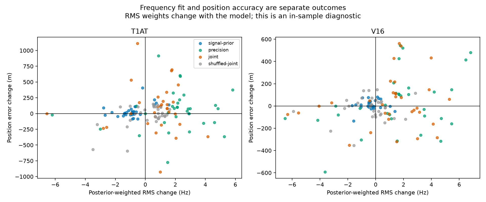
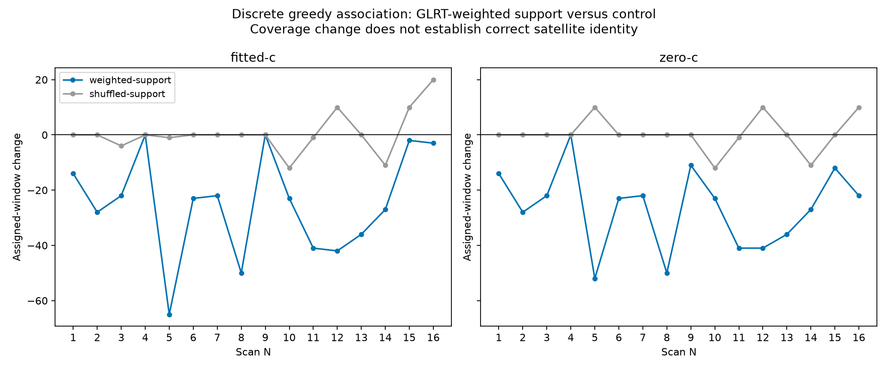

# GLRT strength in final scoring and satellite association: N01–N16 prototypes

Completed October 7, 2026. **These bounded heuristics do not demonstrate a reliable position improvement.** Keep the current default. Their value is a tested way to evaluate GLRT reliability in the likelihood and in discrete selection; the shuffled control and incomplete convergence prevent a promotion claim.

## What the current pipeline does

GLRT ranks/gates raw candidates, estimates CFO and affects tracking support. In the existing T1AT/V16 final likelihood, retained windows have equal base weight: original GLRT margin is not a continuous score weight. Discrete T1AT association maximizes coherent assigned-window count minus 10 per satellite; frequency residuals and timing break ties. The earlier V16 implementation review remains in the archived analysis workspace.

Adding the same GLRT bonus to every satellite explanation of one window cannot distinguish those satellites. Useful mechanisms must instead alter signal-versus-clutter odds, frequency precision, or coherent selection support. A future satellite-conditioned IQ test would need different predicted frequency trajectories and independent confirmation evidence.

## Implemented approaches



Compute a margin midrank separately in each receiver/channel lane; tied margins get the same mark and a constant lane is neutral. Let `u` be that rank percentile and `z=2u−1`. There is no truth-based tuning or threshold selection.

1. **Signal prior:** multiply each satellite's detection odds within a window by `2**z`, bounded from 0.5 to 2. This changes signal-versus-clutter responsibilities while retaining the normalized nonempty finite-set model.
2. **Precision:** multiply frequency standard deviation by `2**(-z/2)`, bounded from 0.707 to 1.414. Stronger margins therefore impose a narrower frequency constraint. Its normalization, gradient and Fisher weights use the same per-window width.
3. **Joint:** combine those changes. **Shuffled joint** permutes marks within each lane with fixed seed 7007, preserving every lane's mark distribution while breaking its relation to the observed window.
4. **Discrete support:** replace coherent window count by the sum of `1+0.5z`, bounded from 0.5 to 1.5 and mean 1 over each lane. Keep the satellite penalty at 10, exclusivity, one timing mode per satellite, 600 Hz gate, and coherent segments with at least 10 windows, at least 5 s span and at most 5 s gaps. Compare with uniform and shuffled support.

The mappings are **assumed reliability relationships**, not measured error calibration or calibrated signal probabilities. Same-IQ score maximization and CFO estimation are coupled. Whole-scan ranks make this a retrospective prototype, not a causal online implementation.

## Matched final-score experiment

All 16 scans completed: **320 position fits**, covering T1AT/C0 and V16 × fitted-`c` and `c=0` × five variants. The 42,610 frozen associated top-one windows, satellite banks, receiver baseline, observations, timing priors, hard bounds, shared 12-start archived pool and maximum search budgets stay matched. Both RF arms keep the same upstream fitted-`c` calibration baseline; this is a controlled **final RF-term ablation**, not independent `c=0` recalibration.

Every trial reprices the same 12 archived starts under its own objective, chooses two by score, runs two 1 s searches and one 1 s polish in the existing 4 km disk. Position truth is used only for evaluation. These are warm-started local prototype searches, not fresh blind localization or global-optimum certificates. The archived calibration is conditioned on the known roof. Aggregate case elapsed time was 18.3 process-minutes with four fit workers; no new RF collection or raw-IQ campaign ran.

Matched control median errors: T1AT fitted-c: 1468 m (16/16 converged); T1AT zero-c: 2298 m (14/16 converged); V16 fitted-c: 1167 m (7/16 converged); V16 zero-c: 1897 m (2/16 converged).



Negative change is better. Improved/worsened counts require an absolute change greater than 1 m. The table includes all completed cases, **including unconverged ones**, as exploratory best-found outcomes.

| Model | RF arm | Variant | Median error Δ (m) | Improved / worsened | Converged / 16 | Both converged |
|---|---|---|---:|---:|---:|---:|
| T1AT | fitted-c | signal-prior | +16.5 | 6 / 10 | 10 | 10 |
| T1AT | fitted-c | precision | +78.3 | 4 / 12 | 6 | 6 |
| T1AT | fitted-c | joint | +96.3 | 5 / 11 | 7 | 7 |
| T1AT | fitted-c | shuffled-joint | +4.2 | 7 / 8 | 9 | 9 |
| T1AT | zero-c | signal-prior | +12.1 | 5 / 9 | 6 | 6 |
| T1AT | zero-c | precision | -0.7 | 8 / 7 | 5 | 5 |
| T1AT | zero-c | joint | +12.5 | 6 / 8 | 4 | 4 |
| T1AT | zero-c | shuffled-joint | -65.6 | 9 / 6 | 5 | 5 |
| V16 | fitted-c | signal-prior | +2.6 | 6 / 9 | 7 | 7 |
| V16 | fitted-c | precision | +50.6 | 7 / 9 | 7 | 7 |
| V16 | fitted-c | joint | -3.4 | 8 / 8 | 7 | 7 |
| V16 | fitted-c | shuffled-joint | -10.3 | 9 / 7 | 8 | 7 |
| V16 | zero-c | signal-prior | +6.9 | 6 / 9 | 2 | 2 |
| V16 | zero-c | precision | -50.6 | 9 / 6 | 3 | 1 |
| V16 | zero-c | joint | +14.5 | 7 / 8 | 2 | 1 |
| V16 | zero-c | shuffled-joint | -10.5 | 8 / 7 | 3 | 2 |

Only **130/320 fits meet the existing KKT convergence threshold**. `summary.json` also reports paired medians restricted to cases where both control and variant converged; these small, selected subsets are not a robust validation cohort. A lower objective within one method chooses its solution; raw NLL values across changed likelihoods are not comparable evidence of improvement.



The residual RMS is posterior-weighted and its weights change with the method. `per_scan.csv` separately records original-owner RMS and repricing under the common unmarked reference likelihood. Neither better in-sample RMS nor a better common reference score establishes better localization. Soft winners and clutter responsibilities may change only within the frozen selected satellite bank; this is distinct from discrete candidate selection.

## Discrete satellite-selection prototype

All 16 scans completed: **96 greedy-selection cases** (two RF calibration arms × uniform, weighted and shuffled support). The uniform implementation exactly reproduced the archived initial greedy assignments and count objective in **32/32 controls**. Both arms reuse the same timing-mode inventory and original top-one observation IDs; their saved residual predictions differ by the archived RF arm. Membership may change here, so these diagnostics are separate from the matched-window position ablation above.



| RF arm | Variant | Total gained windows | Total lost windows | Relabeled windows | Changed satellite sets / 16 |
|---|---|---:|---:|---:|---:|
| fitted-c | weighted-support | 46 | 444 | 88 | 14 |
| fitted-c | shuffled-support | 65 | 54 | 47 | 6 |
| zero-c | weighted-support | 10 | 434 | 36 | 15 |
| zero-c | shuffled-support | 40 | 34 | 0 | 6 |

This prototype covers **greedy selection only**. It does not execute the archived one-out/many-in replacement repairs, regenerate timing hypotheses, or rerun position fitting on the newly selected banks. Changed coverage, satellite count or NORAD labels do not establish correct satellite identities; independent identity ground truth is unavailable here.

## Verification and artifacts

- Nine component tests cover neutral equivalence to the original finite-set likelihood, numerical gradients, posterior normalization, lane ties, monotonic score-transform invariance, deterministic shuffle, bounds, rejection of duplicate-window inputs, and exclusive weighted association.
- Read-only cohort verification checks **32 neutral objective/gradient/curvature comparisons** and **16 marked directional gradient comparisons** on N01 and N16. See `verification.json`.
- `marks.py` owns the likelihood, `experiment.py` runs the fit comparison, `association.py` owns the discrete selection prototype, and `report.py` renders this report and figures.
- The executed fit runner is archived in `source_snapshots/experiment_executed.py`. The final summarizer adds paired-convergence fields without changing numerical fitting. Case-level source digests describe files at receipt creation; provenance also identifies the executed runner snapshot.
- Compact outcomes: [per-scan CSV](per_scan.csv), [position summary](summary.json), [association summary](association_summary.json), [verification](verification.json), [provenance](provenance.json). Full immutable-input receipts and fit traces are under `/srv/bulk/leo/glrt-mark-n01-n16-20261007-v1`; discrete receipts are under `/srv/bulk/leo/glrt-mark-association-n01-n16-20261007-v1`.

## Next steps

Keep these as research prototypes. First calibrate frequency error and signal/clutter odds against GLRT score using independent pilot splits or independent windows, stratified by receiver, rate and edge. Freeze that calibration before a held-out scan comparison. Repeat promising cases with sufficient **matched** optimizer budgets and multiple fixed shuffle seeds, while retaining the fitted-`c` versus `c=0` ablation. Only then connect a selected method to full replacement association and evaluate position accuracy on its changed banks. The present evidence does not justify replacing the default score.

## Reproduction

Use a scientific Python environment with NumPy, SciPy, Matplotlib and pytest. Runners require the archived N01–N16 inputs and original research modules in the analysis workspace; the published report bundle contains prototype code and compact evidence, rather than the full archive and upstream dependencies. Execute from that workspace's repository root; choose fresh output directories because runners do not overwrite completed fit directories.

```sh
export OPENBLAS_NUM_THREADS=1 OMP_NUM_THREADS=1
python -m pytest -q reports/2026_10_07_glrt_mark_prototypes/test_marks.py
python reports/2026_10_07_glrt_mark_prototypes/verify.py
python reports/2026_10_07_glrt_mark_prototypes/experiment.py --output /path/to/new-fit-run --workers 4
python reports/2026_10_07_glrt_mark_prototypes/association.py --output /path/to/new-association-run --workers 4
python reports/2026_10_07_glrt_mark_prototypes/report.py --association-output /path/to/new-association-run
```
