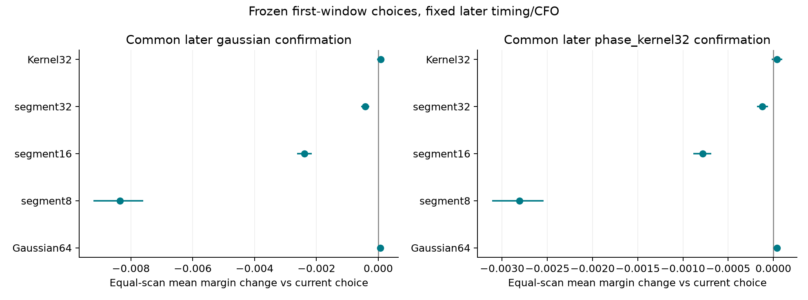
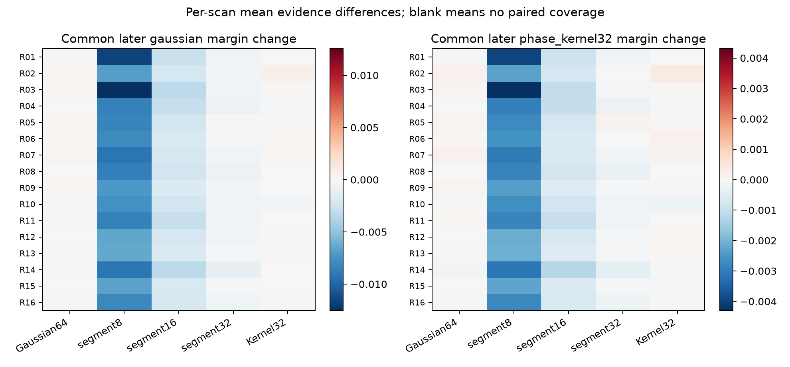
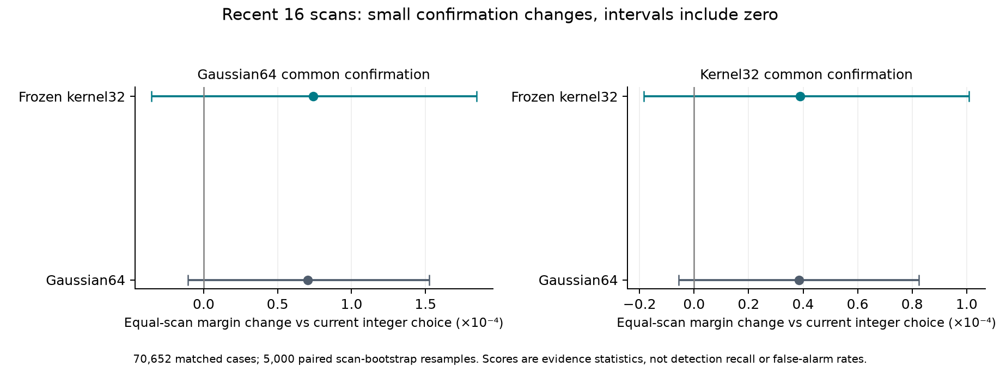

# Shorter-segment detectors on sixteen recent completed GLRT scans

October 7, 2026 (UTC). **The recent recordings do not demonstrate a useful gain from
shorter coherence. Smooth kernel32 shows only tiny, inconclusive changes relative
to the current integer GLRT-margin selector; hard 8/16-symbol segments reduce later confirmation
evidence on every scan.** Retain the current detector. The earlier simulated
improvement does not establish a real-recording improvement on this cohort.

Three SOL workers handled source access, the numerical evaluator/audit, and
paired summaries. The root ran the full replay and independently verified its
coverage, provenance, and saved choices. Production code and defaults are unchanged.

## Full coverage and its limits

The cohort is the newest sixteen completed GLRT scans at the frozen read-only
inventory, with capture starts from **2026-10-06 22:37:19 through 2026-10-07
02:23:23 UTC**. The next newer scan still had partial GLRT coverage when the
receipts were archived. Membership was frozen before prototype evaluation;
tracking completion and signal strength were not admission conditions.

| Coverage | Count |
|---|---:|
| Completed scans | 16/16 |
| Archived visits replayed | 35,352/35,352 |
| Receiver probes accounted for | 70,704/70,704 |
| Probes with paired method comparisons | 70,652 |
| Probes with no persisted candidate seed | 52 |
| Acquired candidate ranks declared by archive | 565,632 |
| Candidates with persisted timing/CFO, all rescored | 372,854 |
| Unavailable candidate ranks explicitly accounted for | 192,778 (34.08%) |
| Replay execution errors | 0 |

This is full visit/probe coverage, not a small sample of each scan. Nine scans
use 2.5 MS/s and seven use 10 MS/s; both receivers are included.

The public archive discards integer timing/CFO seeds when fractional refinement
does not complete. Those candidates remain only as ranks and failure reasons.
We therefore compare every **available archived candidate without adding a
margin gate**, rather than every originally acquired hypothesis. There is no
new acquisition or inference about upstream missed signals.

The baseline is the current integer-epoch coherent-margin selector applied to
that common available bank. It reproduces the archived integer GLRT statistics;
it is not a replay of the final fractional-epoch production selection. Candidate
availability is itself conditioned on production fractional refinement.

## Matched evaluation

All seventeen frozen scorer variants receive symbols 2–65, actual template
energies, the original complete 64-symbol frame support, and the same 512-bin
CFO search. No 128/256-symbol support restriction is imposed. Archived integer
epochs and acquired CFO seeds are reused; no acquisition is rerun.

Each method chooses timing and frequency from 0–20 ms of a probe. The separate
40–60 ms window is then evaluated at that exact fixed hypothesis. Exact and
control use the same fixed frequency. There is no later timing/frequency search.

**This is a temporal repeatability diagnostic, not randomized scientific
validation.** The experiment predates the repository's randomized-holdout rule.
Bootstrap resampling below quantifies descriptive uncertainty; it does not turn
these chronological windows into randomized holdouts. A promotion decision
requires a new, prespecified randomized group holdout with recorded assignments.

To compare choices on the same scale, every chosen hypothesis is scored with
both common later-window measures:

1. Gaussian64 exact-minus-control confirmation margin.
2. Smooth kernel32 exact-minus-control confirmation margin.

For each measure, subtract the value at the baseline's chosen hypothesis on the
same later IQ. The primary aggregate averages those paired differences within
each scan, then gives all sixteen scans equal weight. All six primary methods
share the same 70,652 complete cases. The other eleven variants are secondary;
there is no new winner selection or tuning on these results.

These are continuous confirmation statistics. The recordings have no definitive
signal-presence labels, so score changes are not changes in detection recall,
RF false-alarm rate, frequency accuracy, or position accuracy. Real Doppler,
fading, and intermittency can change the signal between the two windows.

## Results

Relative changes below divide the equal-scan mean paired difference by the
baseline's equal-scan mean later margin: 0.133450951 for Gaussian confirmation
and 0.075192945 for kernel confirmation. Positive means stronger later evidence
under that common measure. Percentages describe score changes, not detection rates.

| First-window selector | Later Gaussian confirmation | Later kernel32 confirmation | Scans improved, Gaussian / kernel |
|---|---:|---:|---:|
| Current integer margin | reference | reference | — |
| Gaussian coherent64 | +0.053% | +0.051% | 8/16 / 9/16 |
| Hard segment8 | **−6.26%** | **−3.74%** | **0/16 / 0/16** |
| Hard segment16 | **−1.79%** | **−1.04%** | **0/16 / 0/16** |
| Hard segment32 | −0.316% | −0.160% | 1/16 / 2/16 |
| Previously selected smooth kernel32 | +0.056% | +0.052% | 10/16 / 9/16 |

The smooth kernel's differences are small and inconclusive under both measures:

| Kernel32 paired difference, original score units | Mean | Paired scan-bootstrap 95% interval |
|---|---:|---:|
| Gaussian confirmation | +0.00007422 | −0.00003546 to +0.00018441 |
| Kernel32 confirmation | +0.00003898 | −0.00001842 to +0.00010086 |

Both intervals span zero. Gaussian coherent64 also has intervals spanning zero.
The hard-segment differences have wholly negative intervals under both common
measures. Secondary kernel lengths and exact-minus-control variants reveal no
positive improvement with a wholly positive interval; shorter hard-segment
margin variants also regress. Full secondary values are in [summary.json](summary.json).

The direction persists within both sample-rate groups. For Gaussian confirmation,
segment8 changes −7.64% at 2.5 MS/s and −5.02% at 10 MS/s; segment16 changes
−2.21% and −1.40%. Kernel32 changes +0.079% and +0.035%, with intervals spanning
zero within both groups. These are descriptive subgroups, not separate method
selection or independent validation populations.

Kernel32 selects the same archived candidate ID as the baseline in 81.14% of
cases on an equal-scan basis; its physical CFO is within 1 kHz of the baseline
in 82.01%. Segment8 agrees on candidate ID in 65.80% and on CFO within 1 kHz in
56.96%. A changed ID can represent a similar basin; disagreement and CFO shifts
alone say nothing about which estimate is correct.







[vector comparison figure](summary_figures/paired_confirmation.svg), and
[per-scan table](per_scan.csv) provide the detailed comparison. Uncertainty uses
5,000 paired scan-bootstrap resamples, seed 2026100703, conditional on this
frozen cohort. Adjacent scans share one installation and observation period;
the intervals do not model dependence between scans or establish performance at
other sites/days. There is no claim of statistical equivalence from an interval
crossing zero.

## The sixteen scans

Each session ID below has the prefix `scan-fw-`. Times are capture starts in UTC;
R01–R10 are October 7 and R11–R16 are October 6. All archived visits were processed.
The available-pair counts preserve the 52 empty-bank probes in coverage totals.

| Label | Session suffix | UTC | MS/s | Edge | Visits | Paired / total RX probes |
|---|---|---|---:|---|---:|---:|
| R01 | 037100c3a1aa6ca8 | 02:23:23 | 2.5 | upper | 2,213 | 4,423 / 4,426 |
| R02 | 426fc8e39a8ae312 | 02:08:18 | 2.5 | lower | 2,218 | 4,433 / 4,436 |
| R03 | bff98f93bf551aed | 01:53:14 | 2.5 | upper | 2,214 | 4,428 / 4,428 |
| R04 | ab4f89ad17f7b673 | 01:38:09 | 10 | lower | 2,200 | 4,397 / 4,400 |
| R05 | e02ff59c036b5abe | 01:23:05 | 10 | lower | 2,197 | 4,392 / 4,394 |
| R06 | b2cec9cc7957e62e | 01:08:02 | 10 | upper | 2,209 | 4,415 / 4,418 |
| R07 | 7869e9c271fe72f8 | 00:52:58 | 10 | lower | 2,201 | 4,398 / 4,402 |
| R08 | ea6d27f9f5712399 | 00:37:54 | 10 | upper | 2,205 | 4,405 / 4,410 |
| R09 | f75551f7591fc2a2 | 00:22:50 | 2.5 | upper | 2,217 | 4,430 / 4,434 |
| R10 | 4b63e4e82af22de2 | 00:07:46 | 10 | lower | 2,195 | 4,382 / 4,390 |
| R11 | a1e890eee8e880e1 | 23:52:42 | 2.5 | lower | 2,220 | 4,439 / 4,440 |
| R12 | 48db0c69158afdbd | 23:37:37 | 2.5 | lower | 2,215 | 4,427 / 4,430 |
| R13 | 7503dce5ad59cac2 | 23:22:33 | 10 | lower | 2,203 | 4,397 / 4,406 |
| R14 | 87c303fa4942bfa8 | 23:07:28 | 2.5 | lower | 2,220 | 4,440 / 4,440 |
| R15 | ffe5accf2d020263 | 22:52:24 | 2.5 | upper | 2,212 | 4,420 / 4,424 |
| R16 | 301fa01e56cd55af | 22:37:19 | 2.5 | upper | 2,213 | 4,426 / 4,426 |

Exact timestamps, raw/GLRT binding digests, and full GET receipts are pinned by
[selection.json](selection.json). The [protocol](PROTOCOL.md) records the
prespecified methods, endpoints, archive restriction, and bounded execution.

## Validation, runtime, and reproduction

The full replay took **565.05 seconds wall time** with four single-thread
workers. It read and verified 195.80 GB of existing uncompressed IQ without
copying a new raw corpus. Aggregate CPU time was 1,999.06 seconds, including
1,097.76 seconds extracting correlations and 450.88 seconds scoring all
seventeen variants and their fixed later hypotheses. These are combined replay
costs, not a per-method speed benchmark. No RF collection or production write
was performed.

**The original experiment passed 54 evaluation tests and 151 tests across all
three complete comparison directories.** This focused publication includes 115
tests covering this evaluation and its frozen scorer dependencies. The source
adapter test explicitly loads the hash-checked numerical snapshot used in the
experiment, because that workspace implementation differs from current main.
Frozen source snapshots and receipts are excluded from linting; replay.py's
historical import grouping is exempted from I001 to preserve its recorded hash.

The [root verification](validation/verification.json) checks all sixteen receipts,
source/result hashes, every saved candidate inventory, and 1,201,084 method
choices. Every available candidate's recomputed current integer score agrees
with the persisted GLRT statistic to numerical precision. The
[independent numerical audit](validation/numerical_audit.json) verifies all 96
first/middle/last-visit audit banks: 506 first-window candidate calculations and
1,632 paired later method confirmations using direct least-squares and dense
Toeplitz oracles. Maximum oracle score error is 5.55e-16; the frozen scorer hash
matches the previous experiment. All cohort and numerical checks pass.

Source roles are [inventory.py](inventory.py), [source_adapter.py](source_adapter.py),
[evaluator.py](evaluator.py), [replay.py](replay.py), and [summarize.py](summarize.py).
The immutable numerical scorer remains in the previous report. Full compressed
case results, per-scan receipts, source hashes, and audit arrays are indexed by
[validation/replay_index.json](validation/replay_index.json). The large `paired_cases.csv`
contains the derived per-method/per-reference pairs; `summary.json` contains
the aggregate and per-scan evidence.

The publication includes compact evidence and figures. Bulk case archives,
audit arrays, and the 663 MB paired-case CSV remain local and are not in Git.
Paths in immutable receipts identify original run artifacts, not files promised
by this checkout. The numerical source used during replay is preserved in
[pilot_methods.py](source_snapshots/pilot_methods.py) and
[templates.py](source_snapshots/templates.py); these are provenance snapshots,
not production replacements. Installed storage adapters and runtime versions
are pinned by the verification receipt. A raw replay requires that matching
runtime and read access to the archived recordings.

### Code map

| Responsibility | Implementation |
|---|---|
| Frozen coherent, segmented, and smooth-kernel search | [score_trials](../2026_10_07_glrt_segment_followup/segment_methods.py#L119) |
| Fixed-frequency later-window score | [score_at_frequency](../2026_10_07_glrt_segment_followup/segment_methods.py#L195) |
| Read-only archived source access | [ArchivedSource](source_adapter.py#L31) |
| Matched candidate selection and confirmation | [evaluate_bank](evaluator.py#L141) |
| Full visit/probe replay | [run_scan](replay.py#L114) |
| Paired scan bootstrap | [bootstrap_scan_means](summarize.py#L115) |
| Independent least-squares and kernel oracles | [direct_gaussian and direct_kernel](audit_recent16.py#L28) |
| Saved-choice and provenance verification | [verify](verify_results.py#L73) |

Run the published unit tests without raw IQ or production access:

```bash
.venv/bin/pytest -q reports/2026_10_07_glrt_detector_comparison \
  reports/2026_10_07_glrt_segment_followup reports/2026_10_07_glrt_recent16
.venv/bin/ruff check reports/2026_10_07_glrt_recent16 \
  --extend-exclude receipts,source_snapshots --per-file-ignores 'replay.py:I001'
```

With the original local bulk artifacts and matching runtime, repeat the full
saved-result audits (these commands are not standalone checkout tests):

```bash
env OPENBLAS_NUM_THREADS=1 OMP_NUM_THREADS=1 MKL_NUM_THREADS=1 \
  .venv/bin/python reports/2026_10_07_glrt_recent16/audit_recent16.py \
  --require-complete --output reports/2026_10_07_glrt_recent16/local/numerical_audit.json
sudo -n -u leo /opt/leo-tracker/current-api/.venv/bin/python \
  reports/2026_10_07_glrt_recent16/verify_results.py
```

The last command uses the installed runtime's read access to verify source hashes;
all analysis storage ports used by the replay were opened read-only. Replaying
raw IQ again requires a fresh output directory because the runner refuses to
overwrite a completed run. Its exact coverage and execution settings are saved
in [validation/run_config.json](validation/run_config.json).
