# Hard60: adaptive positioning default and experiment review

Hard60 is the selected default for the standard adaptive scan **regional positioning**
stage: V16 with a **2 s relative satellite timing prior**, **hard ±60 Hz/s bounds on
each added receiver slope**, and **40→20→10→5 km search with corrected edge priority**.
The independent baseline positioning products remain available.

The reason is tail reliability in the recorded N01–N64 comparison. Hard60 reduced
the historical controlled baseline's worst position errors from **325 to 5.40 km
for c=0**, and **316 to 5.62 km for fitted c**. All 64 scans produced accepted
estimates in both arms. It did not win every scan or every median comparison.
Gaussian60 had a better fitted-c median but a 48 km worst case. None of the three
subsequent extensions justified replacing Hard60 as the default.

This is retrospective development evidence from one receiver location, repeatedly
used to diagnose and select policies. It is **not an independent generalization
test**, a global-optimum certificate, a calibrated uncertainty estimate, or proof
that 60 Hz/s is the physically correct clock limit.

Deployment and browser verification receipts are recorded in
[deployment.md](deployment.md). The compact source evidence, including all
localization experiment reports in this chain, is indexed by
[evidence_manifest.json](evidence_manifest.json). That index records original
relative paths, byte counts and SHA-256 digests. Raw IQ, large orbit arrays and
tens of thousands of optimizer checkpoints remain in their existing local stores;
they are not duplicated in this report.

## Exact policy being promoted

| Setting | Hard60 |
|---|---|
| Geographic discovery | V16 alone; Sacramento center, 250 km radius |
| Original observations | All qualified original top-one GLRT windows, including clutter |
| Frequency likelihood | V16: 125 Hz width; detection budget 1.6; clutter rate 0.5 |
| Relative satellite timing σ | 2 seconds; zero-sum satellite timing basis |
| Common timing σ | 3 seconds, unchanged |
| Receiver slope bounds | −60 ≤ b0,b1 ≤ +60 Hz/s at coarse, calibration and final stages |
| Interior slope cost | None |
| Search | 40, 20, 10, 5 km; 400 distinct scored/attempted positions |
| Initial edge-cell priority | Nearest evaluated coarse-center score, deterministic ties |
| Retained regions | Three, at least 12.5 km apart |
| Final local disk | max(25 km, cell spacing / √2) |
| Bootstrap / coarse fit | 5 s each; coarse fit at most 200 iterations |
| Calibration fits / final fits | 20 s per fit; at most 600 iterations |
| Association | At most 60 s |
| Final starts per region and c arm | Association, zero timing, same-arm continuation |
| Acceptance | Feasible; independently checked scaled projected KKT residual ≤ 0.001 |
| Ranking | Objective + frozen receiver-correction penalty; reference excluded |
| RF comparison | Matched final-stage c=0 and fitted-c arms |

The receiver terms are a0 + b0(t−tcenter) and a1 + b1(t−tcenter).
The bounds restrict each **newly fitted affine slope**, not the Hz offset, shared
RF coefficient c, or total physical clock drift. Calibration slopes and a frozen
piecewise receiver correction contribute to the final prediction as well; the
combined instantaneous drift may exceed 60 Hz/s. A constant slope of 60 Hz/s
would change frequency by 18 kHz over 300 seconds.

The relative timing prior contributes ½Σ(δτs / 2 s)². It is a modeling allowance
for satellite-specific timing/association mismatch, not a measured receiver UTC
uncertainty. Frequency-data NLL, timing cost and position error are separate
quantities. Raw objective totals should not be compared as accuracy measures
across policies that change their priors.

The c ablation is conditional: discovery, receiver calibration and discrete
association retain fitted c. Within a policy, both final arms share observations,
candidate bank, calibration, priors, geographic regions and optimizer budgets.
No optimized final output is transferred between arms. This is **not an
end-to-end zero-c discovery experiment**.

## How the investigation reached this policy

### Initial capture review and continuous filtering

The first six-hour snapshot contained 23 captures and 17 completed regional
analyses. Captures were intact, but median publication latency was 112 minutes
after capture end; median measurement age at publication was 115 minutes.
The snapshot mixed 2.5 and 10 MS/s captures. Causal TLE age was about 49 hours.
T1AT was usually a few kilometers from the reference, while V16 included very
large failures. Its lower frequency residual did not establish better location.
See the [snapshot statistics](evidence/recent_filter_review/summary.json).

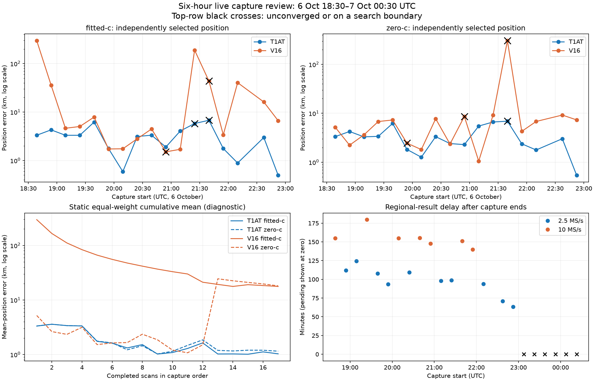

A continuous Kalman-style estimator needs capture-time measurements, delayed
update handling, empirical error covariance, correlation checks and outlier
gating. Averaging a few static estimates looked promising in the original review,
but that is not a moving-receiver filter validation. Hard60 improves the observed
outlier tail; this rollout does not introduce a Kalman filter or claim calibrated
covariance. A next independent evaluation should split randomized whole scan
groups, record assignments/seed, and fit calibration on training groups only.

### Timing-mode local minima and the original large failures

For **scan-fw-6bf407cfe8158445**, October 6 at 18:38 UTC, the original V16
fitted-c selection was 296.82 km away. An accurate basin had better frequency
NLL but retained expensive, weakly supported satellite timing modes under
σ=0.15 s. The discrete association criterion and subsequent V16 timing prior
favored different things. Reproducing the saved fits ruled out a simple timeout.

Sharing saved c-arm starts exposed a better local state, but did not explain or
systematically repair discovery. The subsequent root-cause work tested timing
priors and individual timing alternatives. At σ=1 s, this bad-sample comparison
improved fitted-c error from 296.818 to 4.459 km and c=0 from 5.195 to 3.574 km.
For **scan-fw-0695481606e1a3e8** at 22:09 UTC, fitted-c improved 40.361→0.873 km.
Extra optimization under the original prior did not produce the same repair.

The later six-case slope study did **not** contain the original 296.82 km and
189.44 km examples. Both archived wrong states already satisfied ±10 Hz/s.
Thus those examples were evidence for timing/search diagnosis, not proof that a
slope cap alone repairs them. The retained reports explicitly correct that
coverage misunderstanding.

Sources: [fit root cause](evidence/fit_root_cause/report.txt),
[timing prior](evidence/debug_timing_prior/report.txt),
[saved-start diagnostic](evidence/debug_search_gap/report.txt),
[bad-sample options](evidence/bad_sample_options/report.txt),
[original failure coverage correction](evidence/slope_priors/original_failures_review.txt).

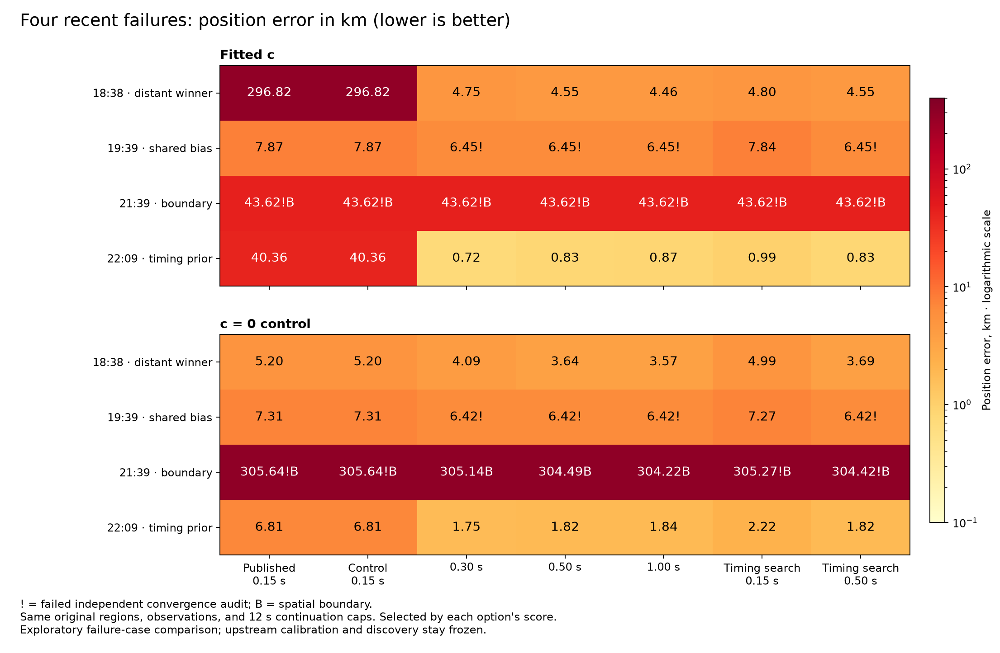

### Remaining bias, cones and receiver-pair clocks

The October 6 19:39 UTC capture, **scan-fw-6a376b600fc2f542**, retained about
7 km error at stationary interior solutions. Its frequency-data likelihood
favored the biased location; the timing prior favored the reference. Receiver-only
fits did not isolate one defective receiver. Early/late conditional fits disagreed.
Those historical temporal splits remain **temporal diagnostics**, not randomized
holdout validation. The physical cause was not established.

The 21:39 UTC capture, **scan-fw-e3bebc228093a125** (14:39 PDT), had an additional
coverage failure: none of the original final disks contained the reference.
Widening a T1AT disk from 12.5 to 25 km improved fitted/c0 errors from
6.760/7.062 to 3.645/1.662 km; widening the V16 disk alone did not fix V16.
Longer optimization and expanded V16 regions still left about 29 km fitted-c
and 303 km c0 error in the subsequent σ=1 s control.

Soft empirical receiver cones barely helped. Their probabilities were
conditional on reception by at least one receiver, not absolute visibility
probabilities; normalization and a nonzero floor limited rejection. A sharper
absolute gate improved the 19:39 case to roughly 5 km but worsened 21:39 fitted-c
to 139 km. **Hard east/west satellite exclusion is not adopted.**

A suspicious 5.9 km branch in the 14:39 PDT capture contradicted simultaneous
receiver measurements by about 6,000 Hz. Preserving RX0 and initializing RX1
from paired observations reduced median pair mismatch to about 67 Hz and reached
4.50 km under the unchanged zero-c likelihood. The later −129.15 Hz/s RX1
slope belonged to an experimental bad branch, not the original published result.
Original additional V16 RX0/RX1 slopes were +51.872/+119.462 Hz/s for c0
and −13.410/−5.572 Hz/s for fitted c.

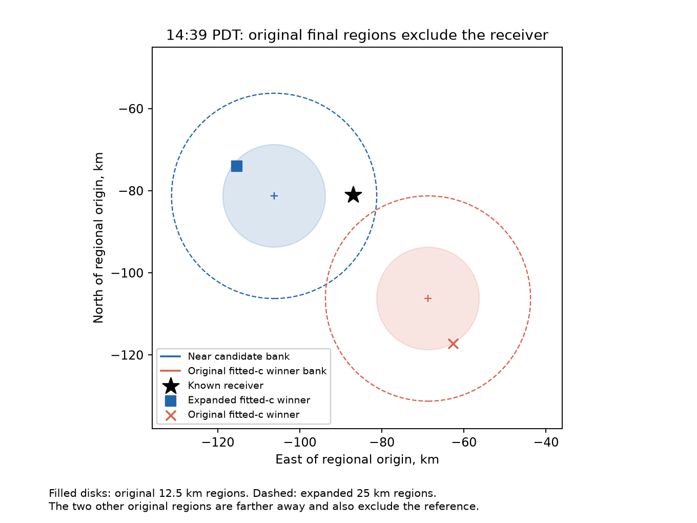
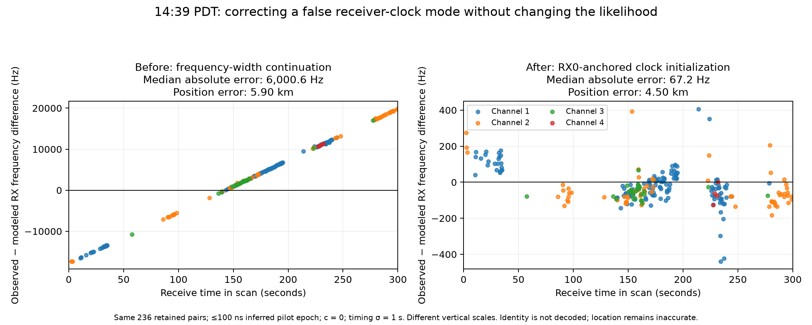

Sources: [shared bias](evidence/debug_shared_bias/report.txt),
[boundary](evidence/debug_search_boundary/report.txt),
[σ=1 root cause](evidence/sigma1_root_cause/report.txt),
[cones](evidence/sigma1_cones/report.txt),
[clock follow-up](evidence/cone_failure_debug/report.txt).

### Empirical drift and the ±10/30/60 prototypes

The eight-hour drift snapshot contained 31 scans, 22 completed and nine pending.
Most additional slopes were small; V16 c0 had conspicuous RX1 outliers, including
+119.46 and −95.27 Hz/s. These are fitted nuisance-parameter distributions,
not independent hardware clock measurements or posterior uncertainties.

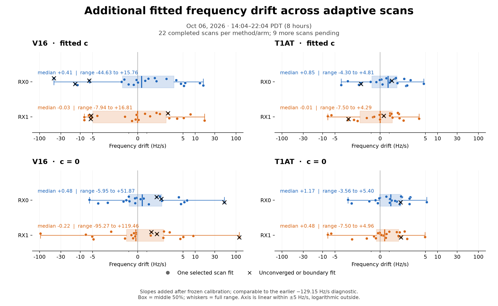

The first six-case comparison tested hard ±10, ±30 and ±60 Hz/s against an
unbounded control, with σ=1 s and matched final c arms. All selected unrestricted
slopes were already within ±9.5375 Hz/s. Different answers under inactive bounds
therefore exposed optimizer path dependence. That study also omitted the useful
V16 refinement region for the 14:39 PDT paired-clock repair.

The corrected 14:39 replay restored all three saved regions. A systematic recipe
using association/zero-timing starts plus same-arm continuation recovered
**2.152 km c0 and 3.942 km fitted-c**, with no hand-repaired clock seed.
“Missing region” meant an omitted candidate refinement disk, not absent RF data.
The production V1 runner did combine both methods' regions; the omission was in
the earlier slope experiment and must not be mislabeled a production union bug.

Sources: [drift snapshot](evidence/adaptive_drift_8h/report.txt),
[slope prototypes](evidence/slope_priors/findings.txt),
[corrected cutoff test](evidence/2139_slope_cutoffs/findings.txt),
[systematic starts](evidence/systematic_starts/findings.txt).

### Independent V16 discovery and the edge-priority defect

The next experiments stopped importing T1AT regions. V16 alone scored 400
positions and retained three regions. On the same 14:39 capture:

| Grid / edge policy | c0 error km | Fitted-c error km |
|---|---:|---:|
| 100/50/25/12.5, old edge priority | 2.790 | 3.145 |
| 50/25/12.5/6.25, old edge priority | 4.212 | 4.449 |
| 50/20/5, old edge priority | 9.451 | 13.659 |
| 50/20/5, corrected edge priority | 3.633 | 4.038 |

The old search gave unevaluated initial edge cells a score of zero. Actual NLLs
were positive and large, so the search treated those cells as unconditionally
promising. With 50/20/5, 212 of 400 points landed in the outermost 10 km.
Giving an unmeasured edge cell the nearest measured coarse-center score reduced
that to 41/400. All 207 shared point scores were identical.

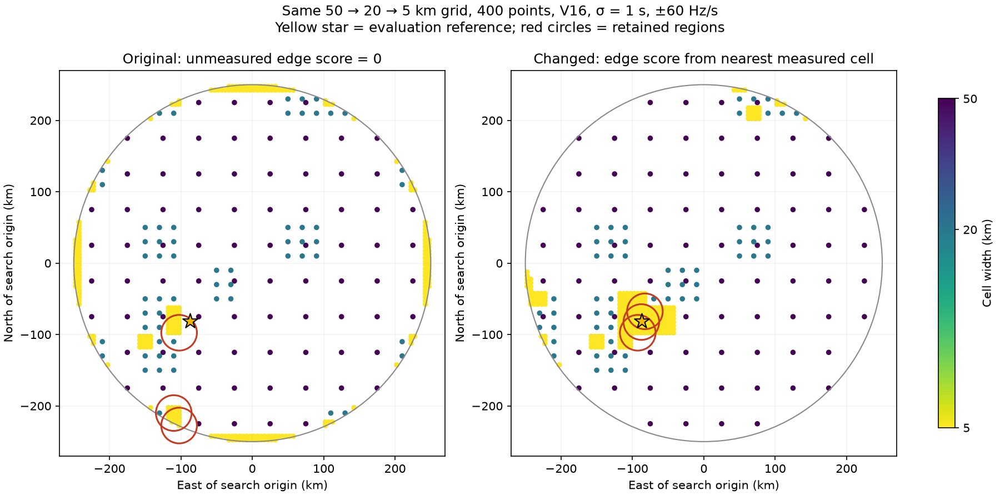

Halving simplifies coverage and avoids overlapping children. It does not make a
score-driven search statistically unbiased. Uniform 20 km and 5 km starting grids
would require 484 and 7,860 points respectively, already beyond the 400-point
budget. The later N64 study therefore tested the 40/20/10/5 hierarchy as a bundle
with timing and slope changes. [Full grid findings](evidence/single_method_grid/findings.txt).

## N01–N64: controlled before/after and timing/slope choices

These are the literal N01–N64 labels, not the older N17–N80 extension. The
controlled “before” is a fresh V16 replay with σ=0.15 s, unbounded slopes and
100/50/25/12.5 grid with old edge priority; it is not a reproduction of every
historical production or roof-initialized result. Observation inventories, causal
orbit banks, prior, 400-point search budget and fitting budgets were matched.

Errors below are horizontal great-circle kilometers, shown as **median / p90 /
maximum**. All arms in this table accepted 64/64 scans.

| Policy | c0 | Fitted c |
|---|---:|---:|
| Controlled before | 2.948 / 144.955 / 324.950 | 2.448 / 186.227 / 316.071 |
| σ=1, hard60, corrected grid | 2.121 / 3.410 / 23.955 | 1.584 / 3.374 / 26.564 |
| **σ=2, hard60, corrected grid** | **2.001 / 3.552 / 5.403** | **1.490 / 3.376 / 5.621** |
| σ=1, hard30, corrected grid | 1.955 / 4.308 / 8.954 | 1.457 / 4.042 / 9.577 |

The before run had seven c0 and nine fitted-c errors above 100 km; all three
revised policies had none. The σ=1/hard60 run missed the useful retained region
on N64 (23.96/26.56 km). σ=2/hard60 covered the reference in retained regions
on all 64 scans and reduced N64 to 0.952/1.430 km.

Hard60 improved 48/64 c0 scans and 40/64 fitted-c scans versus the controlled
before; 16 and 24 respectively became worse. Relative to σ=1/hard60, σ=2
improved only 25/64 c0 and 29/64 fitted-c scans. The reason for promotion is the
overall balance and reduced worst failures, not universal improvement.

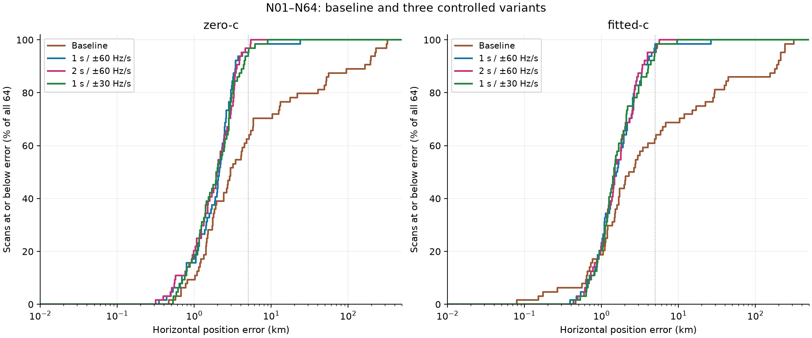
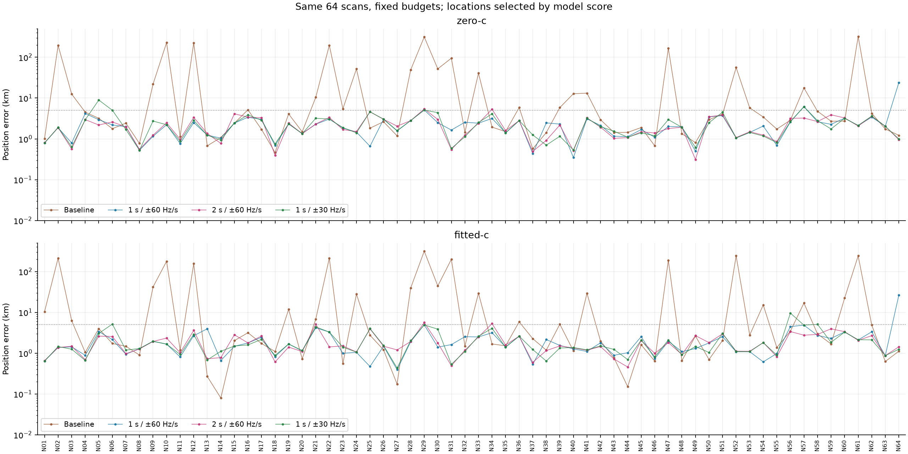

Fitted-c median posterior frequency RMS changed from 109.49 Hz before to 99.53 Hz
with Hard60; c0 changed 149.54→139.98 Hz. This is in-sample frequency fit,
reported separately from location accuracy. The study changed three mechanisms
together, so its large improvement cannot be attributed solely to the 60 Hz/s cap.

Sources: [before/after](evidence/n64_before_after/findings.txt),
[timing/slope comparison](evidence/n64_sigma_slope_variants/findings.txt),
[per-scan CSV](evidence/n64_sigma_slope_variants/results_long.csv).

## Gaussian and smooth slope priors

Every policy below uses σ=2 s and the same corrected grid and budgets.
“Gaussian60” uses slope SD=20 Hz/s plus the ±60 outer box. “Smooth60” is flat
inside ±30, then quadratic with excess scale 10, also retaining ±60. At width
30 those scales become 10 and 5 with a ±15 flat region. Each soft policy adds
4.5 NLL per receiver at its outer bound. Thus these were **interior soft penalties
with hard outer bounds**, not unbounded Gaussian tails.

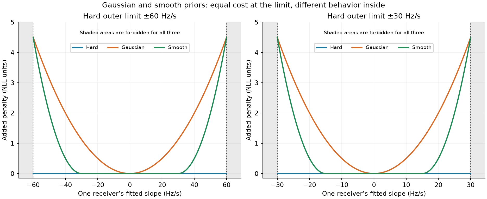

| σ=2 policy | c0 median / p90 / max km | Fitted-c median / p90 / max km |
|---|---:|---:|
| **Hard60** | **2.001 / 3.552 / 5.403** | **1.490 / 3.376 / 5.621** |
| Gaussian60 | 2.052 / 3.997 / 14.672 | 1.360 / 4.223 / 48.039 |
| Smooth60 | 1.975 / 4.585 / 27.379 | 1.517 / 4.770 / 26.791 |
| Hard30 | 2.022 / 4.781 / 92.717 | 1.494 / 4.562 / 99.949 |
| Gaussian30 | 2.443 / 5.288 / 107.225 | 1.601 / 5.058 / 108.459 |
| Smooth30 | 1.989 / 4.086 / 81.399 | 1.568 / 4.716 / 83.189 |

All selected arms completed 64/64. Gaussian60's better fitted-c median did not
offset its tail. Frequency fit and geography again disagreed.

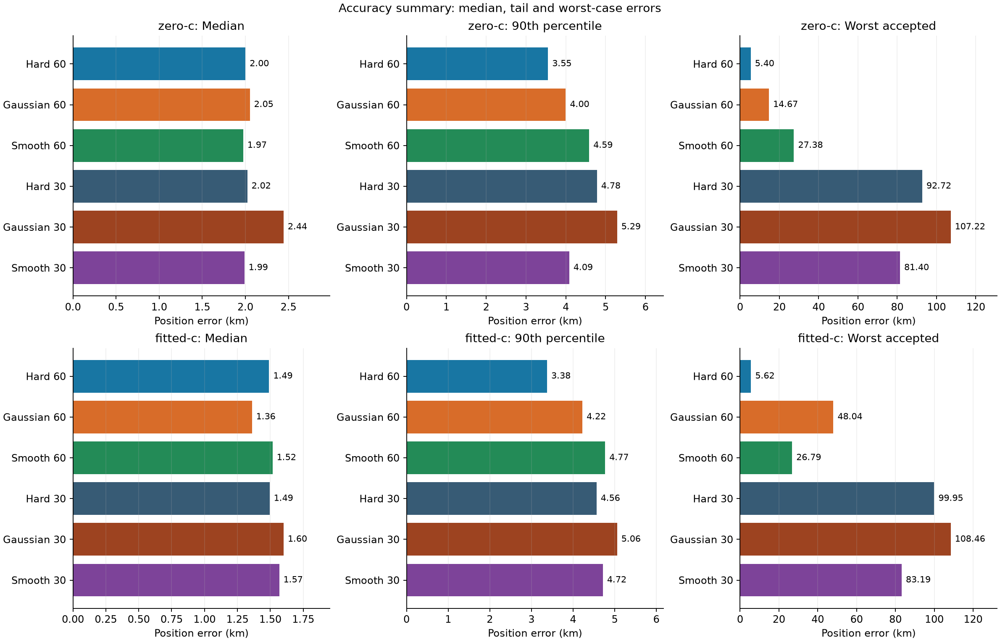
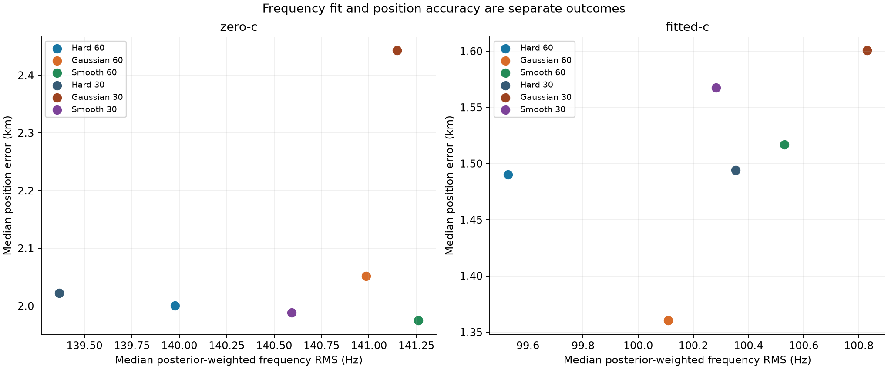

### Why a zero-cost interior helps this optimizer

Hard60 allows transient slope movement without changing the objective until the
outer bound. Its coarse fits ended at the bound on 141/25,600 points (0.55%),
versus 1,635 (6.39%) for Hard30. Smooth60's interior penalty was active on
6,535 points (25.53%). The penalty changes the optimization path even when the
final winner lies inside its flat region.

An exact N64 same-point replay at [−80,−80] km is particularly informative.
The Hard60 state was feasible under Smooth60 with zero additional slope penalty,
yet beat Smooth60's own found solution by 67.05 score units. It was also feasible
under Gaussian30 and beat that policy's found solution by 822.57 under its own
objective. Smooth60's penalty activated in only eight temporary evaluations.
This is direct evidence of a nuisance-optimization local minimum feeding the
coarse ranking, rather than evidence that the physically correct answer needs
an out-of-bounds clock. Six exact coarse replays reproduced archived results.

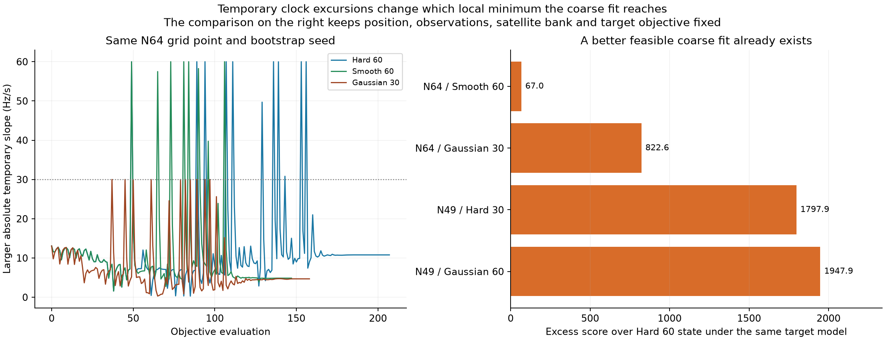

### Worst-case failure for each approach

| Policy / scan | Failure location | What the diagnostic established |
|---|---|---|
| Hard60 / N29, scan-fw-3bf35cdd73bf9970 | Final likelihood preference | All three regions cover the reference; nearest grid point 1.58 km. Selected errors 5.403/5.621 km. Refitting toward truth worsens data NLL by 669/543 while timing cost improves only 1.12/1.85. |
| Gaussian60 / N05, c0 | Regional scoring/ranking | 14.672 km selected; accepted 3.772 km candidate loses by 16.54 score units. |
| Gaussian60 / N49, fitted c | Grid plus final numerical rejection/ranking | 48.039 km selected. A feasible 4.76 km state scores much better but fails strict KKT. Restoring one existing region alone still does not repair ranking. |
| Smooth60 / N39, c0 | Calibration initialization | Near regions fail calibration. A zero-timing calibration restart yields 2.234/1.715 km with better scores, versus 27.379/22.323 km. |
| Smooth60 / N64, fitted c | Grid pruning | Existing-point diagnostic rescue gives 1.528/0.722 km with better scores, versus 24.455/26.791 km. |
| Hard30 / N49 | Grid pruning and calibration | 92.717/99.949 km; existing-region rescue gives 0.292/1.071 km. |
| Gaussian30 / N64 | Grid and downstream ranking | 107.225/108.459 km; rescued 8.834/9.167 km states still lose by score. |
| Smooth30 / N25 | Grid and downstream ranking | 81.399/83.189 km; 1.020 km fitted-c diagnostic still loses by 458.63 score units. |

Truth-selected grid rescues are **diagnostics only**, not deployment algorithms.
For N29, the 11.46 GHz group contributed +341.63 NLL against the reference while
10.96 GHz contributed −56.57 in its favor. Removing or halving the frozen
piecewise clock correction did not remove the bias. Its physical cause remains
unresolved; local profile evidence does not prove a global optimum.

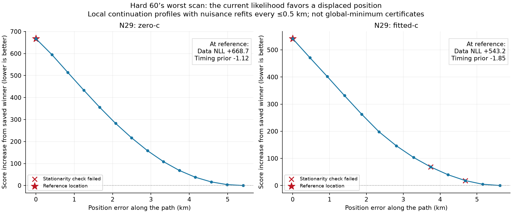

Sources: [soft-prior study](evidence/n64_soft_slope_priors/findings.txt),
[root-cause study](evidence/hard60_root_cause/findings.txt),
[failure-stage table](evidence/hard60_root_cause/failure_stages.csv).

## Three follow-up variants around Hard60

The final study completed 192 scan/variant cases (64×3), each with matched final
c arms. It tested three specific responses to the diagnosed failures:

1. **Two coarse nuisance starts:** independent zero-timing/zero-slope start at
   every fixed geographic point. This doubles coarse fits, not geographic points.
2. **Calibration recovery:** retry failed calibration with an alternate timing
   initialization, retaining the original acceptance threshold.
3. **Receiver×RF residual offsets:** additional final-stage nuisance offsets,
   50 Hz penalty scale and 150 Hz group caps, with gauges excluding receiver means
   and the shared linear RF coefficient.

| Policy | c0 median / p90 / max km | Fitted-c median / p90 / max km |
|---|---:|---:|
| **Hard60** | **2.001 / 3.552 / 5.403** | **1.490 / 3.376 / 5.621** |
| Two coarse starts | 1.946 / 3.552 / 5.403 | 1.502 / 3.217 / 5.298 |
| Calibration recovery | 2.001 / 3.652 / 5.403 | 1.490 / 3.376 / 5.999 |
| RF residual offsets | 2.261 / 5.303 / 299.192 | 1.590 / 3.597 / 5.665 |

RF-offset c0 accepted **60/64**; the other arms accepted 64/64. Its statistics
exclude failed scans, so the rejection count is essential context. The failures
were N16, N27, N46 and N52.

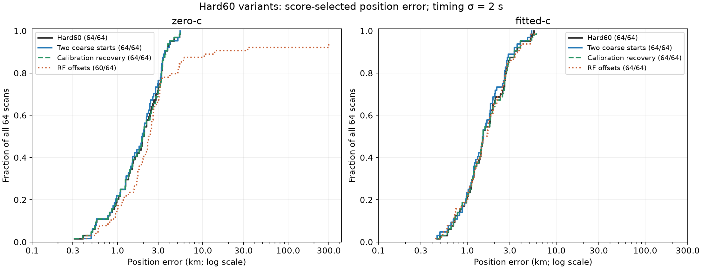
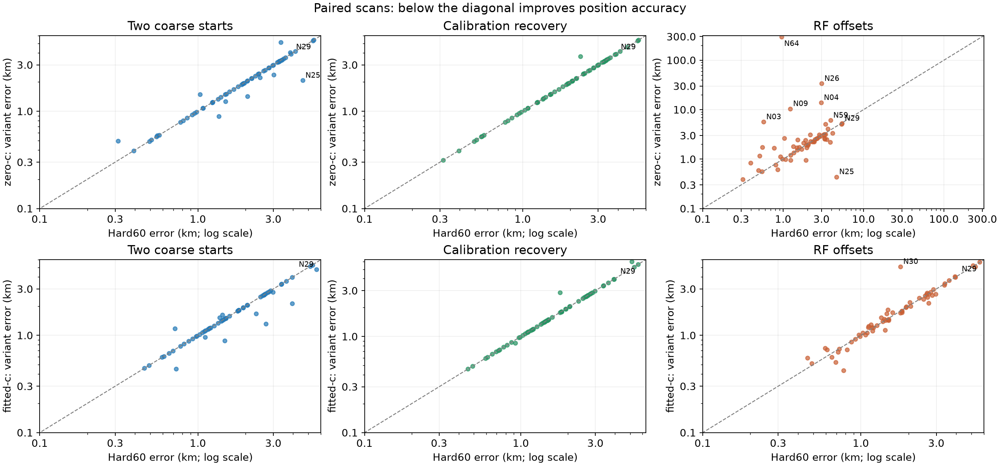

Two starts improved/worsened/left unchanged within 1 m: c0 **8/5/51**, fitted-c
**10/3/51**. N29 fitted-c improved 5.621→4.753 km; N25 3.939→2.135 km.
The second seed won 1,185/25,588 valid coarse comparisons (4.63%); 31/192 retained
regions changed. Recorded coarse fits doubled from 25,588 to 51,176. Summed
coarse-fit seconds rose 22,464→40,719, but cache/concurrency effects prevent
interpreting that ratio as production latency. This remains a candidate for a
cheaper, independently tested selective restart policy.

Calibration recovery repaired all eight failed regions, but better-score
recovered regions sometimes worsened location: N21 fitted-c 5.119→5.999 km.
More successfully fitted regions alone did not improve accuracy.

RF offsets lowered median paired frequency RMS by 5.64 Hz for c0 and 1.14 Hz for
fitted c without improving geography overall. N64 c0 selected a stationary
299 km state after a near 0.588 km state failed strict KKT (0.0034–0.0048 versus
0.001). Additional truth-free starts did not certify the near state. Directional
curvature suggested a numerical precision/conditioning issue, but was not a
global certificate and did not justify relaxing acceptance.

The historical RF-offset follow-up also ran conditional time-half and RF-group
held-out diagnostics on six watch scans. Search/bank/calibration were frozen from
the full capture. Time-half mean NLL worsened in both arms; RF-group results were
mixed and c0 acceptance incomplete. These are **not independent end-to-end or
randomized validation**. They remain labeled according to the procedure actually
run. Future validation must follow the repository's randomized independent-group
rule, with training-only preprocessing.

Sources: [complete findings](evidence/hard60_variants/findings.txt),
[per-scan outputs](evidence/hard60_variants/results_long.csv),
[validation receipt](evidence/hard60_variants/validation_full.json),
[conditional diagnostics](evidence/hard60_variants/holdout_summary.json).

## Implementation and deployment plan

1. Preserve the published V1 contract and its two-method historical products.
   Add a V2 document/namespace for one V16 Hard60 method and both matched c arms.
2. Keep the standard adaptive queue and tracking orchestrator. Change their
   default regional task to Hard60, require V2 publication for completion, and
   include the policy in job/configuration identities.
3. Apply bounds at every fitted stage, use V16 calibration and independent V16
   discovery, retain the corrected grid and 25 km minimum local disk, and accept
   only stationary final candidates. Record failed stages and all attempted fits.
4. Bind checkpoints to inputs, causal TLE evidence, complete policy and source
   digests. Old checkpoints/publications cannot satisfy the new completion check.
5. Package the numerically audited orbit kernel and narrow-Gaussian evaluator
   used by the experiments. Test values/gradients against the unchanged original
   evaluator. No runtime imports from report folders; no compiler runs in workers.
6. Publish a real 1080×960 PNG and digest-bound read-only V2 API route. The WebUI
   prefers Hard60, polls pending work, and labels V1 fallback as historical.
   Intrinsic image dimensions and responsive sizing preserve browser lazy loading.
7. Run component tests and a full recorded-capture canary; then stage immutable
   worker/API overlays and the built UI from the reviewed source delta. Preserve
   effective scratch, leases, admission cutoff, resource limits and capture cadence.
8. Push the reviewed commit to remote main with a normal fast-forward push.
   Select only analysis/API/UI overlays, reprocess one saved scan through the
   normal queue, and verify policy, slope bounds, acceptance and browser PNG decode.
   Save receipts and publish the final verification evidence.

No new RF, database schema change, QNAP mutation, golden fixture update, or
unbounded historical reanalysis is required. Partial-band inputs remain explicitly
unqualified for positioning and receive an insufficient-evidence Hard60 figure.

## What remains to establish

Hard60 is a better **development default** on this evidence. The model still
selects biased stationary locations on some scans, coarse fits can hit deadlines,
and a 400-point heuristic does not exhaust the prior. Repeated tuning on N64
means the small tail should not be treated as a prospective failure probability.

Before feeding these positions into an operational continuous filter, measure
end-to-end availability/latency, validate delayed updates, estimate conservative
location covariance from independent grouped holdouts, and test innovation gating
and correlated errors. Do not convert frequency RMS or the timing σ directly into
position covariance. The deployment retains diagnostic status for this reason.
