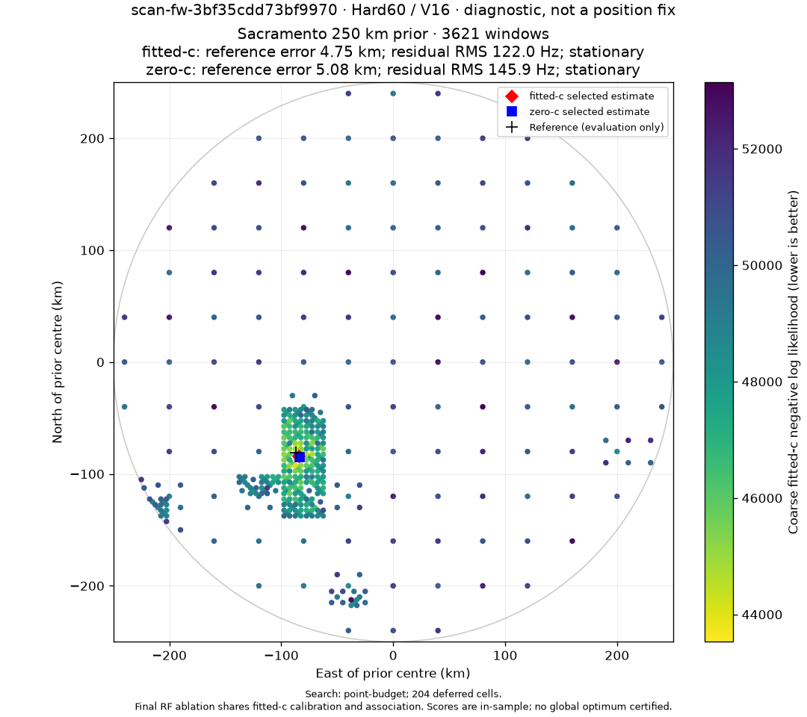
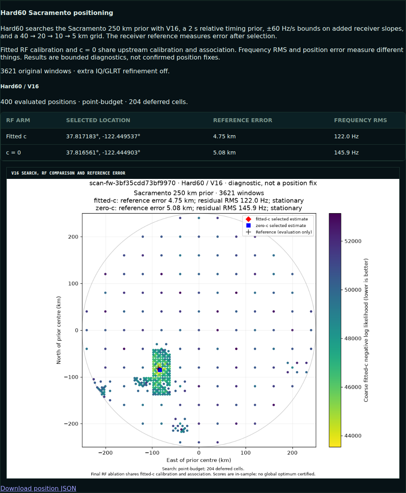

# Hard60 rollout receipts

The implementation and experiment report were pushed to remote main at
068e5e55c9ed3167fb857e51c489c09316763dc9. The numerical/runtime implementation
commit is 9675662455903e652488fbb65875442d9867fe99; the following commit only
decouples contract tests from CLI imports. Work started from remote main
55a5a419dffdfc23d14dda2b159797542d263b63 in an isolated checkout, preserving the
existing research checkout.

Analysis workers and API switched at **2026-10-08 00:12 UTC**. The normal queue
publication canary succeeded at **00:34:16 UTC**; real Chromium verification
passed at **00:36 UTC**. Hard60 is deployed and its PNG renders in the WebUI.

## Prepared change

The standard adaptive tracking queue now requires scanner-regional-position-v2,
whose single method is V16 under the named hard60-v1 policy. Published V1
contracts and namespaces remain unchanged. The V2 API adds a digest-bound PNG
route; the WebUI prefers V2 and explicitly labels historical V1 fallback.

The worker policy is σrelative=2 s, σcommon=3 s, hard ±60 Hz/s stage-specific
added slopes, nearest-measured edge priorities, 40/20/10/5 km, 400 points,
three regions, and stationary-only final selection. Both final c arms remain.

## Qualification completed before cutover

- 115 affected Python tests passed in the initial production-interpreter run;
  the final changed selection/publication checks passed another 20 tests.
- The actual staged worker imports passed **114 tests** with the worker's
  production interpreter; staged API imports passed **25 tests**. These include
  unchanged V1 compatibility, V2 storage/API and real PNG rendering.
- 51 affected WebUI tests passed; TypeScript and the production Vite build passed.
- All 64 saved Hard60 search orders reproduced exactly.
- 54 frozen final states matched the original likelihood and gradient within
  the declared 1e-6 absolute tolerances.
- Six same-start coarse fits reproduced saved objective values exactly.
- The new numerical kernel is built into the Python package; no report folder
  imports, runtime compilation or silent numerical fallback are used.
- The N29 saved-capture replay completed through the full CLI/input/TLE/search/
  publication path, over two bounded resumable slices, without copying old
  experiment scores into that run. It evaluated 400 points, retained three
  calibrated regions and attempted 18 final fits. No new RF was collected.

The ordinary change-aware deployment gate was run against the exact main base:

```sh
./ops test --base 55a5a419dffdfc23d14dda2b159797542d263b63
```

All ten selected pytest shards, Ruff checks/formatting, full WebUI tests and build
passed. **Whole-repository mypy failed with 28 errors in 14 unchanged files.**
An independent extraction of the exact main-base sources produced the identical
28 error lines: zero added or removed errors. These include missing existing
Pluto SDK modules, literal-version inheritance and existing typing issues.
This is not a passing whole-repository receipt. The scoped overlay follows the
same qualification approach as the preceding regional-position deployment.

Evidence: [deployment receipt](deployment-test-receipt.json),
[gate output](deployment-test.log), [main type-check control](main-control-mypy.log),
[worker tests](staged-worker-tests.log), [API tests](staged-api-tests.log),
[numerical parity](numerical-parity.json), [web tests](web-tests.log).

## Saved-scan qualification

Capture: N29, **scan-fw-3bf35cdd73bf9970**, October 1 at 16:10:51 UTC.
There were 3,621 original observation windows. The selected estimates were:

| Final arm | Position error | Frequency RMS | Original-oracle projected KKT |
|---|---:|---:|---:|
| Fitted c | 4.754 km | 122.014 Hz | 0.000281 |
| c=0 | 5.084 km | 145.874 Hz | 0.000222 |

Both selected fits are stationary under the original Python objective and
independent constraints audit. Objective repricing differences are below 2e-11.
All 400 coarse, calibration and final saved slopes satisfy ±60 Hz/s; the maximum
absolute retained stage slope is 54.09993 Hz/s.

Configuration:
`sha256:76d851f39dbfc06decdaacfc50b7b552a2f87f639b72b6b8470aebe5d9c9cf9a`.
Checkpoint binding:
`sha256:f534bb87871ea7f2f285cbeb970ac193cf0d7b6c0fbdb47a7b349009f0684702`.

The live-input replay is deliberately distinguished from the frozen N64 study.
Input/analysis manifests and all observation windows match, but the existing
production rule selects the latest TLE snapshot before **capture start −505 s**.
That selects a 7,605-second-old snapshot and **991 satellites**. The frozen study
used a causal snapshot only 372.5 seconds old and **957 satellites**, which does
not meet the production margin. The rollout preserves the pre-existing production
TLE rule. Therefore 4.754/5.084 km are operational canary results, not a controlled
improvement over the archived N29 Hard60 values of 5.621/5.403 km.

See [input comparison](canary-input-comparison.json),
[independent publication audit](publication-audit.json),
[qualified document](qualified-document.json) and
[slice receipts](qualification-slices.log).



## Selected production runtime

Worker and queue:
`/opt/leo-hard60/967566245590-r1/worker/src`.
API:
`/opt/leo-hard60/967566245590-r1/api/src`, retaining the previous secondary
API source path. UI:
`/opt/leo-hard60/967566245590-r1/web/dist`.

All **19 previously active analysis workers** and the API are running. Their
actual process environments, read through /proc, point to these new source trees;
the queue service's selector points to the same worker tree. Source and UI hashes
were rechecked against the staged inventory before selection.
The capture timer remains active. Existing scheduler capacities remain
memory=12 and heavy=13; neither was changed.
See [live process bindings](live-runtime.json).

Selectors are the new `zzzzzzzzzzzzzzz-hard60.conf` drop-ins, whose exact contents
are retained as [worker.conf](worker.conf), [queue.conf](queue.conf) and
[api.conf](api.conf). The stage was built with [stage_overlay.py](stage_overlay.py)
using separate inherited worker/API trees; report code is not a runtime dependency.

## Normal queue publication canary

The public bounded backfill CLI admitted exactly one saved capture using its
publication-index timestamp 1790891486381410952 for both bounds. The resulting
production job is **48605**. Only this pending verification job was given
temporary priority 1000 so it can use the next free normal worker slot; no live
lease was stolen and no resource capacity was increased.

To avoid recomputing the full qualification, 424 verified numerical stage receipts
were transferred through checkpoint reader/writer ports under the exact matching
configuration/input/evidence binding. **No finished result document or PNG was
copied into production.** The normal tracking worker must generate those products.
This checks deployment, resumption, publication and browser delivery; it is not
an independent second full numerical search.

Evidence: [queue admission](production-enqueue.log),
[checkpoint transfer audit](checkpoint-transfer.json),
[transfer recipe](seed_canary.py).

Job 48605 completed with state **succeeded**, outcome **complete**, and no error,
under `adaptive-worker-22-5f3bc8af2ce1`. The job also completed its previously
missing tracking V15 and adaptive TLE V3 prerequisites before Hard60 publication.
The temporary priority was restored to zero. See the
[production job receipt](production-job.json).

## Live API and browser verification

The live V2 API returned complete. Its input, analysis, policy and evidence
digests match the qualification, as do the full method results, retained basins,
calibrations and all final fit states. The production worker independently rendered
and published the figure from the resumed numerical stages. Its PNG is byte-for-byte
identical to qualification: **167,010 bytes**, **1080×960 pixels**, SHA-256
`9bdfb2478f7611367ad070fe6d46a9e00670bdf3c2e0c2f9cf29da4c1f801eda`.

A fresh Chromium browser loaded the actual deployed page with no network mocks,
injected images or DOM edits. It displayed **Hard60 / V16**, both stationary c
arms, and one decoded map with nonzero layout width. The digest-bound image route
returned HTTP 200 and `image/png`; the browser reported zero page errors and zero
Hard60 panel alerts. The screenshot waits for neighboring lazy-loaded images and
fonts to settle, then captures the unmodified panel.

Evidence: [live publication comparison](live-publication-verification.json),
[browser receipt](browser-verification.json),
[reproducible browser check](verify_browser.mjs),
[post-canary service bindings](post-canary-runtime.json).
All 19 analysis workers and the API remained active on the selected sources after
the canary; the existing capture timer remained active.



## Scope and rollback

The staging operation copies the effective immutable worker and API source trees,
applies only the reviewed role-specific delta, and records inherited/replaced file
hashes. Existing files being replaced were checked byte-for-byte against the
reviewed main base. The API's built UI is staged alongside those sources.

Cutover changes only the final analysis-worker, queue and API drop-ins. Workers
retain their existing SIGINT cancellation/requeue behavior, scratch roots,
concurrency limits and capture admission cutoff. The capture service/timer and
database schema are unchanged.

Rollback removes this rollout's Hard60 selector drop-ins, reloads systemd, and
restarts the same affected analysis/API services. Earlier selectors remain.
Retain all V2 products and digest-scoped checkpoints; V1 readers ignore them.
No data deletion is part of rollback.
