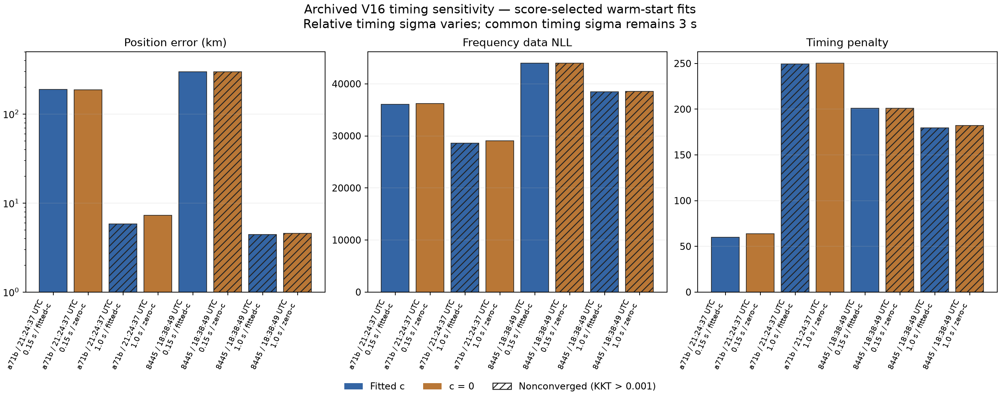
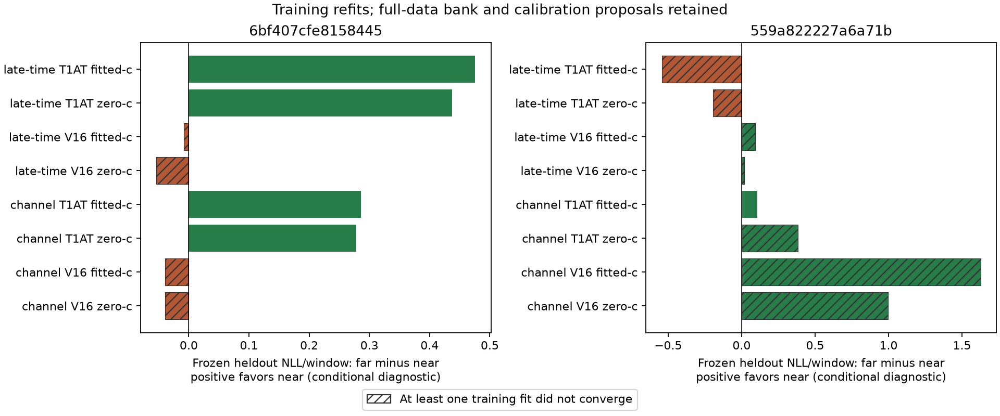
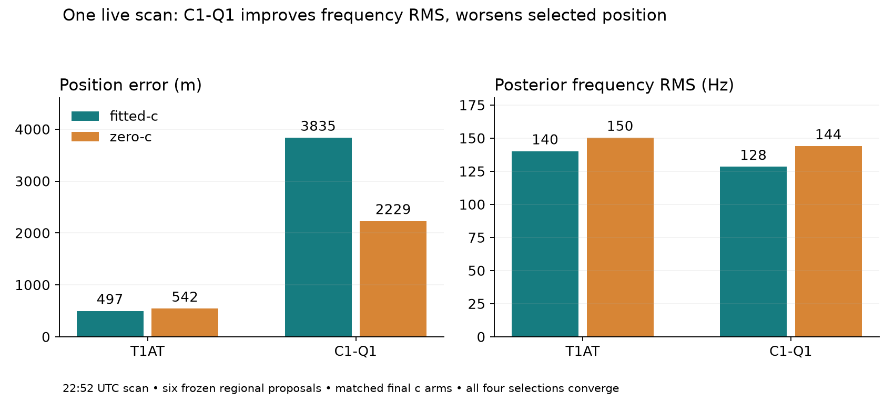

# Live T1AT/V16 follow-up: freshness, timing, initialization and confirmation

Completed October 7, 2026 with three parallel Sol agents and a root integration review. **Keep T1AT as the reference.** Restoring TLE collection fixes an operational problem; the numerical experiments identify several distinct inference failures without establishing a replacement model.

The most actionable new finding is an optimization consistency failure: **8 of 17 published V16 fitted-c selections are beaten by already-computed c=0 states under the same objective.** T1AT has no such failures in this cohort. A more flexible model can reuse a zero-c state, so these are missed feasible solutions, independently of whether the satellite labels are correct. This also sharpens the earlier timing-prior diagnosis: the 297 km case has an existing 5.2 km alternative that wins without changing V16's prior.

## What changed and what was tested

| Workstream | Completed action | Result |
|---|---|---|
| TLE freshness | Started the existing enabled timer; verified collector and next scheduled trigger | Fresh snapshots published; timer active |
| Timing prior | 80 matched refits across every successful archived final basin of two catastrophic scans | Relaxing relative sigma moves selected regions closer; convergence limits promotion |
| Initialization | 160 fixed-state repricings, plus nested-score audit of all 17 recent scans | Existing zero-c states expose missed V16 solutions |
| Reserved observations | 32 train fits with time/channel splits and frozen test evaluation | Wrong regions are not consistently rejected |
| C1-Q1 | 48 matched fits across six archived regional proposals on a third scan | Worse selected position than T1AT in both RF arms |

All numerical work uses existing saved observations and the exact original archived TLE. The refreshed catalogue is deliberately not substituted during these causal comparisons. The only production operation was restoration of the existing TLE timer; scoring and catalogue-selection policies remain unchanged. No RF collection was started, and no QNAP data, persisted public contracts or golden fixtures were changed.

## Live baseline being explained

The [preceding review](../2026_10_07_live_position_review/README.md) froze six hours ending **October 7 00:33:49 UTC**: 23 captures, 17 completed regional products and six pending. Median capture-to-publication delay was 117 minutes. The most recent completed capture began October 6 at 22:52 UTC.

| Model | Final RF arm | Median position error | Worst | Converged selections |
|---|---|---:|---:|---:|
| T1AT | fitted c | 3.31 km | 6.76 km | 16/17 |
| T1AT | c = 0 | 3.30 km | 6.90 km | 17/17 |
| V16 | fitted c | 5.03 km | 296.82 km | 15/17 |
| V16 | c = 0 | 6.79 km | 305.64 km | 14/17 |

These aggregates include completed nonconverged selections. Historical N01–N16 roof-calibrated local searches are a different experiment; their approximately 1.17 km V16 median does not establish superiority in regional inference.

## Fresh downloads can still select older orbital elements

The timer had been cleanly stopped October 4 at 21:16 UTC; available logs do not identify the requester. Starting it at October 7 00:58:56 triggered persistent catch-up. Collection succeeded in 4.893 seconds. The 01:01 scheduled trigger also succeeded, intentionally rate-limiting both providers after the recent collection. Hourly scheduling remains active.

Space-Track's catalogue collection age fell from 52.93 hours to seconds; its full-catalogue median element age fell from 62.82 to **14.55 hours**. Hugging Face's fresh download has median element age **24.20 hours**, with a maximum around 379 hours. These provider-wide ages differ from the earlier scan-specific ages of selected satellites.

The deployed reader chooses the most recently **downloaded** causal snapshot across providers. Hugging Face arrived 2.23 seconds after Space-Track, so it becomes the selected source for sufficiently late capture starts (after approximately 01:07:25.615516 UTC under the existing 505-second causal margin), until a newer eligible snapshot appears.

Among 10,665 overlapping NORAD IDs, Space-Track has newer element epochs for **9,174**, equal epochs for **1,491**, and older epochs for **none**. Its median epoch advantage is 9.40 hours. Inventories also differ: 474 Space-Track-only and five Hugging-Face-only IDs. Thus fixing download freshness alone does not fix source quality. A preferred-provider/element-age policy needs an explicit, tested receipt and whole-catalogue fallback; per-ID mixing is not implemented here. [Freshness evidence](freshness/findings.md).

## Timing and initialization are separate failures

The timing experiment varies only V16's relative timing sigma from **0.15 to 1 second**. Common sigma stays 3 seconds; frequency width, detection/clutter parameters, observations, candidate banks, calibration baselines, geographic bounds and optimizer budgets are matched. Both c arms use the same two archived fitted-c seed vectors per basin. Six successful basins in the first scan and four in the second yield 80 fits.

| Scan | RF arm | Original-sigma control error | Relaxed-sigma error | Relaxed convergence |
|---|---|---:|---:|---|
| 18:38, `6bf407…` | fitted c | 296.818 km | 4.447 km | No; strongly nonstationary |
| 18:38, `6bf407…` | c = 0 | 296.812 km | 4.581 km | No; strongly nonstationary |
| 21:24, `559a82…` | fitted c | 189.436 km | 5.813 km | No; KKT 0.00148 versus 0.001 threshold |
| 21:24, `559a82…` | c = 0 | 187.700 km | 7.288 km | Yes |



The relaxed fitted-c winner in the second scan also touches its local basin boundary. These are sensitivity results, not validated accuracy improvements. The fitted-c-only seed pool fails to reproduce published zero-c near solutions, exposing another source of sensitivity. The run took 339.7 seconds including reconstruction; each fit had five seconds and 300 iterations.

Separately, repricing all archived vectors from **both RF arms** needs no optimization. On `6bf407…`, the archived 5.195 km zero-c state scores **44,111.833**, better than the 296.818 km published fitted-c state's **44,170.238**, under unchanged V16 settings. A zero-c state is feasible in the free-c model with identical score. Its constrained convergence does not establish free-c stationarity; it is nevertheless an existing better feasible state.

The [17-scan nested-score audit](nested_scores.json) finds this score-ordering failure in **8/17 V16 selections and 0/17 T1AT selections**. Simply substituting the lower-score zero-c state would improve position in three of those eight cases and worsen it in five, including a 43.6 to 305.6 km regression. A score-floor guard can detect an optimization failure, but cannot certify a position or identity. Candidate seeding, score calibration and independent confirmation all remain necessary. [Full timing findings](timing/findings.md).

## Reserved-window checks are not yet independent confirmation

The diagnostic reserves the last quarter of observed time or a populated channel per receiver, then fits position and nuisance parameters on training rows and scores the reserved rows without refitting. Both regions see exactly the same original top-one windows, including clutter/unassigned windows. The original full-scan clock/RF coordinate frame is preserved in both subsets.



The first scan's T1AT comparisons favor the near bank on both folds; V16 weakly favors the far bank. The second scan changes preference with method/fold. Only **17/32 fits converge**, and just **5/16 near/far pairs** have both fits converged. Frequency prediction improvements and position accuracy can move in opposite directions in the matched RF arms.

These are **conditional predictive diagnostics**. The proposal, association and receiver baseline were originally learned from the full scan. The near comparison bank was selected using the evaluation-informed best-within-10-km archived result. Withholding final-fit rows does not undo that leakage. The experiment therefore does not establish independent NORAD identities, statistical significance, or a reliable rejection threshold. Clean confirmation requires training-only proposals/calibration and observations reserved before selection. [Protocol and results](heldout/findings.md).

## C1-Q1 also fails to improve the tested live scan

The research adapter implements the historical 0–1 degree quintic horizon gate and 1/3-second relative timing sigma, retaining T1AT's other settings. It uses all six archived regional proposals on the 22:52 scan, the same original inputs and two archived T1AT seed vectors per basin for both models and both c arms.



T1AT errors are **497 m fitted-c / 542 m zero-c**. C1-Q1 errors are **3,835 m / 2,229 m**, despite lower posterior frequency RMS. All four selected fits converge; 43 of 48 total fits converge. Final C1-Q1 banks differ between RF arms, so their selected-error difference is not a fixed-bank RF treatment effect. The single scan and T1AT-derived warm starts limit generalization. [C1-Q1 findings](c1q1/findings.md).

## Verification and reproducibility

- Eight component-owned tests pass: C1-Q1 likelihood/gradient/geometry checks and reserved-window separation, frozen prediction and coordinate-frame checks. A separate Sol agent reviewed C1-Q1 and reran its tests.
- Forty archived V16 and twelve archived T1AT objective values reproduce the original numerical values; timing-only objective and gradient differences are checked on every timing seed.
- [Independent input verification](heldout/verification.json) passes for all three scans: capture/analysis manifests, original TLE bytes and causal timing, complete ordered candidate inventory, window evidence, configuration digest and checkpoint binding.
- Matching checks verify exact basin/start/bank inventories, c=0, common timing priors and additive score decomposition. Source digests and the exact executed helper snapshot distinguish later provenance-assertion hardening from executed numerical code.
- All 24 published Python files pass Ruff lint and formatting checks. Preformat sources are preserved as `.py.txt` artifacts with digest manifests; numerical receipts retain their original executed-source hashes. Publication formatting does not rerun numerical fitting.
- Runners require the archived analysis store and deployed numerical modules; this report bundle contains compact results and research code, not the raw radio corpus or a standalone deployment.

For the focused tests, use the scientific environment and deployed numerical overlay:

```sh
PYTHONDONTWRITEBYTECODE=1 \
PYTHONPATH=/opt/leo-regional-position/05ba40d4fd68-r2/worker/src \
OPENBLAS_NUM_THREADS=1 \
/srv/bulk/leo-dev/adaptive-three-position-methods/.venv/bin/python -m pytest -q \
  reports/2026_10_07_live_position_followup/c1q1/test_model.py \
  reports/2026_10_07_live_position_followup/heldout/test_protocol.py
```

## Next implementation priorities

1. Make causal provider selection explicit and expose actual element ages; verify whole-catalogue fallback and candidate-inventory changes. The timer repair is complete; this selection-policy change is still pending.
2. Share feasible seeds across RF arms and add a nested-score consistency check. Re-evaluate free-arm stationarity when importing a constrained state, and keep score quality separate from localization confidence.
3. Use training-only association/calibration for independent time/channel confirmation on fresh causal snapshots, retaining matched c arms and bounded budgets. Carry competing regions and convergence status forward rather than asserting an unconfirmed NORAD/position winner.
4. Retain T1AT as the empirical reference. Neither relaxed V16 nor C1-Q1 nor GLRT mark weighting has earned promotion from these results.
