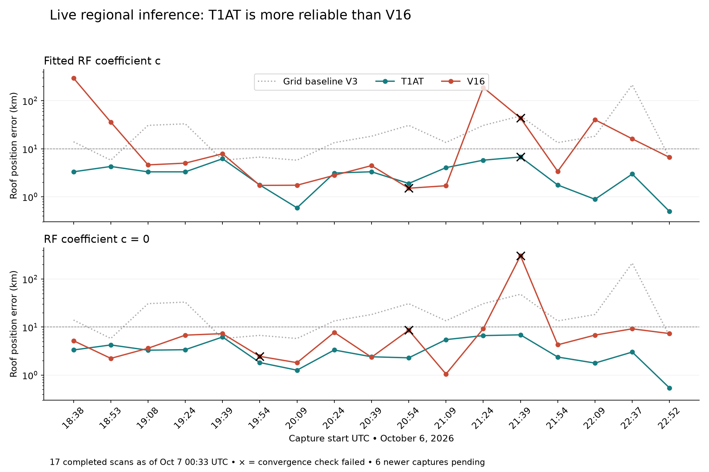
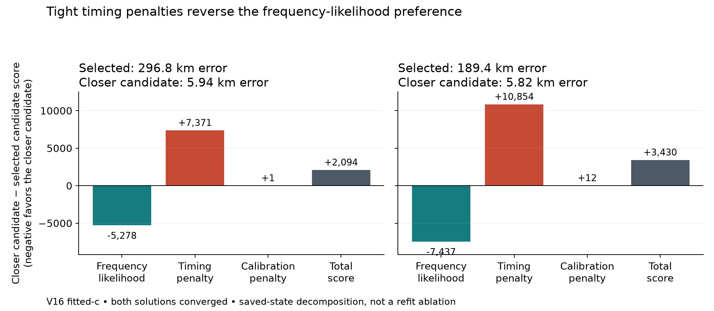

# Recent automated T1AT/V16 position review

Frozen snapshot: October 7, 2026 at 00:33:49 UTC. The six-hour capture interval contains 23 recordings, 17 completed regional products, four checkpointed jobs and two with no regional checkpoints yet. Capture-to-regional-publication delay has median 117.15 minutes and maximum 184.70 minutes, measured using document modification time. The latest completed capture starts October 6 at 22:52:24 UTC.

**T1AT is more reliable on this cohort.** Historical V16 development results used roof-conditioned calibration and local search, so they do not establish superiority for the automated Sacramento-centered 250 km regional prior.

| Method | Final RF arm | Median error | P90 error | Worst error | Converged |
|---|---|---:|---:|---:|---:|
| T1AT | fitted c | 3.31 km | 5.96 km | 6.76 km | 16/17 |
| T1AT | c = 0 | 3.30 km | 6.39 km | 6.90 km | 17/17 |
| V16 | fitted c | 5.03 km | 101.95 km | 296.82 km | 15/17 |
| V16 | c = 0 | 6.79 km | 9.22 km | 305.64 km | 14/17 |

All completed selections enter these aggregates, including nonconverged ones. The older V3 grid baseline has 14.01 km median error with 12.5 km finest spacing; its resolution differs from the continuously refined models.

## Evidence of distinct failures

- The TLE timer was enabled but inactive. Used snapshot collection ages range from 46.60 to 50.82 hours; element ages among saved basin satellites range from 51.57 to 127.56 hours. The median of per-scan median element ages is 62.10 hours. These measurements identify stale input, not its causal share of the position error.
- T1AT and V16 select the same fitted-c source basin on eight of seventeen scans. Across the cohort, 7,598 shared assigned windows receive different discrete NORAD labels. On the 296.82 km V16 failure, 2,532 of 2,612 common assigned windows differ from T1AT, including 650 windows labeled 67336 versus 58601. These are incompatible assignments, not independently established satellite identities.
- V16 selects converged 296.82 km and 189.44 km positions despite completed near alternatives. At saved candidate states, timing penalties reverse better near-region frequency likelihoods. This decomposition does not itself refit a different prior.
- On the latest completed scan, the same fitted-c satellite bank and discrete assignments give 497 m error with T1AT versus 6.63 km with V16, while posterior frequency RMS falls from 140.1 to 108.7 Hz. A better in-sample frequency fit does not certify location.
- Every model hierarchy exhausts its 400-point budget. Ninety-three successful calibration basins have converged pre/post fits, and seven basin stages failed calibration convergence. Every successful association stops at no improving greedy repair, which is local heuristic termination rather than identity verification.

The final RF-term comparison uses shared fitted-c calibration and association. T1AT selects the same bank in both RF arms on all seventeen scans: fitted c changes error by median −70 m and posterior RMS by −10.21 Hz. V16 retains the same selected bank in only eight arm pairs; within that subset, fitted c changes error by median +250 m while RMS improves by 13.35 Hz. Different selected banks are not pooled as a clean fixed-bank RF treatment effect.

## Follow-up supersedes the initial diagnosis

The [parallel Sol follow-up](../2026_10_07_live_position_followup/README.md) restores TLE collection and performs bounded timing, initialization, reserved-observation and C1-Q1 experiments. It discovers that eight V16 free-c selections are beaten by existing c=0 states under the same objective, and that current snapshot selection can prefer a later download with older elements. These findings separate optimizer/start selection from prior-induced ranking and prevent interpreting the saved timing decomposition as the sole cause.

## Artifacts

`audit.py` reads and verifies published regional documents and plot artifacts through their storage port, matches capture digests and freezes the capture inventory. `cases.py` reads verified checkpoints, computes score decompositions, compares discrete assignment labels and checks actual orbital element epochs. `summarize.py` produces `summary.json`, `per_scan.csv` and the figures without new fitting. `snapshot.json`, `cases.json` and `tle_timer_status.txt` retain the evidence and source digests. Position truth is used only for evaluation, never to choose these live published estimates.
