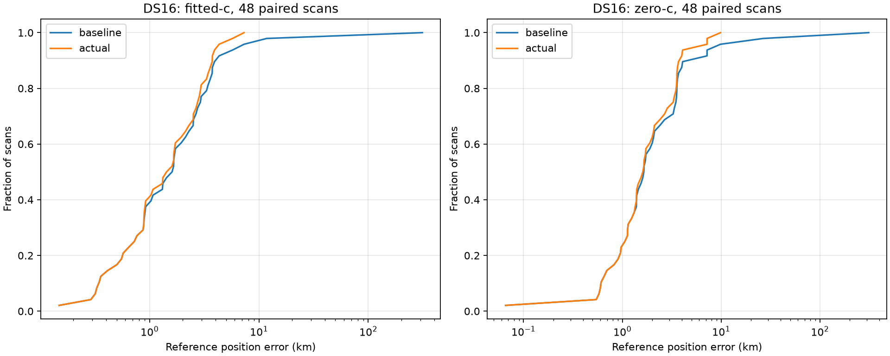
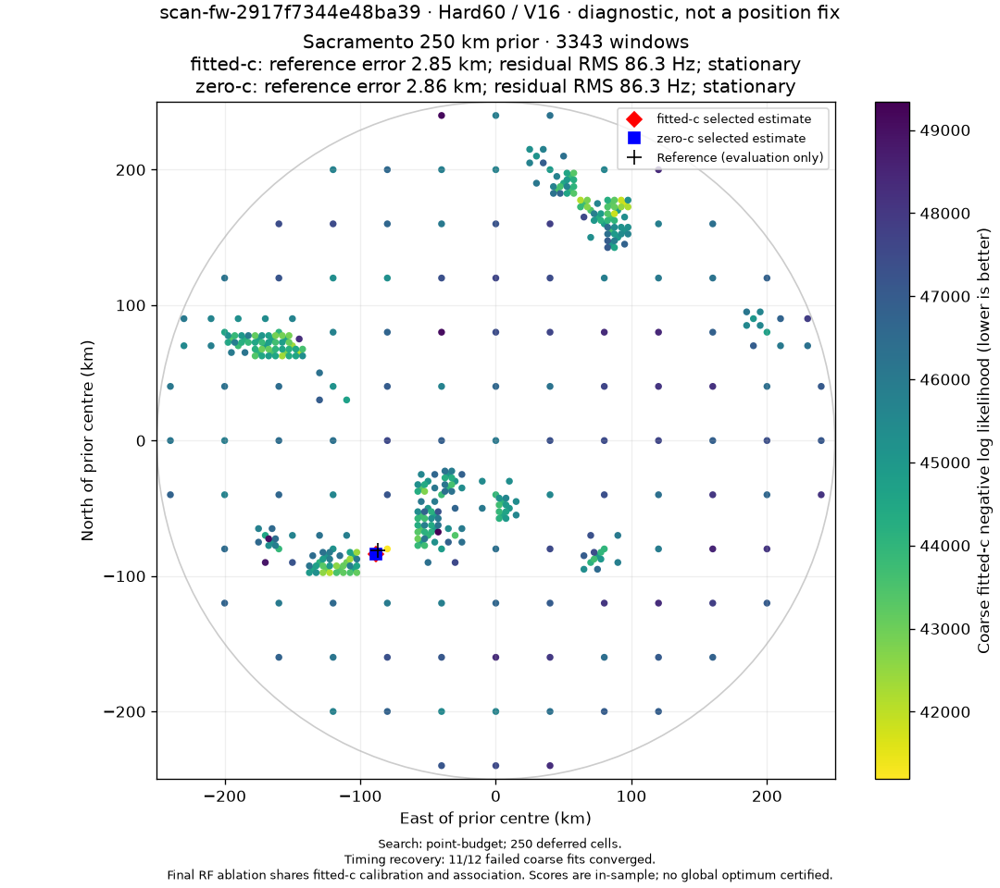
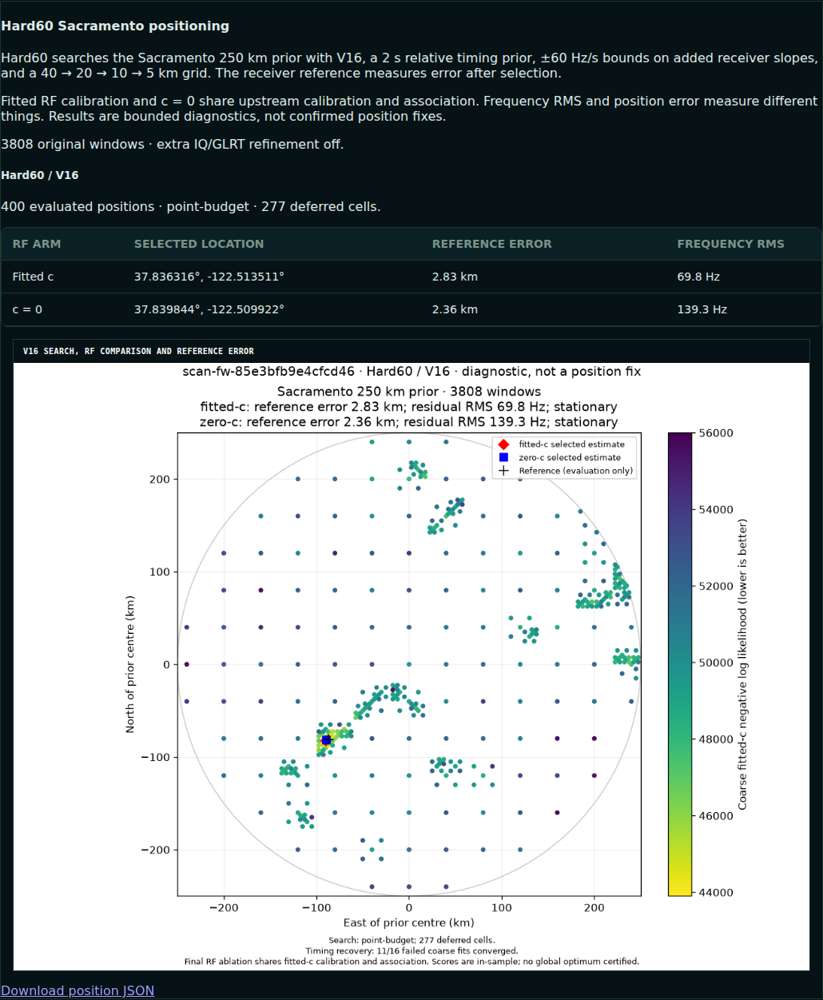

# Hard60 bounded-timing recovery rollout

The standard adaptive analysis default now adds **B: directly bounded satellite
timing variables** when an original 40 km coarse fit fails its independent
convergence audit. Runtime revision: `7d296d36d733a18fbc4ec28c63dc579ef2f7f136`,
pushed to remote main. Cutover completed **2026-10-08 14:49:42 UTC**.

Configuration digest:
`sha256:d1524c45e6e702008221d941240e7a0ac26f13feac87fef73e83f04c9c0a80f6`.
The recorded configuration includes `recovery_policy=failed-coarse-box-v1` and
hashes both new production modules. Existing published V1/V2 contracts and
immutable publications remain unchanged.

## Why this policy

The original SLSQP fit optimized a common timing offset plus zero-sum relative
offsets. Its out-of-range evaluation guard returned a discontinuous `1e12`
penalty. The optimizer could terminate successfully at one state while the
wrapper returned a different, lower-score feasible state with a failing KKT
audit. More allowed wall time did not fix an optimizer that had already stopped.

The recovery solver instead directly bounds each satellite's total timing shift
to ±20 s, reconstructs the common offset as their mean, and keeps the common
offset constrained to ±10 s. The physical likelihood, Gaussian timing priors,
and slope bounds are unchanged. A small existing orbit interpolation margin
allows numerically consistent evaluation at the timing boundaries.

Only independently stationary states can calibrate or become final position
estimates. The returned stationary state, terminal optimizer state and best
feasible evaluated state are recorded separately. A better in-sample score alone
does not certify convergence or better localization.

Recovery applies only to failed supported coarse fits. The original search and
final candidates remain available. This is deliberate: in the prototype study,
replacing successful fits was not reliably beneficial. The earlier three-way
comparison is retained in the self-contained [optimizer study](optimizer-study.html).

## Operational behavior

1. Run the original 400-point, 40/20/10/5 km search with nearest-measured edge
   priorities and the original calibration/final fits.
2. Retry nonstationary supported 40 km fits from their original bootstrap seeds,
   using the new parameterization, at most 5 s and 200 iterations per attempt.
3. Re-rank existing regions using the better feasible coarse score. Recoveries
   that enter the three retained regions receive calibration, association and
   final fitting; they do not erase the original finalists.
4. Require independent convergence before and after calibration. Try the coarse
   state first, then a zero-timing start if necessary. Calibration/final fits have
   20 s and 600 iterations each; association retains its 60 s budget.
5. Fit both `c=0` and fitted-`c` using the same observations, candidate set,
   calibration, association, priors, three starts and final search budgets.
   Select within each arm by original model score plus calibration penalty.
6. Checkpoint every operation. Resumption uses a new configuration/input/evidence
   binding. Published PNGs include recovery counts and the selected arm results.

The default remains σrelative=2 s, σcommon=3 s and hard ±60 Hz/s **per-stage added
affine slopes**. The cap is not a bound on the accumulated receiver calibration.
Both RF arms share fitted-`c` calibration and association; this is a controlled
conditional final-stage ablation, not a completely independent zero-`c` pipeline.
Reference coordinates enter only after model-score selection.

## Integrated DS16 regression

All 48 saved DS16 scans were replayed through the integrated production runner.
Baseline stages were read from their verified immutable checkpoints; all new
recovery work was computed afresh. This comparison preserves observations,
candidate sets, original search budgets and candidates. It is not a cold replay
of all 48 searches. The full cold S27 replay is reported separately below.

All 96 selected arm results match the frozen B prototype within the declared
1 m coordinate and 0.001 objective tolerances. The actual aggregate position
statistics reproduce the prototype values exactly. Recovery converged on
**570/678 failed coarse fits (84.1%)** and added 12 final fits, six each for S14
and S27. No scan's selected position regressed at the 1 m comparison tolerance.
The new coarse attempts took a median **0.503 s**, p95 **0.891 s**; their combined
fit time was 362.6 s across all 48 scans. These are measured fit times, not an
end-to-end pipeline latency promise.

| Final arm / metric | Original Hard60 | With recovery |
|---|---:|---:|
| Fitted c: mean error | 8.562 km | **1.886 km** |
| Fitted c: median | 1.634 km | **1.518 km** |
| Fitted c: p95 | 6.763 km | **4.186 km** |
| Fitted c: worst | 312.409 km | **7.314 km** |
| c=0: mean error | 9.224 km | **2.245 km** |
| c=0: median | 1.655 km | **1.631 km** |
| c=0: p95 | 8.938 km | **6.109 km** |
| c=0: worst | 312.374 km | **9.870 km** |

Both arms: two scans improved, 46 unchanged, zero regressed.

Position and in-sample frequency fit are reported separately:

| Sample / arm | Position error, before → after | Frequency RMS, before → after | Selection score, before → after |
|---|---:|---:|---:|
| S14 fitted c | 11.784 → 0.888 km | 127.84 → 85.40 Hz | 48403.70 → 39297.32 |
| S14 c=0 | 26.793 → 1.348 km | 153.80 → 145.87 Hz | 49129.81 → 41321.53 |
| S27 fitted c | 312.409 → 2.848 km | 120.39 → 86.27 Hz | 39461.45 → 36497.66 |
| S27 c=0 | 312.374 → 2.856 km | 120.66 → 86.30 Hz | 39469.36 → 36497.77 |

S14 is `scan-fw-151ee2be70b82235`; S27 is `scan-fw-2917f7344e48ba39`.
The remaining worst fitted-c result is S24, 7.314 km. This change repairs a
measured numerical failure; it does not certify a global optimum or eliminate
model/association error. DS16 is a previously inspected regression corpus. Its
original whole-scan development/validation assignments are retained in
[frozen-inputs.json](frozen-inputs.json). The split used PCG64 seed 2026100801
with four already-inspected failures assigned to development, then randomized
the remaining scans; see [split protocol](ds16-split-protocol.json). This is not
a new unseen holdout. Original dataset membership is in
[DS16 selection](ds16-selection.json).

Evidence: [summary](summary.json), [48 paired receipts](cohort/),
[integrated replay harness](qualify.py), [pinned input reader](inputs.py).
The harness requires the local immutable DS16 recording, analysis, TLE and
checkpoint archives. It checks their document/input/candidate bindings and never
writes the original publications or baseline stages.

## Cold saved-capture qualification

S27 also ran through the actual CLI from saved recording inputs, building the
causal orbit bank, all 400 search points and every numerical stage afresh, into
an isolated qualification root. No baseline stage receipts were copied into
this run. It completed over two bounded resumable slices and published its own
document and PNG. Its selected results match the integrated replay exactly.

The independent original Python likelihood audit found objective differences
below 1.2e−10. Projected KKT residuals were 0.000625 fitted-c and 0.000235 zero-c,
both below 0.001. The new solver recovered 11 of 12 failed coarse points.

Evidence: [cold audit](cold/audit.json), [full document](cold/document.json),
[slice log](cold-slices.log), [audit script](audit.py). The slice log also records
an initial setup failure before the qualification output directory was created;
that attempt performed no search or publication.

## Tests and deployment

- 29 focused component tests passed under both development and production Python.
- The staged worker source passed 69 tests covering numerical constraints,
  recovery, resumption, queue integration, storage and rendering.
- The staged API source passed 11 tests covering publication routes, V1/V2
  contracts and PNG generation.
- The ordinary exact-base gate passed all five selected pytest shards and Ruff
  checks/formatting. Whole-repository mypy reports **28 existing errors in 14
  files**. An independent extraction of the exact pre-change base produced the
  identical 28 error lines. This is not a passing whole-repository gate.
- Before activation, all 1,391 staged source/native/UI files were rehashed against
  the stage inventory. The unchanged built UI was carried forward.
- Cutover selected the new worker, queue and API overlay. All 19 existing workers
  and the API restarted successfully. Actual `/proc` source bindings were checked.
  The acquisition timer, resource capacities, database schema and capture settings
  were not changed.

Evidence: [gate receipt](deployment-test-receipt.json), [gate log](deployment-test.log),
[base type-check comparison](mypy-comparison.json), [worker tests](staged-worker-tests.log),
[API tests](staged-api-tests.log), [activation receipt](activation.json),
[actual process bindings](runtime.json).

The analysis-only overlay follows the existing Hard60 rollout procedure. It
applies only the reviewed source delta over the effective inherited worker/API
trees and builds the existing native extension for the production interpreter.
It does not perform a full acquisition deployment or initiate RF qualification.

Rollback removes only the three `zzzzzzzzzzzzzzzz-hard60-bounded.conf` drop-ins
listed in [activation.json](activation.json), reloads systemd, and restarts the
same recorded analysis/API units. The previous immutable source trees and
selectors remain available. Retain published products and digest-scoped
checkpoints; rollback requires no data deletion.

## Live verification

The normal queue processed `scan-fw-85e3bfb9e4cfcd46` under the new configuration
and published at **14:58:00 UTC**, job **48750**, outcome `complete`, no error.
This was a recent recording already in the queue at cutover, not a newly
initiated RF capture. No finished qualification documents, PNGs or numerical
stage receipts were copied into this run; no temporary priority was assigned.

Recovery ran on 16 failed coarse points and converged on 11. Both selected final
arms are stationary. Their results were fitted-c **2.825 km / 69.82 Hz RMS** and
zero-c **2.363 km / 139.33 Hz RMS**. The independent original Python objective
audit agrees within 7.3e−12, and both KKT residuals pass. This is also a useful
new example of a better frequency fit not implying better position accuracy.

Fresh Chromium loaded the real [deployed scan](http://gauss:8090/?scan_id=scan-fw-85e3bfb9e4cfcd46)
at **14:58:24 UTC**, with no mocks or DOM edits. The page showed the correct
policy, both c arms and one decoded **1080×960** PNG with positive layout width.
The image route returned HTTP 200, `image/png`, **179,774 bytes**, and SHA-256
`ca13e862d9c5f6917cb6a2f282f43a8cd032268913279a53a1b7f4262c886546`, matching the
digest in its URL. There were zero page errors and zero panel alerts. The image
visibly includes the `11/16` recovery annotation and corrected estimate markers.

Evidence: [queue job](live-job.json), [worker log](live-job.log),
[browser receipt](live-85e3/browser.json), [numerical audit](live-85e3/audit.json),
[published document](live-85e3/document.json), [browser verifier](verify_browser.mjs).

The existing pose service rejects an unrelated schema-16 recording, and the
existing spool transfer reports one archive with a radio identity mismatch.
These errors predate cutover. Transfer still published the next regular
recording, `scan-fw-b299927c33fccc7a`, at 14:53:44 UTC, and the normal queue
admitted it at 14:54:14 UTC. The errors did not block this verification.
