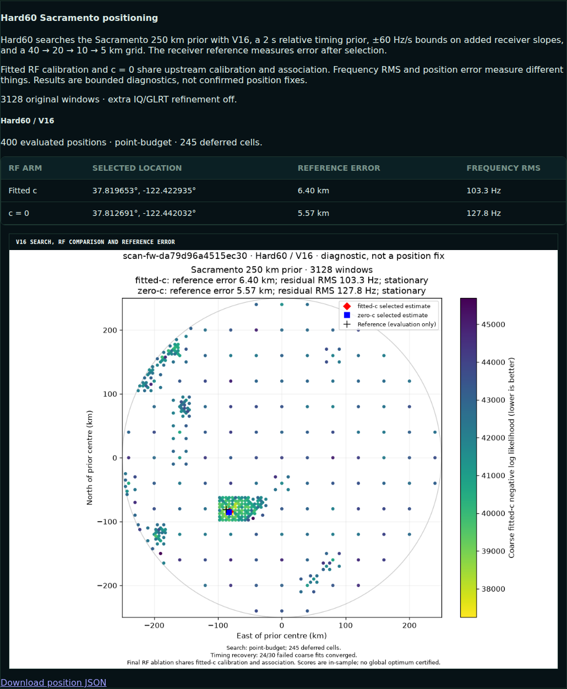
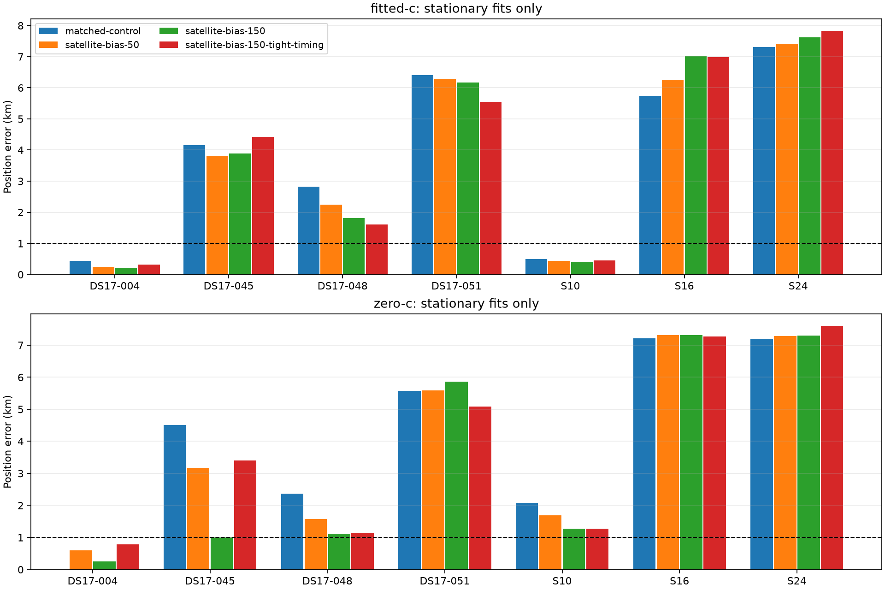
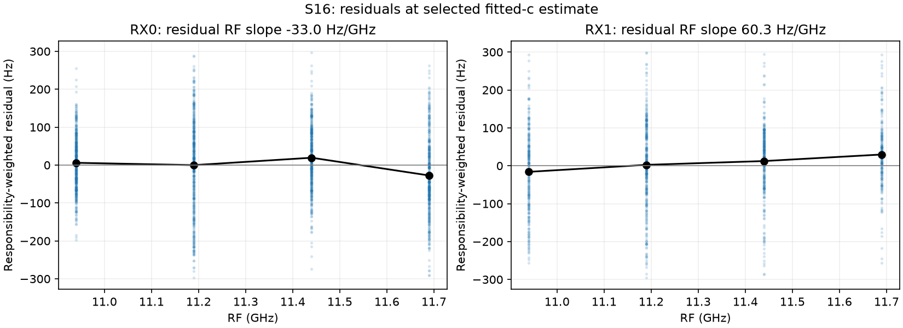
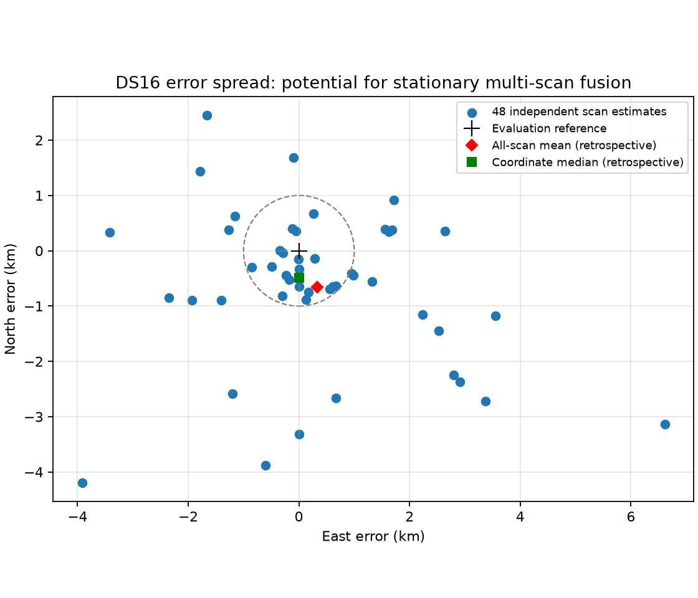

# Position-error iteration 1: model bias after optimizer recovery

**Decision: retain the deployed bounded-recovery Hard60 default. Do not deploy
the satellite-frequency-offset prototypes.** They improve frequency residuals
much more consistently than position, and worsen the two remaining worst DS16
cases. The <1 km mean-position-error goal is not yet achieved.

The preceding [deployment report](../2026_10_08_hard60_bounded_recovery/README.md)
records runtime `7d296d36d`, the 48-scan regression, cold replay and first live
browser check. That rollout report was published to main at `88632b27f`.
This iteration adds a second normal-queue/browser verification, freezes DS17
validation membership, and tests the first new model family on development data.

## Deployment verified on another recent scan

`scan-fw-da79d96a4515ec30` completed normally at **2026-10-08 15:11:39 UTC**.
Its new recovery policy converged on **24 of 30** failed coarse fits. Chromium
displayed its actual **1080×960 PNG**, HTTP 200, `image/png`, **177,745 bytes**,
with a matching digest and no page errors or panel alerts. There were no copied
qualification products or manually seeded checkpoints.

The resulting fitted-c error is **6.404 km**; zero-c is **5.568 km**. Successful
deployment and numerical convergence do not make this position accurate. This
scan is now a useful additional failure case, DS17-051. It was reserved for
development before its outcome was inspected.

[Live scan](http://gauss:8090/?scan_id=scan-fw-da79d96a4515ec30),
[browser receipt](live-da79/browser.json), [published result](live-da79/document.json).

## Frozen data and evaluation discipline

DS17 has **51 sealed recordings** after DS16's window. Its manifest digest is
`sha256:39dd3ddd65468718615cc1680365b67a892f46ae6fc8ab660fe9114565f0db27`.
The original mint includes both receivers and is independent of localization
outcomes and analysis readiness. No new RF was requested or collected for this study.

Before inspecting the remaining DS17 errors, whole recordings were split with
PCG64 seed **2026100802**: **17 development / 34 validation**. The two operational
canaries were reserved for development; the other 15 development recordings were
randomly selected. Both receivers and every observation in a scan stay together.
DS16's 48 scans are already inspected development/regression data.

**The 34 DS17 validation outcomes remain unopened.** Sixteen development
baselines were available for this iteration; DS17-050 was still progressing
through the normal pipeline. It remains in the cohort and is not silently
excluded. Existing baseline stages are verified and reused; bounded recovery
is recomputed where the publication predates the deployment. This is not a cold
replay of every scan.

See [immutable protocol](protocol.json), [protocol digest](protocol.sha256),
[DS17 manifest](ds17-manifest.json), [baseline reader/replay](baseline.py).

## What remains wrong

S16 (**5.738 km**) and S24 (**7.314 km**) remain stationary interior solutions
under the deployed objective. The prior diagnostic fixed-reference fits, keeping
their selected satellite bank and calibration, found worse local scores at the
reference position. That points to conditional model/association bias rather
than the already-repaired premature coarse-fit termination. It does not prove a
global optimum: fixed-reference nuisance fits and satellite association can
themselves have multiple minima.

The new DS17-051 failure is also stationary and away from the search boundary.
Adding fit time or declaring optimizer success cannot establish better accuracy.
The seven probes below deliberately include failures and controls; their mean
is **not** an estimate of average performance across DS16 or DS17.

## Tested model: per-satellite frequency offsets

The hypothesis is that some unexplained frequency offsets are being absorbed by
satellite timing shifts, distorting position. The prototype adds one constant
frequency offset per satellite, with a zero-centered Gaussian prior. This is a
model hypothesis, not an attribution to a particular satellite's clock.

Three variants were tested:

| Variant | Satellite offset prior σ | Relative timing prior σ |
|---|---:|---:|
| Bias50 | 50 Hz | 2 s |
| Bias150 | 150 Hz | 2 s |
| Bias150 + tight timing | 150 Hz | 0.25 s |

Each paired arm uses the same observations, satellite bank, frozen receiver
calibration, position seed, local 25 km disk, hard ±60 Hz/s added-slope bounds,
20 s budget and 600 iterations. `c=0` is exactly fixed at zero; fitted-c remains
free. Satellite offsets are fitted jointly with the existing position/clock/
timing variables and have an outer ±2,000 Hz feasibility bound. Final estimates
must pass an independent physical-and-offset gradient audit at 0.001.

These are **single-start conditional final-fit probes**, not complete new grid
searches or independent end-to-end calibration ablations. The control uses the
same selected candidate bank and seed as each prototype. The reference is used
only after each fit returns. Objective values across models with different
priors are not treated as interchangeable evidence.

Four tests pass under both development and production Python: zero offsets
exactly reproduce the original likelihood/gradient; all physical and offset
derivatives match finite differences; both c arms preserve physical bounds and
report their independent convergence status.

## Results

| Model | Fitted-c mean error, 7 paired scans | Fitted-c frequency RMS | Zero-c mean error, 6 paired stationary controls | Zero-c frequency RMS |
|---|---:|---:|---:|---:|
| Matched control | 3.911 km | 96.84 Hz | 4.821 km | 136.49 Hz |
| Bias50 | 3.815 km | 90.20 Hz | 4.437 km | 131.41 Hz |
| Bias150 | 3.875 km | 85.90 Hz | 3.978 km | 125.53 Hz |
| Bias150 + tight timing | 3.879 km | 85.87 Hz | 4.294 km | 125.66 Hz |

All seven fitted-c controls and all 42 prototype fits converged. One of the seven
zero-c controls did not converge; its location is excluded from the plotted
accepted results and the zero-c paired comparison uses the same six scans for
every model. Coverage is reported in [summary.json](summary.json).

The strongest frequency-fit change, Bias150, reduces fitted-c RMS by **11.3%**,
but position error by only **0.9%** on these diagnostic cases. More flexible
frequency fitting does not resolve the two principal failures:

| Sample | Control fitted-c | Bias50 | Bias150 | Bias150 + tight timing |
|---|---:|---:|---:|---:|
| S16 | 5.738 km | 6.264 km | 7.015 km | 6.982 km |
| S24 | 7.314 km | 7.409 km | 7.623 km | 7.822 km |
| DS17-045 | 4.154 km | 3.810 km | 3.889 km | 4.426 km |
| DS17-048 | 2.825 km | 2.248 km | 1.818 km | 1.603 km |
| DS17-051 | 6.404 km | 6.295 km | 6.174 km | 5.546 km |
| S10 control | 0.501 km | 0.437 km | 0.410 km | 0.453 km |
| DS17-004 control | 0.443 km | 0.245 km | 0.197 km | 0.322 km |

Evidence: [per-scan fits](probes/), [prototype](satellite_bias.py),
[same-seed runner](probe.py), [tests](test_satellite_bias.py),
[production test log](production-prototype-tests.log).

## Residual diagnostics and next hypotheses

At the selected fitted-c state, supported observations still show different
frequency-dependent residual patterns on the two receivers. A weighted
regression of residual against offset, time and RF gives:

| Sample | RX0 residual RF slope | RX1 residual RF slope |
|---|---:|---:|
| S16 | −32.98 Hz/GHz | +60.33 Hz/GHz |
| S24 | +4.36 Hz/GHz | −26.34 Hz/GHz |
| DS17-045 | +2.63 Hz/GHz | −3.12 Hz/GHz |
| DS17-048 | −30.43 Hz/GHz | +31.49 Hz/GHz |
| DS17-051 | −1.16 Hz/GHz | −8.41 Hz/GHz |

These are conditional residual diagnostics with frozen posterior associations,
not independent hardware calibration measurements. Their uneven size also
suggests that a receiver RF-slope correction alone will not fix every case.

The next approaches to test are:

1. **Receiver-specific RF calibration with shrinkage.** Allow a small RX0/RX1
   difference around the shared fitted-c term, or a stable channel correction
   learned from development recordings. This addresses an observed residual
   pattern while limiting the freedom to absorb satellite motion. Preserve a
   complete zero-RF-calibration ablation with matched observations and budgets.
2. **Track-consistent association and balanced support.** Test whether a few
   densely sampled or incorrectly associated tracks dominate the estimate.
   Diagnose leave-one-track/satellite influence, receiver-pair consistency and
   identity continuity before changing likelihood weights or gates. Candidate
   selection must not use reference error.
3. **Causal robust multi-scan fusion for the stationary receiver.** DS16's
   independent estimates have substantial spread: the retrospective all-scan
   mean is 0.737 km from the reference and its coordinate median is 0.484 km.
   This motivates testing a filter, but those two numbers use future scans and
   are **not** a causal result or proof of the <1 km objective. Report cold-start
   behavior, latency, motion assumptions and standalone scan error separately.

No prototype in this report is promoted to production. The current default
continues to achieve **1.886 km mean on the 48-scan DS16 regression**, and the
34-scan DS17 validation set remains available for a frozen, materially better
candidate. Newer recordings will be admitted by a frozen capture-time/membership
rule before their localization outcomes are examined.
