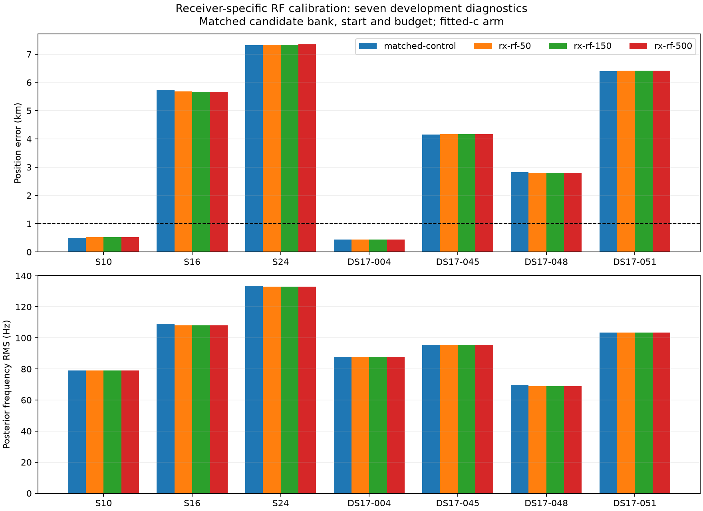

# Position-error iteration 2: receiver-specific RF calibration

**Decision: do not deploy this extension.** On the same seven development
diagnostics used in iteration 1, the best of three prior widths reduces mean
position error by only 0.00189 km (1.9 metres). The worst case becomes slightly
worse. This rules against prioritizing this particular calibration extension as
the remedy for the remaining multi-kilometre failures.

The production default remains bounded-recovery Hard60, with 1.886 km mean error
on the 48 previously inspected DS16 scans. The below-1-km mean objective is still
unmet. These seven deliberately selected diagnostics are not a representative
cohort or a validation set.



## Hypothesis and controlled experiment

Iteration 1 found different RF-dependent residual slopes in RX0 and RX1. Here
we retain the shared coefficient `c` and add a difference `d`:

```
RX0 coefficient = c - d/2
RX1 coefficient = c + d/2
additional penalty = 0.5 * (d / sigma_d)^2
```

The coefficients have units Hz/GHz. The three variants use `sigma_d` of 50, 150,
and 500 Hz/GHz. These widths are unrelated to the timing prior, which stays at
2 seconds for relative satellite timing. The ±60 Hz/s receiver time-slope bounds
also stay unchanged. We bound `d` to ±5000 Hz/GHz; the bound is not active in
these fitted results.

For each scan, all variants use the same observations, candidate satellite bank,
receiver baseline, initial physical vector, 25-km local search disk, timing
priors and 20-second/600-iteration budget. The prototype optimizes position,
timing, receiver nuisance terms, shared `c` and differential `d` jointly. It uses
the production timing-box parameterization, analytic gradients and independent
physical KKT checks. Reference position is used only to evaluate the returned
candidate. This is a local model test, not a rerun of the entire grid search.

Each variant includes a matched **zero-c arm that fixes both `c` and `d` to
zero**. Calibration baselines and candidate sets remain fixed between arms.
The control uses the production bounded fitter; the prototype adds the extra
parameter to an SLSQP wrapper. This implementation difference has a measurable
numerical effect in one zero-c case, documented below.

## Position results: fitted-c arm

| Scan | Control km | σd=50 km | σd=150 km | σd=500 km |
|---|---:|---:|---:|---:|
| S10 | 0.501 | 0.524 | 0.528 | 0.528 |
| S16 | 5.738 | 5.683 | 5.673 | 5.671 |
| S24 | 7.314 | 7.336 | 7.341 | 7.341 |
| DS17-004 | 0.443 | 0.445 | 0.445 | 0.445 |
| DS17-045 | 4.154 | 4.166 | 4.168 | 4.169 |
| DS17-048 | 2.825 | 2.796 | 2.793 | 2.793 |
| DS17-051 | 6.404 | 6.417 | 6.420 | 6.420 |
| **Mean** | **3.91148** | **3.90960** | **3.90968** | **3.90970** |

All 28 fitted-c fits passed the stationarity audit. Mean posterior frequency
RMS changes from 96.838 Hz to 96.496, 96.472 and 96.469 Hz. Frequency fit and
localization both change very little; widening the prior saturates without
removing the large errors.

S16 is particularly informative: with the widest prior the fitted RX1−RX0
coefficient difference is about +162.5 Hz/GHz, and frequency RMS drops from
109.14 to 107.99 Hz, yet position error falls only 67 metres. S24 learns about
−40.0 Hz/GHz and reduces frequency RMS from 133.49 to 132.99 Hz while moving
27 metres farther from the reference. The observed differential RF residual
pattern is therefore insufficient to explain these positioning failures within
the frozen calibration/association basin. This does not rule out errors in the
upstream calibration, candidate bank, or another basin.

## Zero-c ablation and numerical limits

The DS17-004 control zero-c fit failed the independent stationarity check, so
all paired zero-c aggregates exclude that same scan. On the remaining six
scans, control mean error is 4.82059 km and prototype mean error is 4.83186 km
for every prior width. Mean frequency RMS is 136.487 versus 136.581 Hz.

Because `c=d=0`, the three prototypes have exactly the same zero-c objective
and return identical results. They generally reproduce the control, except
DS17-045: the control obtains objective 35317.3431 and error 4.5112 km; the
prototype wrapper obtains 35318.0091 and error 4.5789 km. Both pass their local
KKT audit. This is evidence of numerical/local-solution sensitivity under an
equivalent objective, **not an RF model effect**, and demonstrates why
stationarity alone does not establish a global optimum. No zero-c improvement
is attributed to the new model.

## Integrity, deployment and next iteration

The 34 reserved DS17 validation outcomes remain unopened. These experiments
use only the development membership frozen in
[iteration 1](../2026_10_08_position_error_iter01/protocol.json). All DS16 scans
were already development/regression data. No new RF collection was initiated.
DS17-050's normal pipeline publication also became available during this
iteration, completing availability of all 17 DS17 development baselines; it
was not added to this fixed seven-case comparison.

Production revision `8f54778f9` additionally limits new per-track TLE review PNGs
to the longest 16 eligible tracks. Its 51 component tests passed under both
development and production Python. All 19 active workers were verified to use
the new source overlay; acquisition remained active. Existing checkpointed
publications retain their original rendering limit. This rendering change does
not alter Hard60's scientific inputs or fit.

Next, diagnose association and track influence: quantify whether a small
number of tracks or satellites controls the displaced minimum, test influence
after nuisance refitting, and check consistency across receivers. Any resulting
weighting or association rule must be chosen without reference-position error
at inference. A separate causal fusion experiment remains worthwhile for a
stationary receiver, but must report cold start, latency and individual-scan
accuracy rather than substituting a retrospective average for localization.

## Reproduction and evidence

`receiver_rf.py` implements the prototype; `probe.py` loads sealed existing
inputs through iteration 1's development-only loader. `probes/*.json` contains
all 56 returned candidates, vectors, scores, physical constraint checks,
stationarity and position errors. `summary.json` records the paired aggregates.
`summarize.py` regenerates the comparison PNG.

Three component tests pass on Python 3.13 and production Python 3.14: original
objective/gradient equivalence, finite-difference checks for every physical
parameter and the differential term, and optimizer bounds/complete RF ablation
for both arms. Ruff passes. The production native orbit kernel is used.

Run from the isolated worktree using the deployed source on `PYTHONPATH` and
production Python, with BLAS threads set to one:

```
python reports/2026_10_08_position_error_iter02/probe.py \
  S10 S16 S24 DS17-004 DS17-045 DS17-048 DS17-051
python reports/2026_10_08_position_error_iter02/summarize.py
```

Probe outputs refuse overwrite; use a separate copy for a repeat experiment.
Input access requires the existing local corpus and immutable published
analysis products. This report adds no runtime dependency or deployed model.
