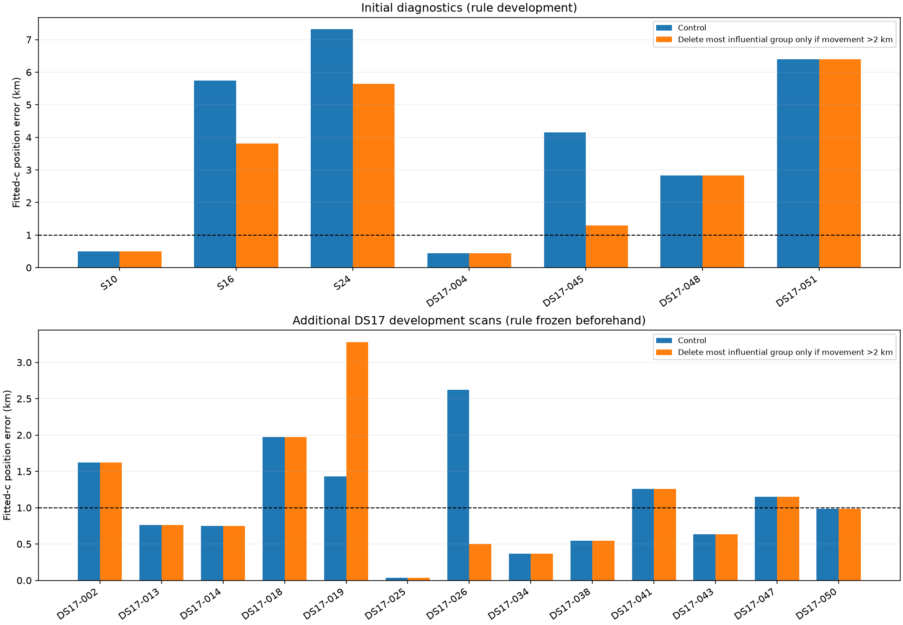

# Position-error iteration 3: satellite influence and a frozen deletion rule

**Decision: retain influence as a diagnostic; do not deploy automatic deletion.**
Removing a high-influence satellite's observations can improve a bad estimate,
but can also discard useful geometry. A rule that looked promising on seven
initial diagnostics delivered only a 21-metre mean improvement on 13 additional
DS17 development scans, while increasing their worst error from 2.62 to 3.28 km.
The matched zero-c comparison deteriorated substantially.

This iteration contains **360 fits across 20 scans**: three DS16 scans and all
17 DS17 development scans. The 34 reserved DS17 validation scans remain unopened.
The production scientific model is unchanged; its DS16 mean remains 1.886 km.
The below-1-km mean objective has not been achieved.

## What was tested

For each scan, freeze the deployed fitted-c candidate bank, baseline calibration
and initial position/timing vector. Rank satellites by total posterior support
at that estimate. For each of the eight highest-support satellites, remove
observations whose strongest satellite responsibility belongs to it and is at
least 0.8, provided at least 14 observations qualify. The satellite itself stays
in the candidate bank. Then refit position, receiver affine parameters, shared
RF coefficient and satellite timing from the same seed. Other observations can
still change their mixture associations.

Each deletion is run with fitted c and c fixed to zero. Both arms use exactly
the same observation subset, candidate bank, frozen calibration, timing priors,
local 25-km disk and budget of 20 seconds/600 iterations. The control refits all
observations with the same budget. RF/time nuisance centering is explicitly
preserved during observation subsetting, so the seed retains its physical
meaning. Reference coordinates enter only after optimization, for evaluation.

This is a final-fit ablation conditional on the existing fitted-c upstream
calibration and association. It does not recalibrate the full pipeline or rerun
the grid after each deletion. Catalogue numbers identify model-assigned
satellites, not independently confirmed transmitter identities.

## Initial failure diagnosis

| Case | Control error km | Deleted group | Position movement km | Error after deletion km |
|---|---:|---:|---:|---:|
| S16 | 5.738 | 57061 | 2.279 | 3.809 |
| S24 | 7.314 | 66885 | 2.889 | 5.643 |
| DS17-045 | 4.154 | 62754 | 2.858 | 1.297 |
| DS17-051 | 6.404 | 69144 | 1.017 | 7.105 |

These rows show the **largest movement**, selected without reference error.
S16's group contains 309 of 3114 observations, split 123/186 between receivers.
S24's contains 349 of 3774, split 232/117. DS17-045's contains 350 of 3102,
split 253/97. Thus about one tenth of a scan's observations can move the
estimated location by several kilometres.

Large movement is not proof of a bad satellite or erroneous data. DS17-051's
most influential group is observed only on RX0 (161 rows), and removing it
makes the result worse. In S16 and DS17-045, the original group timing shifts
are −12.32 and +15.78 seconds, respectively. Those large inferred shifts warrant
association scrutiny, but they do not establish that the TLE or clock is wrong.
S24's influential group has a modest +0.58-second shift, so timing magnitude
alone does not explain the pattern.

No single tested group removal fixes the persistent DS16 errors: the best
deletion in hindsight still leaves S16 at 3.81 km and S24 at 5.64 km. DS17-051's
best deletion still leaves 6.18 km. These are diagnostic lower bounds among
the tested deletions, **not deployable estimates chosen by reference error**.
They point to a problem beyond one isolated bad measurement group within these
fixed calibration/association hypotheses.

## Freeze, expand, and reject the automatic rule

After the initial seven diagnostics, freeze this rule in
[expansion-protocol.json](expansion-protocol.json): select the converged
fitted-c deletion producing the largest location displacement, apply it only
if movement exceeds 2 km, and require its matched zero-c deletion to converge.
Otherwise retain the control. The same removed rows apply to both c arms.

This threshold is development-selected, not an independently justified physical
constant. The expansion contains the remaining 13 DS17 development members;
their baseline products were already available, but their deletion outcomes
had not been computed when the rule was frozen. They are **not** the reserved
validation set.

| Cohort | Fitted-c mean before → after km | Improved / worsened | Worst before → after km |
|---|---:|---:|---:|
| Initial seven diagnostics | 3.911 → 2.989 | 3 / 0 | 7.314 → 6.404 |
| Additional 13 DS17 development | 1.088 → 1.067 | 1 / 1 | 2.624 → 3.279 |
| All 17 DS17 development | 1.646 → 1.461 | 2 / 1 | 6.404 → 6.404 |

The expansion counterexamples are decisive:

- **DS17-026:** delete group 69152, 2.624 → 0.500 km.
- **DS17-019:** delete group 59537, 1.433 → 3.279 km.

The rule identifies leverage, but cannot tell whether that leverage is helpful.
Its strong initial improvement does not carry over reliably. We do not tune a
new threshold after seeing these outcomes or promote this rule on its combined
development mean.

## Frequency fit, zero-c comparison, and convergence

To avoid scoring a smaller dataset as if it were better fit, frequency RMS is
evaluated again on **all original observations** for every returned vector.
Mean fitted-c RMS changes from 96.838 to 99.505 Hz on the initial seven and
76.826 to 78.606 Hz on the expansion. An improved position on some cases can
therefore accompany a worse fit to all original frequencies. Neither metric
is a substitute for the other.

| Cohort | Paired zero-c scans | Mean error before → after km |
|---|---:|---:|
| Initial diagnostics | 6 | 4.821 → 4.123 |
| Expansion | 10 | 1.410 → 1.831 |
| All DS17 development | 13 | 2.042 → 2.209 |

DS17-019's zero-c error increases to 5.538 km. DS17-026's zero-c error also
increases, despite the fitted-c improvement. This reinforces the need to keep
the RF ablation explicit.

All 180 fitted-c fits passed the independent stationarity audit. Nine of 180
zero-c fits did not, including four controls: DS17-002, -004, -018 and -047.
Paired zero-c summaries exclude those same controls from both before/after
columns; raw results retain every failure. These are local matched-control
refits from the fitted-c seed, so a nonstationary control is not a claim that
the scan's original published zero-c solution failed. Total optimizer time was
262 seconds, excluding input loading and orbit-bank construction.

## Next approaches

1. **Track-consistent association:** evaluate a common satellite identity over
   an independently reconstructed frequency track, with explicit outlier rows,
   rather than allowing unrelated per-window associations to provide apparently
   strong aggregate support. Start by measuring identity switches within the
   influential groups and agreement between simultaneous receivers.
2. **Joint calibration sensitivity:** the current experiment freezes the
   receiver baseline learned at an earlier trial location. Jointly refit its
   smooth correction with position under the existing gauge and smoothness
   constraints, or profile it at each candidate, to test whether the frozen
   correction preserves positional bias. Avoid unconstrained clock freedom.
3. **Causal multi-scan estimation:** test robust sequential fusion separately
   for this stationary installation, using only past/current measurements.
   Report cold start, latency, and individual-scan accuracy separately. An
   offline average using future scans cannot establish the requested goal.

## New-scan rendering verification

The separate production change limiting per-track TLE reviews to the longest
16 tracks was exercised by normal scan `scan-fw-0014cc103687b490`. Its published
tracking result contains **16 reviews out of 52 eligible tracks**, with 36
deferred. `verify_reviews.mjs` checks the real WebUI, decodes all 16 PNGs,
verifies HTTP status/content type and content hashes, and confirms descending
support spans. The receipt and first rendered review are in
[live-reviews16](live-reviews16/). No new RF capture was launched for this test.

## Evidence and reproduction

`influence.py` loads the sealed development inputs through iteration 1's loader.
`influence/*.json` records all 360 candidates, vectors, scores, displacement,
deleted-row counts by receiver, errors and optimizer diagnostics.
`influence_policy.py` implements the frozen rule; `summarize.py` regenerates
the aggregates and visualization. Existing output files cannot be overwritten
by the experiment runner.

Three component tests pass under development Python 3.13 and production Python
3.14: subsetting preserves predicted residuals, parameter centering and the
candidate bank; groups are disjoint and confidence-gated; and the policy uses
movement, not reference error, while enforcing the convergence requirement.
Ruff passes. Production code and scientific golden fixtures are unchanged.

Use production Python with deployed source on `PYTHONPATH` and BLAS threads set
to one. Run `influence.py` with the seven initial labels, then the labels in
`expansion-protocol.json`, and run `summarize.py`. Corpus access and the existing
immutable analysis products are required. The reserved 34-scan validation set
is untouched and remains available for a stronger, frozen candidate.
